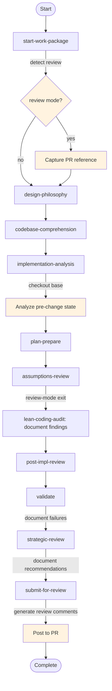

# Review Mode

Review mode carries a work package over an existing pull request: the code is already written, and the run's product is a posted review rather than a merged change. It is ordinary state — a boolean `is_review_mode` variable, plus conditional steps, checkpoints and exit predicates that read it.

---

## Overview

When activated, review mode:

- Takes requirements from the ticket
- Analyses the **pre-change baseline** state from the base branch
- Reviews code that already exists
- **Documents findings** for the author to act on
- Generates structured **PR review comments**

---

## How It Works

### State-Driven Activation

Review mode is driven by `is_review_mode`, plus the gap flags `review_mode_ambiguous` and `review_pr_missing` for the cases where derivation cannot settle mode or PR identity.

A derive-first detection step early in `start-work-package` (`detect-review-mode`) recognizes review intent and PR identity from `{user_request}` / `{pr_reference}`. When mode and PR are clear, the run continues without activation confirms. When mode is ambiguous, `review-mode-detection` asks; when review mode is active but the PR is missing, `review-pr-reference` asks. Everything mode-specific downstream is a conditional step, checkpoint, or exit that reads `is_review_mode`, and mode-specific variable values (e.g. `needs_elicitation = false`) are set by an ordinary control step gated the same way.

### Activity-Level Behavior

Activities express review-mode behavior through standard conditions on steps and checkpoints, and predicates on exits:

- **Review-only steps** have `condition: is_review_mode == true`
- **Create-only steps** have `condition: is_review_mode != true`
- **Review-only checkpoints** have `condition: is_review_mode == true`
- **Review-mode exits** carry the predicate `is_review_mode == true`

Which constructs each activity gates is declared in that activity's own `activities/NN-<id>.yaml`. The format of the review a run posts is in [review-mode](./resources/review-mode.md).

Routing carries Requirements Elicitation and Implement off the review path: design-philosophy sets `needs_elicitation` false, so codebase-comprehension routes past elicitation, and assumptions-review takes its `review-mode` exit straight to lean-coding-audit. Requirements come from the ticket, and the code under review already exists.

### Headless After Activation

Once review mode is active, `{headless_mode}` is true, so a soft checkpoint takes its default option without reaching a person. A review-mode run can therefore be dispatched and left to run.

A gate stays interactive where no default can stand in for the answer. An activity declares a checkpoint without `defaultOption` and `autoAdvanceMs` when its gate is one of these:

- **A gap the derivation left** — the mode, or the identity of the pull request, that the request itself did not settle. A clear derive path reaches neither.
- **A fact about the machine or the diff that the run cannot observe** — whether the author's suite can run in this environment, whether any change block carries an issue, and whether each block's rationale describes the change it sits under. On the review path there is no author to vouch for the diff, so those attestations are the load-bearing confirmations of the run.
- **An outward-facing side effect** — posting the consolidated review on the pull request, and settling which findings that review carries to the author.

Every other review-reachable checkpoint declares `defaultOption` with `autoAdvanceMs`, or is gated out on `is_review_mode`. The activity YAML is where each is declared.

The create path and the review path each carry their own findings gate, because the decision differs. On the create path `review-findings` asks what to do about the findings, the session owning the code it would change. On the review path `findings-delivery` asks which findings the posted review carries to the author, since raising a finding is the only action a review can take on someone else's branch. Each gate is conditioned on `is_review_mode`, so a run meets exactly one of them, and each gate's activity YAML declares the options that run can perform.

The same boundary gates the `review-fix-cycle` loop out of review mode. `code_findings_actionable` and `test_findings_actionable` say a finding reached the severity that warrants action; on the review path the action is raising it to the author, and no component file is edited.

---

## Activating Review Mode

The `detect-review-mode` step in `start-work-package` derives review mode from user request patterns such as:

| Pattern | Example |
|---------|---------|
| "start review work package" | `Start a review work package for PR #123` |
| "review pr" | `Review PR #456` |
| "review existing implementation" | `Review the existing implementation` |

Clear review intent with a parseable PR number or URL skips activation confirms and announces the derived mode. Confirms fire only on gaps:

- **Mode unclear** — `review_mode_ambiguous` → `review-mode-detection` (review vs new implementation)
- **PR missing** — `review_pr_missing` → `review-pr-reference` (number or URL)

When the first derive pass already checked out the PR branch, a second bind is skipped. When the PR was supplied only at the gap confirm, a follow-up `capture-pr-reference` bind completes checkout and ticket extract.

---

## Review Mode Flow

The graph in `workflow.yaml` is the authority for routing; `assumptions-review` carries the `is_review_mode == true` exit that reaches `lean-coding-audit`.

---

## Related Resources

- [review-mode.md](./resources/review-mode.md) - Detailed review mode guide with output formats
- [rust-substrate-code-review.md](./resources/rust-substrate-code-review.md) - Code review criteria
- [test-suite-review.md](./resources/test-suite-review.md) - Test quality assessment
