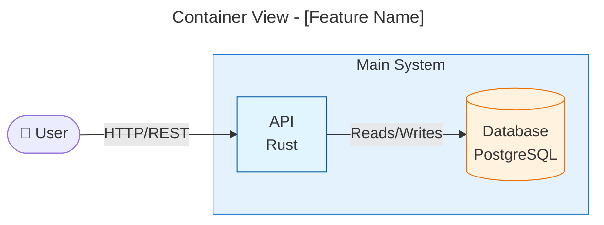
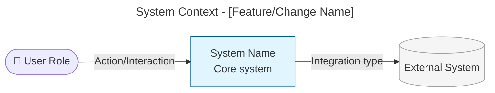

# Architecture Summary Guide

High-level visual document for management-level stakeholders (engineering/product managers, technical directors, non-technical stakeholders) answering: what changed, where it fits, why it matters, what's next. Uses UML-style Mermaid diagrams at whole-system abstraction. Test: a reader unfamiliar with the codebase must understand it in 5 minutes.

## When to Create

Create when: changes touch system boundaries or integrations, multiple components/services are affected, the change has business-visible impact, or stakeholders need to understand what was delivered.

Skip for: bug fixes with no architectural impact, internal refactoring invisible to stakeholders, documentation-only changes.

## Diagram Selection

| Diagram | Shows | Use when |
|---------|-------|----------|
| System Context (flowchart) | Actors, the system, external systems, labeled relationships | Always (required) |
| Package (flowchart + subgraphs) | Logical module groupings and dependencies | Changes affect module organization, cross-cutting concerns, or new packages/crates |
| Container (flowchart + subgraphs) | Runtime containers/services and interactions | Changes affect deployment topology, infrastructure, or service boundaries |
| Sequence | Ordered interactions between components | Key flows are affected and ordering clarifies behavior |
| Before/After (paired flowcharts) | Original vs modified state | Change modifies existing architecture/flows |

Mermaid node shapes: `([text])` actor, `[text]` internal system, `[(text)]` database, `[[text]]` external service.

Container diagram example (the [Architecture Summary Artifact Template](#architecture-summary-artifact-template) embeds the system-context form):



## Rules

- Business language only: no file paths, function names, code, or unexplained jargon. Focus on *what* and *why*, not *how*. Assume the reader does not know the codebase.
- 5-10 elements per diagram, one concept per diagram; show relationships between systems, not internal detail (the forest, not the trees).
- Label every arrow with the interaction type; direction shows data/control flow; avoid crossing lines.
- Highlight new/modified elements with distinct colors; grey out unchanged context; keep names and colors consistent across diagrams.
- Include a clear "why" for the changes.
- At most two diagrams: the system context, and one more where the change warrants it.
- **Line budget:** ~80 lines. Diagrams count toward it.

## Architecture Summary Artifact Template

Template:

````markdown
# Architecture Summary

> architecture-summary · [work package name] · #[issue number] [title] · YYYY-MM-DD · [author/agent]

## Summary

[2-3 sentences: what was implemented and why it matters, for someone unfamiliar with the codebase.]

## System Context



## What Changed

- **[Added / Modified / Removed] [component]** — [what it now does, in business terms].

## [Package Structure / Key Flow / Before and After]

[Omit this section unless the change warrants a second diagram, chosen per Diagram Selection. One diagram, then one sentence on what it shows.]

## Impact

[Who is affected and which upstream or downstream systems, in two or three sentences.]

## Risks

[Omit this section if the implementation surfaced no risk the plan does not already hold. One line per net-new risk and its mitigation.]

[Omit if none. One line: What comes next: [deferred-items register](deferred-items.json).]
````
