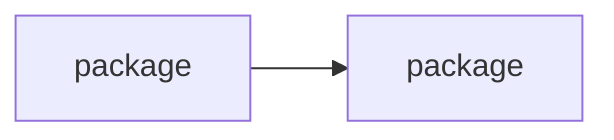

# Priority Ranking Guide

Creation guide for bare filename `priority-ranking.md`. The reader is choosing what to start. The document answers: in what order, why that order, what can run in parallel, and what else would have been valid.

## Template

````markdown
# Priority Ranking

**Packages:** {n} · **Layers:** {n} · **Parallel groups:** {n}

| # | Package | Value | Risk | Effort | Rationale |
|---|---------|-------|------|--------|-----------|
| 1 | [package name](package-plan.md) | High | Low | Medium | one line |

## Dependencies



## Parallel

| Group | Packages |
|-------|----------|
| 1 | package, package |

## Alternatives

{One line per other valid sequence and what would make it the better choice. Omit when the dependency graph admits one order.}
````

## Rules

- **Every package is a row, in execution order.** The row index is the position; a package with no row has no agreed place in the sequence.
- **Rationale is one line.** It says what put the package at this position — the dependency, the value-to-effort ratio, or the risk that argues for going early.
- **Assessments come from the framework.** High, Medium and Low on value, risk and effort are assigned per the [evaluation criteria](./prioritization-framework.md#step-2-evaluation-criteria); this template records the assignment.
- **A dependency cycle is recorded, not ordered around.** Name the cycle and its packages, and state the extraction or removal that breaks it.
- **The order is a recommendation.** The user decides the final order; the document does not assert one was chosen.
- **Line budget:** ~50 lines.
