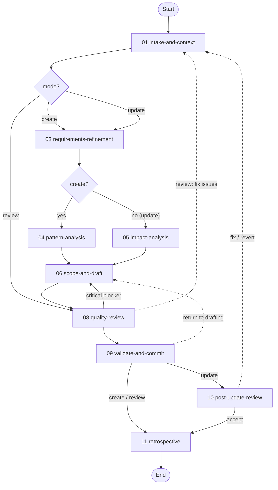

# Workflow Design Workflow

> **Replaced by [`workflow-authoring`](/workflow-authoring/README.md), where every new session starts.**
> This workflow serves the sessions already in flight, and is removed once none remain. Its version
> is frozen: a bump emits a version-mismatch warning on every call of every in-flight session.
>
> At the commit gates, thirty-second auto-advances accept the result as it stands, including
> *proceed to commit* when files fail schema validation. Prefer finishing promptly over resuming late.

> Guides agents through creating, updating, or reviewing workflow definitions. In create/update modes, it derives intent from a free-form user description, reconciles design assumptions, and collects the stakeholder decisions into one approval before commit; it runs headless by default (opt out with “interactive”, “not headless”, or “with checkpoints”). Create/update edits run in a dedicated `{target_path}` worktree. In review mode, audits one or more existing workflows against the design principles and produces a compliance report.

---

## Overview

This workflow manages the complete lifecycle of workflow definition authoring, with three modes (create, update, review) that control which activities execute. All modes enforce schema expressiveness, convention conformance, and structural enforcement of critical constraints. Activity `#` columns below match on-disk `NN-` file prefixes (gaps at 02/07 are intentional).

| # | Activity | Mode | Purpose |
|---|----------|------|---------|
| 01 | [**Intake and Context**](./activities/README.md#01-intake-and-context) | All | Derive create/update/review, gap flags and `{headless_mode}`, and internalize schemas and YAML format |
| 03 | [**Requirements Refinement**](./activities/README.md#03-requirements-refinement) | Create, Update | Elicit or synthesize the spec, then surface and reconcile design assumptions |
| 04 | [**Pattern Analysis**](./activities/README.md#04-pattern-analysis) | Create only | Audit 2+ reference workflows for reusable patterns |
| 05 | [**Impact Analysis**](./activities/README.md#05-impact-analysis) | Update only | Enumerate affected files, check integrity, flag removals |
| 06 | [**Scope and Draft**](./activities/README.md#06-scope-and-draft) | Create, Update | Ensure dedicated `{target_path}` worktree, define file manifest, draft and validate each file, then verify planning artifacts against the design canonical-home map |
| 08 | [**Quality Review**](./activities/README.md#08-quality-review) | All | Audit the drafted or target workflows and remediate findings; the passes live in [`08-quality-review.yaml`](./activities/08-quality-review.yaml) |
| 09 | [**Validate and Commit**](./activities/README.md#09-validate-and-commit) | All | Validate schemas, then commit from `{target_path}` on `{workflow_branch}` and open a PR against `workflows` (create/update), or save the compliance report (review) |
| 10 | [**Post-Update Review**](./activities/README.md#10-post-update-review) | Update only | Post-commit compliance audit that remediates remaining findings automatically and publishes the remediation to the open pull request |
| 11 | [**Retrospective**](./activities/README.md#11-retrospective) | All | Record a completion summary (create/update) and conduct a session retrospective |

**Detailed documentation:**

- **Activities:** See [activities/README.md](./activities/README.md) for the per-activity orientation map, with links to the authoritative activity YAML files.
- **Techniques:** See [techniques/](techniques/) for the full technique library (workflow-local standalone techniques plus the shared `TECHNIQUE.md` base contract) with protocol flows and rules.
- **Resources:** See [resources/README.md](./resources/README.md) for the resource index with usage context and cross-workflow access.

---

## Modes

| Mode | Activation | Description |
|------|------------|-------------|
| **Create** (default) | "create a workflow", "new workflow" | Build a new workflow from a free-form description |
| **Update** | "update workflow", "modify workflow" | Modify an existing workflow with content preservation checks; automatic post-commit compliance review |
| **Review** | "review workflow", "audit workflow" | Audit an existing workflow against design principles; produce compliance report |

---

## Workflow Flow



---

## Orchestration Model

Inherits the meta orchestrator/worker pattern — [workflow-orchestrator](/meta/techniques/workflow-engine/workflow-orchestrator.md) / [activity-worker](/meta/techniques/workflow-engine/activity-worker.md) via [dispatch-activity](/meta/techniques/workflow-engine/dispatch-activity.md) (agent stubs via [compose-prompt](/meta/techniques/workflow-engine/compose-prompt.md)).

---

## Review Mode

Review mode audits one or more existing workflows (`target_workflow_ids`, with each iteration binding `target_workflow_id`) against the design principles, anti-pattern catalog, and schema validation. Pass inventory, severity disposition, and where a failing pass routes live in [`08-quality-review.yaml`](./activities/08-quality-review.yaml). The output is a severity-rated compliance report in the session planning folder.

---

## Design Principles

Positive design-time framing — see [design-principles](/canon/resources/design-principles.md). Stance only; Detect stays in the anti-pattern catalog. Structural gates live in activity YAML.

---

## Techniques

The `techniques/` directory is a flat library of workflow-local standalone techniques (no group folders), plus a [`TECHNIQUE.md`](./techniques/TECHNIQUE.md) holding shared Inputs, Outputs, and Rules for every technique here. Each activity step binds exactly one technique via `step.technique`. Cross-cutting meta [`variable-binding`](/meta/techniques/variable-binding.md) is declared at `workflow.techniques.activity` and inherited by every activity. Commits go through meta [`git::commit-regular-files`](/git/techniques/commit-regular-files.md). Planning-folder report artifacts use [`work-package::manage-artifacts::write-artifact`](/work-package/techniques/manage-artifacts/write-artifact.md); the planning-folder `README.md` is seeded and verified via meta [`workflow-engine::create-readme`](/meta/techniques/workflow-engine/create-readme.md) / [`verify-readme-conforms`](/meta/techniques/workflow-engine/verify-readme-conforms.md) (universal [planning-readme](/meta/resources/planning-readme.md) Template + [readme-seed](./resources/readme-seed.md)). The design-assumption lifecycle reuses [`work-package::review-assumptions`](/work-package/techniques/review-assumptions/TECHNIQUE.md) (`collect`, `record`), with workflow-local `reconcile-design-assumptions`. A workflow-local `conduct-retrospective` covers the session retrospective.

| Technique | Capability | Bound by |
|-----------|------------|----------|
| [`intake-classification`](./techniques/intake-classification.md) | Classify create/update/review, land gap flags + `{headless_mode}`, set mode + target | Intake and Context |
| [`context-loading`](./techniques/context-loading.md) | Load schemas, survey references; assemble format-conventions + applicable-constructs in create and update modes | Intake and Context |
| [`derive-design-dimensions`](./techniques/derive-design-dimensions.md) | Derive the ordered design dimensions to elicit, per mode | Requirements Refinement |
| [`prepare-dimension`](./techniques/prepare-dimension.md) | Assemble elicitation questions for one design dimension | Requirements Refinement |
| [`capture-dimension`](./techniques/capture-dimension.md) | Record answers for one design dimension and fold into accumulated design | Requirements Refinement |
| [`synthesize-update-specification`](./techniques/synthesize-update-specification.md) | Assemble the update-mode specification from changed dimensions only (no per-dimension elicitation) | Requirements Refinement |
| [`assemble-design-specification`](./techniques/assemble-design-specification.md) | Assemble the elicited design specification for linked review | Requirements Refinement |
| [`reconcile-design-assumptions`](./techniques/reconcile-design-assumptions.md) | Resolve audit-resolvable assumptions and report whether any remain | Requirements Refinement |
| [`pattern-analysis`](./techniques/pattern-analysis.md) | Extract patterns from reference workflows into the comparison | Pattern Analysis |
| [`impact-analysis`](./techniques/impact-analysis.md) | Assess change impact on files, exits and graph, and references | Impact Analysis |
| [`scope-definition`](./techniques/scope-definition.md) | Enumerate the file manifest with lean structural design and drafting order | Scope and Draft |
| [`prepare-workflow-branch`](./techniques/prepare-workflow-branch.md) | Ensure dedicated `{target_path}` worktree on `{workflow_branch}` (compose WP create-worktree) | Scope and Draft |
| [`assemble-file-approach`](./techniques/assemble-file-approach.md) | Assemble the per-file drafting plan | Scope and Draft |
| [`review-drafted-file`](./techniques/review-drafted-file.md) | Assemble a per-file review note (including update-mode removals) | Scope and Draft |
| [`yaml-authoring`](./techniques/yaml-authoring.md) | Author syntactically valid YAML files that pass schema validation | Scope and Draft |
| meta [`verify-artifact-conforms`](/meta/techniques/verify-artifact-conforms.md) | Verify planning artifacts against the design canonical-home map and the guide map, and fix drift in place | Scope and Draft |
| [`audit-expressiveness`](./techniques/audit-expressiveness.md) | Walk prose against the schema construct inventory | Quality Review (create/update), Post-Update |
| [`audit-conformance`](./techniques/audit-conformance.md) | Apply convention-conformance against reference workflows | Quality Review (create/update), Post-Update |
| [`audit-rule-hygiene`](./techniques/audit-rule-hygiene.md) | Apply Rule Hygiene anti-patterns to `rules[]` | Quality Review (create/update) |
| [`audit-rule-enforcement`](./techniques/audit-rule-enforcement.md) | Apply `structure-backed-constraints` to `rules[]` | Quality Review (create/update) |
| [`verify-high-findings`](./techniques/verify-high-findings.md) | Adversarially verify High findings and recalibrate severity before remediation | Quality Review |
| [`audit-principles`](./techniques/audit-principles.md) | Audit against the design principles (review mode) | Quality Review |
| [`audit-anti-patterns`](./techniques/audit-anti-patterns.md) | Apply the anti-patterns catalog (including tool/technique/doc consistency vs harness surface) | Quality Review |
| [`audit-schema-validation`](./techniques/audit-schema-validation.md) | Validate every YAML file against its schema | Quality Review, Validate and Commit |
| [`compile-report`](./techniques/compile-report.md) | Compile the severity-rated compliance report (review mode) | Quality Review |
| [`reload-workflow`](./techniques/reload-workflow.md) | Reload the committed workflow from the server | Quality Review, Post-Update Review |
| [`scope-verification`](./techniques/scope-verification.md) | Verify every scope-manifest item is addressed | Validate and Commit |
| [`readme-authoring`](./techniques/readme-authoring.md) | Generate or update the workflow README set | Validate and Commit |
| [`commit-verification`](./techniques/commit-verification.md) | Verify the commit landed on `{target_path}` | Validate and Commit |
| [`publish-workflow-pr`](./techniques/publish-workflow-pr.md) | Compose the workflow-design PR title and body from bound planning artifacts | Validate and Commit |
| [`summarize-findings`](./techniques/summarize-findings.md) | Produce a severity-rated findings summary | Post-Update Review |
| [`review-draft-yaml`](./techniques/review-draft-yaml.md) | Block-indexed review of the drafted YAML, capturing a draft attestation before the audit passes | Scope and Draft |
| [`apply-audit-fixes`](./techniques/apply-audit-fixes.md) | Record selected audit findings as `{fixes_applied}` after activity-bound edit and re-validation | Quality Review, Post-Update Review |
| [`scope-audit`](./techniques/scope-audit.md) | Audit the committed change set against the scope manifest for drift | Post-Update Review |
| [`create-completion-doc`](./techniques/create-completion-doc.md) | Assemble the `COMPLETE.md` close-out document, with the session retrospective as its section | Retrospective |
| [`conduct-retrospective`](./techniques/conduct-retrospective.md) | Analyse non-checkpoint interactions and assemble a prioritized session retrospective | Retrospective |

---

## Resources

| Order | Resource | Purpose |
|---|----------|---------|
| 00 | [Design Principles](/canon/resources/design-principles.md) | Positive framing principles (stance only) |
| 01 | [Schema Construct Inventory](/canon/resources/schema-construct-inventory.md) | An informal phrase mapped to the formal construct |
| 02 | [Anti-Patterns](/canon/resources/anti-patterns.md) | Prohibited-pattern catalog (AP-XX + name) by category |
| 03 | [Update Mode Guide](./resources/update-mode-guide.md) | Update change-request category vocabulary |
| 04 | [Compliance Report](./resources/compliance-report.md) | Creation guide: compliance / post-update review |
| 05 | [README Seed](./resources/readme-seed.md) | Progress inventory + mode map for planning-folder README |
| 06 | [Completion Artifact](./resources/completion-artifact.md) | Creation guide: `COMPLETE.md` |
| 07 | [Design Assumptions](./resources/design-assumptions.md) | Creation guide: `assumptions-log.md` |
| 08 | [Design Assumption Reconciliation](./resources/design-assumption-reconciliation.md) | Audit vs open resolvability of design assumptions |
| 09 | [Elicitation Guide](./resources/elicitation-guide.md) | Mode dimension sets + per-dimension question bank |
| 10 | [Convention Conformance](/canon/resources/convention-conformance.md) | Reference conventions vs sibling workflows |
| 11–21 | [Artifact creation guides](./resources/README.md#planning-artifact-to-guide-map) | Template + Rules for every planning artifact |

---

## Outputs

In create and update modes the workflow seeds and maintains a **planning folder** under `.engineering/artifacts/planning/`: a `README.md` from the universal [planning-readme](/meta/resources/planning-readme.md) Template plus this workflow's [readme-seed](./resources/readme-seed.md) profile, whose progress tracker is updated on completing each activity. In all modes, report artifacts are written into the planning folder as numbered files via [`work-package::manage-artifacts::write-artifact`](/work-package/techniques/manage-artifacts/write-artifact.md).

**Create mode:** A complete workflow file set committed on a feature branch in the workflows repo, with a pull request opened against the `workflows` branch, plus a planning folder.

**Update mode:** Modified workflow files committed on a feature branch with a pull request against the `workflows` branch, plus a post-update compliance snapshot in the planning folder.

**Review mode:** A compliance report committed in the planning folder.

Every mode ends with the [Retrospective](./activities/README.md#11-retrospective) activity, which writes one close-out document, `COMPLETE.md`, to the planning folder: the session retrospective, and in create and update modes the completion summary it is a section of.

---

## File Structure

```
corpus/workflow-design/
├── workflow.yaml                          # Workflow definition (variables, rules, inherited techniques)
├── README.md                             # This file
├── activities/
│   ├── README.md                         # Per-activity documentation
│   ├── 01-intake-and-context.yaml        # Classify mode + target, internalize schemas/format
│   ├── 03-requirements-refinement.yaml   # Elicit design details one question at a time
│   ├── 04-pattern-analysis.yaml          # Audit reference workflows (create only)
│   ├── 05-impact-analysis.yaml           # Impact analysis (update mode)
│   ├── 06-scope-and-draft.yaml           # Manifest, draft/validate per file, verify artifact homes
│   ├── 08-quality-review.yaml            # Audit passes (full compliance audit in review mode)
│   ├── 09-validate-and-commit.yaml       # Validate and commit
│   ├── 10-post-update-review.yaml        # Post-commit compliance audit (update mode)
│   └── 11-retrospective.yaml             # Completion summary + session retrospective (terminal)
├── techniques/                           # Flat library of workflow-local standalone techniques
│   ├── TECHNIQUE.md                      # Shared Inputs/Outputs/Rules for every technique
│   ├── intake-classification.md
│   ├── context-loading.md
│   ├── derive-design-dimensions.md
│   ├── prepare-dimension.md
│   ├── capture-dimension.md
│   ├── synthesize-update-specification.md
│   ├── assemble-design-specification.md
│   ├── pattern-analysis.md
│   ├── impact-analysis.md
│   ├── scope-definition.md
│   ├── assemble-file-approach.md
│   ├── review-drafted-file.md
│   ├── yaml-authoring.md
│   ├── scope-verification.md
│   ├── readme-authoring.md
│   ├── commit-verification.md
│   ├── reload-workflow.md
│   ├── compile-report.md
│   ├── summarize-findings.md
│   ├── audit-principles.md
│   ├── audit-anti-patterns.md
│   ├── audit-schema-validation.md
│   ├── audit-expressiveness.md
│   ├── audit-conformance.md
│   ├── audit-rule-hygiene.md
│   ├── audit-rule-enforcement.md
│   ├── verify-high-findings.md
│   ├── review-draft-yaml.md
│   ├── apply-audit-fixes.md
│   ├── scope-audit.md
│   ├── create-completion-doc.md
│   ├── conduct-retrospective.md
│   ├── reconcile-design-assumptions.md
│   ├── prepare-workflow-branch.md
│   └── publish-workflow-pr.md
└── resources/
    ├── README.md                         # Resource index + artifact→guide map
    ├── update-mode-guide.md              # Update mode guide
    ├── compliance-report.md              # Creation guide: compliance / post-update
    ├── readme-seed.md                    # Progress inventory + mode map for planning README
    ├── completion-artifact.md            # Creation guide: COMPLETE.md
    ├── design-assumptions.md             # Creation guide: assumptions-log.md
    ├── design-assumption-reconciliation.md  # Audit-based reconciliation guide
    ├── elicitation-guide.md              # Mode sets + per-dimension question bank
    ├── structural-inventory.md           # Creation guide
    ├── format-conventions.md             # Creation guide
    ├── applicable-constructs.md          # Creation guide
    ├── design-specification.md           # Creation guide
    ├── impact-analysis.md                # Creation guide
    ├── pattern-analysis.md               # Creation guide
    ├── scope-manifest.md                 # Creation guide
    ├── drafting-plan.md                  # Creation guide
    ├── file-review-note.md               # Creation guide
    ├── follow-ups.md                     # Creation guide
    ├── draft-attestation.md              # Creation guide
    └── findings-satellite.md             # Shared audit-satellite creation guide
```
