# Architecture

The workflow server drives agents through long engineering tasks. The task is often ambiguous, it outlasts one agent's **context**, the working memory that agent holds, and an agent that loses its place can damage a codebase. Read the sections in order. Each one is the outline of a page, and the page is the account.

A **dispatch** divides the work so that no one context holds all of it. A **checkpoint** is how a **worker**, an agent that cannot speak to the person, still gets an answer. **State** is the path already written down, so the next step is not a guess. Notes from the run live in a **planning folder**, apart from the code.

A **workflow** is the guide an operator follows. A **technique** is one capability a step names. A **routine** is a run of steps written once and spliced in wherever it is needed. A **resource** is reference material a technique cites and does not contain.

**Resolution** is how a name stands for one file. **Delivery** is that file handed over when the run needs it. **Fidelity** is the check on a claim to have followed the workflow.

## Dispatch

One agent cannot talk to a person, track a long run, and write the code. Talking, tracking, and doing stay apart, each in its own context (Figure 1). A worker that runs out of room can be replaced, and the run does not lose its place. That division is what [dispatch](dispatch.md) is (Figure 2).

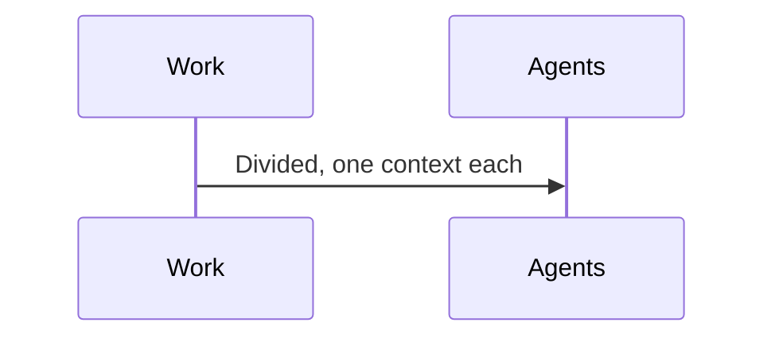

*Figure 1. Work Divided So No One Context Holds All of It.*

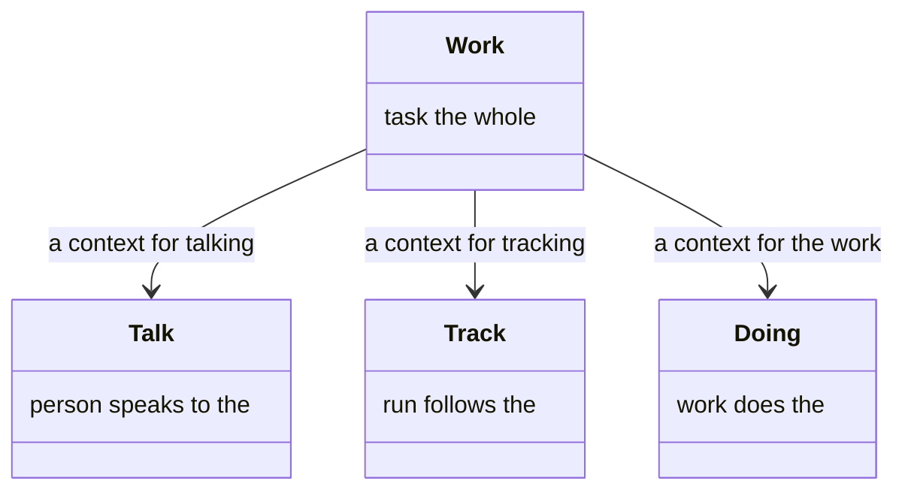

*Figure 2. Talking, Tracking, and Doing, Kept Apart.*

## Checkpoints

The work sometimes cannot decide, and the agent doing the work cannot ask the person. The question leaves the work (Figure 3). It comes back as an answer, and the work goes on. That leaving and returning is what [checkpoints](checkpoint.md) are (Figure 4).

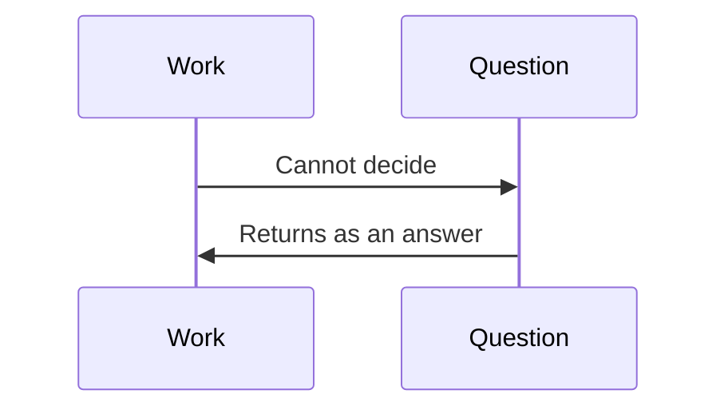

*Figure 3. A Question Leaves the Work and Comes Back.*

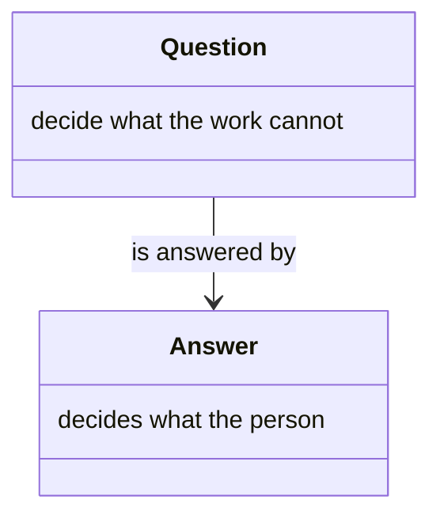

*Figure 4. A Question, and the Answer That Returns.*

## State

Ask what to do next, and two runs of the same facts can take different paths. The next place is written down before the run reaches it, so those runs take the same path (Figure 5). Notes from the run stay in the planning folder, apart from the code. Where that folder sits is the workspace [project layout](https://github.com/m2ux/workflow-server/blob/workspace/docs/layout.md), what it holds is [state](state.md#the-planning-folder), and the path itself is [state](state.md) (Figure 6).

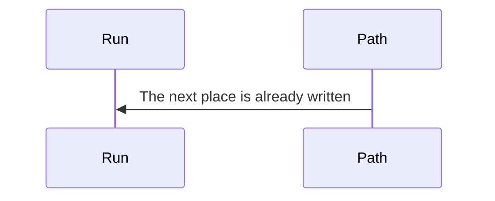

*Figure 5. The Next Place Is Written before the Run Reaches It.*

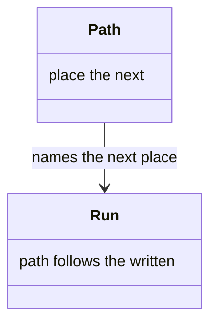

*Figure 6. A Run, and the Path Written Down for It.*

## Workflow

The operator follows one guide from the first phase to the last. The guide names each phase and where each outcome leads (Figure 7). One file holds that guide. That file is what a [workflow](workflow.md) is (Figure 8).

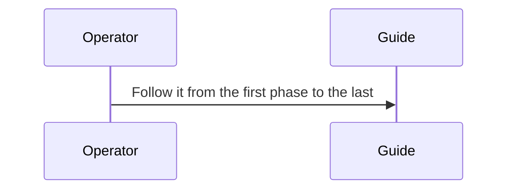

*Figure 7. One Guide, Followed from the First Phase to the Last.*

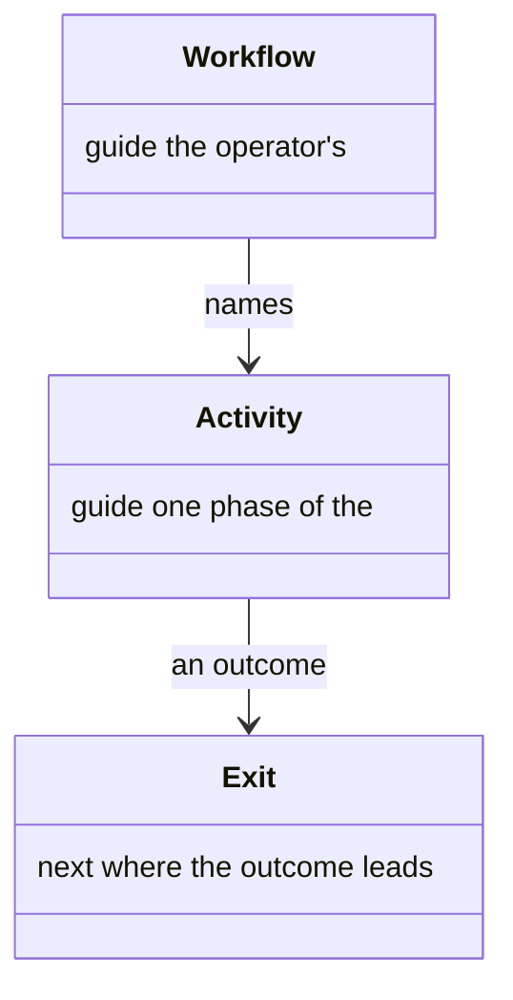

*Figure 8. Workflow, Activity, and Exit.*

## Technique

A step names one way of doing a thing, written down so any step can name it (Figure 9). The file says what it does, what it needs, and the steps to follow. That file is what a [technique](technique.md) is (Figure 10).

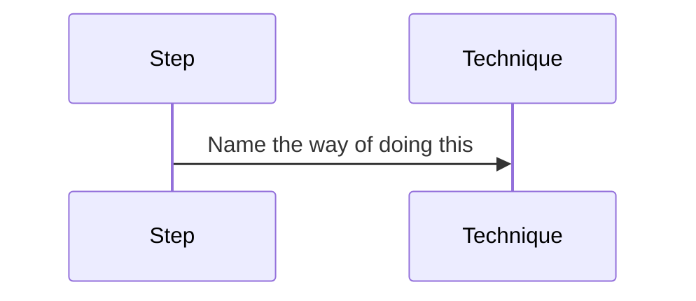

*Figure 9. A Step Names One Way of Doing a Thing.*

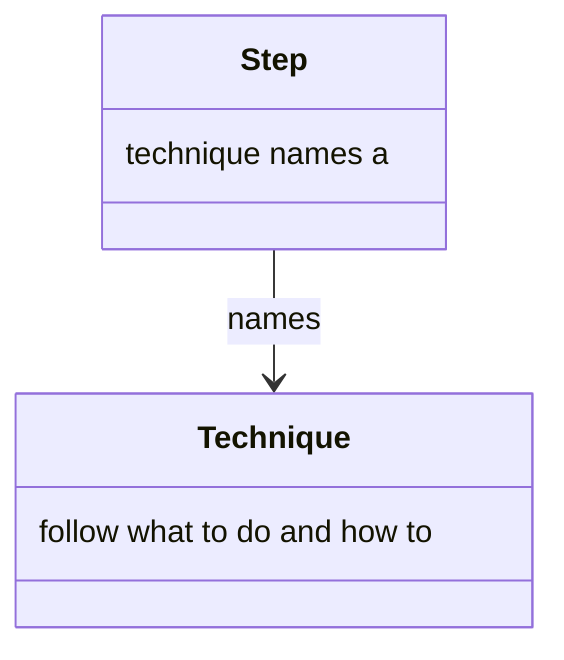

*Figure 10. A Step, and the Technique It Names.*

## Routine

The same run of steps shows up in more than one phase. It is written once, and each site splices it in (Figure 11). The site supplies the arguments. That reuse is what a [routine](routine.md) is (Figure 12).

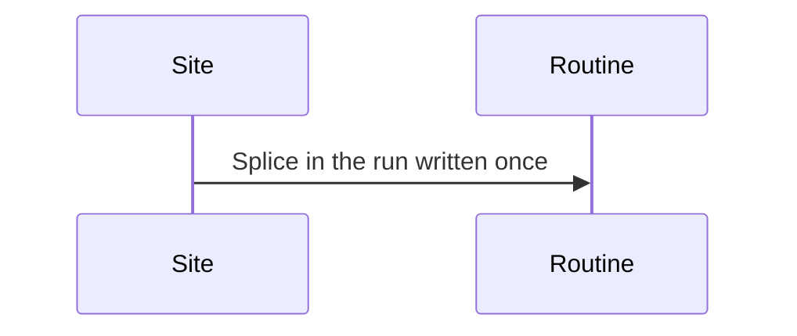

*Figure 11. A Site Splices in a Run Written Once.*

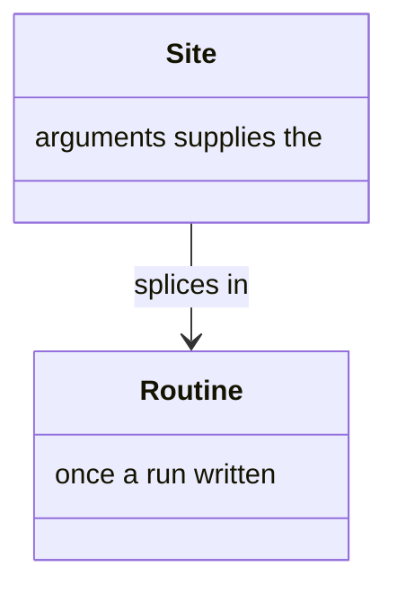

*Figure 12. A Routine, and a Site That Splices It In.*

## Resource

A technique sometimes needs a long guide it should not contain. That guide is cited, and fetched when the step needs it (Figure 13). One section can be fetched alone. That guide is what a [resource](resource.md) is (Figure 14).

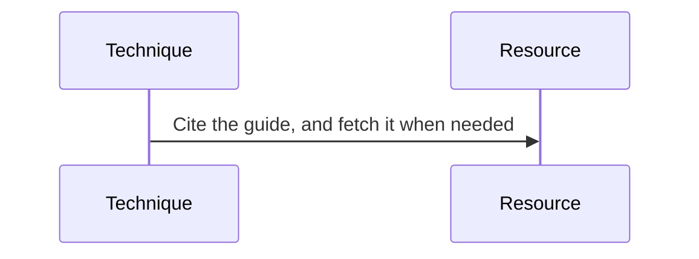

*Figure 13. A Technique Cites a Guide and Fetches It When Needed.*

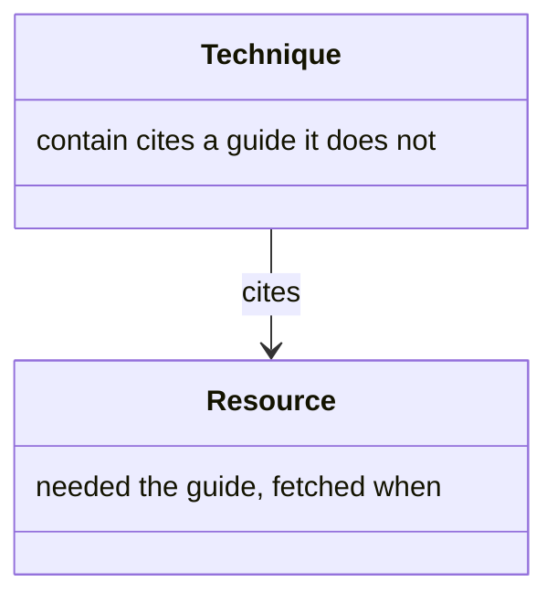

*Figure 14. A Technique, and the Resource It Cites.*

## Resolution

A whole workflow's instructions are too much to hand over at once. The run names the one capability it needs now (Figure 15). That name stands for a file, and the rest stays unread. That standing-for is what [resolution](resolution.md) is (Figure 16).

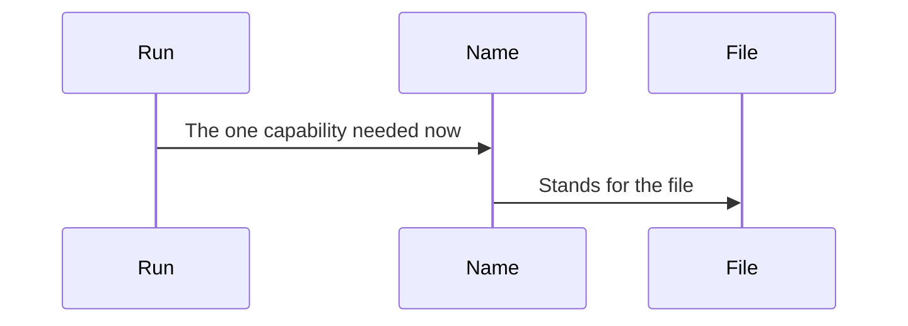

*Figure 15. A Name Stands for One File.*

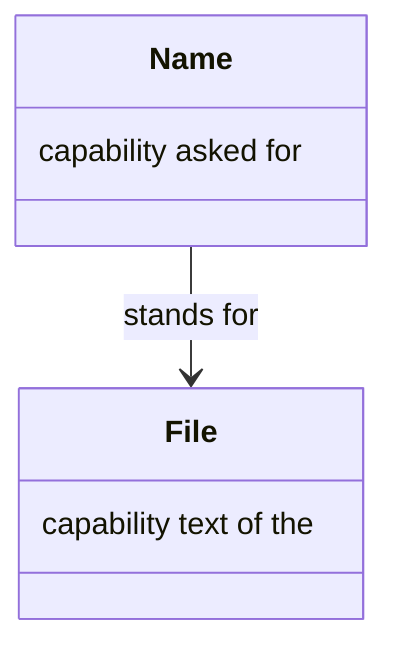

*Figure 16. A Name, and the File It Stands For.*

## Delivery

The named file has to reach the agent that needs it. It is handed over when it is needed, not all at once (Figure 17). A later need for the same file does not send the whole text again. That handing-over is what [delivery](delivery.md) is, and how a document in the planning folder is [named](delivery.md#how-documents-are-named) is there too (Figure 18).

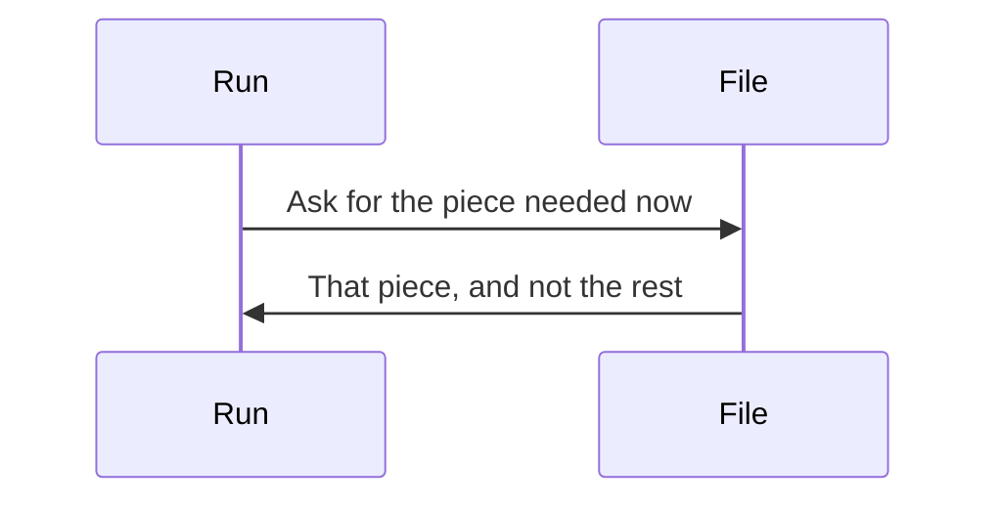

*Figure 17. One Piece Is Handed Over When Needed.*

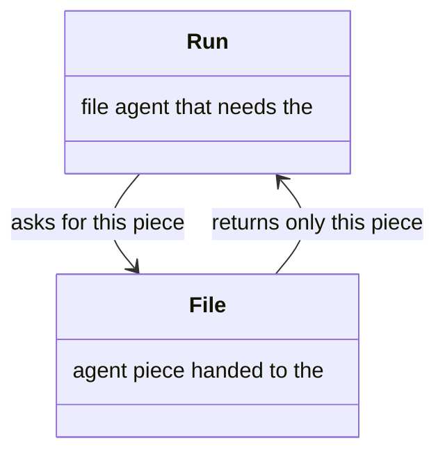

*Figure 18. A Run, and the One Piece Handed to It.*

## Fidelity

An agent can claim it followed the workflow and be wrong. What the run claims can be set beside what was declared (Figure 19). A mismatch is visible, rather than left as a story the agent tells. That comparison is what [fidelity](fidelity.md) is (Figure 20).

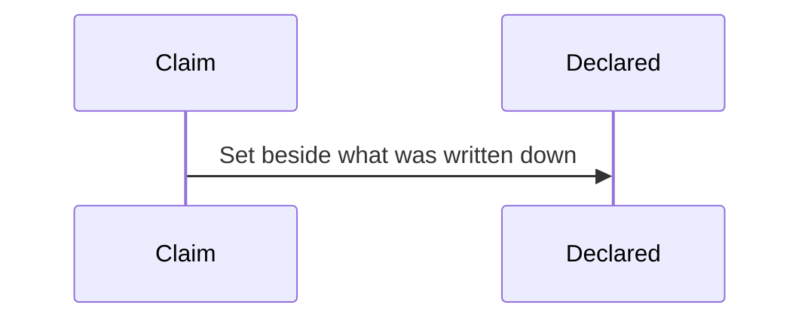

*Figure 19. A Claim Set beside What Was Declared.*

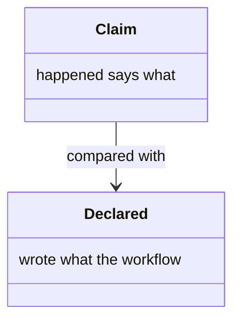

*Figure 20. A Claim, and What Was Declared.*
