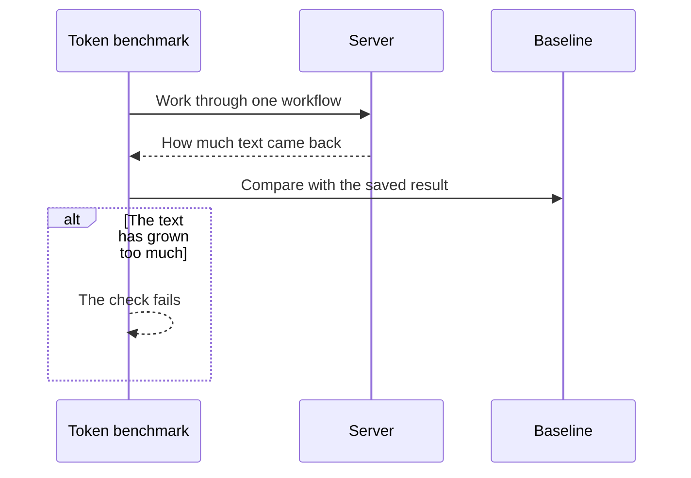
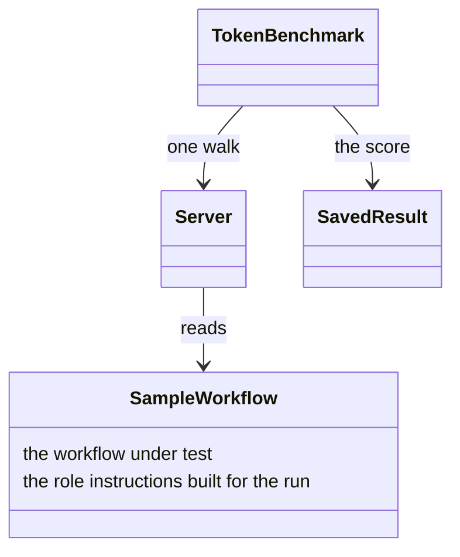
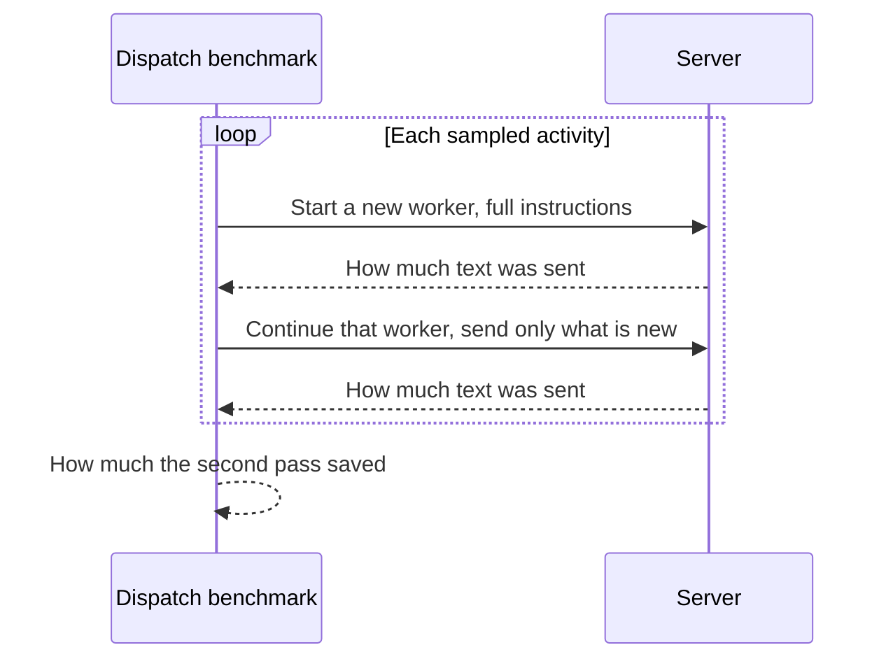
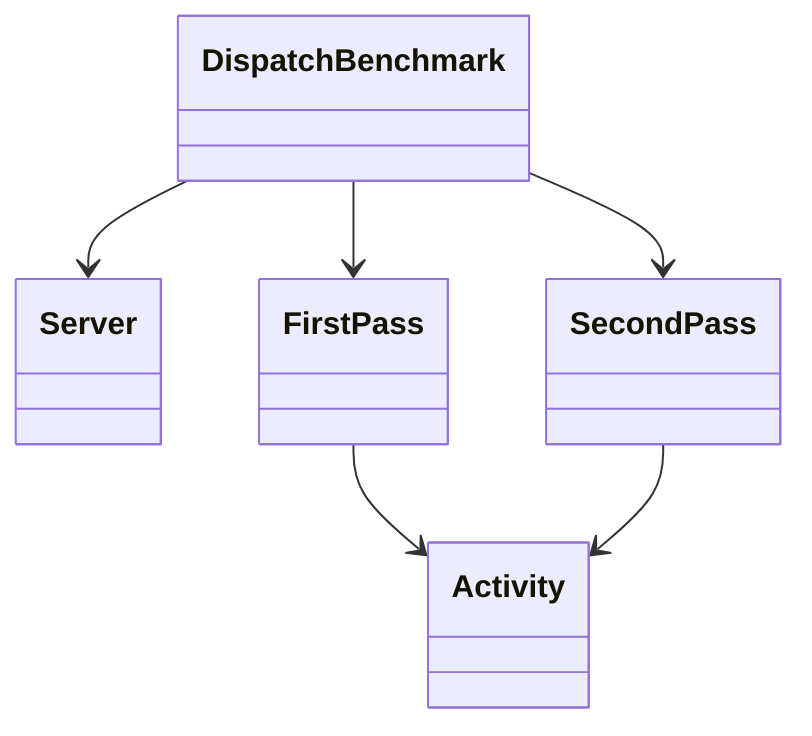
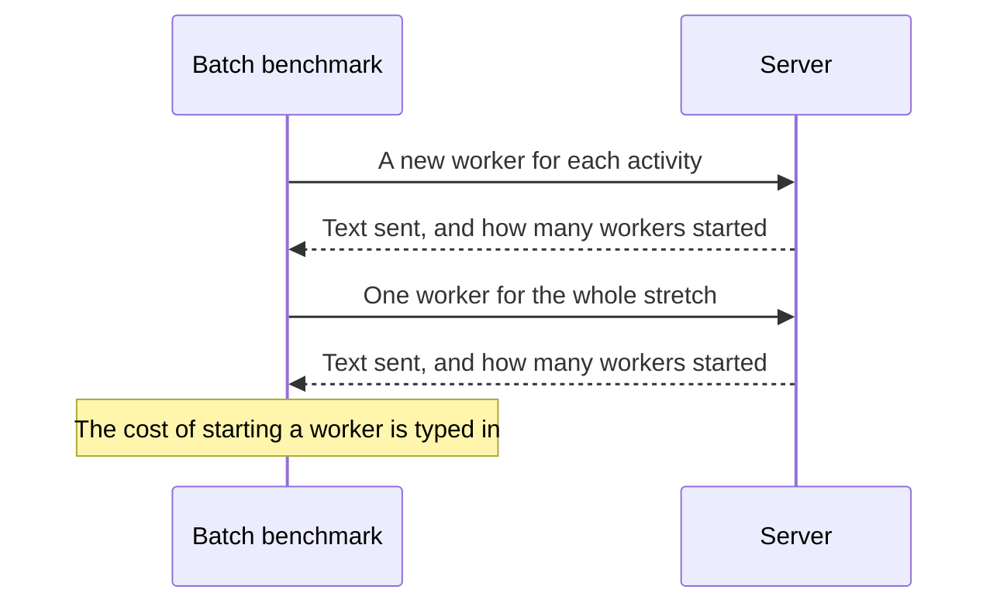
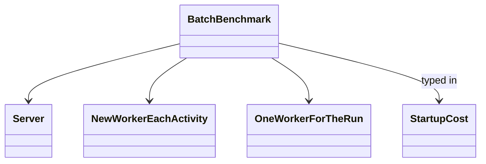
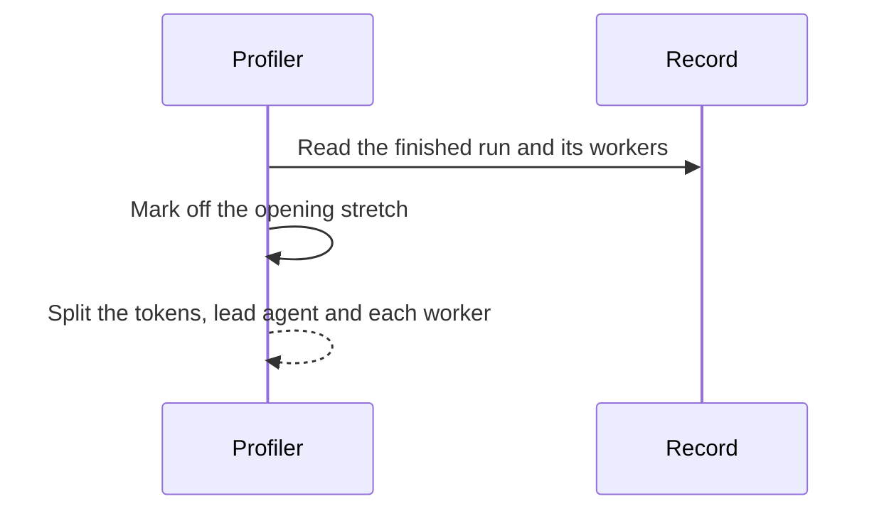
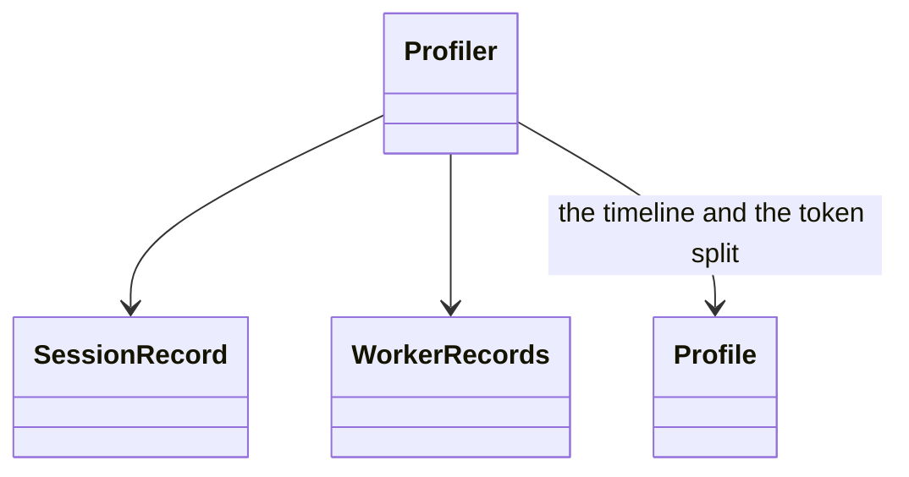

# Benchmarks

These programs measure how much text the server sends an agent while it works through a workflow, and what a finished run cost in tokens. The contract under test is [reference delivery](delivery.md#reference-delivery).

- Three benchmarks drive the server over an in-memory transport and change one thing at a time to isolate cause.
- The profiler reads a run that already happened.

Pick the tool that changes the thing you changed: a number from another tool cannot be blamed on your edit.

| Tool | Command | What It Varies |
|------|---------|----------------|
| [Token Delivery Benchmark](../benchmark/run-token-benchmark.ts) | `npm run bench:token` | the session mode, over one solo walk |
| [Dispatch Overhead Benchmark](../benchmark/run-dispatch-benchmark.ts) | `npm run bench:dispatch` | one re-dispatch: a spawn pass against a resume pass of the same activity |
| [Batch Benchmark](../benchmark/run-batch-benchmark.ts) | `npm run bench:batch` | the batch: the same run walked per activity, then as one context |
| [Run Profiler](../benchmark/scripts/run-profile.ts) | `npm run profile:run` | nothing; it reads a real run off disk |

## Token Delivery Benchmark

The benchmark asks the server to work through one workflow and counts the text that comes back. Figure 1 shows that count compared with the [baseline](../benchmark/fixtures/token-benchmark-baseline.json): if the text has grown too much, the check fails. Figure 2 shows where the walk gets its workflow, and the baseline it is scored against. The check on every pull request runs the [commands](#appendix) against a small sample workflow called delivery-fixture.



*Figure 1. One Walk, Compared with the Saved Result.*



*Figure 2. The Sample Workflow the Server Reads, and the Saved Result the Walk Is Scored Against.*

## Dispatch Overhead Benchmark

Starting a worker from scratch means sending it the full instructions. Continuing that same worker means sending less, because it already has them. Figure 3 shows those two passes, and the text saved by the second. Figure 4 shows that both passes are the same activity.



*Figure 3. Start a Worker from Scratch, Then Continue the Same One.*



*Figure 4. Both Passes Are the Same Activity.*

## Batch Benchmark

The same stretch of work is done twice. Figure 5 shows the first time, with a new worker for each activity, and the second time, with one worker for the whole stretch. The text counted follows the [batch limit](delivery.md#batch-budget). Figure 6 shows those two passes, and a start-up cost that is typed in rather than measured: the cost of spinning up a worker is not something this run can see.



*Figure 5. The Same Stretch of Work, Once per Activity and Once with One Worker.*



*Figure 6. The Two Passes, and a Start-up Cost That Is Typed In.*

## Run Profiler

This one does not run the server. It reads a run that already finished. Figure 7 shows that read: the opening stretch of the run is marked off, and the tokens are split between the lead agent and each worker. Figure 8 shows the two records that read comes from, and the profile built out of them.



*Figure 7. A Finished Run, with the Lead Agent's Tokens Separate from Each Worker's.*



*Figure 8. The Session Record, the Worker Records, and the Profile Built from Them.*

## Appendix

### Token Delivery

```bash
# Fresh-mode ship gate. Fails with exit 3 above the threshold.
npm run --silent bench:token -- --workflow=delivery-fixture --fixture-corpus --label=AFTER --context-mode=fresh --gate --max-regression-pct=1

# Re-record the baseline, in the same commit as the change that moved it.
npm run --silent bench:token -- --workflow=delivery-fixture --fixture-corpus --label=baseline --context-mode=fresh --no-compare

# The reference-delivery win. Banner-warned as cross-mode.
npm run --silent bench:token -- --label=opt --context-mode=persistent

# Absolute metrics only.
npm run --silent bench:token -- --label=raw --context-mode=persistent --no-compare
```

### Run Profiler

```bash
npm run profile:run -- --session=03e43af3
```
