# Checkpoints

A workflow sometimes has to stop and ask a person. Which directory to use, whether a change is ready, which of two readings was meant: the run cannot settle these from what it already knows, and a wrong guess produces work nobody wanted. A **checkpoint** is that pause, written into the steps, and it holds the run until someone answers.

A **worker** carries out one activity, in the background, and cannot speak to the person. An **orchestrator** tracks the workflow and passes the question along. A **user-facing agent** is the one that can ask. Work travels down a [chain](dispatch.md) of these agents, so the question travels up and the answer travels back down.

A **session** holds the pause and the recorded answer. The worker hands up a **block**, an empty marker, and stops. **Yielded** means the pause is new. **Replayed** means an answer is already there and the worker continues. An **answer key** names the activity and the checkpoint, so a replacement worker can replay. The [calls](api.md#workflow-navigation) record the pause, show it, answer it, and continue.

A **gate** is a checkpoint placed before the steps its answer steers. An answer's **effect** writes a variable or names the activity's outcome. A **routine** declares one gate that several **sites** reuse. A **dispatch** sends a worker an activity, and a checkpoint is never that activity's first step. What a timer cannot prove is in [fidelity](fidelity.md).

## Checkpoint Flow

The question travels up to the person, and the answer travels back down (Figure 1). The agents and the session hold that pause (Figure 2).

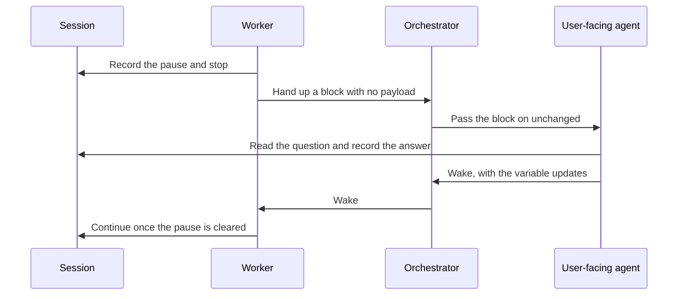


*Figure 1. Question Travels Up, and the Answer Travels Back Down.*


*Figure 2. Agents, and the Session That Holds the Pause.*


### Worker Pauses

The worker branches on the server's answer (Figure 3). The session is what answers it (Figure 4).

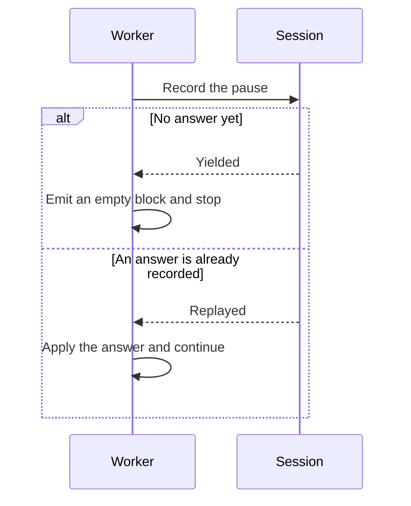


*Figure 3. Worker Branches on Yielded (a new pause) or Replayed (an answer already recorded).*

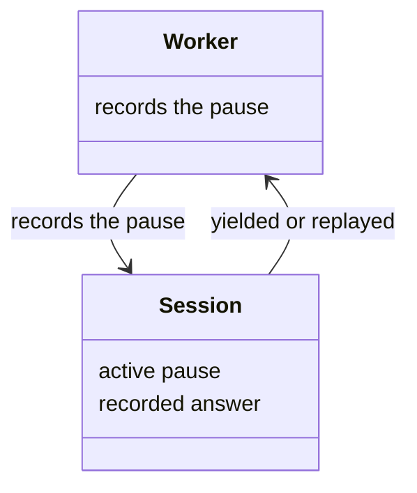


*Figure 4. Worker and the Session That Answers It.*

The block carries no payload. The pause lives in the session, and whoever presents it reads it from there. A replacement worker that reaches a gate already answered applies that answer and continues, because the answer key names the activity and the checkpoint and no agent.

#### Recording the Pause

```javascript
yield_checkpoint({ session_index, checkpoint_id: "confirm-target" })
```

A worker that meets a decision its activity never declared may yield one anyway, supplying its own message and options. A declared gate owns its wording, so those two fields are refused there.

### One Pause per Session

A second pause is refused on a session that already has one, while a parent and a child each keep their own (Figure 5). Every session in the tree has that slot, and a replacement worker replays by the answer key (Figure 6).

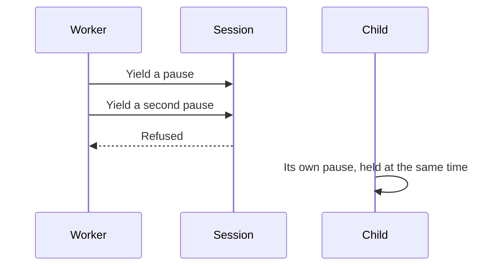


*Figure 5. A Second Pause on One Session Is Refused.*

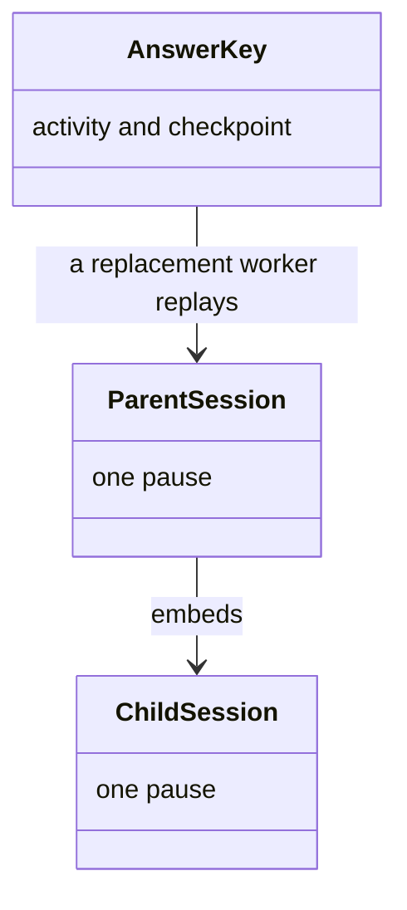


*Figure 6. Each Session in the Tree Has One Slot.*

The refusal reads the session the call addresses. A parent and each of its children carries its own slot, so a parent and a child can hold a pause at the same time, and two children can as well. What no single session can do is stack two.

### Orchestrator Relays

The block passes upward unchanged (Figure 7). The orchestrator stands between the worker and the agent that can ask (Figure 8).

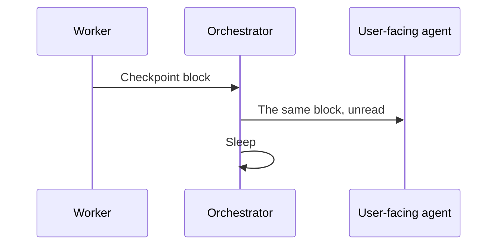


*Figure 7. Block Passes Upward Unchanged.*

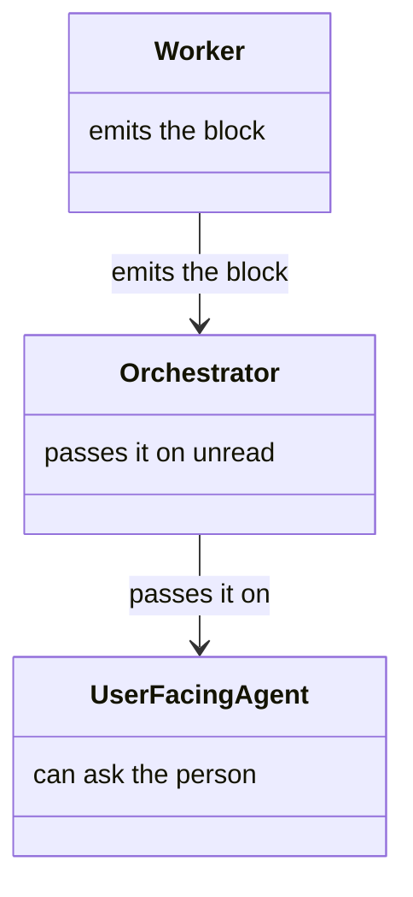


*Figure 8. Orchestrator between the Worker and the User-Facing Agent.*


### User-Facing Agent Presents and Resolves

The question is shown to the person, and the answer is written back (Figure 9). The agent, the session, and the effects are the pieces (Figure 10).

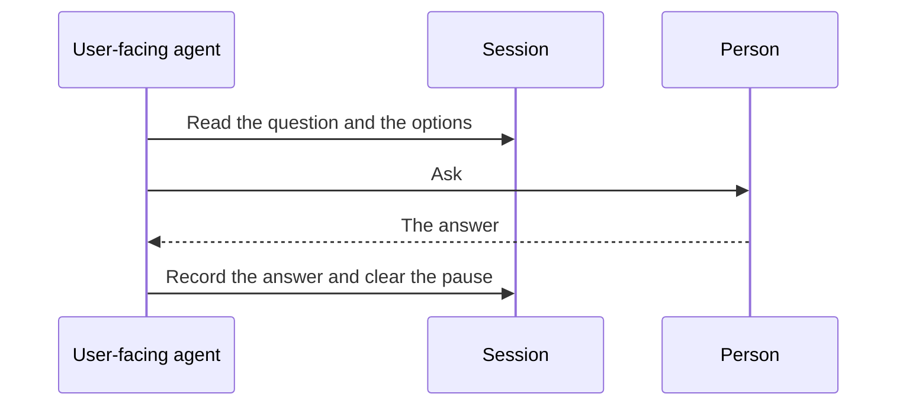


*Figure 9. Question Is Shown, and the Answer Is Written Back.*

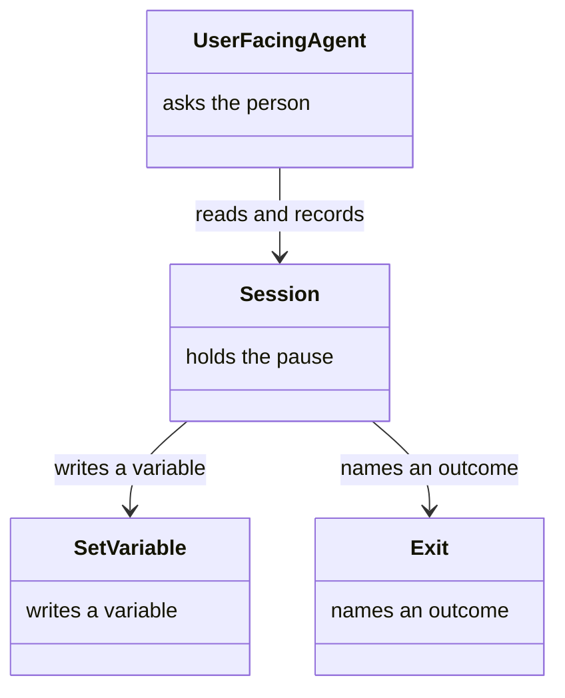


*Figure 10. Agent, the Session, and the Effects.*

An effect is applied on its own terms. A variable effect is written into the session. An exit effect names one of the activity's declared outcomes; the server reads its destination from the workflow graph and hands both back, because recording the answer does not itself move the session. Where that exit is immediate, the activity's remaining steps do not run.

#### Reading the Question

```javascript
present_checkpoint({ session_index })
```

The server reads the active pause, finds the matching definition, and returns the message, the options, and the effect each option carries.

#### Recording the Answer

```javascript
respond_checkpoint({ session_index, option_id: "proceed" })
```


### Resolving a Pause

The server accepts one answer, and only after its wait (Figure 11). Each answer waits on the pause timestamp (Figure 12).

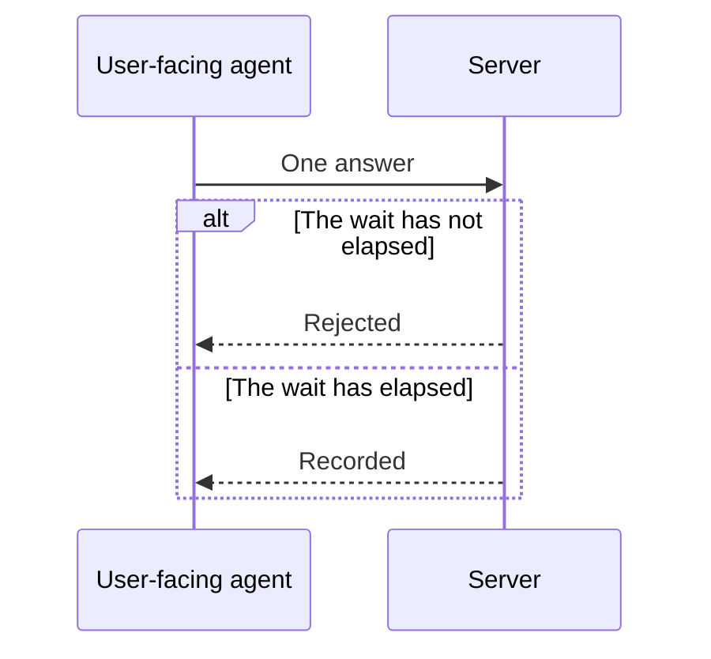


*Figure 11. One Answer, after Its Wait.*

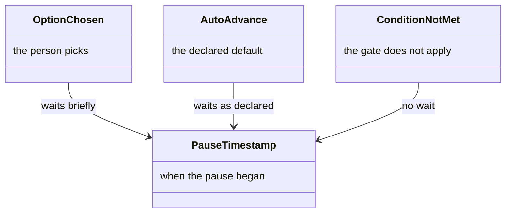


*Figure 12. Answers and the Timers They Wait On.*

#### Answer Modes


| Mode                | What it means                            | Timing                                              |
| ------------------- | ---------------------------------------- | --------------------------------------------------- |
| `option_id`         | The person picked this option            | At least three seconds since the pause was recorded |
| `auto_advance`      | Take the checkpoint's own default        | The declared wait has passed                        |
| `condition_not_met` | The prerequisite is false, so dismiss it | None                                                |


Exactly one of the three may be supplied. Both timers run from the moment the pause was recorded, so an answer that arrives instantly is rejected.

#### Soft Gate and Dismissal

Auto-advance needs both a default option and a declared wait. That pair is a soft gate. A gate that must wait for a person declares neither, and declaring one without the other is a defect.

Dismissal is only open to a checkpoint carrying a structured condition. One gated by an inline expression cannot be dismissed this way. The server checks that the condition field is present and cannot check whether it is true, so the evaluation is taken on trust and recorded.


## Resume Protocol

The agents wake in reverse, and the worker is refused while the pause is still active (Figure 13). The same agents wake, or one agent plays both roles when nothing is in the background (Figure 14).

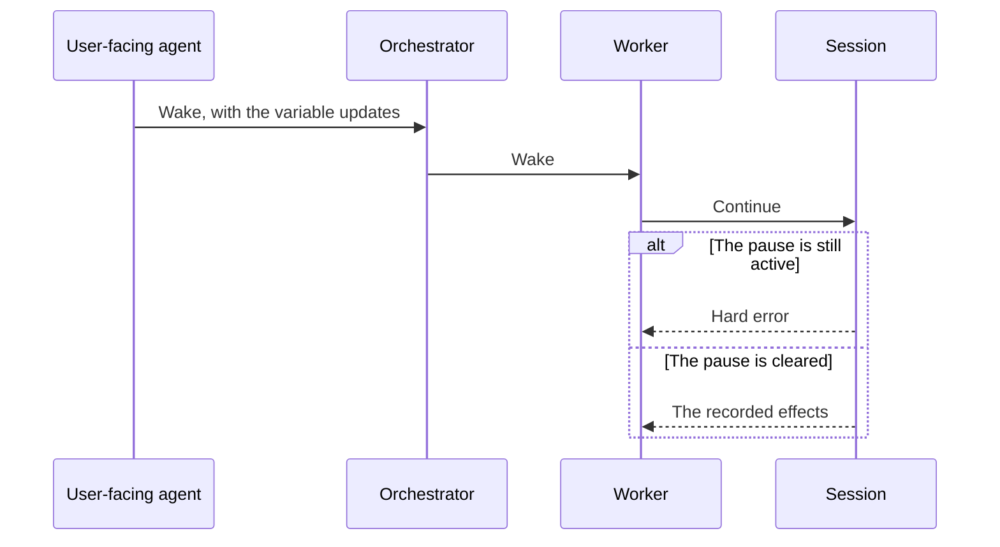


*Figure 13. Agents Wake in Reverse, or the Worker Is Refused.*


*Figure 14. Agents Waking, or One Agent Switching Role.*

The user-facing agent wakes the orchestrator and passes the variable updates in plain text. The orchestrator updates its own state and wakes the worker the same way. Where one agent plays every role, that wake does nothing: the same agent switches back to the worker and continues.

#### Continuing After the Answer

```javascript
resume_checkpoint({ session_index })
```

The server checks that the pause has been cleared and returns the recorded effects. Calling this while the pause is still active is a hard error: the answer has to exist before the worker moves.

## Declaring a Checkpoint

One declaration is reused at several sites, then shown to the worker as an ordinary checkpoint (Figure 15). The step, the shared routine, and the sites that refer to it are the pieces (Figure 16). The step's fields are the [schema](../schemas/activity.schema.json#L428).

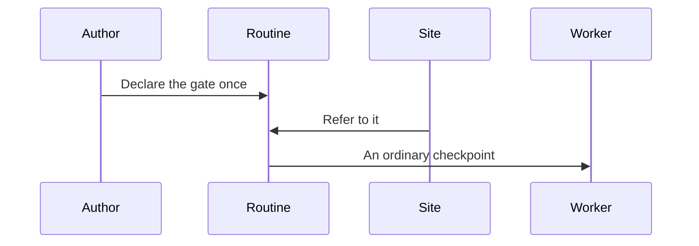


*Figure 15. Declared Once, Then Shown as an Ordinary Checkpoint.*

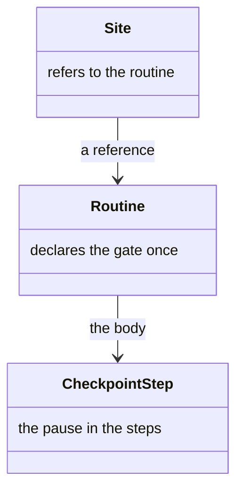


*Figure 16. Step, the Shared Routine, and the Sites That Refer to It.*

A gate that is not part of a larger run is a one-step routine. The reference prefixes every identifier the run contributes, so two sites cannot collide, and the routine's signature is held against its body. The loader materialises the reference before delivery, so every consumer sees an ordinary checkpoint. A checkpoint body authored inline at two sites is reported.

#### Example Declaration

```yaml
steps:
  - kind: checkpoint
    id: confirm-target
    message: "Please confirm the detected target is correct."
    condition:
      type: simple
      variable: target_detected
      operator: exists
    options:
      - id: proceed
        label: "Proceed"
        description: "The target is correct; continue."
        effect:
          setVariable:
            target_confirmed: true
      - id: edit
        label: "Choose another"
        description: "Select a different target before proceeding."
        effect:
          setVariable:
            target_confirmed: false
```

The fields of that declaration are the [schema](../schemas/activity.schema.json#L428).


## Where a Checkpoint Belongs

A gate comes before the steps its answer steers, and a gate placed too late does not (Figure 17). The checkpoint, the steps around it, and the order check are the pieces (Figure 18).

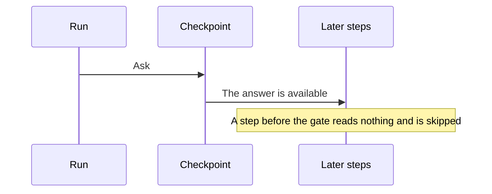


*Figure 17. Gate Comes before the Steps Its Answer Steers.*

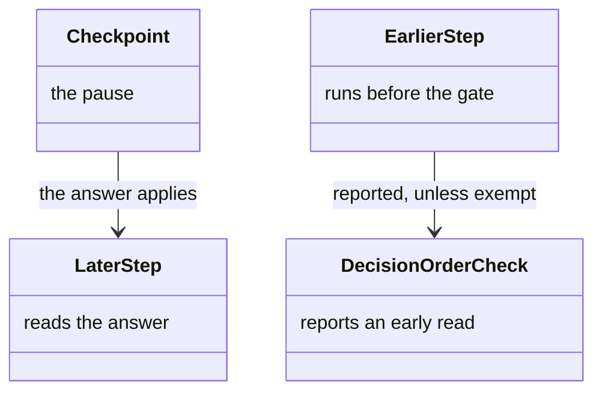


*Figure 18. Checkpoint, the Steps around It, and the Order Check.*

Every step gated on a variable the checkpoint decides has to run after it. A gate reading an unbound variable is false, so the step is skipped, and the answer arrives with nothing left to apply it to. The run completes, having asked a question that changed nothing.

#### Exempt Earlier Reads

Five earlier reads are exempt, because each already has an answer or loses nothing by not firing.


| Exempt                                   | Why                                                                                                       |
| ---------------------------------------- | --------------------------------------------------------------------------------------------------------- |
| The variable declares a default          | Seeding puts it in the bag at session creation, so the earlier gate reads the default rather than nothing |
| The earlier gate tests presence          | A presence test answers on a missing variable; absence is one of its two answers                          |
| The earlier step only announces          | An announcement that does not fire costs nothing                                                          |
| The deciding option leaves the activity  | The run meets the earlier step again on its next visit, and that visit reads what the option wrote        |
| The two gates demand incompatible values | No single run reaches both steps, so the earlier one was never waiting on this decision                   |


The last two are how a value is settled. A technique derives it. An announcement reports it when the derivation was confident, and a checkpoint decides it when the derivation was ambiguous. Without those exemptions that shape is reported as a defect.

Requirements come from conjuncts only. An alternative proves nothing about which branch a run took, so a gate built from one contributes no exclusion.

### Never the First Step

A checkpoint is refused as the first step, and the decision sits in one of the other places (Figure 19). The activity and the dispatch would otherwise pay for a pause before any work (Figure 20).

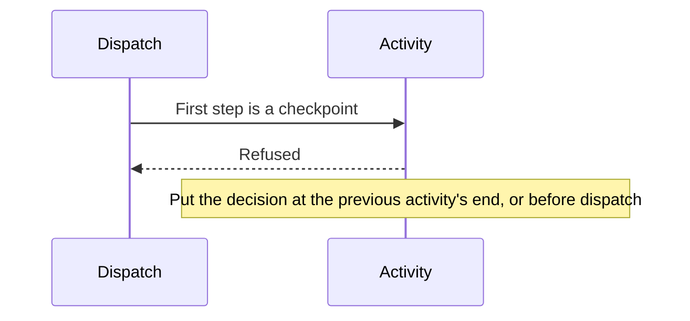


*Figure 19. A Checkpoint Is Refused as the First Step.*

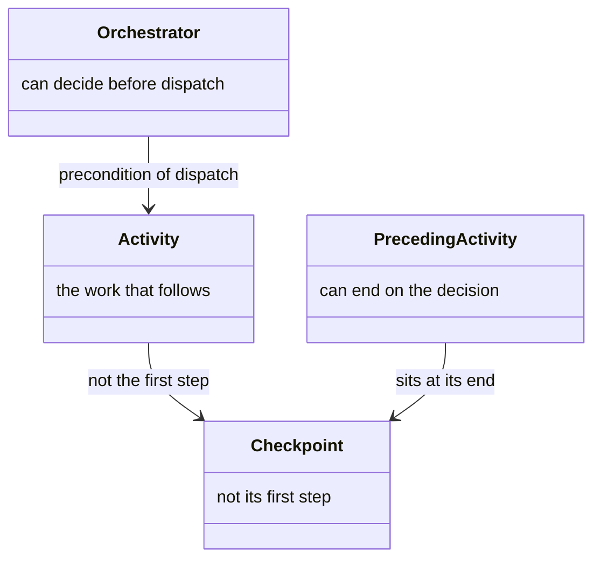


*Figure 20. Activity, and Where the Decision Can Sit.*

## What the Design Buys

A question stays off a background agent, and a pause outlives the worker (Figure 21). The channel, the session, and the timers are what hold that (Figure 22).

```mermaid
sequenceDiagram
  participant Worker
  participant Top as User-facing agent
  participant Session
  Worker->>Top: The question, via the relay
  Note over Worker: The worker does not ask the person
  Worker->>Session: The pause and the answer
  Note over Session: A replacement worker reads the same answer
```


*Figure 21. Question Stays with the Agent Who Can Ask, and the Pause Stays in the Session.*

```mermaid
classDiagram
  class UserFacingAgent {
    the only channel to the person
  }
  class Orchestrator {
    passes the block unread
  }
  class Session {
    pause and answer
  }
  class Timers {
    refuse an instant answer
  }
  UserFacingAgent --> Session : records the answer
  Orchestrator --> UserFacingAgent : passes the block
  Timers --> Session : an instant answer is refused
```


*Figure 22. Channel, the Unread Relay, the Session, and the Timers.*

A background agent that tries to ask the person has no channel to do it, so every question travels to the one agent that does. The orchestrator in the middle passes a block it never parses, and needs no view of the question, the options, or the effects. The pause and its answer live in the session, so a worker that dies mid-gate loses no decision. The two timers make an instant answer fail.