# Checkpoints

A workflow sometimes has to stop and ask a person. Which directory to use, whether a change is ready, which of two readings was meant: the run cannot settle these from what it already knows, and a wrong guess produces work nobody wanted. A **checkpoint** is that pause, written into the steps, and it holds the run until someone answers.

A **worker** carries out one activity, in the background, and cannot speak to the person. An **orchestrator** tracks the workflow and passes the question along. A **user-facing agent** is the one that can ask. Work travels down a [chain](dispatch.md) of these agents, so the question travels up and the answer travels back down.

A **session** holds the pause and the recorded answer. The worker hands up a **block**, an empty marker, and stops. **Yielded** means the pause is new. **Replayed** means an answer is already there and the worker continues. An **answer key** names the activity and the checkpoint, so a replacement worker can replay. The [calls](api-reference.md#workflow-navigation) record the pause, show it, answer it, and continue.

A **gate** is a checkpoint placed before the steps its answer steers. An answer's **effect** writes a variable or names the activity's outcome. A **routine** declares one gate that several **sites** reuse. A **dispatch** sends a worker an activity, and a checkpoint is never that activity's first step. What a timer cannot prove is in [fidelity](fidelity.md).

## Checkpoint Flow

The question travels up to the person, and the answer travels back down (Figure 1). The agents and the session hold that pause (Figure 2).

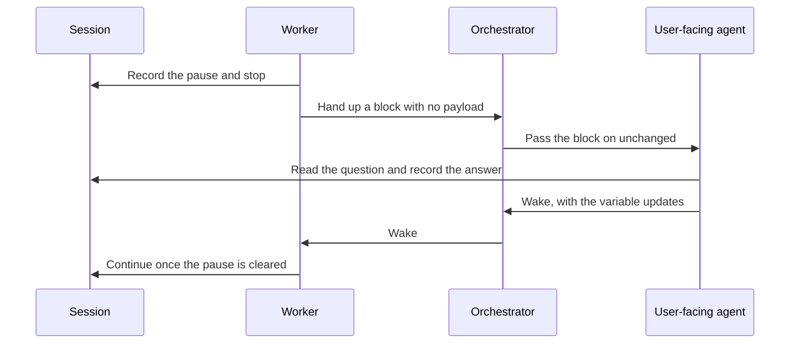

*Figure 1. Question Travels Up, and the Answer Travels Back Down.*

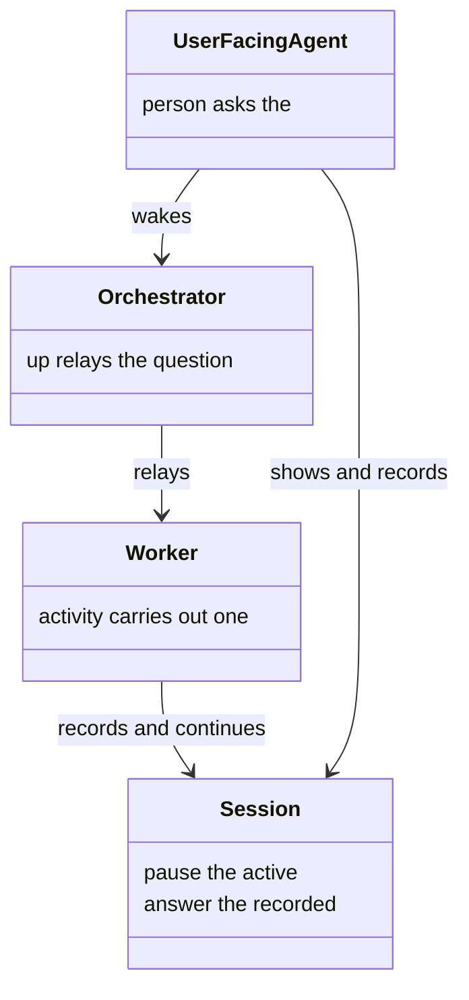

*Figure 2. Agents, and the Session That Holds the Pause.*

<a id="the-worker-pauses"></a>

### Worker Pauses

The worker branches on the server's answer (Figure 3). The session is what answers it (Figure 4).

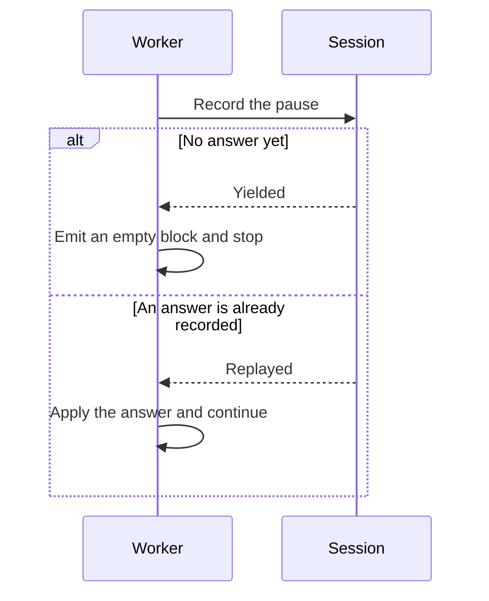

*Figure 3. Worker Branches on Yielded (a new pause) or Replayed (an answer already recorded).*

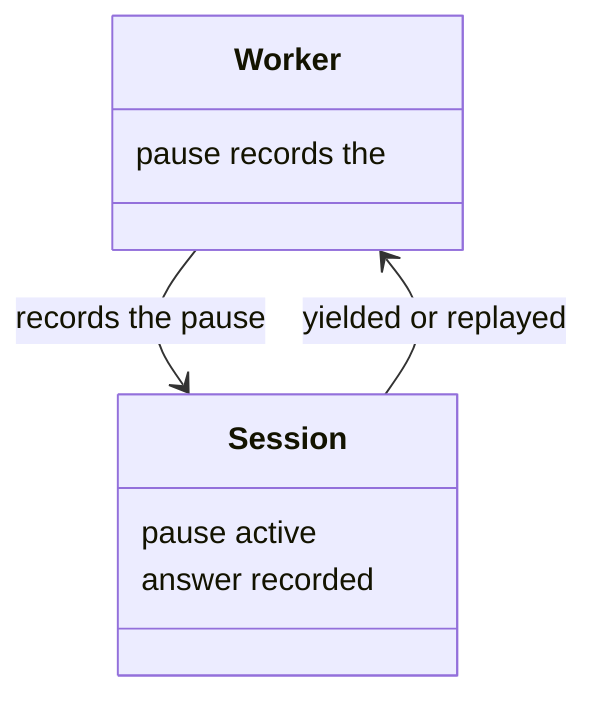

*Figure 4. Worker and the Session That Answers It.*

### One Pause per Session

A second pause is refused on a session that already has one, while a parent and a child each keep their own (Figure 5). Every session in the tree has that slot, and a replacement worker replays by the answer key (Figure 6).

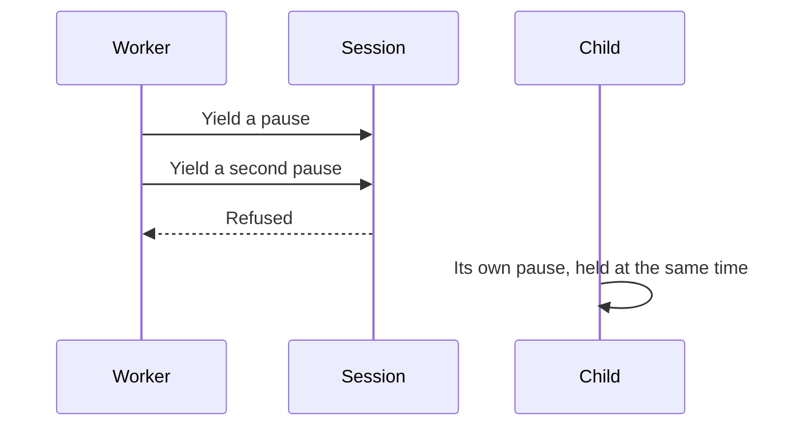

*Figure 5. A Second Pause on One Session Is Refused.*


*Figure 6. Each Session in the Tree Has One Slot.*

### Orchestrator Relays

The block passes upward unchanged (Figure 7). The orchestrator stands between the worker and the agent that can ask (Figure 8).

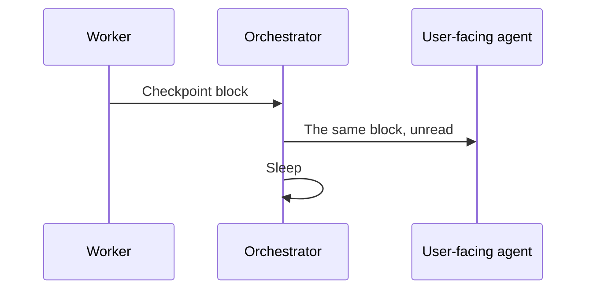

*Figure 7. Block Passes Upward Unchanged.*

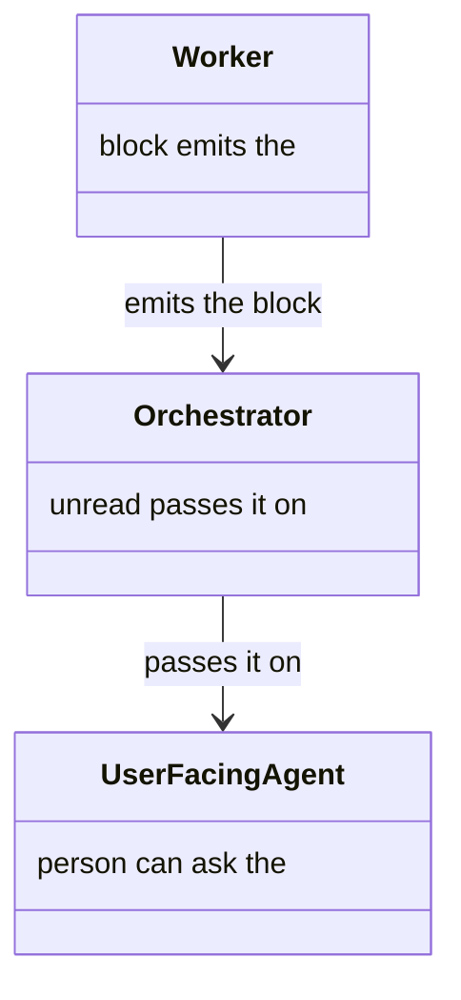

*Figure 8. Orchestrator between the Worker and the User-Facing Agent.*

<a id="the-user-facing-agent-presents-and-resolves"></a>

### User-Facing Agent Presents and Resolves

The question is shown to the person, and the answer is written back (Figure 9). The agent, the session, and the effects are the pieces (Figure 10).

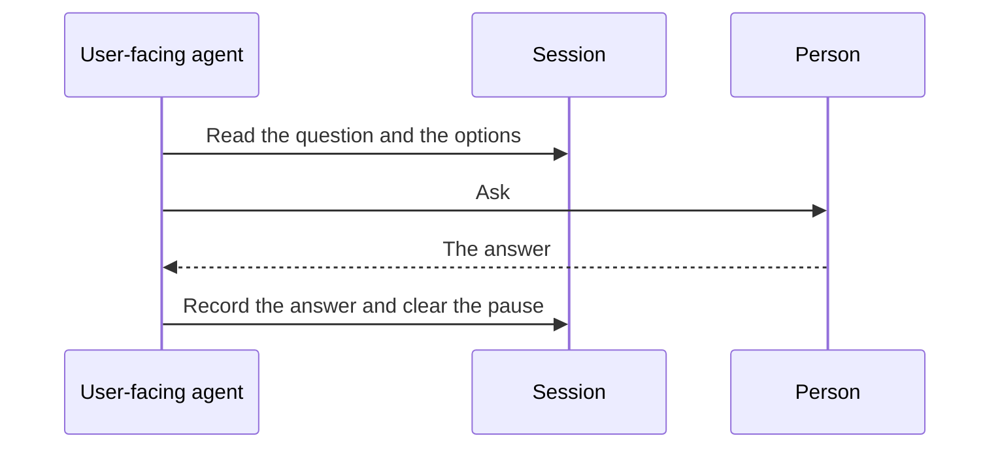

*Figure 9. Question Is Shown, and the Answer Is Written Back.*

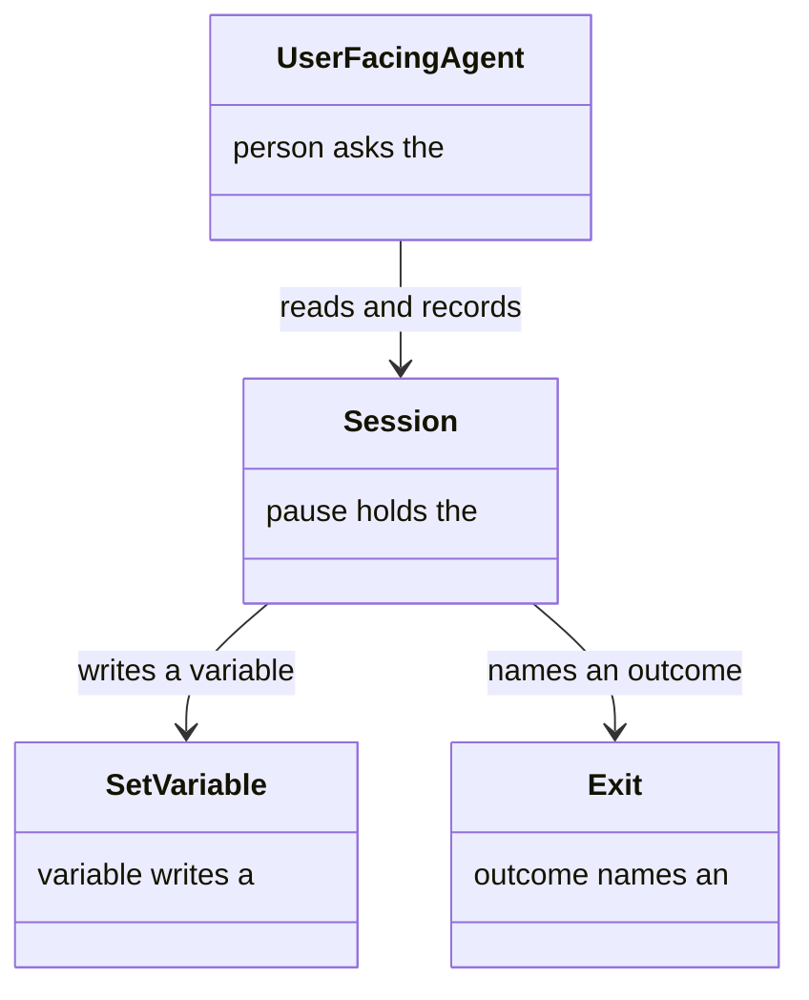

*Figure 10. Agent, the Session, and the Effects.*

<a id="three-ways-to-resolve-one"></a>

### Resolving a Pause

The server accepts one answer, and only after its wait (Figure 11). Each answer waits on the pause timestamp (Figure 12).

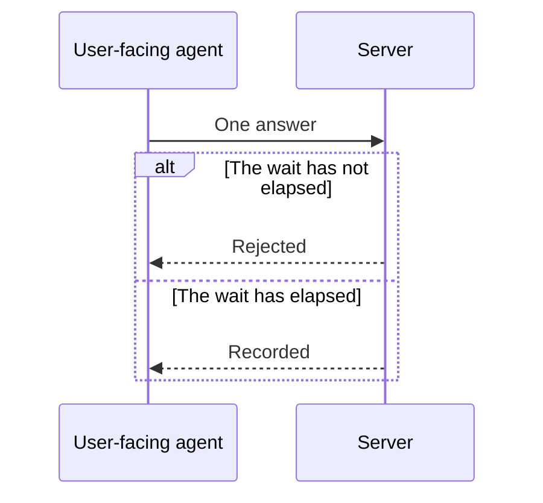

*Figure 11. One Answer, after Its Wait.*

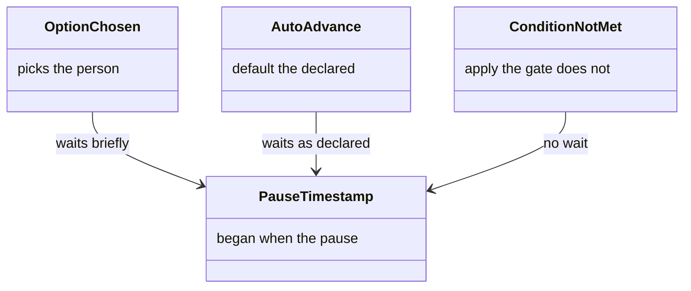

*Figure 12. Answers and the Timers They Wait On.*

<a id="the-resume-protocol"></a>

## Resume Protocol

The agents wake in reverse, and the worker is refused while the pause is still active (Figure 13). The same agents wake, or one agent plays both roles when nothing is in the background (Figure 14).

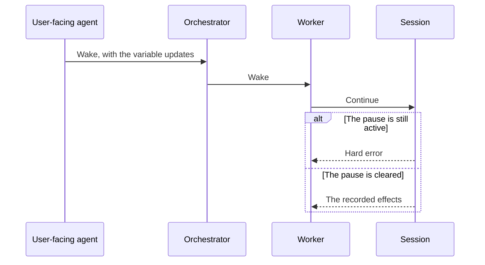

*Figure 13. Agents Wake in Reverse, or the Worker Is Refused.*

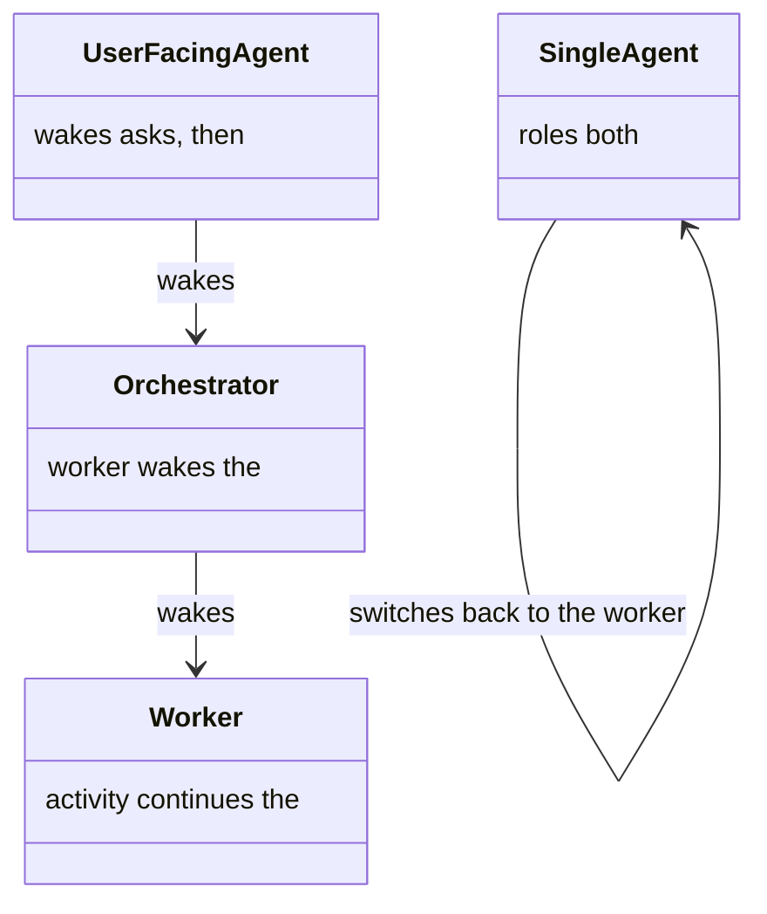

*Figure 14. Agents Waking, or One Agent Switching Role.*

## Declaring a Checkpoint

One declaration is reused at several sites, then shown to the worker as an ordinary checkpoint (Figure 15). The step, the shared routine, and the sites that refer to it are the pieces (Figure 16). The step's fields are the [schema](../schemas/README.md#checkpoint-step).

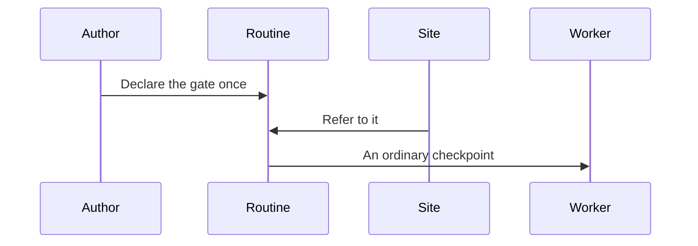

*Figure 15. Declared Once, Then Shown as an Ordinary Checkpoint.*

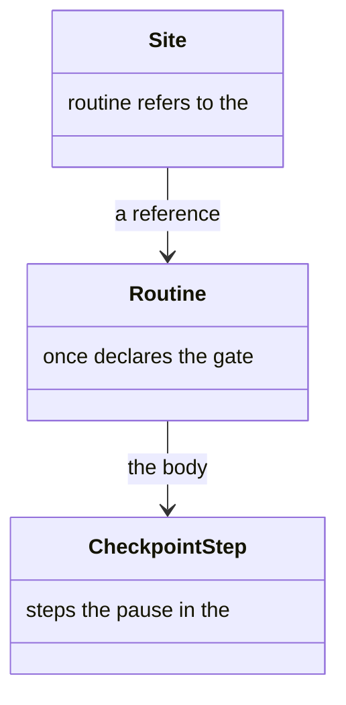

*Figure 16. Step, the Shared Routine, and the Sites That Refer to It.*

## Where a Checkpoint Belongs

A gate comes before the steps its answer steers, and a gate placed too late does not (Figure 17). The checkpoint, the steps around it, and the order check are the pieces (Figure 18).

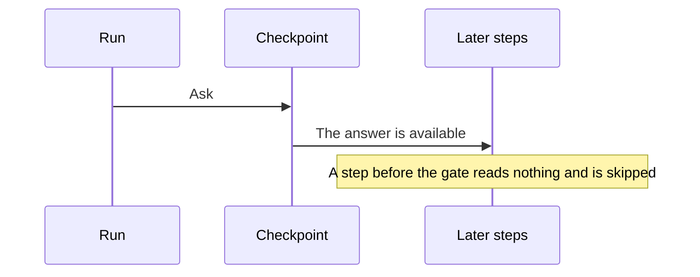

*Figure 17. Gate Comes before the Steps Its Answer Steers.*


*Figure 18. Checkpoint, the Steps around It, and the Order Check.*

### Never the First Step

A checkpoint is refused as the first step, and the decision sits in one of the other places (Figure 19). The activity and the dispatch would otherwise pay for a pause before any work (Figure 20).

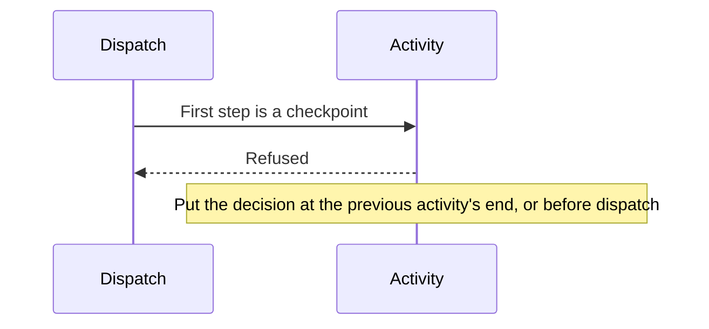

*Figure 19. A Checkpoint Is Refused as the First Step.*

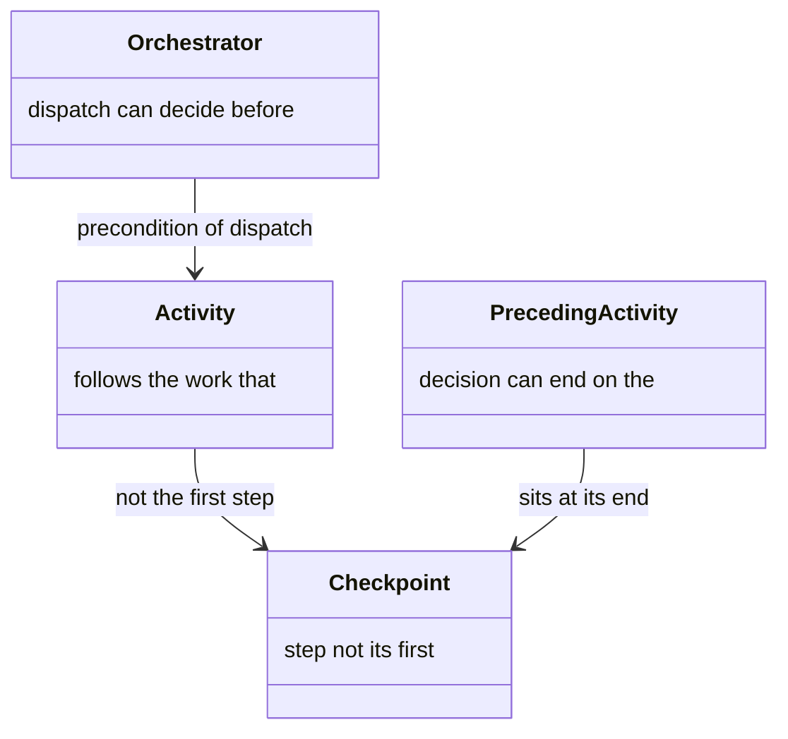

*Figure 20. Activity, and Where the Decision Can Sit.*

## What the Design Buys

A question stays off a background agent, and a pause outlives the worker (Figure 21). The channel, the session, and the timers are what hold that (Figure 22).

```mermaid
sequenceDiagram
  participant Worker
  participant Top as User-facing agent
  participant Session
  Worker->>Top: The question, via the relay
  Note over Worker: The worker does not ask the person
  Worker->>Session: The pause and the answer
  Note over Session: A replacement worker reads the same answer
```

*Figure 21. Question Stays with the Agent Who Can Ask, and the Pause Stays in the Session.*

```mermaid
classDiagram
  class UserFacingAgent {
    person the only channel to the
  }
  class Orchestrator {
    unread passes the block
  }
  class Session {
    answer pause and
  }
  class Timers {
    answer refuse an instant
  }
  UserFacingAgent --> Session : records the answer
  Orchestrator --> UserFacingAgent : passes the block
  Timers --> Session : an instant answer is refused
```

*Figure 22. Channel, the Unread Relay, the Session, and the Timers.*
