# Checkpoints

A workflow sometimes has to stop and ask a person. Which directory to use, whether a change is ready, which of two readings was meant: the run cannot settle these from what it already knows, and a wrong guess produces work nobody wanted. A checkpoint is that pause, written into the steps, and it holds the run until someone answers.

The agent that reaches the pause is not the agent that can ask. Work travels down a [chain](dispatch.md) of agents. The ones at the bottom run in the background and cannot speak to the person, so the question travels up to the agent that can, and the answer travels back down. The pause begins when a worker reaches it, through the [calls](api-reference.md#workflow-navigation) that record it, show it, answer it, and continue.

## Checkpoint Flow

Figure 1 is the question traveling up to the person and the answer traveling back down. Figure 2 is the three agents and the session that holds the pause.

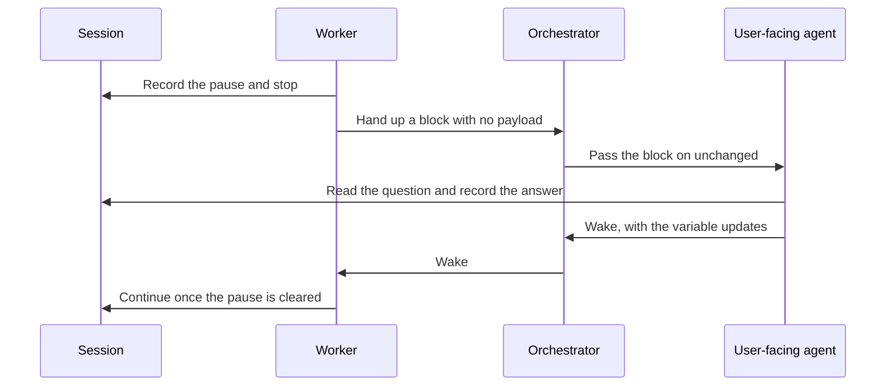

*Figure 1. The Question Travels Up, and the Answer Travels Back Down.*

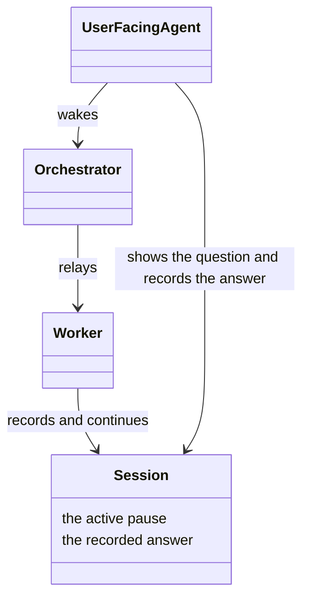

*Figure 2. The Three Agents, and the Session That Holds the Pause.*

<a id="the-worker-pauses"></a>

### Worker Pauses

Figure 3 is the worker branching on the server's answer. Figure 4 is the worker, the session, and that answer.

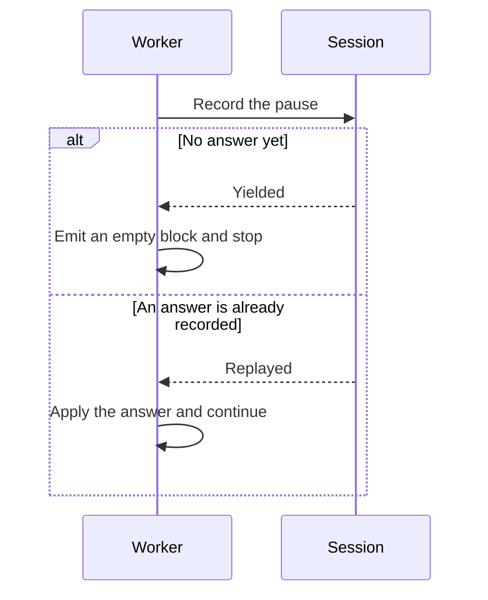

*Figure 3. The Worker Branches on Yielded or Replayed.*

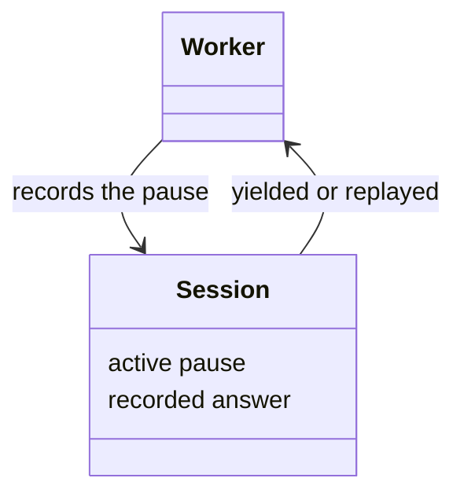

*Figure 4. The Worker and the Session That Answers It.*

### One Pause per Session

Figure 5 is a second pause refused on a session that already has one, while a parent and a child each keep their own. Figure 6 is that slot on every session in the tree, and the answer key a replacement worker uses.

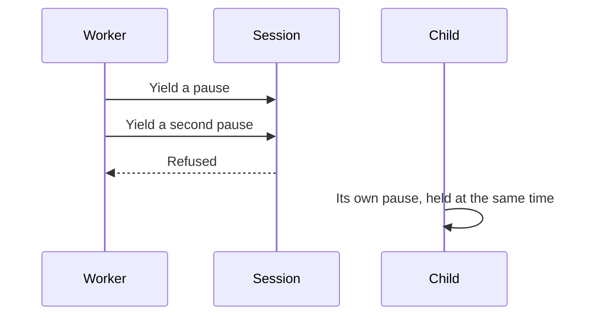

*Figure 5. A Second Pause on One Session Is Refused.*

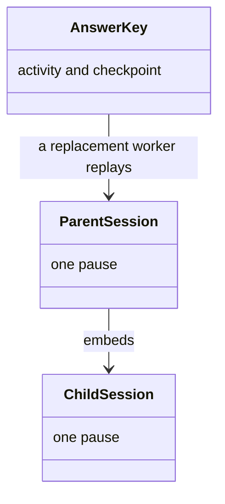

*Figure 6. Each Session in the Tree Has One Slot.*

### Orchestrator Relays

Figure 7 is the block passing upward unchanged. Figure 8 is the orchestrator standing between the worker and the agent that can ask.

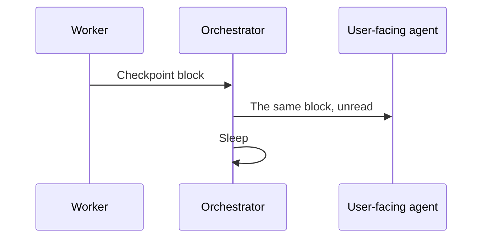

*Figure 7. The Block Passes Upward Unchanged.*

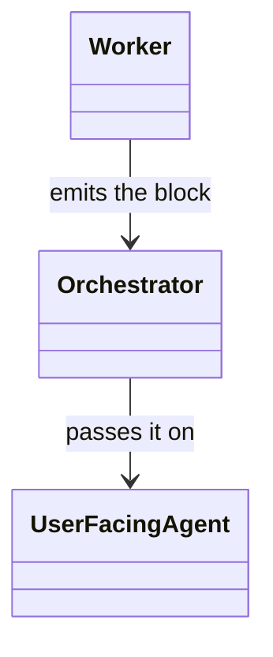

*Figure 8. The Orchestrator between the Worker and the User-Facing Agent.*

<a id="the-user-facing-agent-presents-and-resolves"></a>

### User-Facing Agent Presents and Resolves

Figure 9 is the question shown to the person and the answer written back. Figure 10 is the agent, the session, and the two kinds of effect.

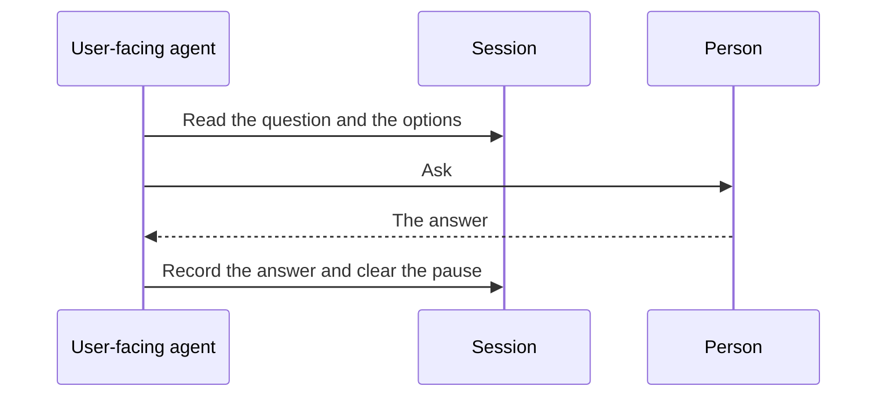

*Figure 9. The Question Is Shown, and the Answer Is Written Back.*

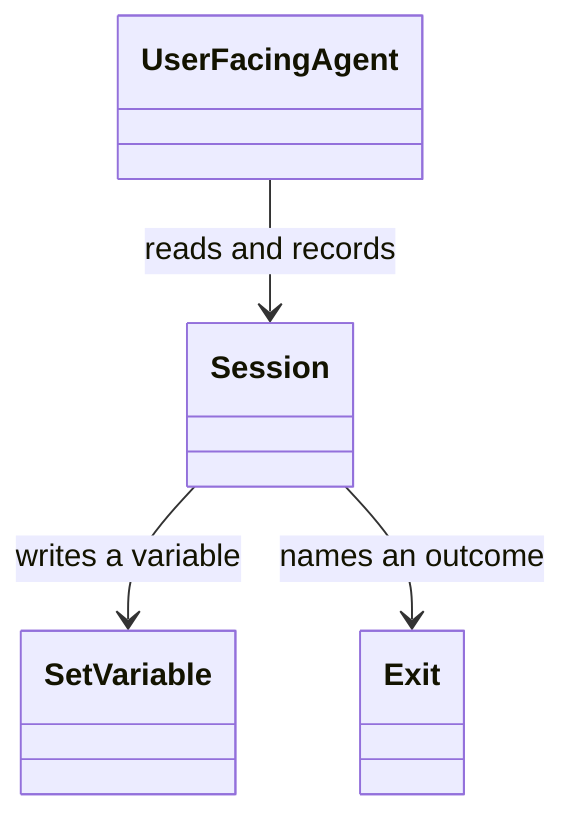

*Figure 10. The Agent, the Session, and the Two Effects.*

<a id="three-ways-to-resolve-one"></a>

### Three Ways to Resolve One

Figure 11 is the server accepting exactly one of the three answers. Figure 12 is those three answers and the two timers.

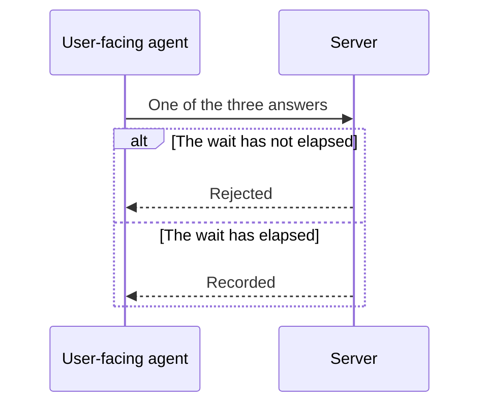

*Figure 11. Exactly One Answer, after Its Wait.*

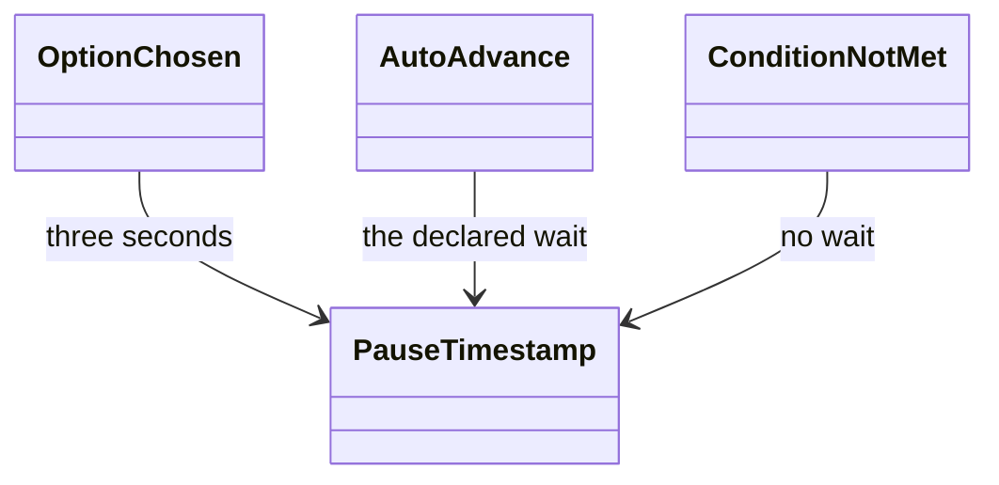

*Figure 12. The Three Answers and the Timers They Wait On.*

<a id="the-resume-protocol"></a>

## Resume Protocol

Figure 13 is the agents waking in reverse, and the worker refused while the pause is still active. Figure 14 is the same three agents, with one agent playing both roles when nothing is in the background.

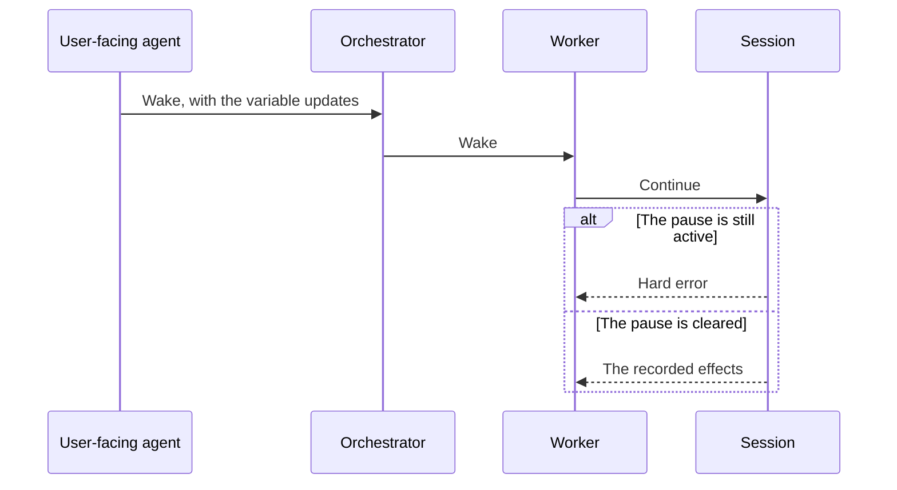

*Figure 13. The Agents Wake in Reverse, or the Worker Is Refused.*

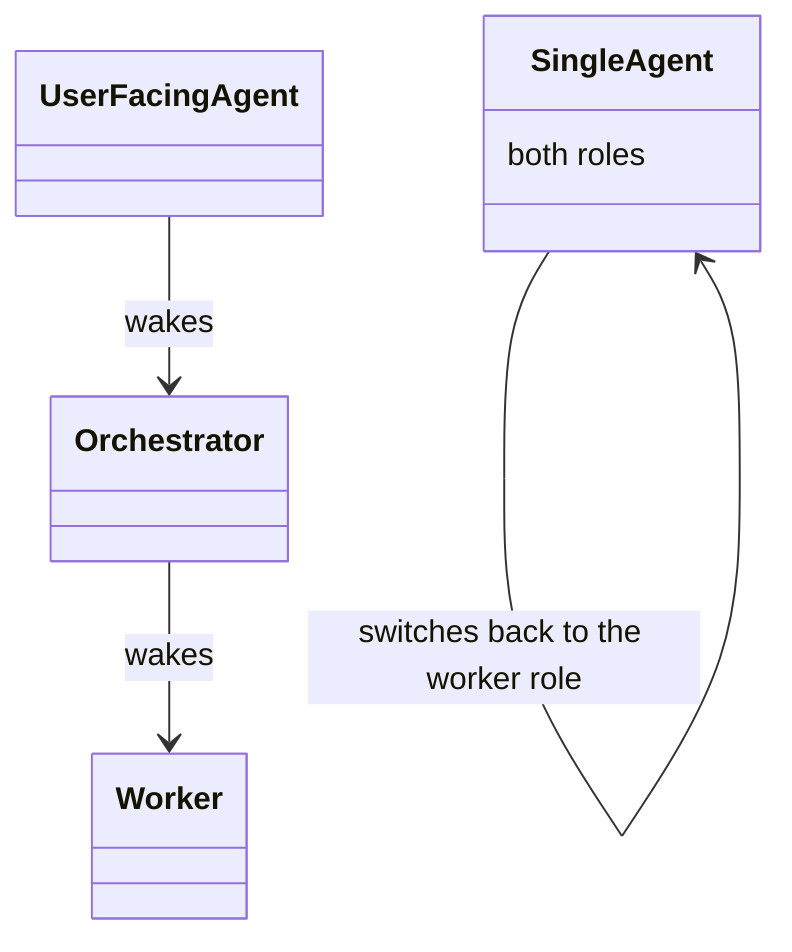

*Figure 14. Three Agents Waking, or One Agent Switching Role.*

## Declaring a Checkpoint

Figure 15 is one declaration reused at several sites, then shown to the worker as an ordinary checkpoint. Figure 16 is the step, the shared routine, and the sites that refer to it.

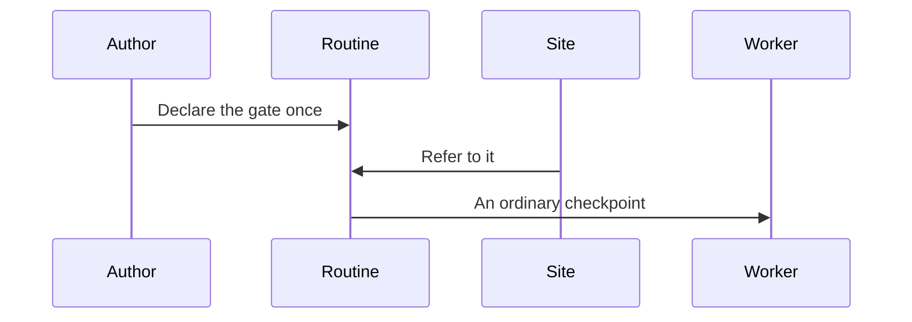

*Figure 15. Declared Once, Then Shown as an Ordinary Checkpoint.*

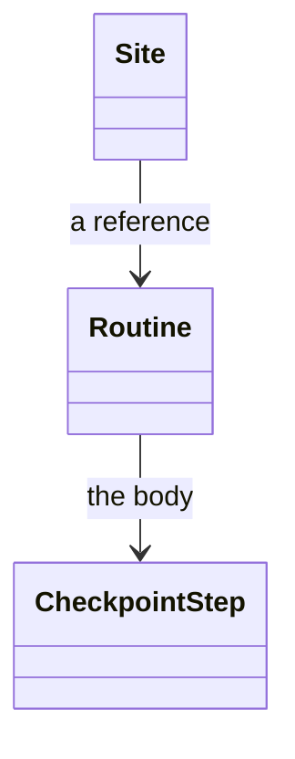

*Figure 16. The Step, the Shared Routine, and the Sites That Refer to It.*

The step's fields are the [schema](../schemas/README.md#checkpoint-step).

## Where a Checkpoint Belongs

Figure 17 is a gate placed before the steps its answer steers, and a gate placed too late. Figure 18 is the checkpoint, the later steps, and the check that reports a decision read too early.

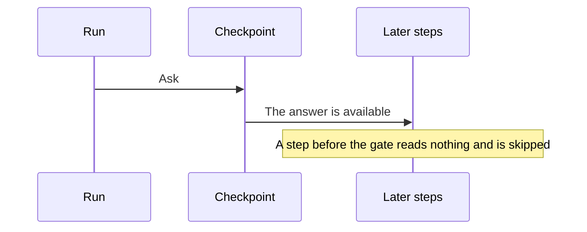

*Figure 17. The Gate Comes before the Steps Its Answer Steers.*

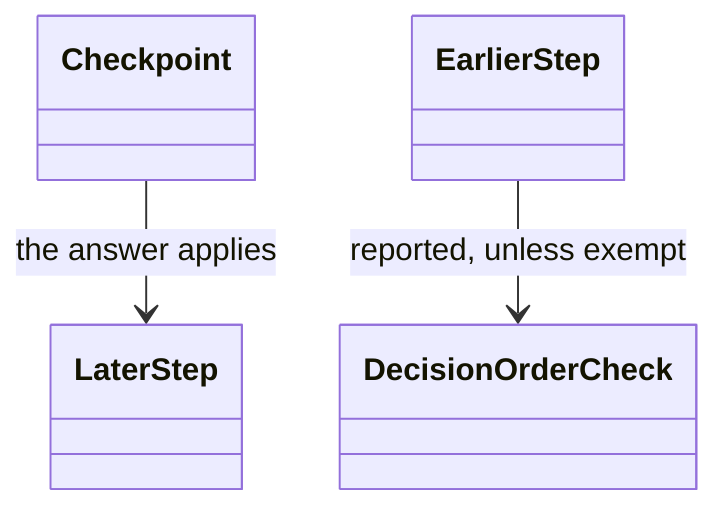

*Figure 18. The Checkpoint, the Steps around It, and the Order Check.*

### Never the First Step

Figure 19 is a checkpoint refused as the first step, and the two places that decision can sit instead. Figure 20 is the activity and the dispatch that would otherwise pay for a pause before any work.

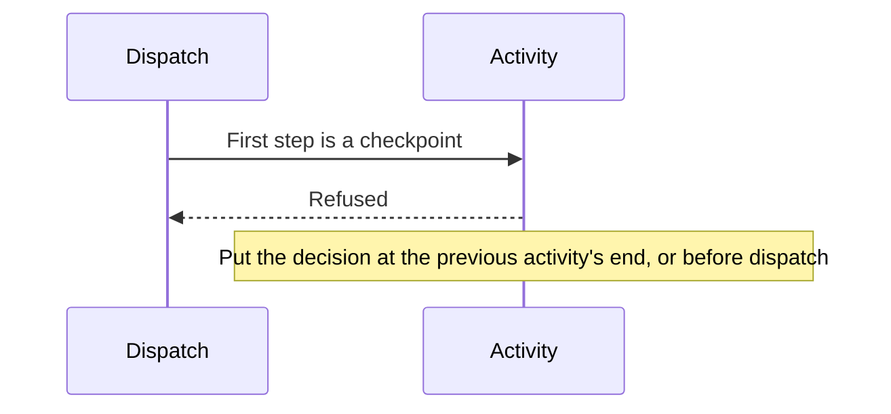

*Figure 19. A Checkpoint Is Refused as the First Step.*

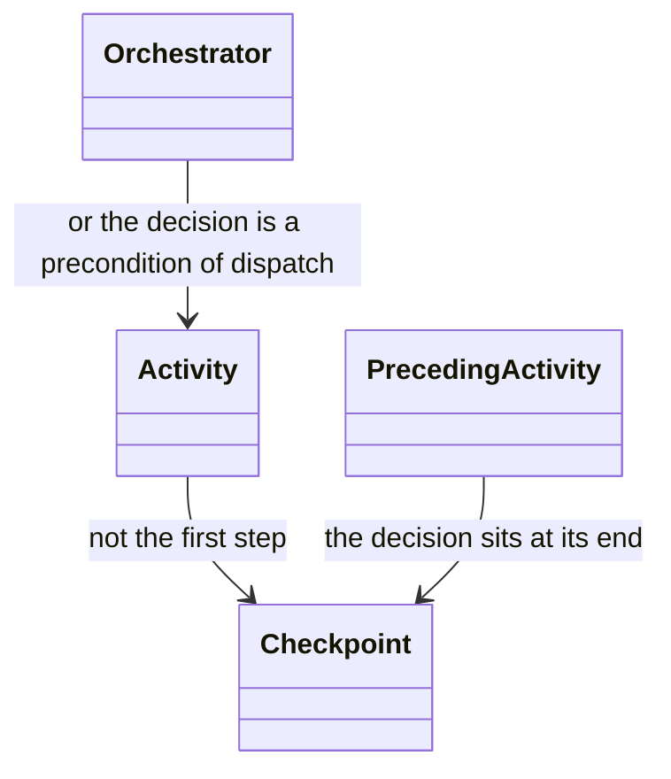

*Figure 20. The Activity, and the Two Places the Decision Can Sit.*

## What the Design Buys

Figure 21 is a question kept off a background agent and a pause that outlives the worker. Figure 22 is the channel, the session, and the timers. What those timers cannot prove is in [fidelity](workflow-fidelity.md).

```mermaid
sequenceDiagram
  participant Worker
  participant Top as User-facing agent
  participant Session
  Worker->>Top: The question, via the relay
  Note over Worker: The worker does not ask the person
  Worker->>Session: The pause and the answer
  Note over Session: A replacement worker reads the same answer
```

*Figure 21. The Question Stays with the Agent Who Can Ask, and the Pause Stays in the Session.*

```mermaid
classDiagram
  class UserFacingAgent {
    the only channel to the person
  }
  class Orchestrator {
    passes the block unread
  }
  class Session {
    pause and answer
  }
  class Timers
  UserFacingAgent --> Session
  Orchestrator --> UserFacingAgent
  Timers --> Session : an instant answer is refused
```

*Figure 22. The Channel, the Unread Relay, the Session, and the Timers.*
