# Delivery

A workflow's instructions are too much to hand an agent all at once. They are split into **techniques**, each one way of doing a single thing, and **resources**, the reference material a technique points at. An **activity** names the techniques its steps need. A **reference** is that name. When the run reaches the step, the server loads the file and sends it, because that is the instruction for the work in hand.

An **orchestrator** tracks one workflow. A **worker** carries out one activity. **Conduct** is the rules every worker is held to. What the server sends them together is a **bundle**: what the workflow names, a **core set** (the instructions always added for that role), and anything added only when the workflow can reach it.

A **context** is the working memory one agent holds from start to finish. A **window** is how much of that one activity may spend on content the worker did not ask for. A **batch** is several activities continued by one worker. A **gate** is a pause for a person. Steps placed in the response are **inlined**; the rest are fetched later. A **prefix** is the leading digits of an activity file, put in front of each document it writes.

The first send of a file is in full. A later send to the same context is a short **marker**, and that way of sending is **reference delivery**. The **ledger** records what the context was already sent. A **dispatch** is one worker being sent an activity, and each one is counted. Which file a reference reaches is [resolution](resolution.md). The [calls](api.md#workflow-navigation) that ask for a delivery are in the tool catalog.


## What Agents Are Sent

A bundle is assembled and handed to an agent, so the agent does not go looking up files itself (Figure 1). A bundle is what the workflow names, what the server always includes, and what is added only when the workflow can reach it (Figure 2).

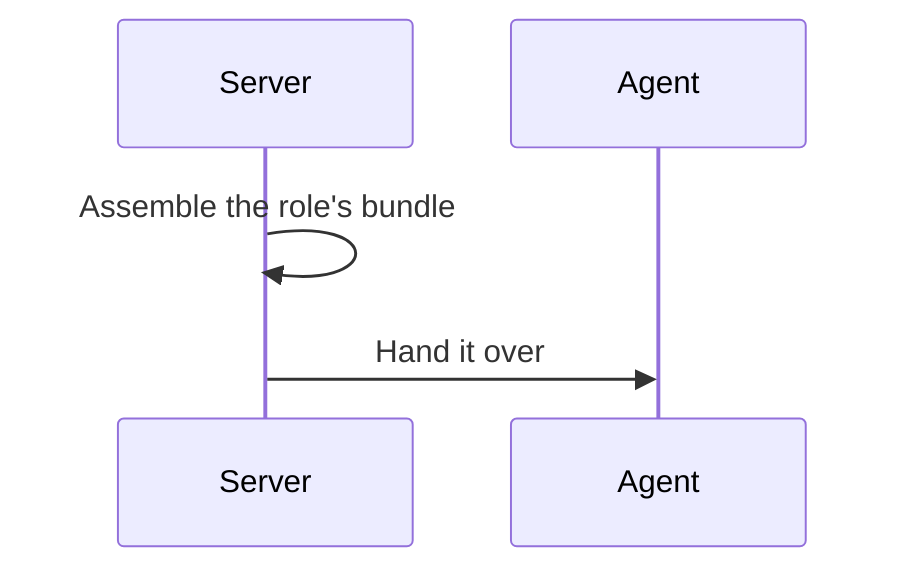


*Figure 1. A Bundle Is Assembled and Handed Over.*

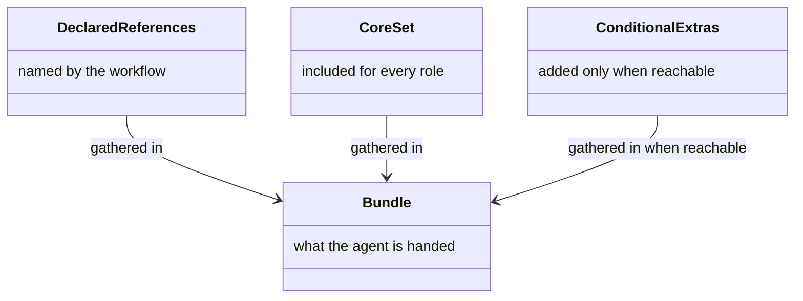


*Figure 2. Declared References, Core Set (orchestrator's walk, state, dispatch, or worker's role, finish, conduct), and Conditional Extras.*


### Orchestrator Bundle

An orchestrator receives the techniques it is to carry out, and the workflow it drives (Figure 3). Those are the techniques, the shared contracts, and the workflow metadata (Figure 4).

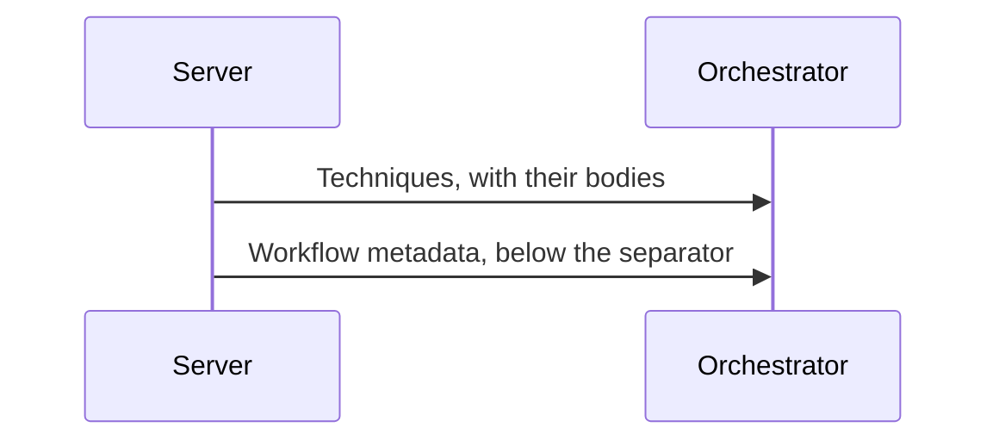


*Figure 3. An Orchestrator Receives Its Techniques and the Workflow.*

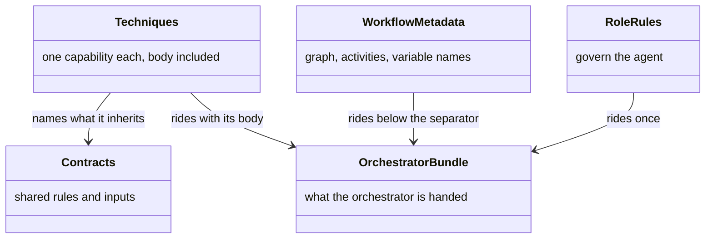


*Figure 4. Techniques, Shared Contracts, Role Rules, and Workflow Metadata.*

Every technique in that union arrives with its body. Rules and inputs a scope shares with every technique under it arrive once, and each body names those scopes.

#### Where a Rule Lives

A rule a technique declares rides the body that states it, beside the procedure it constrains. A rule a workflow or a group shares with every technique under that scope arrives once, and the body names that scope. What is left is the role's own rules, which govern the agent rather than any one technique. The three sets are disjoint, so no rule is read twice, and an activity whose every rule belongs to a technique or a scope sends no list at all. The body wins a tie against the flat list, because it can say which technique a rule binds and a flat list cannot.

Below the separator rides the workflow metadata, whole: the rules, the variable roster, the graph, and the activities. The roster gives every name the run holds, with its type, the values it may take, and its starting value, because the orchestrator has to recognise a name a worker reports and read that value from the session.

What the metadata never carries, at any size, is the prose explaining what each variable is for. That absence is the contract. Nothing the orchestrator decides turns on that prose, and the activity that produces a value and the activity that consumes it each carry it in their own definition.


### Worker Bundle

A worker receives the activity it was sent to do, plus the conduct every worker is held to (Figure 5). That is the activity and that conduct (Figure 6).

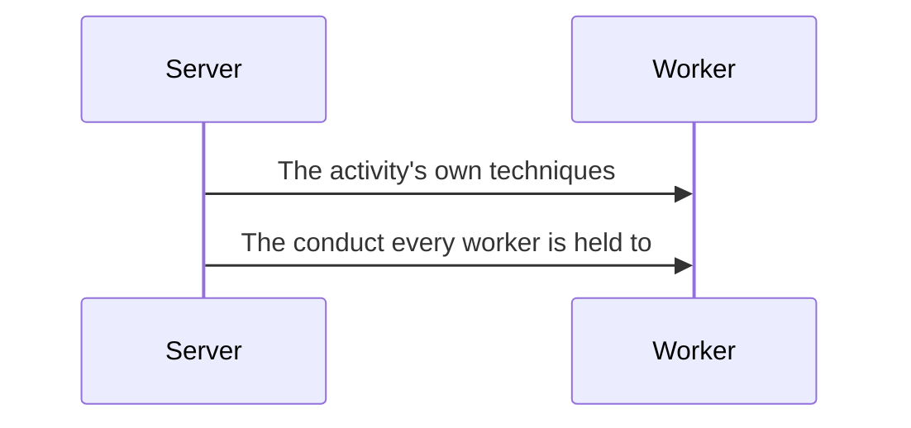


*Figure 5. A Worker Receives Its Activity and Its Conduct.*

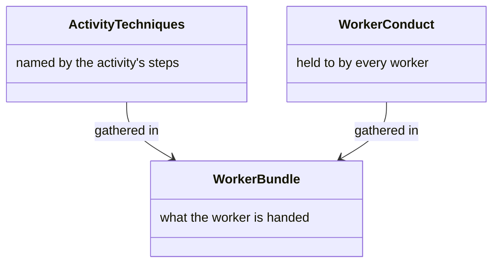


*Figure 6. Activity Techniques and Worker Conduct.*

The worker's own role is in that set because every worker is told to apply it, and only the shared layer declares it. Without it, a worker would be told to apply a technique its bundle never carried.


### Document Names

A worker names each document with the activity's prefix, so the folder sorts by activity (Figure 7). That is the activity, that prefix, and the list of expected documents (Figure 8). Where the folder sits is the [planning folder](state.md#the-planning-folder).

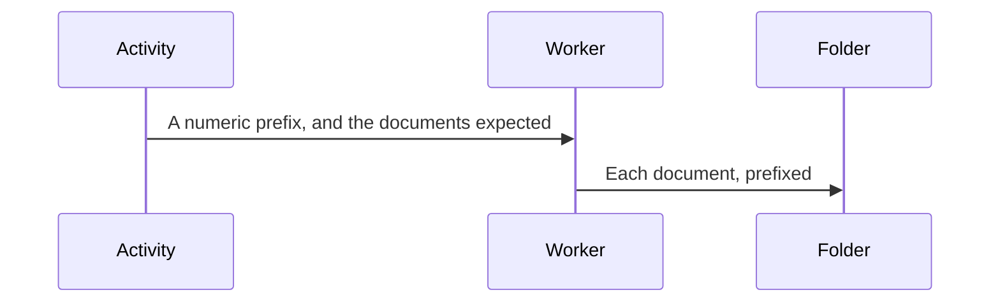


*Figure 7. Each Document Takes the Activity's Prefix.*

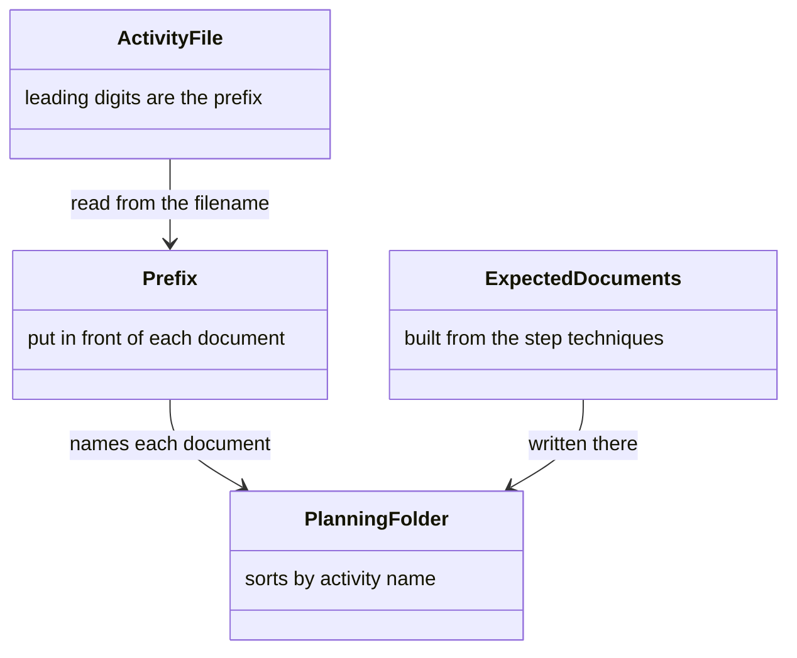


*Figure 8. The Activity, Its Prefix, and the Documents Expected.*

An activity file such as `02-analyse-sources.yaml` gives the prefix, the leading digits of that filename. The worker puts it in front of each document, so `analyse-sources.md` lands as `02-analyse-sources.md`. Sorting the planning folder by name sorts it by activity, and two activities do not share a filename.

The same response names the documents the activity is expected to produce. The server builds that list from the outputs of the techniques the activity's steps use. Each entry names the output and the filename. The activity file does not carry the list.


### Asking for One Technique by Name

An agent asks for one technique that was not in the bundle (Figure 9). It names that technique by the step, or by the technique itself (Figure 10).


*Figure 9. One Technique, Asked for by Name.*


*Figure 10. A Step Name, or a Technique Name.*

The two names answer different questions. A step name is the technique that step binds. A technique name is one of the role's techniques that this delivery did not carry, or one this context no longer holds. Only techniques this session's definitions name are servable. Naming the activity alongside makes a step that resolves against a moved activity fail, rather than quietly returning a technique from the wrong activity.

#### Techniques the Core Set Leaves Out

A technique the core set leaves out rides the delivery when definitions already loaded show the workflow needs it, and stays out where it would be dead weight.


| Content                                                                                 | Delivered when                                |
| --------------------------------------------------------------------------------------- | --------------------------------------------- |
| The checkpoint techniques an orchestrator uses to show a question and record the answer | Any activity of the run declares a checkpoint |
| The checkpoint techniques a worker uses to pause and to continue                        | The same reading, over the same roster        |
| The fan techniques, and the rules that apply only to a fan                              | The graph fans an exit                        |


Each reading is over the whole workflow, not the activity in hand. A bundle's rules are one set, so a technique set that varied activity by activity would re-deliver the entire rules list at every activity whose set differed.

What is held back stays reachable. A worker may raise a decision its activity never declared, and an orchestrator then has to present and resolve it, so both checkpoint pairs can still be asked for by name from any session.

#### Core Sets


| Set          | Covers                                                                                                                                                                                                                          |
| ------------ | ------------------------------------------------------------------------------------------------------------------------------------------------------------------------------------------------------------------------------- |
| Orchestrator | How the engine advances and evaluates a transition, how state is kept and committed, how a child workflow is handled, how a prompt is composed, the Git steps a commit needs, and how a background agent is started and resumed |
| Worker       | The worker's own role, and finishing an activity                                                                                                                                                                                |


Conduct is the engine's baseline rather than a workflow's choice, so no workflow declares it. The rules that bind every agent appear in both sets. The rules that specialise one role appear only in that role's set.


## Delivery Budgets

The window limits what one activity may add that the worker did not ask for. The batch limits what one context accumulates across a run. A **handover** is one tool result, and its limit is what that result may weigh.

They answer different questions and stay set apart (Figure 11). An activity, a run, and a result are what they bound (Figure 12). The numbers are in [configuration](configuration.md#delivery-budgets).

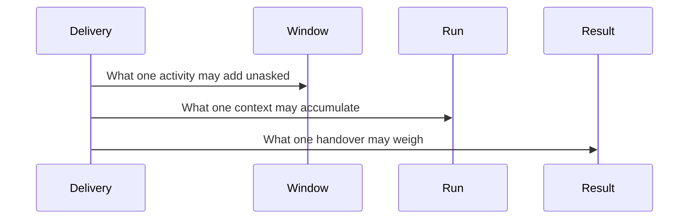


*Figure 11. Separate Limits, Each on a Different Question.*

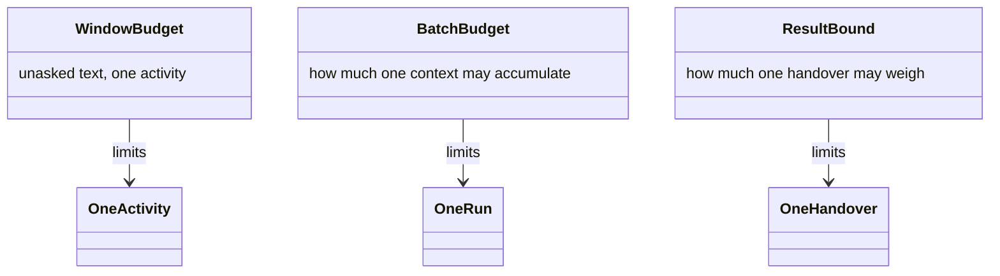


*Figure 12. One Activity, One Run, and One Handover.*


### Window Budget

A single activity spends a share of the worker's window on content the worker did not ask for, and stops when that share is gone (Figure 13). That is the window, the steps that may still be skipped, and the content that rides anyway (Figure 14).

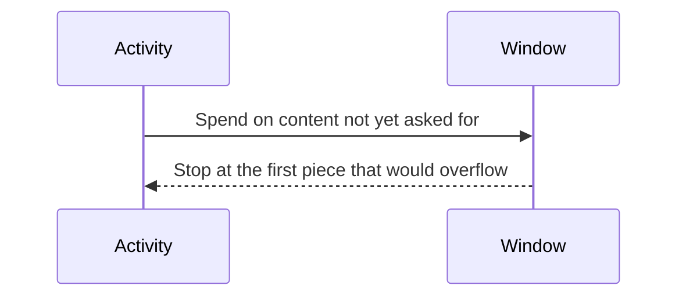


*Figure 13. One Activity Spends a Share of the Window.*

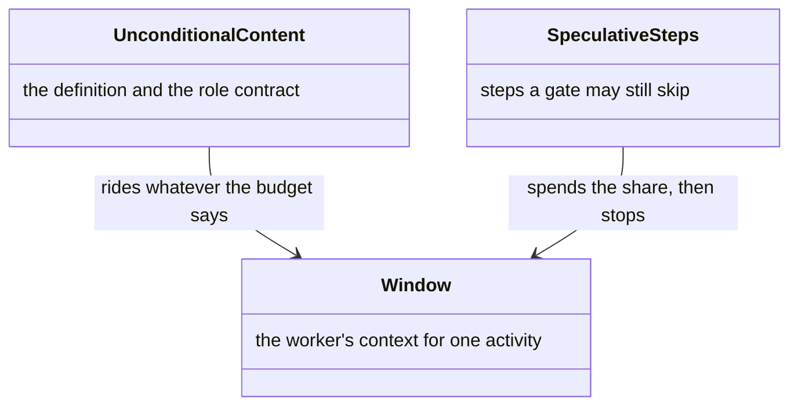


*Figure 14. Content That Rides, and Content That Spends the Share.*

#### Spending the Window

```
window budget = context size × headroom × characters per token
```

The headroom defaults to four fifths of the window. Both figures are server configuration.

What the activity walks unconditionally — the definition, the role's rules, the techniques of its contract — rides whatever the budget says, because it is not speculative. A marker draws the budget down by nothing: the context it goes to already holds that content.

What the budget is spent on, each stage stopping at the first entry that would overflow what remains:


| Order | Content                                  | Left to                       |
| ----- | ---------------------------------------- | ----------------------------- |
| 1     | Step technique bodies, in document order | A later ask for that step     |
| 2     | Resource bodies placed in the response   | A later ask for that resource |


A body the budget leaves out is recorded as delivered to nobody. A ledger entry for it would collapse a later delivery to a marker for bytes the worker never received.


### Batch Budget

One worker walks several activities, pauses at a commit and at a gate, and continues as the same worker (Figure 15). That run has a character limit and an activity limit (Figure 16). How the chain of agents is shaped is [dispatch](dispatch.md). What the numbers come to on a real corpus is in [benchmarks](benchmark.md).

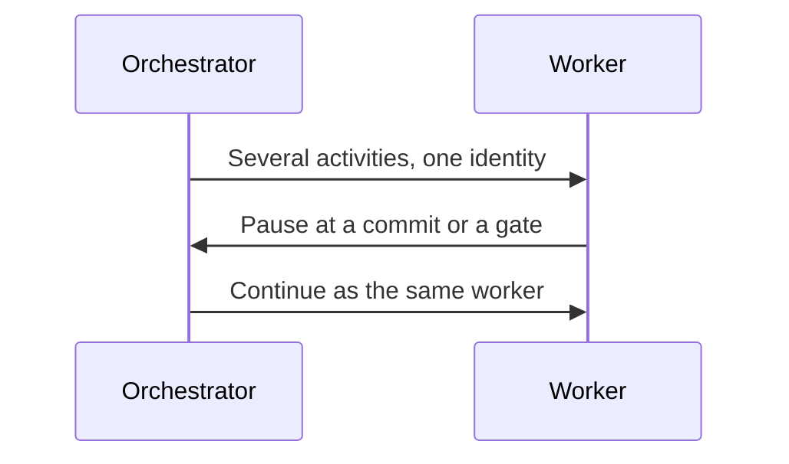


*Figure 15. One Worker Walks a Run, and Continues after a Pause.*

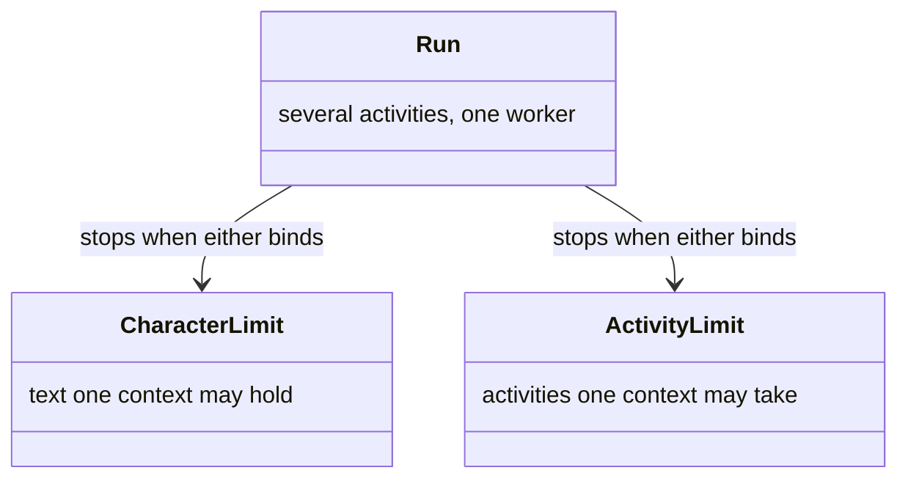


*Figure 16. A Run, Bounded by Characters and by Activities.*

One dispatch may carry several activities, and the worker walks them under one identity, so it pays for establishing a context once for the run rather than once per activity. That saving is the point of a batch. The run pauses at every activity boundary, because the orchestrator owns the commit that boundary requires, and at every gate, because the orchestrator owns the answer. It continues in place across both, under the identity its dispatch bound, so a pause costs a round trip rather than a new worker.

#### Limits

A batch is not declared. It is the run of activities one delivery takes, so the server sees it with no orchestrator cooperation, and a worker that omits a parameter does not escape it. The scope is the caller's identity, which is not authenticated, so this bounds a cooperating chain rather than an adversarial one. Two limits apply, both read off the session history:


| Limit                           | How it is derived                                                    | Default |
| ------------------------------- | -------------------------------------------------------------------- | ------- |
| Cumulative characters delivered | A fraction of the context, its own fraction rather than the window's | `0.35`  |
| Distinct activities             | A count of activities one delivery may take                          | `3`     |


The fraction is its own rather than the window's, because the two answer different questions. Set this one as high as the window and a whole long workflow would fit in a single context, which is what the activity cap exists to prevent. The cap covers what a character count cannot see: the context the host establishes and the server never delivers, the code the worker reads, the documents it drafts, and the degradation that comes with a long walk.

#### Which Limit Binds

At a large window the activity cap binds first, because the characters run out later than the count does. A worker declaring a smaller window is bounded proportionally, and below some point the character budget takes over instead. Admission is checked before a delivery rather than after, so the admitted activity can carry a run past the budget by up to one heavy activity.

#### Counting Each Delivery Once

A dispatch's recorded size is the whole activity response, so anything placed in it eagerly is already inside that figure. What counts on top is only what the worker went back for. Counting a bundled entry both ways would overstate every activity that bundles anything.

The ordinary end of a run is the worker stopping. The count is of activities delivered to that context. Asking past the bound is refused with the payload undelivered, and the history names the limit, once per scope, activity, and limit.

Room is answered as of that delivery. The worker then fetches techniques and resources while it runs the activity, drawing down the same budget, so a run reported as having room can still be refused at the next boundary. The reading a continue-or-replace decision wants is the one taken at that boundary, after those fetches.

A refusal is an expected outcome. The orchestrator releases the identity and dispatches a replacement, which must carry a new identity. The bound is keyed on the identity, and a fresh context under a used one would receive markers for content it does not hold.

#### Carve-Outs

Three carve-outs keep the bound aimed at what it is for:

- A context that has taken no activity is always admitted its first. Fetches draw down the same budget, so a scope that read past it before taking any activity would otherwise be refused the work it was started to do.
- An activity the context already holds is always served. That is a worker continuing after a gate and asking for the payload it is sitting on.
- The session's own agent is unbounded. That scope owns the whole walk, which is what a persistent session describes. Its run is the session, not a batch.


#### Refusal and Replacement

A refusal is a history event. An older server meeting an event it does not know fails to read the session. Moving back to that server means stripping those events or retiring the session. Reading an older session on this server is unaffected.

The worker reports each activity as it completes, so the session tracks the run. A replacement picks up the current activity, takes a full delivery, and re-crosses gates already answered. Cost is one row per activity a dispatch covered, sharing an identity, rather than one figure per dispatch. Without that, a batch size cannot be calibrated from real runs.


### One Tool Result

A handover goes out whole, and a log line is written when it has outgrown one result (Figure 17). That is the result and that log (Figure 18).

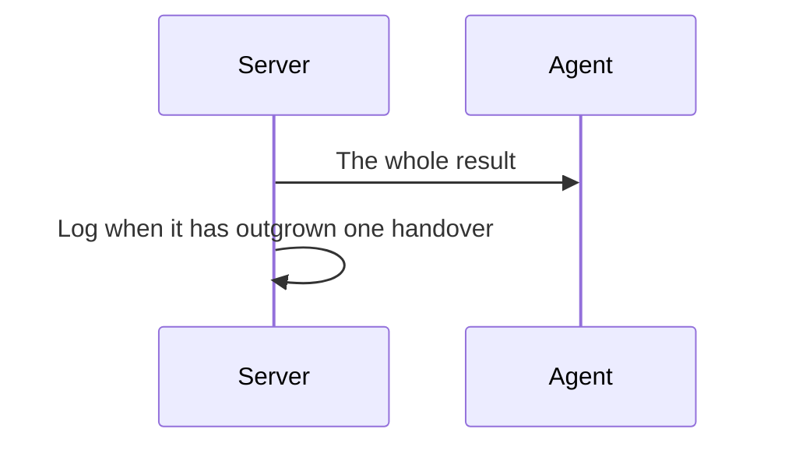


*Figure 17. A Result Goes Out Whole, and Is Logged When It Is Too Large.*

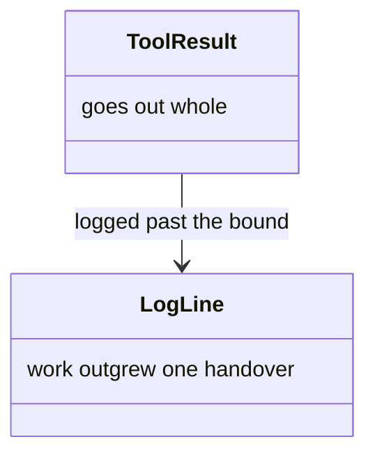


*Figure 18. The Result, and the Log That Says to Split the Work.*

The bound covers the response text and the protocol around it together: the documents expected, the exits, the gate readings, and the delivery cost. An orchestrator's delivery is measured against the same figure as a worker's, because both open a role's work.

It decides nothing about what a delivery holds. A delivery past it goes out whole, and the server logs that it did. Nothing is cut, because nothing can be cut without discarding what the response exists to carry. That log line is the signal that the work has outgrown a single handover. For an activity, the answer is to divide the activity. For an orchestrator bundle, it is a workflow that has outgrown one orchestrator.


## Eager Bundling

Small steps are placed in the activity response until the window budget runs out, so those steps need no later fetch (Figure 19). That is the activity, the inlined steps, and the steps left to fetch (Figure 20).

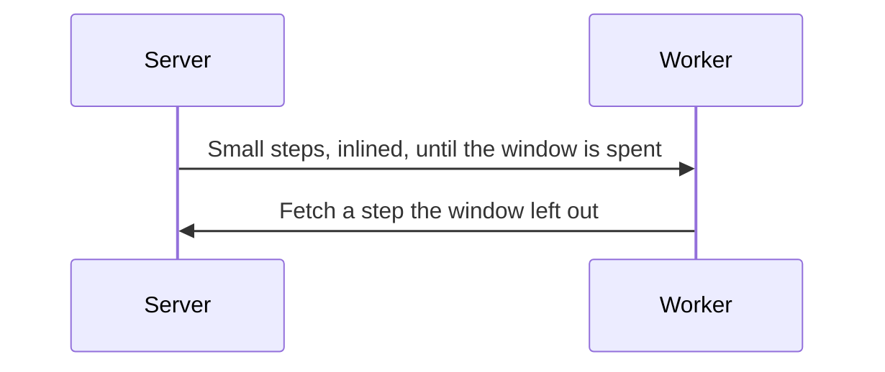


*Figure 19. Small Steps Ride with the Activity until the Window Is Spent.*

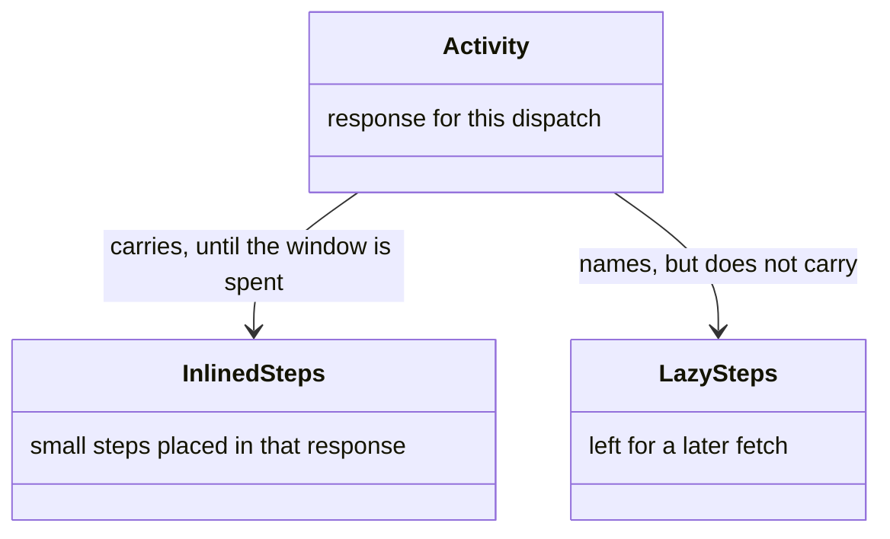


*Figure 20. Inlined Steps, and Steps Left to Fetch.*

Inlining is automatic. There is no per-activity opt-in. What sizes the bundle is the worker's window.

#### Which Steps Are Inlined

Each technique step whose gate answers true, in document order, until the budget runs out. A step with no gate answers true. The server can take that answer when every variable the gate compares is already bound and no step of this activity produces one of them. Otherwise the gate is unanswered, and the step stays for a later fetch.


| Gate reads                                                                                       | Answer     | Delivery                                                                  |
| ------------------------------------------------------------------------------------------------ | ---------- | ------------------------------------------------------------------------- |
| Variables bound before the activity opened, none of them written inside it, and the gate is true | True       | Inlined. The worker certainly reaches this step                           |
| The same, evaluating false                                                                       | False      | Left to fetch, and nothing is shipped for a step the run will not execute |
| A variable this activity produces                                                                | Unanswered | Left to fetch                                                             |
| A variable absent from the bag                                                                   | Unanswered | Left to fetch. An absent read is not the same as a negative one           |
| An expression that does not parse                                                                | Unanswered | Left to fetch                                                             |


A gate this activity produces is checked before a gate that is merely absent. An enclosing loop's gate narrows its body, so a step is inlined only where every gate above it also answers true. A body inlined under a gated loop is the procedure for every iteration: use the copy already held, rather than fetching it again each pass.

Whatever the worker evaluates when it reaches the step is still what decides whether the step runs. This answer decides only how the content travels. An activity may also cap the size of any one technique placed in the response. A cap of zero leaves every step for a later fetch.

#### Marking an Inlined Step

Asking for a technique is itself a beat: the worker turns to that step. Inlining removes the call, so the worker supplies the beat instead. It takes inlined steps strictly in order and, on reaching each one, marks that step before carrying it out. That mark is the trace for a bundled step. The worker does not ask the server again per bundled step. The record written at delivery already counts as coverage.


### Resource Bodies

A linked resource arrives as a body only when a later delivery can collapse it, and as a name otherwise (Figure 21). Reference mode carries the body, and full mode carries the name (Figure 22).

```mermaid
sequenceDiagram
  participant Server
  participant Worker
  alt The context can collapse a repeat
    Server->>Worker: The resource body
  else Nothing to collapse against
    Server->>Worker: The resource's name
  end
```


*Figure 21. A Body When a Repeat Can Collapse, a Name Otherwise.*

```mermaid
classDiagram
  class ReferenceMode {
    a repeat can collapse
  }
  class FullMode {
    nothing yet to collapse against
  }
  class ResourceBody {
    the reference material itself
  }
  class ResourceName {
    ask for the body later
  }
  ReferenceMode --> ResourceBody : sends
  FullMode --> ResourceName : sends
```


*Figure 22. Reference Mode Carries Bodies. Full Mode Carries Names.*


| Mode      | A linked resource                                                                                                                                                                                                                            |
| --------- | -------------------------------------------------------------------------------------------------------------------------------------------------------------------------------------------------------------------------------------------- |
| Reference | The body, so a later send to the same context can collapse to a marker. Bodies are not nested inside each step, which would repeat them once per technique                                                                                   |
| Full      | The name. That call lands in a context with nothing to collapse against, so a body would ship in full again in every activity that links it. The later activities of a batch ask for reference delivery, having a ledger to collapse against |
| Neither   | A single oversized resource, and anything past the window. Their names still travel, so nothing linked becomes unreachable                                                                                                                   |


Bundled techniques arrive keyed by step. Each entry opens with a marker naming the step and the technique, then the same composition a later fetch of that step would return. A note on the response says whether this delivery carried bodies or names.


## Reference Delivery

A first delivery is in full, and a later delivery to the same context is a short marker (Figure 23). That is the context and its ledger (Figure 24). Two workers that share a session are two contexts.

```mermaid
sequenceDiagram
  participant Server
  participant Context
  Server->>Context: The payload, in full
  Context->>Server: Ask again
  Server->>Context: A marker for what this context already holds
```


*Figure 23. Full the First Time, a Marker When the Context Already Holds It.*

```mermaid
classDiagram
  class Context {
    one agent, spawn to finish
  }
  class Ledger {
    what this context was already sent
  }
  class Marker {
    stands for bytes already held
  }
  Context --> Ledger : records each delivery
  Ledger --> Marker : same bytes, sent again
```


*Figure 24. A Context, Its Ledger, and a Marker.*

#### Context That Holds the Bytes

A marker is valid only for the context that received the bytes it stands for.

- A walk with one agent is one context for the whole walk.
- A dispatched worker is one context from the moment it starts until it finishes, including a resume along the way.
- Two workers that share a session are two contexts.

What establishes that a context holds a payload is its own ledger. The blocks that every activity repeats — the worker's techniques, its rules, and the rules the activity inherits — collapse for a returning identity in every delivery mode. A replacement worker arrives under a new identity, reads an empty ledger, and takes them in full.

A marker stands for a whole item: one composed technique, one rules list, one note, one resource. No marker names a field of a body. A body missing one of its fields is a fragment, and a reader holding a fragment has no call that returns the part it lacks.

#### Asking for Reference Delivery


| How                                          | Applies to                                                       |
| -------------------------------------------- | ---------------------------------------------------------------- |
| The session is opened in the persistent mode | The whole session, including a child session opened the same way |
| One call asks for reference delivery         | That call                                                        |
| One call forces the body                     | Overrides the opt-in for the item asked for                      |


Saying the context is fresh drops that scope's ledger entries, because the caller is stating this identity retains nothing it was sent. The next delivery to it is therefore full. Forcing the bundle does the same for one call without touching the ledger.

#### Ledger Keys

The server hashes each payload it delivers and records it, in every mode, so a later call that asks for a marker can still refer to content that arrived in full. Keys are namespaced by channel, so a marker only points at content delivered through that same channel.

The ledger is keyed on the delivery scope: the identity supplied with the call when there is one, otherwise the session's recorded identity. A dispatched worker authenticates against the orchestrator's session, and several workers can hold that session at once. The scope names the context a payload went to, rather than the session they share.

The orchestrator mints one identity per dispatch and reuses it for as long as that worker lives: when it resumes after a gate, and when it advances to the next activity of the batch. A fresh start reads an empty ledger and takes a full delivery. That same context reads its own entries and gets markers. A sibling worker is unaffected either way.

#### Calls That Collapse

- An activity load, under reference delivery, collapses any bundled technique whose composed content is byte-identical to an earlier delivery, and collapses the rules and the shared contracts the same way. Techniques new to the activity, or whose content changed, arrive in full. The activity body itself is always delivered. In the default mode the repeated blocks still collapse for a returning identity.
- A technique asked for again, byte-identical, returns a marker and a hash instead of the composed technique. Annotations that say where a binding came from are part of that content, so the same step collapses and the same technique fetched from a different step is delivered in full.
- A resource asked for again, byte-identical, returns a marker and a hash. The key is the caller's exact name, anchor included, so a whole resource and one section of it occupy independent slots.
- A workflow load, in the persistent mode, collapses the technique bundle above the separator to one marker when the agent already holds it. The workflow summary below the separator stays full.
- The notes that travel with a delivery pass through the same ledger. A context that holds one receives a marker in its place. Forcing the bundle restores them with everything else it restores.

Asking for one technique or one resource collapses under reference delivery or a persistent session. A fresh session and the default session always receive full bodies.

#### Shared Contracts

Composition merges each ancestor's contract into the technique the guards see, so they see one fully composed value. What an agent is sent does not copy that merge onto every body. A response bundling several techniques of one group carries that group's rules and shared inputs once, and each body names the group. An agent reads one technique's own fields, then the named contracts on the same response.

Two steps bound to the same technique in one activity are the one case that collapses inside a response: the second entry is a marker naming the same whole technique the first delivered. Hashing the content is what keeps a marker from going stale. A technique annotated with where its bindings came from hashes differently, so it arrives in full.

#### Forcing a Full Delivery

Forcing the body returns the full payload of the item asked for. Reach for it when the calling context no longer holds the earlier payload, after that payload was summarised away. Forcing the bundle does the same for a whole delivery: a context that lost a payload gets everything that delivery would have sent it.

#### Ledger and Bundling

A technique placed in the activity response and the same technique asked for later share one ledger key, hashing the same body. In a persistent session a bundled delivery collapses a later fetch of that step to a marker, and a reference-mode re-delivery of the activity collapses entries already delivered. Forcing the bundle re-delivers them all, and forcing one step reaches any one of them. Shared contracts use one key across the activity load and the later fetch.


## What Gets Measured

Each dispatch and each fetch is recorded, and the agent reports what a turn cost (Figure 25). That is the history, the ledger, and that report (Figure 26). Coverage of a bundled step counts for [fidelity](fidelity.md#layer-5-the-step-manifest).

```mermaid
sequenceDiagram
  participant Server
  participant Agent
  Server->>Server: Record the dispatch and each fetch
  Agent->>Server: Report what the turn cost
```


*Figure 25. Dispatches Are Counted, and Cost Is Reported.*

```mermaid
classDiagram
  class History {
    one record per dispatch
  }
  class Ledger {
    full size, sent or saved
  }
  class UsageReport {
    turn cost, agent reported
  }
  class Dispatch
  class Fetch
  class Activity
  History --> Dispatch : counts
  Ledger --> Fetch : counts
  UsageReport --> Activity : one row each
```


*Figure 26. History, the Ledger, and the Agent's Report.*

#### Dispatch Record

Each activity load records a dispatch: whether this identity is new or continuing, and how many characters went out. The server derives new-versus-continuing from whether it has met that scope at all, so the orchestrator does not declare it. The two values name the two states the ledger has: an empty ledger taking a full delivery, and prior deliveries to collapse.

A worker sent outside that load, which never asks for the activity, records the same event on its first technique or resource fetch. Where a completed activity is counted at its exit, this counts dispatches.

#### Second Delivery

When an activity is delivered whole to a context that has not received it, in a session where another context already took it, the server records that second copy: who received it, who had it first, and how many characters. That is either a replaced worker or a resume that arrived under a fresh identity, and it leaves no other trace. A second full delivery reads like a first one at every other instrument.

#### Payload Size

A technique fetch, a technique placed in the bundle, and a resource fetch each carry the full payload size, on both the full path and the marker path, and which of the two it was. Characters delivered and characters saved are both totals that add up from the ledger.

#### Reported Cost

The server cannot see what a turn cost the host, so an agent reports it, one row per completed activity. The basis says whether the figure is that activity's own spend or a running total for the agent, because the two sum differently and adding them without knowing which would double-count.

#### Benchmarks

One program prices a session mode, one prices a re-dispatch, and one prices a run of activities. All three, and the gate that runs on every pull request, are in [benchmarks](benchmark.md).