# Delivery

A workflow's instructions are too much to hand an agent all at once. They are split into techniques, each one way of doing a single thing, and into resources, the reference material a technique points at. An activity is a mechanism that formalises the application of techniques into steps that can be reliably delivered to an agent. When the run reaches a step, the server loads the named file and sends it to the agent.

This page details what gets sent, based upon a judgement about how much of it one agent's context may hold, and what delivery costs. Which file a reference reaches is [resolution](resource-resolution.md). The [calls](api-reference.md#workflow-navigation) that ask for a delivery are in the tool catalog.

<a id="what-a-role-receives"></a>

## Role Receives

A bundle is assembled and handed to an agent, so the agent does not go looking up files itself (Figure 1). A bundle is what the workflow names, what the server always includes, and what is added only when the workflow can reach it (Figure 2).

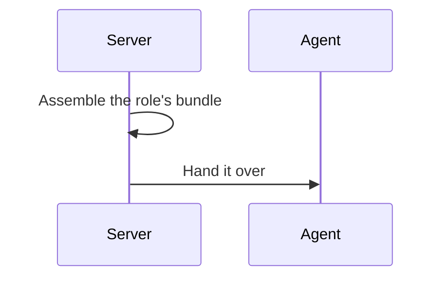

*Figure 1. A Bundle Is Assembled and Handed Over.*

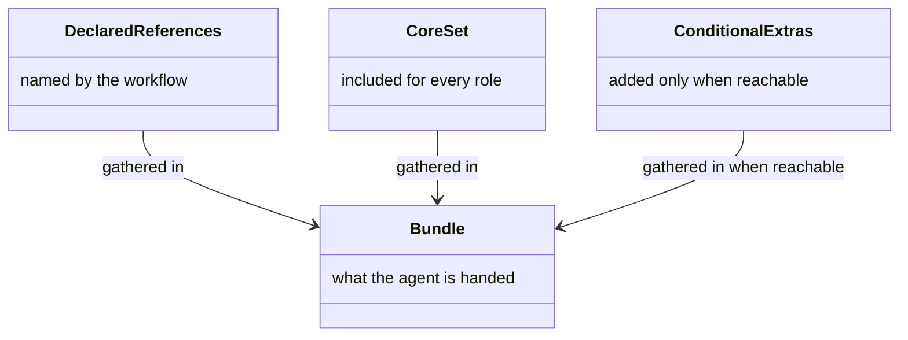

*Figure 2. Declared References, Core Set (orchestrator's walk, state, dispatch, or worker's role, finish, conduct), and Conditional Extras.*

<a id="the-orchestrator-bundle"></a>

### Orchestrator Bundle

An orchestrator receives its operations and the workflow it drives (Figure 3). Those are the operations, the shared contracts, and the workflow metadata (Figure 4).


*Figure 3. An Orchestrator Receives Its Operations and the Workflow.*

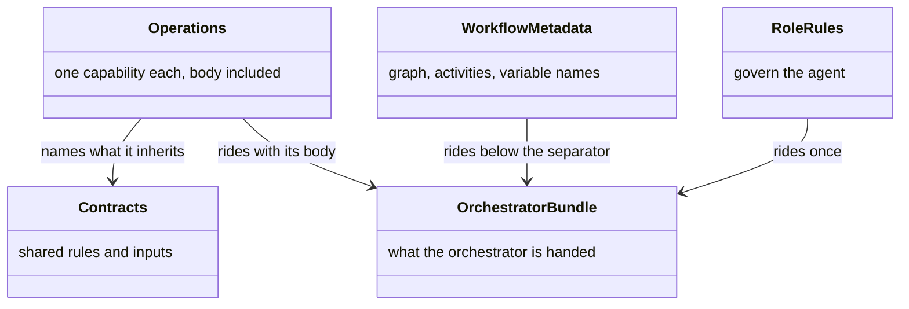

*Figure 4. Operations, Shared Contracts, Role Rules, and Workflow Metadata.*

<a id="the-worker-bundle"></a>

### Worker Bundle

A worker receives the activity it was sent to do, plus the conduct every worker is held to (Figure 5). That is the activity and that conduct (Figure 6).

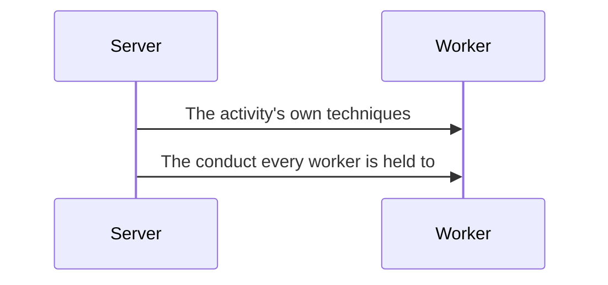

*Figure 5. A Worker Receives Its Activity and Its Conduct.*

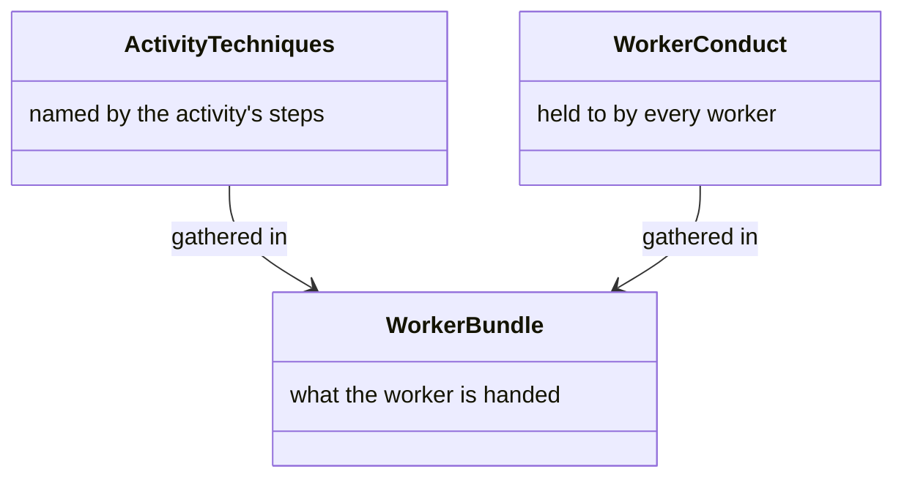

*Figure 6. Activity Techniques and Worker Conduct.*

<a id="how-documents-are-named"></a>

### Document Names

A worker names each document with the activity's prefix, so the folder sorts by activity (Figure 7). That is the activity, that prefix, and the list of expected documents (Figure 8). Where the folder sits is the [planning folder](state.md#the-planning-folder).

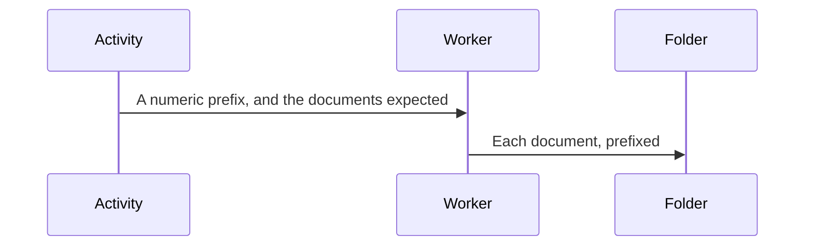

*Figure 7. Each Document Takes the Activity's Prefix.*

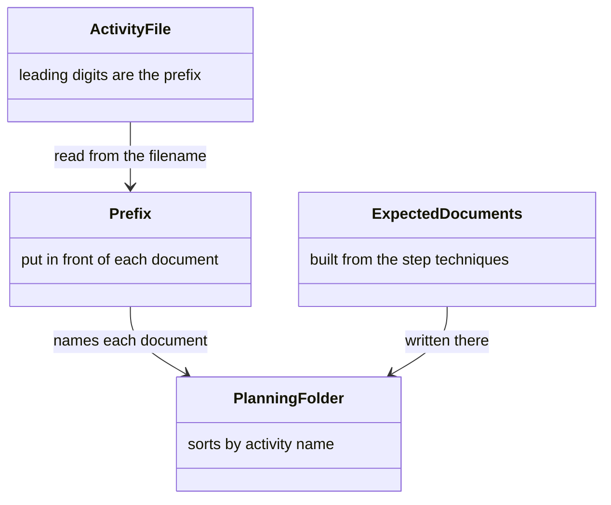

*Figure 8. The Activity, Its Prefix, and the Documents Expected.*

<a id="asking-for-one-by-name"></a>

### Asking for One by Name

An agent asks for one operation that was not in the bundle (Figure 9). It names that operation by the step, or by the operation itself (Figure 10).

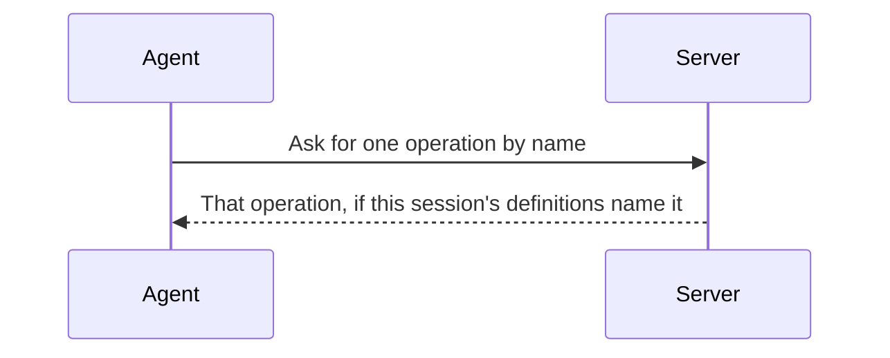

*Figure 9. One Operation, Asked for by Name.*

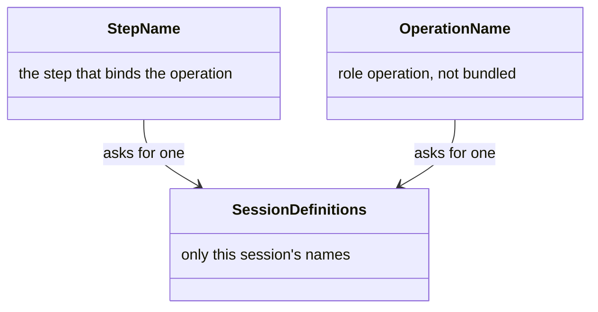

*Figure 10. A Step Name, or an Operation Name.*

<a id="the-three-budgets"></a>

## Three Budgets

Three limits each answer a different question, and are set apart from each other (Figure 11). They are one activity, one run, and one result (Figure 12). The numbers are in [configuration](configuration.md#delivery-budgets).

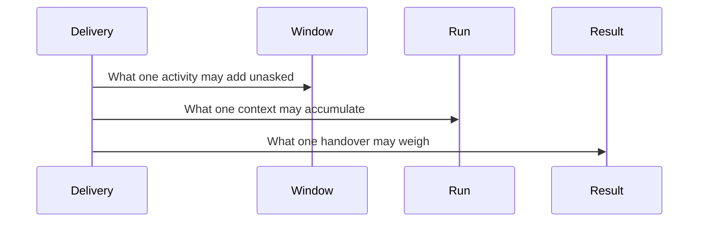

*Figure 11. Three Limits, Each on a Different Question.*

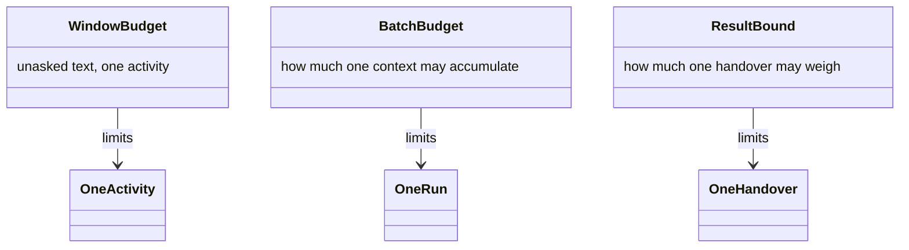

*Figure 12. One Activity, One Run, and One Handover.*

<a id="the-window-budget"></a>

### Window Budget

A single activity spends a share of the worker's window on content the worker did not ask for, and stops when that share is gone (Figure 13). That is the window, the steps that may still be skipped, and the content that rides anyway (Figure 14).

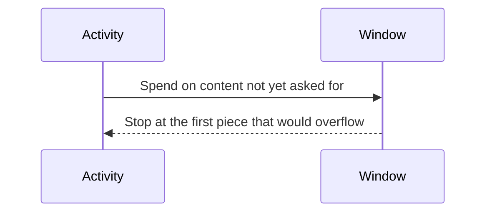

*Figure 13. One Activity Spends a Share of the Window.*

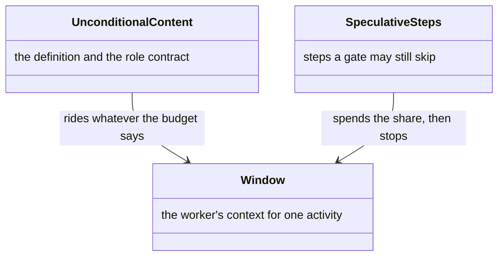

*Figure 14. Content That Rides, and Content That Spends the Share.*

<a id="the-batch-budget"></a>

### Batch Budget

One worker walks several activities, pauses at a commit and at a gate, and continues as the same worker (Figure 15). That run has a character limit and an activity limit (Figure 16). How the chain of agents is shaped is [dispatch](dispatch.md). What the numbers come to on a real corpus is in [benchmarks](../benchmark/README.md).

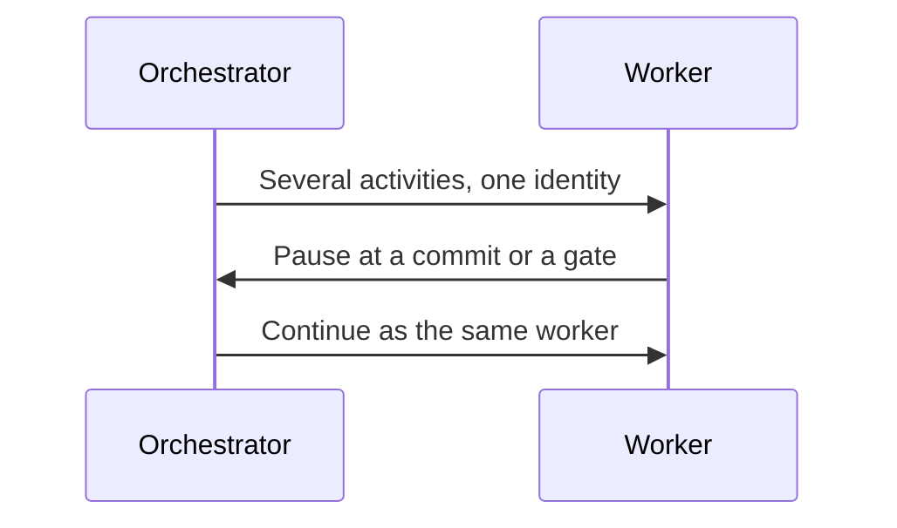

*Figure 15. One Worker Walks a Run, and Continues after a Pause.*

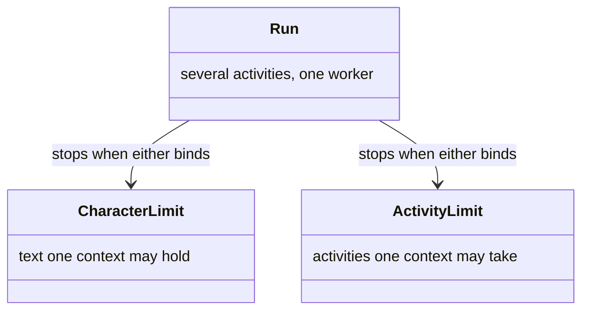

*Figure 16. A Run, Bounded by Characters and by Activities.*

<a id="what-one-tool-result-may-carry"></a>

### One Tool Result

A handover goes out whole, and a log line is written when it has outgrown one result (Figure 17). That is the result and that log (Figure 18).

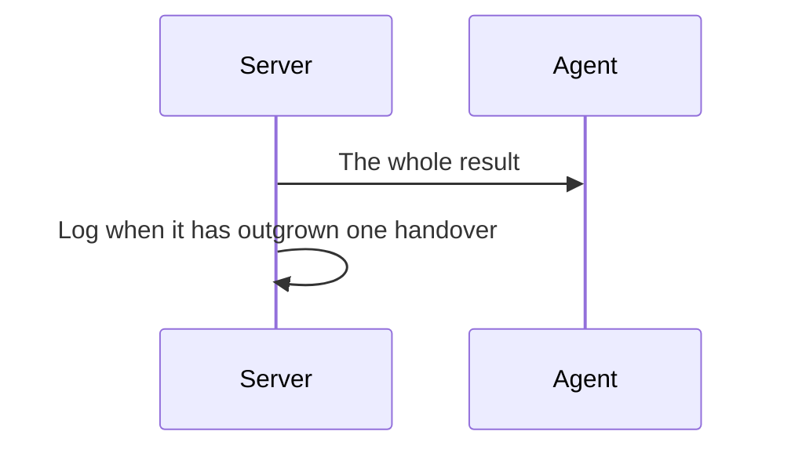

*Figure 17. A Result Goes Out Whole, and Is Logged When It Is Too Large.*

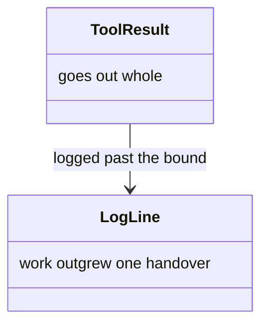

*Figure 18. The Result, and the Log That Says to Split the Work.*

<a id="eager-technique-bundling"></a>

## Eager Bundling

Small steps are placed in the activity response until the window budget runs out, so those steps need no later fetch (Figure 19). That is the activity, the inlined steps, and the steps left to fetch (Figure 20).

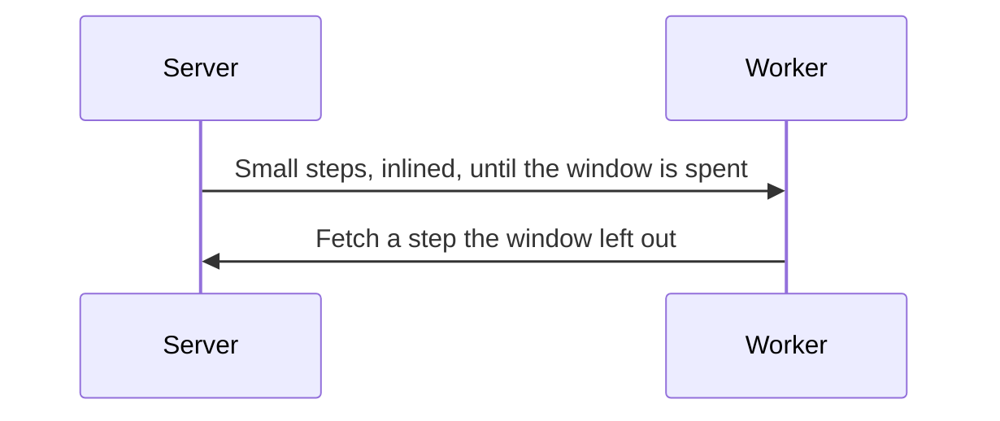

*Figure 19. Small Steps Ride with the Activity until the Window Is Spent.*

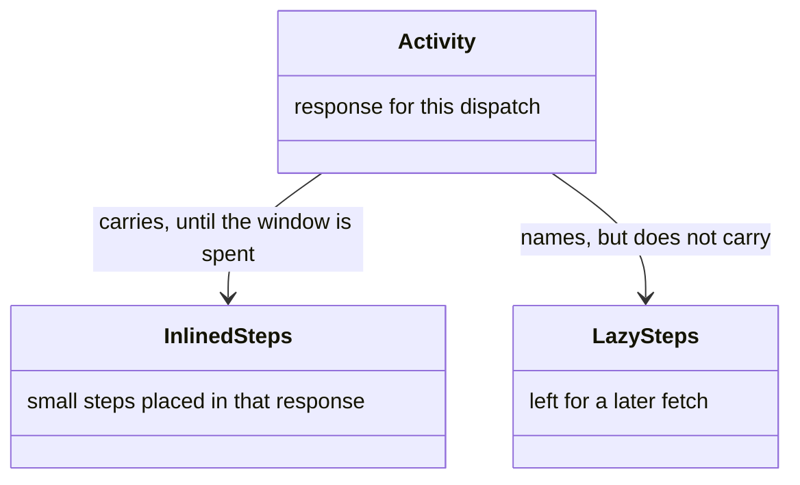

*Figure 20. Inlined Steps, and Steps Left to Fetch.*

<a id="resources-bodies-only-under-reference-delivery"></a>

### Resource Bodies

A linked resource arrives as a body only when a later delivery can collapse it, and as a name otherwise (Figure 21). Those are the two modes (Figure 22).

```mermaid
sequenceDiagram
  participant Server
  participant Worker
  alt The context can collapse a repeat
    Server->>Worker: The resource body
  else Nothing to collapse against
    Server->>Worker: The resource's name
  end
```

*Figure 21. A Body When a Repeat Can Collapse, a Name Otherwise.*

```mermaid
classDiagram
  class ReferenceMode {
    a repeat can collapse
  }
  class FullMode {
    nothing yet to collapse against
  }
  class ResourceBody {
    the reference material itself
  }
  class ResourceName {
    ask for the body later
  }
  ReferenceMode --> ResourceBody : sends
  FullMode --> ResourceName : sends
```

*Figure 22. Reference Mode Carries Bodies. Full Mode Carries Names.*

<a id="reference-delivery"></a>

## Reference Delivery

A first delivery is in full, and a later delivery to the same context is a short marker (Figure 23). That is the context and its ledger (Figure 24). Two workers that share a session are two contexts.

```mermaid
sequenceDiagram
  participant Server
  participant Context
  Server->>Context: The payload, in full
  Context->>Server: Ask again
  Server->>Context: A marker for what this context already holds
```

*Figure 23. Full the First Time, a Marker When the Context Already Holds It.*

```mermaid
classDiagram
  class Context {
    one agent, spawn to finish
  }
  class Ledger {
    what this context was already sent
  }
  class Marker {
    stands for bytes already held
  }
  Context --> Ledger : records each delivery
  Ledger --> Marker : same bytes, sent again
```

*Figure 24. A Context, Its Ledger, and a Marker.*

<a id="token-usage-is-reported-not-derived"></a>

## What Gets Measured

Each dispatch and each fetch is recorded, and the agent reports what a turn cost (Figure 25). That is the history, the ledger, and that report (Figure 26). Coverage of a bundled step counts for [fidelity](workflow-fidelity.md#layer-5-the-step-manifest).

```mermaid
sequenceDiagram
  participant Server
  participant Agent
  Server->>Server: Record the dispatch and each fetch
  Agent->>Server: Report what the turn cost
```

*Figure 25. Dispatches Are Counted, and Cost Is Reported.*

```mermaid
classDiagram
  class History {
    one record per dispatch
  }
  class Ledger {
    full size, sent or saved
  }
  class UsageReport {
    turn cost, agent reported
  }
  class Dispatch
  class Fetch
  class Activity
  History --> Dispatch : counts
  Ledger --> Fetch : counts
  UsageReport --> Activity : one row each
```

*Figure 26. History, the Ledger, and the Agent's Report.*
