# Dispatch

One agent cannot talk to a person, track a long run, and write the code, so the work is split into three roles. The **user-facing agent** is the only one that talks to the person. It starts an **orchestrator**, which tracks one workflow, and the orchestrator starts a **worker** to carry out one **activity**, a single phase of that workflow. A **dispatch** is one such handing-on. A **session** is one run; every call names it with a short **session index**, never a token, and the notes of the run live in a **planning folder**. Starting a workflow opens a **child session** inside the one already open.

A **batch** keeps one worker, and so one **context** — the working memory that agent holds — across several activities. Starting one new worker, and a new context, for each item of a list is a **fan**. A **gate** is a pause for a person. The **host** is the program the agents run in; when it can start a background agent, a **sub-agent**, the chain is three agents, and when it cannot, one agent takes each role in turn. The [calls](api.md#session) that open a child run and ask where it stands are in the tool catalog. Where the session itself is kept is [state](state.md#persistence).

## Roles

### Diversity

A person talks to one agent. That agent starts an orchestrator. The orchestrator starts a worker for one activity and takes the result back (Figure 1). The three stay apart: only the first talks to the person, only the second tracks the run, only the third does the work (Figure 2).

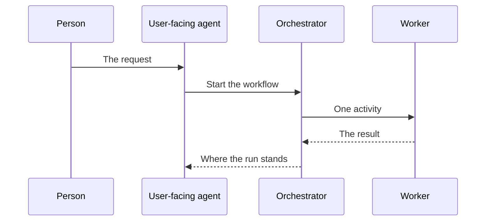

*Figure 1. Work Handed Down the Chain, and the Report Handed Back.*

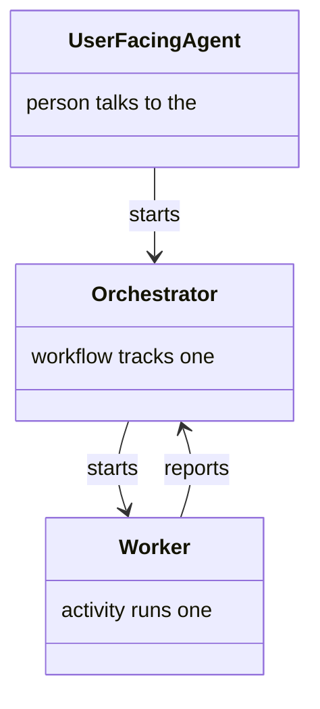

*Figure 2. The Three Roles, and Who Starts Whom.*

## Starting Agents

### Spawning an Orchestrator

Starting a workflow opens a child session inside the parent's, then starts the orchestrator in the background (Figure 3). The child is part of the parent's session, and it inherits the parent's planning folder (Figure 4).

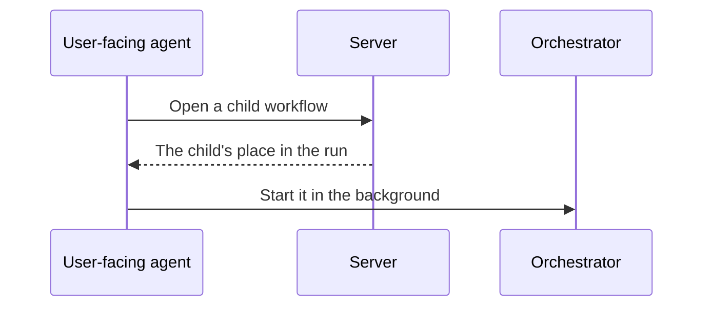

*Figure 3. A Child Workflow Is Opened, Then an Orchestrator Is Started.*

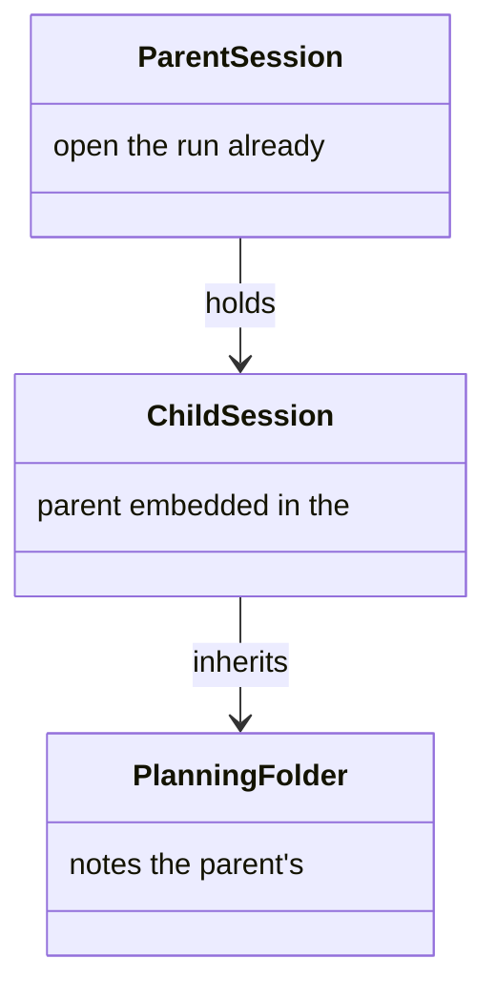

*Figure 4. A Child Session Inside the Parent's.*

### Spawning a Worker

A worker does not open a session of its own. It shares the orchestrator's, so both read the same state (Figure 5). That is the opposite of an orchestrator, which opens a child (Figure 6).

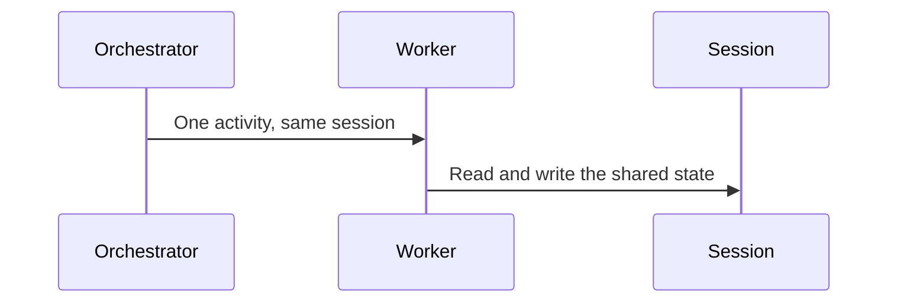

*Figure 5. A Worker Shares the Orchestrator's Session.*

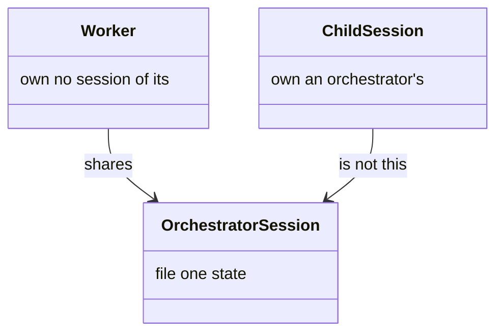

*Figure 6. A Shared Session, Not a Child Session.*

## Several at Once

### Batching a Run

One dispatch may carry several activities, walked by one worker. The run still pauses for a commit and for a gate, and continues as that same worker (Figure 7). A refusal is the cue to start a replacement (Figure 8). How far a run may go is the [batch limit](delivery.md#the-batch-budget).

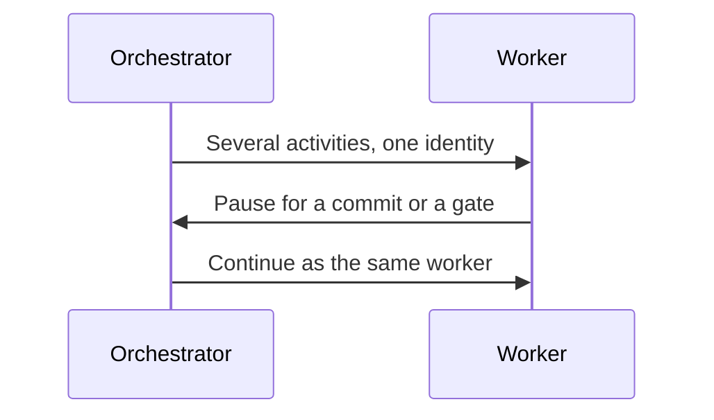

*Figure 7. One Worker Continues after a Pause.*

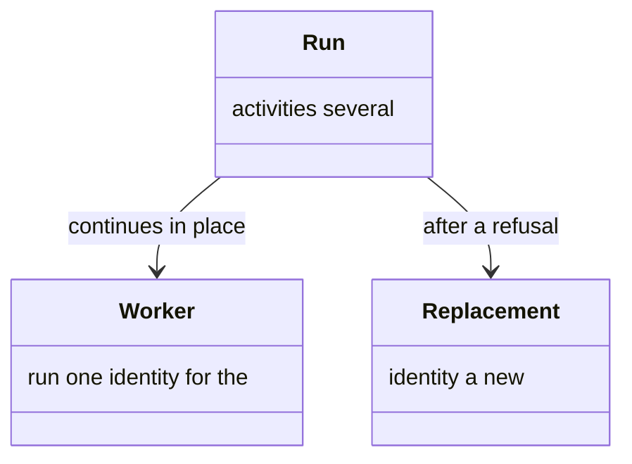

*Figure 8. Continue the Same Worker, or Replace It.*

### Fanning an Exit

A destination may name several branches, one worker for each item of a list the activity before it wrote. An empty list is not a fan. They start together in one turn, and the run meets again only when every branch has returned (Figure 9). The exit, the list, the branches, and the meeting point are one picture (Figure 10). How many branches may open is in [configuration](configuration.md#delivery-budgets).

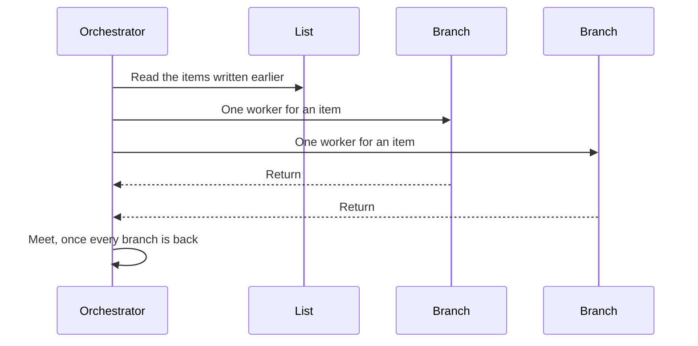

*Figure 9. One Worker per List Item, Meeting When All Return.*

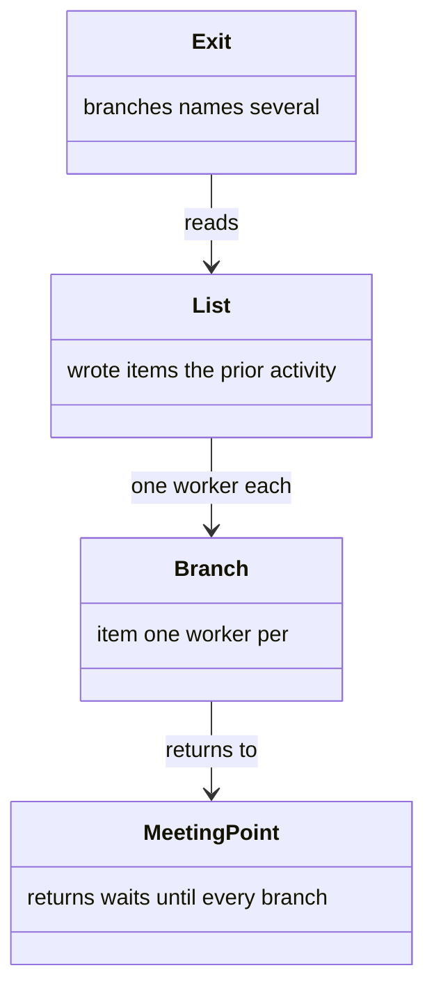

*Figure 10. An Exit, the List, the Branches, and the Meeting Point.*

### Fan Starts from Scratch

Each branch is a new worker, sent its instructions in full. A batch is the opposite: one worker continues (Figure 11). A fan pays a context per branch; a batch pays one for the run (Figure 12).

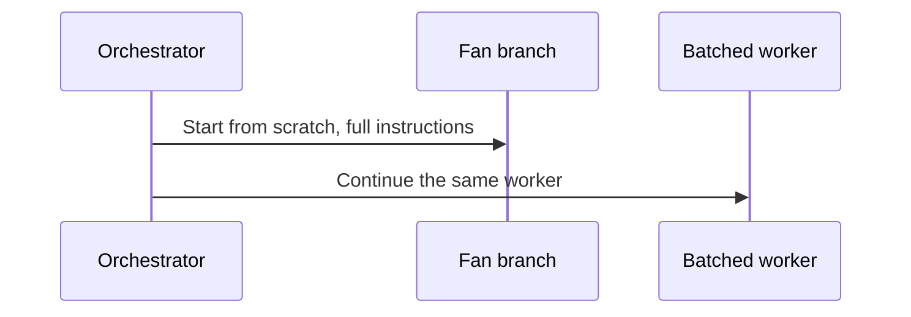

*Figure 11. A Fan (one worker per list item) Starts Fresh. A Batch Continues.*

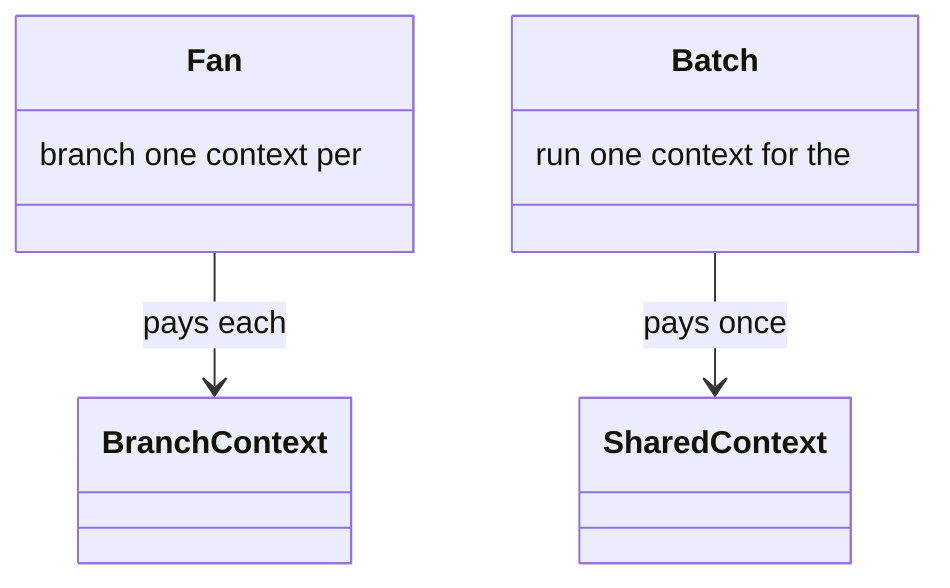

*Figure 12. A Context per Branch, or One for the Run.*

## Asking and Resuming

### Polling a Dispatched Workflow

The user-facing agent can ask where a child run stands without waking it (Figure 13). The answer is the session's place: going, waiting on a person, or finished (Figure 14).

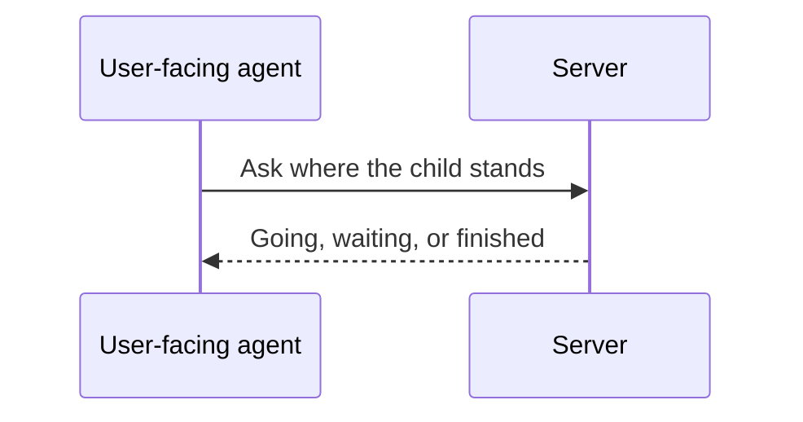

*Figure 13. Ask Where a Child Run Stands.*

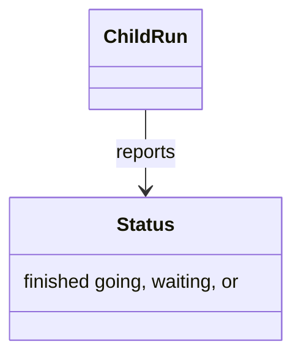

*Figure 14. A Child Run and Where It Stands.*

### Resuming a Sub-Agent

An agent that pauses does not end. The host re-enters it with new instructions added to the context it already has (Figure 15). The memory of the work stays; the new instruction is appended (Figure 16).

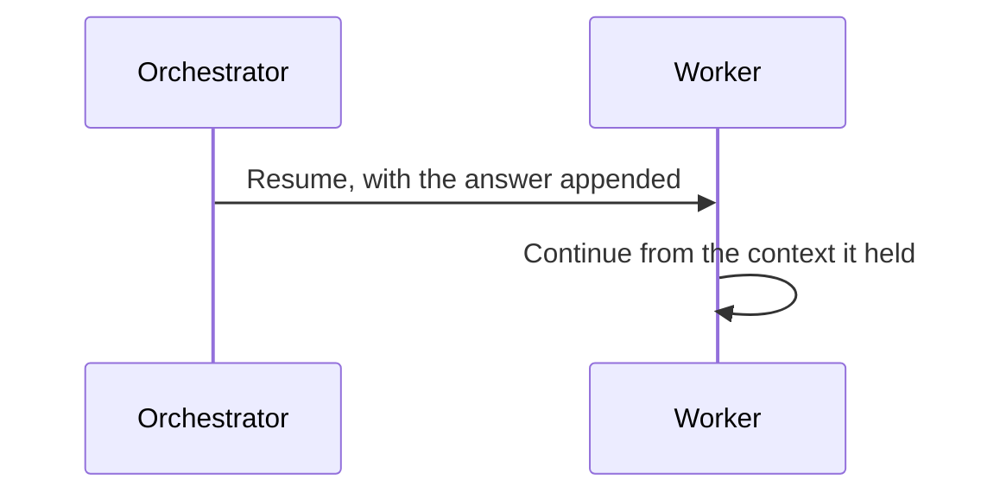

*Figure 15. A Paused Agent Is Re-Entered with the Answer.*

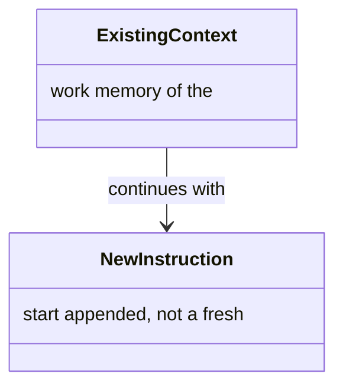

*Figure 16. The Context Already Held, Plus the New Instruction.*

## One Conversation

### Hosts without Sub-Agents

Where the host cannot start a background agent, one agent takes each role in turn in a single conversation (Figure 17). What the server enforces is the same; only the handoff differs (Figure 18).

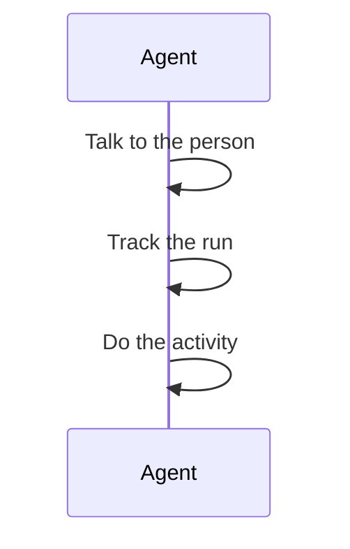

*Figure 17. One Agent Takes Each Role in Turn.*

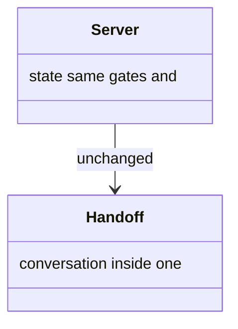

*Figure 18. The Server Is Unchanged. The Handoff Is Not.*
