# Fidelity

An agent's claim to have followed a workflow has to be checkable. **Fidelity** is that check. It is made of **layers**. Each time the agent asks the server to do something, that ask is a **call**. A layer either refuses the call or records a **warning** and moves on.

The server keeps the **session**, the run, in the **planning folder**, where the notes of the run live. The **state file** in that folder is the session written down. An agent holds only a **session index**, a designator that finds the state file.

A **seal** is the mark the server puts on the state file, bound to the server's **signing key**. A **read** is the server opening that file. The seal is checked on every read, so a file changed outside the server fails the next one.

A **trace** is the server's own record of calls, written on every call. At a **handover**, when one activity is left for the next, the layers between the seal and the trace run (Figure 2). The seal is the foundation, and the trace sits on top (Figure 1). A warning left unread stays in the trace, so a drifting agent remains visible afterwards.

A **worker** carries out one activity. A **checkpoint** is a pause for a person, and while it is open the worker cannot go on. An **exit** is the outcome named when an activity is left. The **graph** says which exit leads to which activity.

A **step manifest** lists the steps the agent says it completed. An **activity manifest** lists the activities so far. A **trace token** is the sealed packet of calls since the last handover, carried unread. A **semantic trace** is the account the agent writes into the planning folder, apart from the server's record of calls.

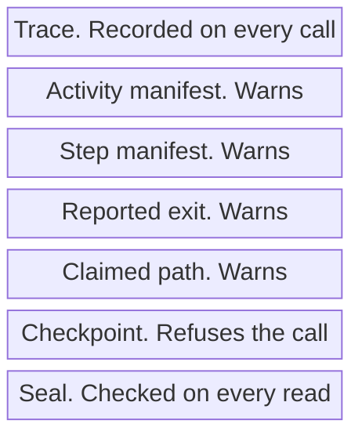

*Figure 1. Layers, Foundation at the Bottom.*

```mermaid
flowchart TD
    seal["Seal checked"] --> work["Activity carried out"]
    work --> checkpoint{"Checkpoint clear?"}
    checkpoint -->|No| refuse["Call refused"]
    checkpoint -->|Yes| graph["Claimed path checked"]
    graph -.-> manifest["Reported work checked"]
    manifest --> trace["Trace recorded"]
```

*Figure 2. Checks at a Handover. A Hard Check Refuses. A Dashed Check Warns.*

<a id="layer-1-session-integrity"></a>

## Layer 1: Session Integrity

The state file is read with its seal (Figure 3). A session index, six characters, finds that file and proves nothing about it (Figure 4).

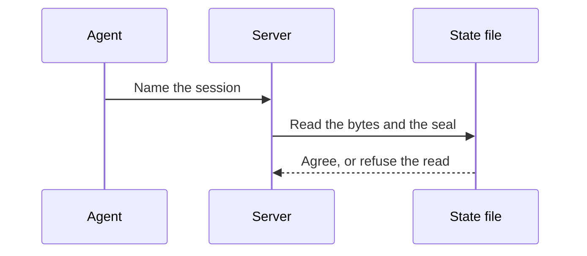

*Figure 3. The Seal Is Checked on Every Read.*

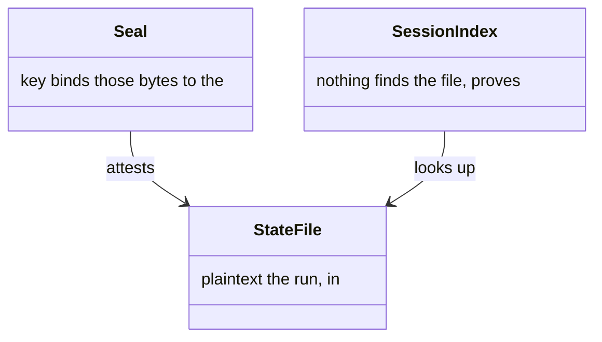

*Figure 4. State File, Seal, and Session Index.*

The state file is plaintext. The seal binds those bytes to the signing key. The server checks the seal on every read, and a disagreement fails the read. The file layout itself is in [state](state.md#persistence). Where the signing key lives, and how the server finds it, is in [configuration](configuration.md#signing-key).

### What the seal buys

- State edited outside the server is caught on the next read rather than trusted.
- A session index is a lookup key, not a bearer credential. The seal attests that the state is the server's own; the index attests nothing.
- Rotating or losing the signing key invalidates existing seals. That surfaces as `SEAL_MISMATCH` rather than as quiet acceptance.

## Layer 2: Checkpoint Gate

While a checkpoint is open, the run cannot advance past it (Figure 5). The calls that show the question and record the answer stay open, and the calls that would skip it do not (Figure 6).

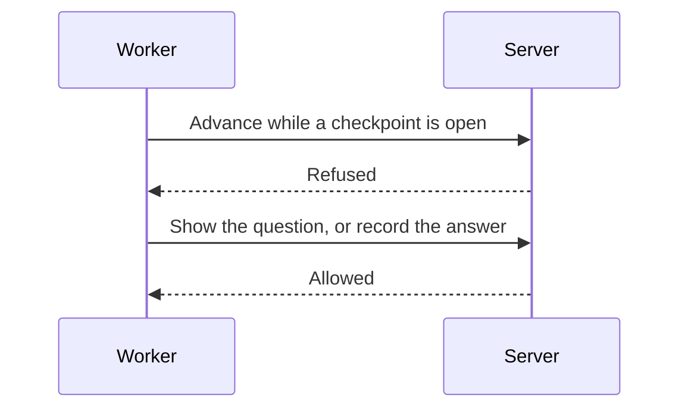

*Figure 5. An Open Checkpoint Refuses the Advance.*

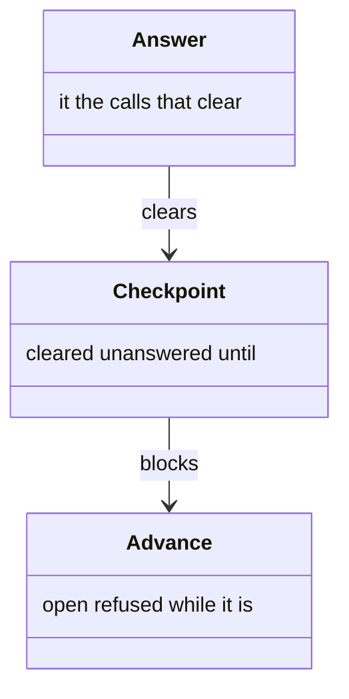

*Figure 6. Checkpoint, the Advance It Blocks, and the Answer That Clears It.*

When a worker yields a checkpoint, the server records it in the session's `activeCheckpoint` field.

### What Refuses While a Gate Is Open

Some calls guard the run's own progress, each with its own inline check:

| Call | Why it refuses |
|-----------|----------------|
| `next_activity` | The run must not advance past a question nobody answered |
| `yield_checkpoint` | A second pause on top of an outstanding one cannot be unwound |
| `resume_checkpoint` | A worker must not continue before the answer exists |

Others deliver content — `get_workflow`, `get_activity`, `get_technique`, `get_resource` and `get_trace` — and refuse through the shared `assertNoActiveCheckpoint` helper, which gives one blanket reason for all of them.

### What Stays Open, and Why

| Call | Why it must not gate |
|-----------|----------------------|
| `present_checkpoint`, `respond_checkpoint` | They are the resolution mechanism |
| `inspect_session`, `get_workflow_status` | Diagnostics, so an orchestrator can examine a run that has stopped |
| `record_usage` | It accounts for work already done |
| `dispatch_child` | A run holding an unanswered question can still open a child workflow |

### What the Gate Enforces

- An agent cannot forge a response. `option_id` is validated against the checkpoint definition.
- An agent cannot resolve instantly. Both timers run from the recorded pause, so answering faster than a person could read is refused. This closes the cheapest way to fake a gate: calling `respond_checkpoint` straight after `yield_checkpoint` without showing anyone anything.
- Real worker execution takes minutes, so the check never fires on a legitimate run.
- An agent cannot dismiss an unconditional checkpoint. `condition_not_met` is rejected without a `condition` field.

The three resolution modes and the timers each one waits out are specified in [checkpoints](checkpoint.md#three-ways-to-resolve-one).

## Layer 3: Cross-Activity Validation

Each call is set beside the position the server recorded last time (Figure 7). A jump the graph does not allow, or an outcome the activity did not declare, is a warning, and the call still proceeds (Figure 8).

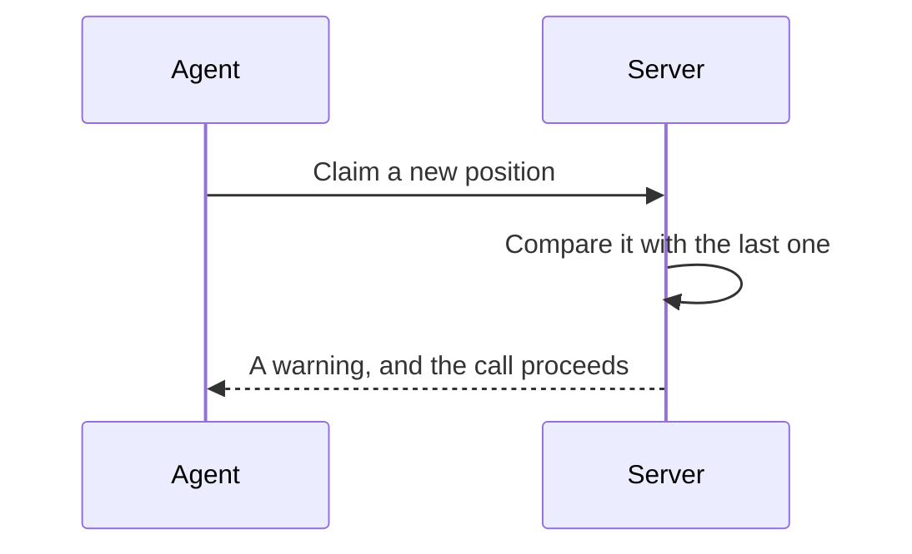

*Figure 7. A Claimed Position Is Compared with the Last One.*

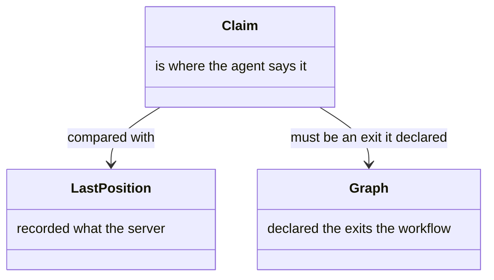

*Figure 8. Last Position, the Claim, and the Declared Graph.*

On every tool call the server compares the position it recorded last time against what this call claims. A disagreement produces a warning in `_meta.validation`:

| Check | What it detects |
|-------|-----------------|
| Workflow consistency | The agent switched workflows mid-session without starting a new one |
| Activity transition | The agent jumped to an activity the graph binds no exit of the previous one to |
| Technique association | The agent loaded a technique the current activity does not declare |
| Version drift | The workflow definition changed on disk since the session started |

## Layer 4: Reported Exit

On `next_activity` an agent may name the outcome the activity it is leaving reached, as the `exit` parameter. The server checks that the activity declares an exit by that name, and that the graph binds that exit to the requested target (Figure 9). The exit is then recorded in the sealed state and in the trace, so the agent cannot revise it afterwards (Figure 10).

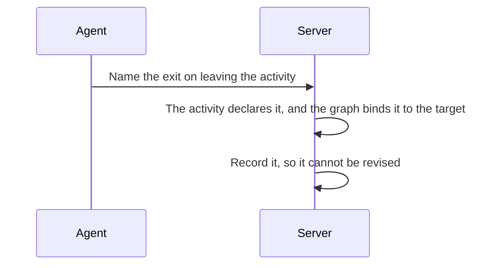

*Figure 9. A Named Exit Is Checked, Then Recorded.*

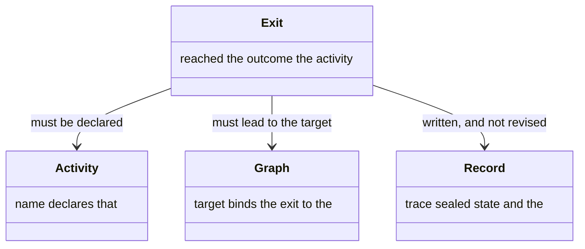

*Figure 10. Exit, the Activity That Declares It, the Graph, and the Record.*

What this cannot check is whether the exit's predicate is actually true. Exits are often selected by a user's answer at a checkpoint, and those answers are logged, so a later review can cross-reference reported exits against checkpoint responses.

<a id="layer-5-the-step-manifest"></a>

## Layer 5: Step Manifest

When an activity is left, the agent reports the steps it completed and the activities so far (Figure 11). A step reported done, whose technique was never sent, is the sign the work was skipped (Figure 12).

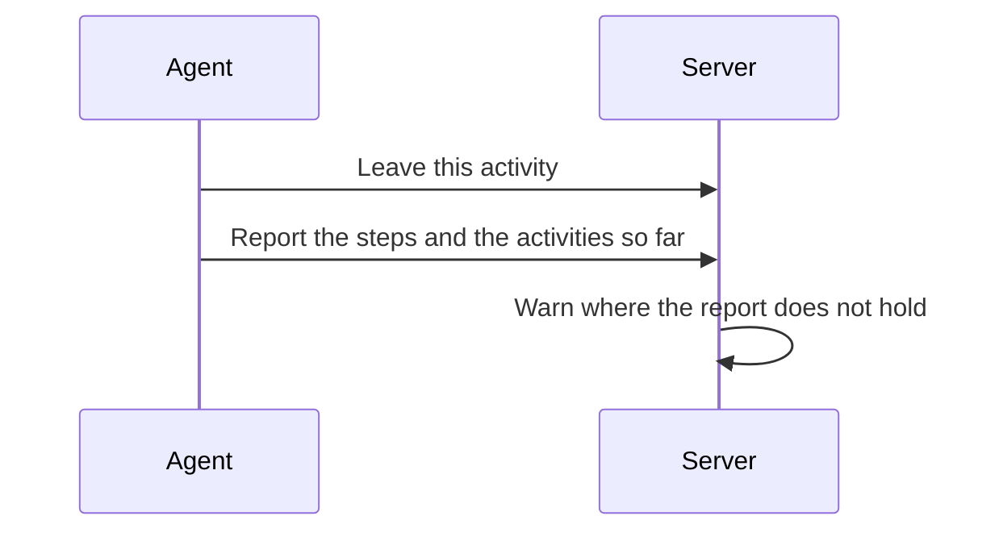

*Figure 11. The Agent Reports the Work as It Leaves an Activity.*

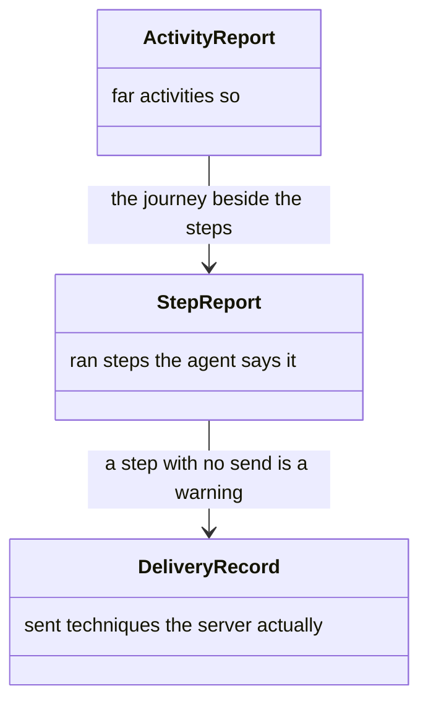

*Figure 12. Step Report, Activity Report, and What Was Sent.*

On `next_activity` an agent passes a `step_manifest`: one entry per step completed in the activity being left.

```json
{
  "step_manifest": [
    { "step_id": "resolve-target", "output": { "target_path": "/path" } },
    { "step_id": "prepare-target", "output": { "checked_out_ref": "main" } },
    { "step_id": "detect-layout", "output": { "needs_migration": false } }
  ]
}
```

### Warnings

Each warns rather than blocks:

| Check | Warns when |
|-------|-----------|
| Presence | An ungated top-level step is missing |
| Order | Top-level steps are out of declaration order — a relative comparison, so omitted gated steps do not shift it |
| Output | A step reports no value at all — an absent map, or one with no keys |
| Declaration | A reported key names no output the step's bound technique declares |
| Identity | A step id names no step of the activity |

### Steps That May Be Left Out

A step gated by `when` or `condition`, and a loop carrying a `continueWhile` continuation test, may be omitted: the agent evaluated the gate and skipped the step. A loop's continuation test decides whether its body runs at all, which is why a loop carrying one is gated on the same terms as a conditional step.

Those three fields are the only ones the validator reads. `step.required` is a hint for the worker, not a check.

### What a Loop Body Owes the Manifest

One entry per body step per iteration, under the step's declared id each time — three passes of a two-step body are six entries, in the order they ran. A body run three times and reported once says it ran once.

No loop-body id is ever required: the iteration count is the agent's, possibly zero, and the server holds no count of its own to check against. What the validator does check is that every id names a step of the activity, so a repeated id reads as a repeated run rather than a duplicate.

The order check is a subsequence comparison over top-level ids alone, so body entries interleaved between them shift nothing.

### Technique-Fetch Fidelity

The server records every delivery of technique or resource content into the session history:

| Event | Recorded on |
|-------|-------------|
| `technique_fetched` | a `get_technique` call, with the resolved id, the bound `step_id` where supplied, and the agent |
| `technique_bundled` | each step technique inlined by `get_activity` |
| `resource_fetched` | a `get_resource` call — observability only |
| `activity_delivered` | each `get_activity`, naming what that call resolved and spent |

All three delivery events carry `chars`, the full payload size on either path, and `delivery: "full" | "unchanged"`. Characters delivered and characters saved are both summable from the history rather than estimated. An unchanged-reference answer under persistent context mode still counts as a delivery.

Against that record, a manifested technique step with no delivery during the current activity visit warns. The step was reported complete but its technique content was never loaded, which is the signature of silent degradation. A step counts as covered by a step-bound fetch, by any in-activity fetch that resolved to the same technique, or by an inline bundle delivery. A loop-back revisit needs its own fetches. Delivery mechanics are in [reference delivery](delivery.md#reference-delivery) and [bundling](delivery.md#eager-technique-bundling).

## Layer 6: Activity Manifest

An agent may also pass an `activity_manifest` on `next_activity`: a summary of the activities completed so far.

```json
{
  "activity_manifest": [
    { "activity_id": "detect-layout", "outcome": "completed", "exit": "standard" },
    { "activity_id": "analyse-sources", "outcome": "completed", "exit": "skip-optional" },
    { "activity_id": "draft-plan", "outcome": "revised", "exit": "done" }
  ]
}
```

Each check warns: that every activity id exists in the workflow, that outcomes are non-empty, and that each claimed exit is one that activity declares.

<a id="layer-7-the-execution-trace"></a>

## Layer 7: Execution Trace

Every call is recorded as it happens (Figure 13). At a handover, the calls since the last one are handed back as a token the agent carries without reading (Figure 14).

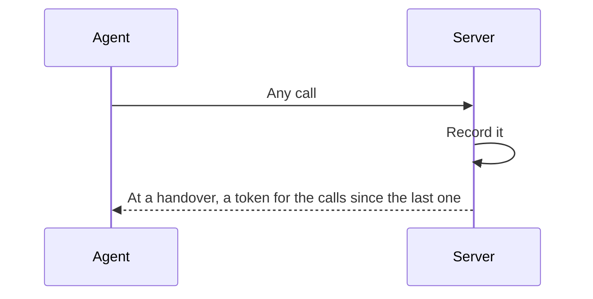

*Figure 13. Every Call Is Recorded, and a Handover Returns a Token.*

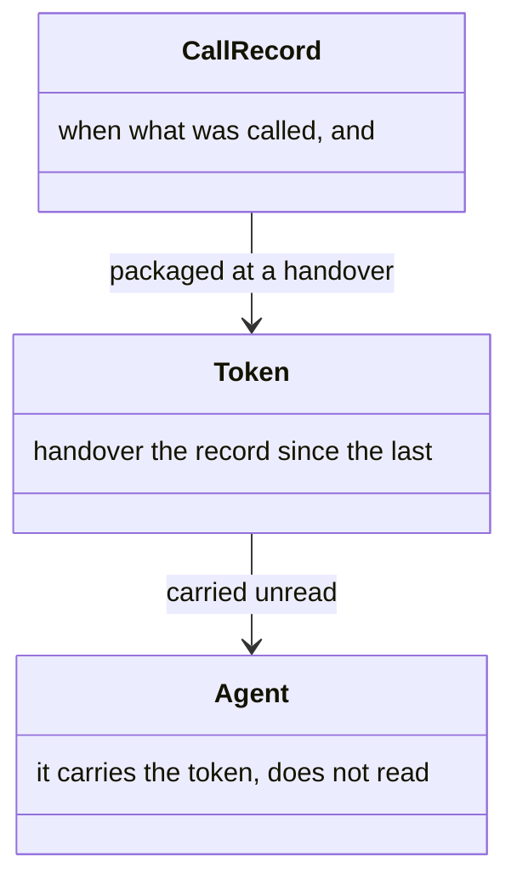

*Figure 14. Call Record, Token, and the Agent That Carries It.*

### What Each Event Carries

The server captures a mechanical trace of every tool call through `withAuditLog`:

| Field | Description |
|-------|-------------|
| `name` | Tool name |
| `ts` | Timestamp (Unix seconds) |
| `ms` | Duration in milliseconds |
| `s` | Status, `ok` or `error` |
| `wf`, `act`, `aid` | Workflow, activity and agent id the call was made under |
| `err` | Error message, on failure |
| `vw` | Validation warnings from `_meta.validation` |

### How a Trace Token Travels

Events accumulate in an in-memory `TraceStore`. On each `next_activity` the server packages everything since the last transition into a trace token, signed with the same key that seals session state, and returns it in `_meta.trace_token`.

The agent accumulates these tokens as opaque strings without parsing them, which keeps the mechanical trace out of its reasoning context. `get_trace` resolves accumulated tokens into full event data, or returns the in-memory trace when given none.

A token is self-contained rather than a pointer into server memory, so it stays a valid attestation across a restart. Field names are compressed, which is what keeps an accumulating set of tokens small enough to carry without thinking about it.

What the trace makes possible after the fact:

- **Parent and child correlation** — a launched workflow's events carry their own `sid`, and the session file records which session launched it.

Agents write a second, semantic trace — step outputs, checkpoint responses, decision branches, variable changes — into the planning folder, per the workflow's own technique instructions. The server's mechanical trace and that semantic one together give complete visibility.

## What a Check Cannot Prove

The check sees what was reported and what was called, not that the work was done or that a person saw the question (Figure 15). A warning left unread is still in the trace (Figure 16).

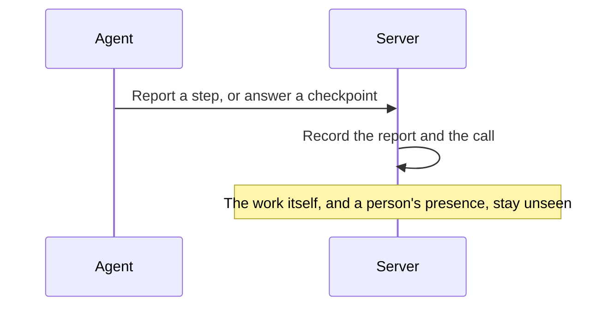

*Figure 15. The Report Is Recorded. The Work Itself Stays Unseen.*

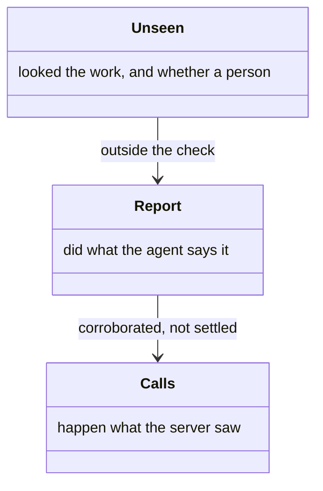

*Figure 16. Report, the Calls, and What Stays Unseen.*

## Limits of Detectability

Every layer above detects rather than prevents, and the limits are worth stating plainly.

- **Step execution is not provable.** The manifest shows that an agent *reported* each step, not that it did the work, and the output descriptions are the agent's own. The mechanical trace independently confirms which tool calls were made, which corroborates but does not settle it.
- **Condition truth is not verified.** The server checks that a claimed exit maps to the target activity. Whether the predicate holds in the agent's state is beyond it.
- **Checkpoint user presence is not provable.** The gate ensures the agent calls `respond_checkpoint` with a valid option. It cannot show a person saw the question. The timers raise the bar by rejecting an instant resolve, but an agent could wait the minimum and submit a fabricated answer. This is inherent wherever the agent controls the channel to the user.
- **Conditional dismissal relies on honesty.** On `condition_not_met` the server validates that the checkpoint carries a `condition`, not that the condition is false. The dismissal is recorded for later audit.
- **A repeated call is not distinguished from a fresh one.** A call is checked against the position the server recorded, so it cannot tell that an agent is re-issuing a call it already made. The trace records both, so a repeat is visible afterwards.
- **Warnings are advisory.** A confused agent may ignore them. They are captured in the trace, so ignored warnings show up in review.
- **The in-memory trace does not survive a restart.** Tokens issued before it remain valid, since the event data is embedded in them, but a `get_trace` with no tokens returns nothing for prior sessions.
- **The semantic trace depends on the agent.** The server cannot verify that the agent wrote it, or that it is complete.
