# Resolution

A workflow's instructions are split into artifacts whose grain is chosen so that an agent is handed the exact piece of work it needs, and nothing else. A **workflow** is a guide used to reliably direct an agent to fulfill a set of operator objectives. An **activity** is one phase of that guide. A **routine** is a named run of re-usable steps, declared once and spliced into an activity that refers to it. A **technique** is one capability an activity's steps name. A **resource** is reference material a technique points at, not work the step itself carries out.

A **reference** is the name of one of those artifacts: a workflow, an activity, a routine, a technique, or a resource. **Resolution** is how that reference allows the file that holds the artifact to be discovered. A **namespace** is a directory references reach. What then travels, and what it costs, is [delivery](delivery.md).

A **rule** is a named invariant on a technique. A **nested technique** is a technique file inside a group, and it is still a technique. A **bundle** is the set of files a list of references resolves to. A **contract** is what an ancestor folder contributes: shared inputs, outputs, and rules, not a procedure. **Meta** is the shared workflow every other workflow can reach. An **orchestrator** tracks one workflow. A **worker** carries out one activity.

## General

### Filename as Identity

The filename is the id (Figure 1). A standalone file, a group folder, and a resource file are the three shapes (Figure 2).

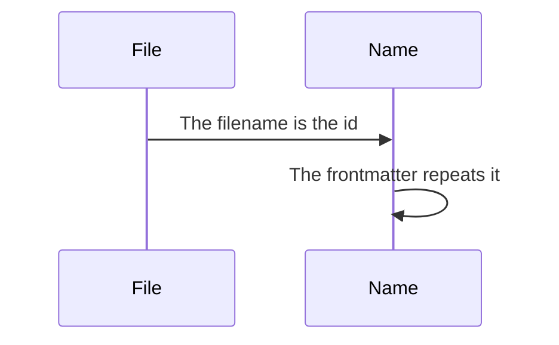

*Figure 1. The Filename Is the Name an Agent Asks For.*

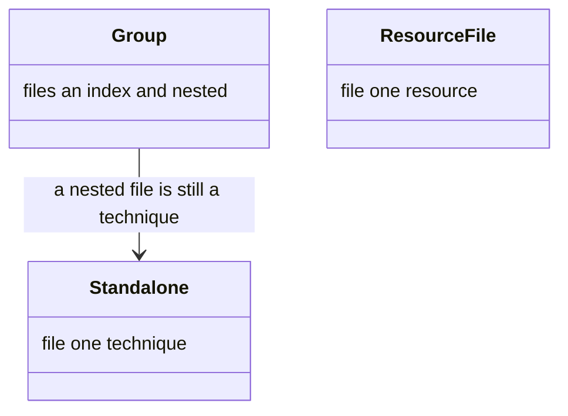

*Figure 2. Standalone Technique, Group, and Resource File.*

Techniques and resources are markdown files on disk, and each one's filename is its id. A standalone technique is `techniques/{slug}.md`; a grouped technique is a folder holding a `TECHNIQUE.md` index plus one `{sub}.md` per nested technique; a resource is `resources/{slug}.md`. The id matches the filename, and the frontmatter repeats it.

So the file `techniques/workflow-engine.md` is the technique `workflow-engine`, and that is the name an agent asks for it by.

### Reference Path

Activities and workflows compose behaviour by listing references (Figure 3). A reference is a path of names, and a same-namespace reference leaves the namespace off (Figure 4).

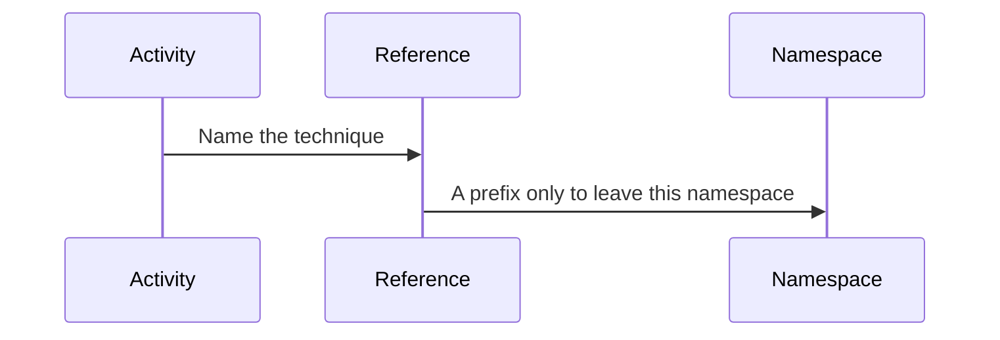

*Figure 3. A Reference Names a Technique, and a Prefix Leaves the Namespace.*

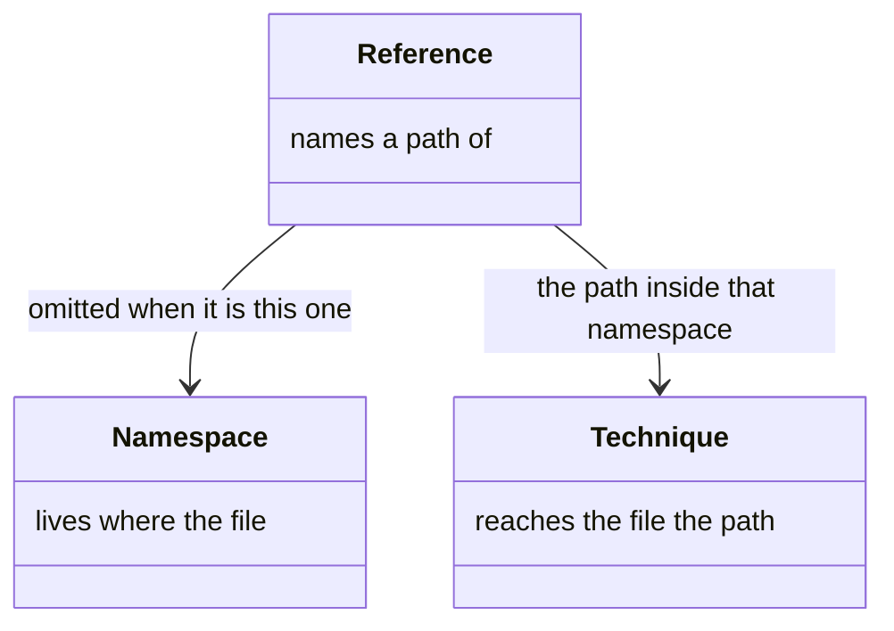

*Figure 4. Reference, Namespace, and Technique.*

#### Path Shape

A reference is a `::`-delimited path:

```
[namespace::]technique[::nested…]
```

#### Listed References

```yaml
techniques:
  primary: workflow-engine::dispatch-activity
  supporting:
    - workflow-engine::evaluate-transition
    - agent-conduct::checkpoint-discipline
    - meta::agent-conduct::file-sensitivity      # namespace-prefixed
    - shared::indexer::analyse                   # a namespace named by its path
```

A same-namespace reference omits the prefix; the current workflow is filled in at resolution. Include a leading prefix only to reach another namespace — the longest leading run that names one is the prefix, and everything after it is a path inside that namespace's `techniques/`. A `namespace/technique` slash form spells a single-segment prefix.

<a id="what-a-namespace-is"></a>

### Namespace

A directory becomes a namespace by holding techniques, resources, or routines, or by holding a workflow definition (Figure 5). It answers to its directory name and to the path that reaches it (Figure 6).

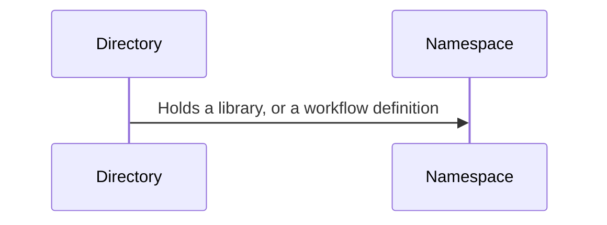

*Figure 5. A Directory Becomes a Namespace by What It Holds.*

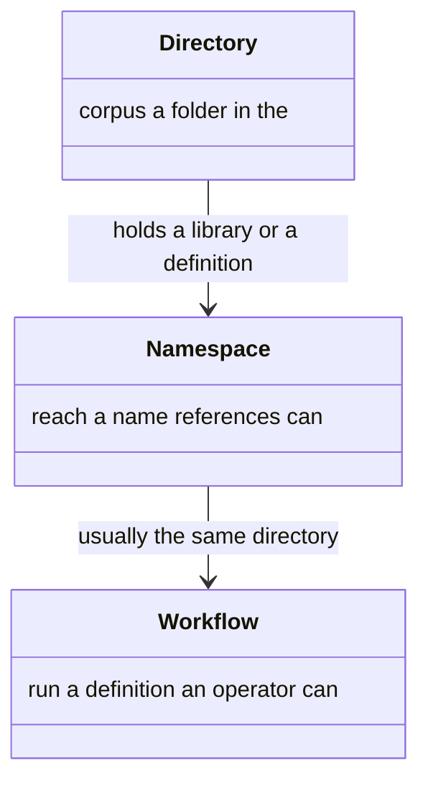

*Figure 6. Directory, Namespace, and Workflow.*

#### What Earns the Name

A namespace is a directory offering artifacts to references. It earns that by holding a `techniques/`, `resources/` or `routines/` directory, or by holding a `workflow.yaml` — and a directory holding a definition is a workflow as well, the guide an operator follows. The two are usually one directory: a workflow keeping its own library beside its definition is addressable with nothing done to it.

`activities/` earns nothing. An activity declares exits, and the destinations those exits lead to live in a definition's `graph`, so an activity in a directory holding no definition could never be routed. Activities belong to workflows; the three library kinds are what a namespace offers.

#### Name and Path

A namespace answers to two names: its directory name, and the slash-joined path from the corpus root that reaches it. The name is what a reference ordinarily carries, so a folder can be re-grouped without rewriting what points at it; the path is what a reference carries where a name is claimed twice, or where an author would rather be explicit. `shared/indexer/techniques/analyse.md` answers to `indexer::analyse` and to `shared::indexer::analyse` alike.

Two consequences are worth stating. A namespace holding no definition never reaches `list_workflows`, because the listing reads definitions rather than a list of names to exclude — so a shared library sits in the corpus without appearing as a workflow. And where a namespace at `a/b` and a directory `a/techniques/b/` both exist, one reference names two files: `indexCorpus` reports the collision and the reference is refused naming both, rather than one reading being picked and the other left unreachable.
### Shared Meta Layer

Shared behaviour is written once in meta, and a workflow's own file of the same name wins (Figure 7). The current workflow and meta are the two places (Figure 8).

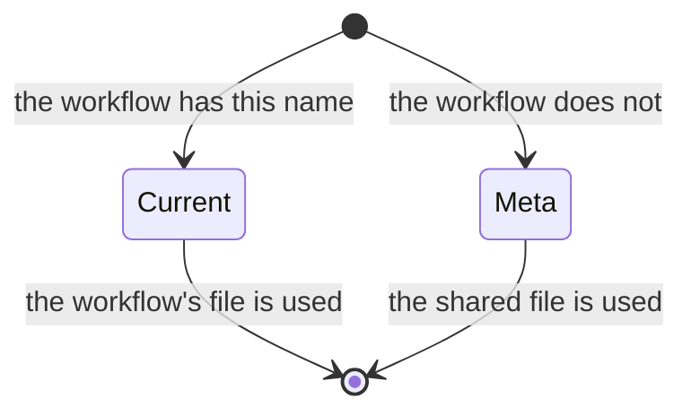

*Figure 7. The Current Workflow's File Wins. Otherwise Meta's.*

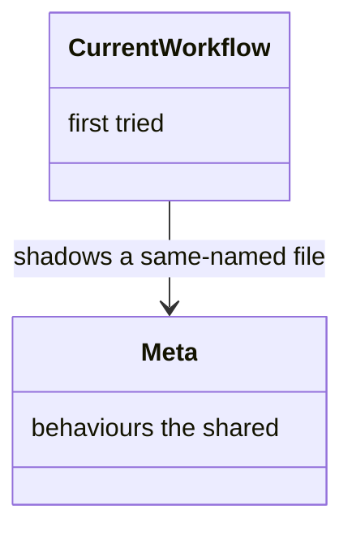

*Figure 8. Current Workflow, and Meta.*

The behaviours every workflow needs — how the engine advances, how agents are expected to conduct themselves — are written once in a shared workflow called `meta`, so no other workflow has to restate them.

Resolution therefore looks in two places, in order: the current workflow's own technique folder first, and the shared layer second. A workflow that defines a technique under a name the shared layer also uses shadows the shared one, which is how a workflow overrides a standard behaviour without the shared copy having to know about it.

## Workflow

### Declared Techniques

A workflow declares techniques for the orchestrator, and techniques every activity inherits (Figure 9). Those two audiences are the pieces (Figure 10).

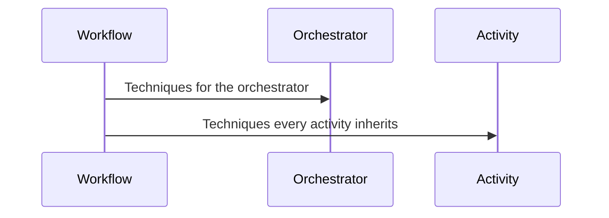

*Figure 9. Workflow Techniques Reach the Orchestrator and Every Activity.*

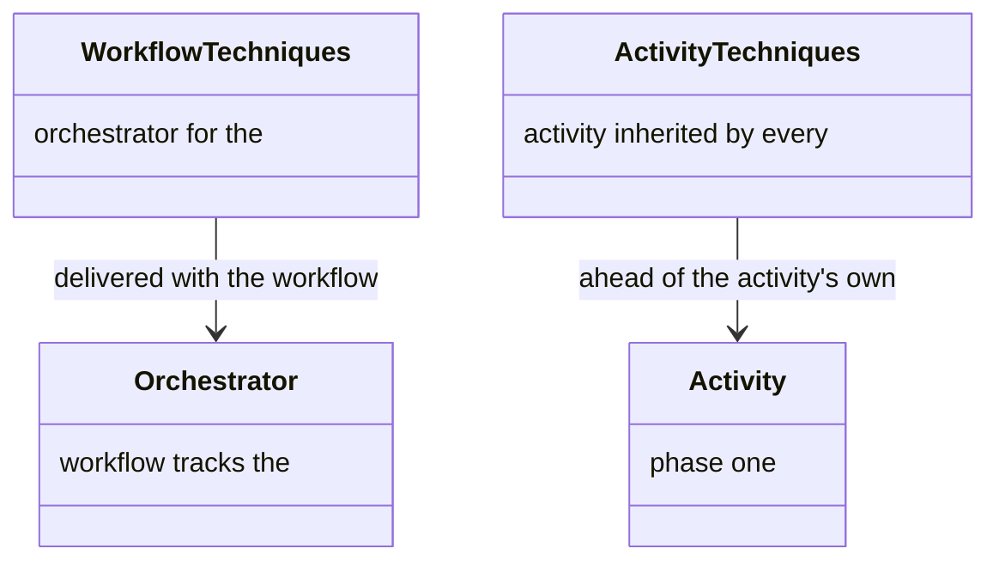

*Figure 10. Workflow Techniques, Activity Techniques, Orchestrator, and Activity.*

A workflow declares techniques partitioned by audience, mirroring `rules`. `techniques.workflow` is for the orchestrator; `techniques.activity` is inherited by every activity.

The orchestrator's set arrives in the `get_workflow` technique bundle rather than as a separate preamble. Before any activity has opened, `get_technique` returns the composed body of the first `techniques.workflow` entry.

The activity set is injected into every `get_activity` technique bundle, ahead of the activity's own `techniques[]`. So a technique common to all activities — variable binding, say — is declared once at the workflow level instead of repeated on each one.

## Activity


An activity file lives in its workflow's `activities/` directory. A reference usually omits that segment, and the server adds it (Figure 11). A name in another workflow carries that workflow first (Figure 12).

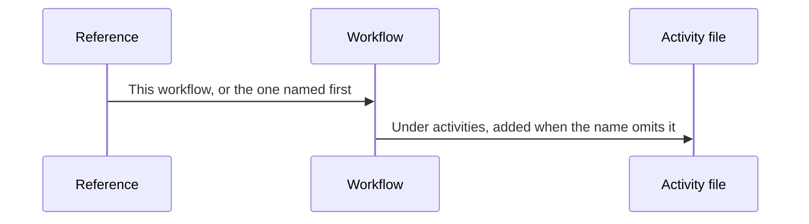

*Figure 11. A Reference Reaches an Activity File Under Activities.*

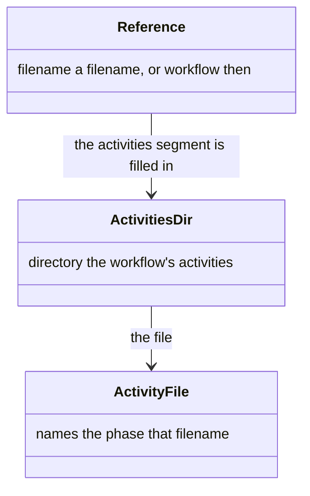

*Figure 12. Reference, the Activities Directory, and the Activity File.*

Holding `activities/` does not make a directory a namespace. An activity declares exits, and the destinations those exits lead to live in a workflow's graph, so an activity with no workflow could never be routed. A workflow may name an activity from another workflow. The file is read from that workflow's `activities/` directory, and a reference that already includes `activities/` is used as written.

### Filename Prefix

The filename may begin with a number. That number is the prefix put in front of each document the activity writes. How documents are named is [naming](delivery.md#how-documents-are-named).

## Routine


A routine is one file in `routines/`, named for the routine, with no place in an order (Figure 13). A reference's last segment is the routine, and every segment before it is the namespace (Figure 14).

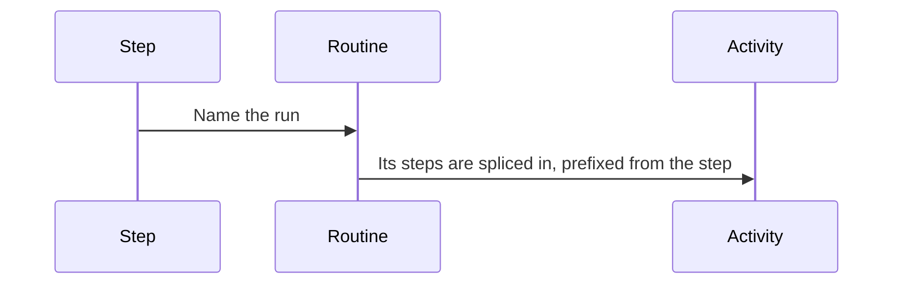

*Figure 13. A Routine's Steps Are Spliced Into the Activity.*

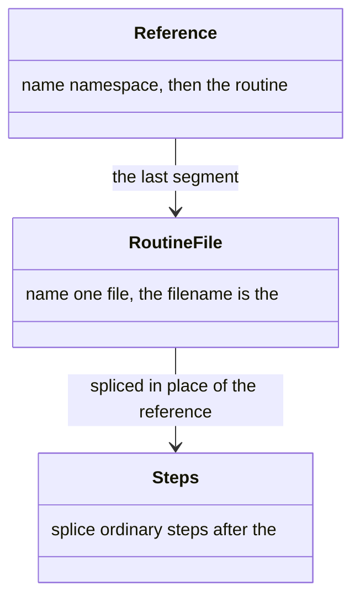

*Figure 14. Reference, Routine File, and the Steps Spliced In.*

A routine lives at `routines/<name>.yaml`, beside `activities/`. The filename is the name a reference resolves, so the file's `id` agrees with it. A reference is `[namespace::]name`. A qualified name resolves in that namespace only. A bare name resolves against the referring activity's source workflow, then meta. There is no group segment: the last segment is the routine, and every segment before it belongs to the namespace.

### Splice

The loader substitutes the site's arguments through the body, prefixes every identifier inside it from the referring step's id, and splices the steps in place of the reference. The step manifest, the guards, and the worker see ordinary steps. Two references to one routine do not collide, because each body is prefixed from its own step. A routine may refer to another, and a cycle fails the load.

## Technique

### Technique Shape

One kind of technique is either a single file or a folder of nested techniques (Figure 15). Identity, inputs, outputs, protocol, and rules are what it publishes (Figure 16).

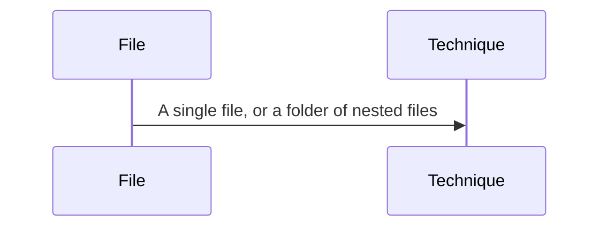

*Figure 15. One Kind of Technique, as a File or a Folder.*

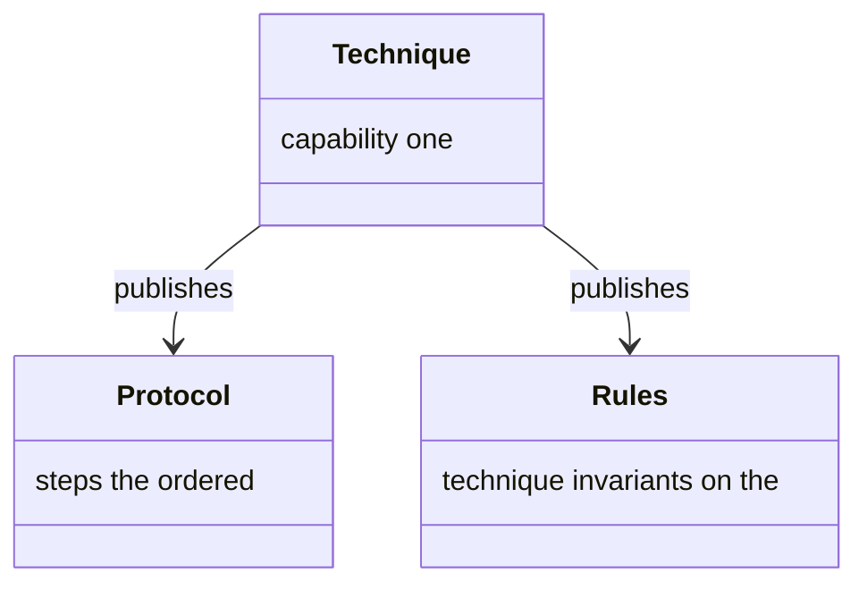

*Figure 16. Technique, Protocol, and Rules.*

There is one kind of technique. It is either a single markdown file, or a folder whose `TECHNIQUE.md` index carries nested techniques as sibling files. A nested technique is itself a technique: same shape, same delivery.

#### Published Fields

A technique publishes:

* **`id`**, **`version`**, **`capability`** — the identity and the capability statement.
* **`inputs`** (optional) — an array of entries, each with `id`, `description`, `required`, `default`, and optional `components` (named sub-members).
* **`outputs`** (optional) — an array of entries, each with `id`, `description`, optional `components`, and an optional `artifact` carrying a `name` (the filename produced when the output is persisted).
* **`protocol`** — an ordered list of blocks `{title?, steps[]}`. Steps are imperative bullets; failure handling is expressed inline within the relevant steps.
* **`rules`** — named behavioural invariants that apply across the technique. Each key is a rule name (or a group prefix); each value is a single rule string or an array of related rules.

Section shapes and the addressing grammar are the [technique protocol](technique.md). The case and shape of every id are the [identifier conventions](README.md#document-corpus).

### Technique or Rule

A reference reaches a technique, or a rule on that technique (Figure 17). The trailing segment decides which (Figure 18).

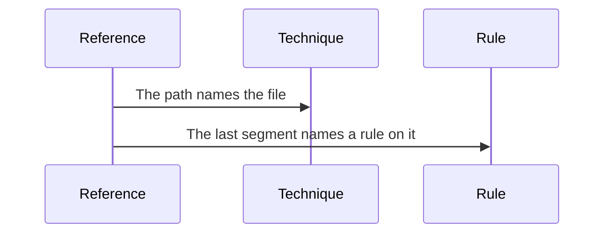

*Figure 17. A Reference Reaches a Technique, or a Rule on It.*

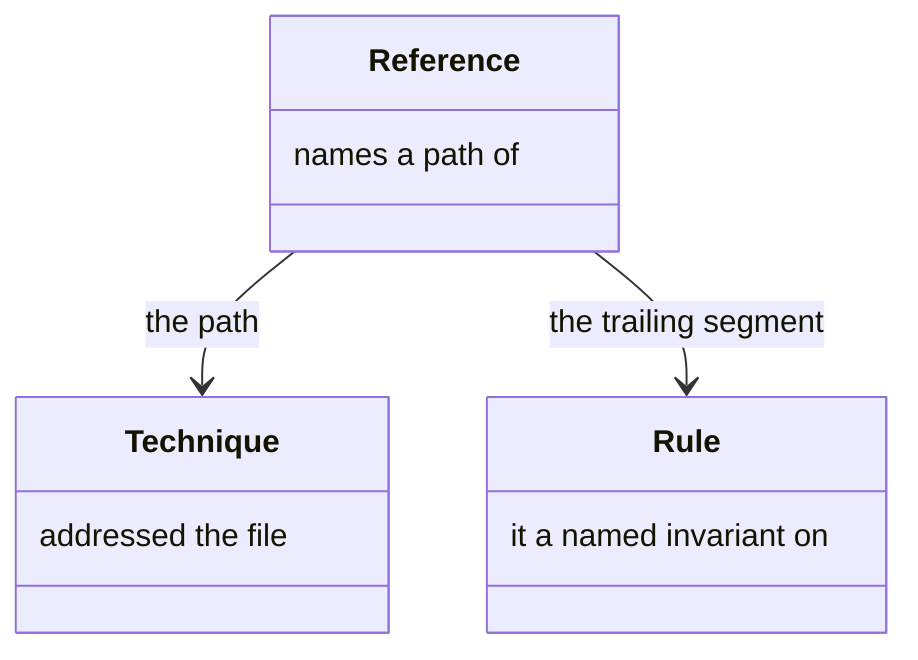

*Figure 18. Reference, Technique, and Rule.*

* **A technique** — a standalone `{technique}.md`, a grouped `{group}/TECHNIQUE.md` index, or a nested `{group}/{sub}.md` file (addressed `{group}::{sub}`). A nested technique is a technique.
* **A rule** — when the trailing segment matches a rule name on the addressed technique. A bare group reference `{technique}::{group}` expands to every rule named `{group}-*` on that technique.

### Inline Invocation

An invocation written in a step points at the same technique the bundle already carried (Figure 19). The step text and the bundled body are the pieces (Figure 20).

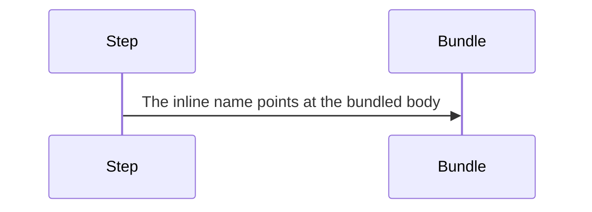

*Figure 19. An Inline Name Points at the Body Already Bundled.*

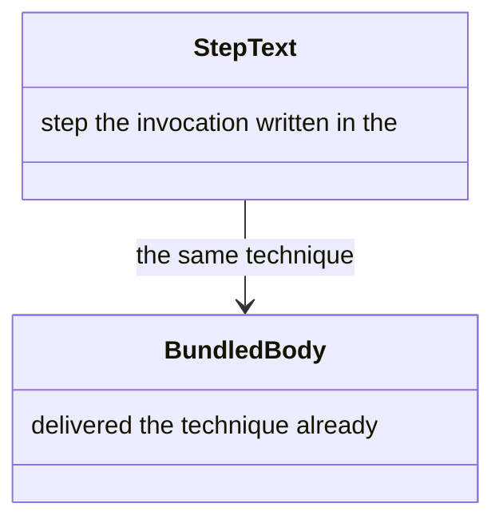

*Figure 20. Step Text, and the Bundled Body It Points At.*

#### Inline Form

Technique invocations also appear inside step descriptions:

```yaml
steps:
  - id: dispatch-worker
    description: "workflow-engine::dispatch-activity(activity_id: {next}, agent_id: 'worker')"
```

The inline form points at the same technique body. Agents read the technique from the bundled response rather than re-fetching it.

### Resolution Order

A reference is located, then read as a whole technique, a nested technique, or a rule, and otherwise left unresolved (Figure 21). A prefix fixes the namespace, and no prefix tries the current workflow before meta (Figure 22).

```mermaid
stateDiagram-v2
  [*] --> Located
  Located --> Whole: no nested segment
  Located --> Nested: a nested file matches
  Nested --> Rule: no nested file matches
  Rule --> Unresolved: no rule matches
  Whole --> [*]
  Nested --> [*]
  Rule --> [*]
```

*Figure 21. A Reference Becomes a Whole Technique, a Nested One, a Rule, or Unresolved.*

```mermaid
classDiagram
  class Prefix {
    namespace names the
  }
  class CurrentWorkflow {
    prefix tried first when there is no
  }
  class Meta {
    second the shared layer, tried
  }
  Prefix --> CurrentWorkflow : a prefix does not fall through
  CurrentWorkflow --> Meta : shadows a same-named file
```

*Figure 22. Prefix, Current Workflow, and Meta.*

#### Steps

Each reference resolves as follows:

1. **Locate the technique.** If the reference carries a namespace prefix, load from that namespace's `techniques/` folder and nowhere else — a prefix says where the technique lives, so a fallback would deliver a different file under the same reference. Otherwise resolve **current-workflow-first, then the `meta` shared layer** — the current workflow's technique shadows a same-named `meta` one.
2. **Whole-technique reference** (no nested segment) — deliver the technique's own body (capability, flow, inputs, protocol, outputs) and auto-include its rules.
3. **Nested reference** — try a `{group}/{sub}.md` nested technique first (current-workflow-first, then `meta`); deliver its body and auto-include its rules.
4. **Rule reference** — if no nested technique matches, match the trailing segment against the technique's rules. A direct name match resolves to that rule. A group prefix `{group}` expands to every `{group}-*` rule.
5. **Unresolved** — a reference that matches none of the above surfaces explicitly; it is never silently dropped.

### Role Rules

When a technique is resolved, remaining **role** rules — those not already on a technique body or a scope contract — are appended as rule entries (Figure 23). Role rules, technique rules, and scope rules each have a home (Figure 24).

```mermaid
sequenceDiagram
  participant Technique
  participant RoleRules as Role rules
  Technique->>RoleRules: Rules not already on a body are appended
```

*Figure 23. Role Rules Not Already on a Body Are Appended.*

```mermaid
classDiagram
  class TechniqueRules {
    body ride on the technique
  }
  class ScopeRules {
    contract ride on the
  }
  class RoleRules {
    technique govern the role, not one
  }
  TechniqueRules --> RoleRules : not restated there
  ScopeRules --> RoleRules : not restated there
```

*Figure 24. Technique Rules, Scope Rules, and Role Rules.*

Technique and scope rules ride those homes; they are not restated in the list.

### Bundle

Resolving a list of references groups the result into buckets (Figure 25). Techniques, contracts, rules, and unresolved references are the pieces (Figure 26).

```mermaid
sequenceDiagram
  participant References
  participant Bundle
  References->>Bundle: Each name is placed in a bucket
```

*Figure 25. A List of References Becomes a Bundle.*

```mermaid
classDiagram
  class Techniques {
    path bodies, keyed by
  }
  class Contracts {
    rules an ancestor's shared inputs and
  }
  class Rules {
    each role rules, one line
  }
  class Unresolved {
    nothing names that matched
  }
  Techniques --> Bundle: gathered in
  Contracts --> Bundle: gathered in
  Rules --> Bundle: gathered in
  Unresolved --> Bundle: gathered in
  class Bundle {
    to what the list resolved
  }
```

*Figure 26. Techniques, Contracts, Rules, Unresolved References, and the Bundle.*

The result of resolving a list of references is a bundle grouped into these buckets:

* **`techniques`** — keyed by full path (`{workflow}/{technique}` or `{technique}`, with `::{sub}` appended for a nested technique) → technique body (own fields plus `inherits`).
* **`contracts`** — keyed by scope id (workflow id or group path) → that ancestor's authored rules and shared inputs/outputs.
* **`rules`** — a flat array of `[rule-name, rule-line]` tuples (one tuple per line) for rules that govern the role rather than any one technique.
* **`unresolved`** — references that did not resolve.

Empty buckets are omitted. The lookup is structural and requires no session token; most clients receive it indirectly through the bundles that `get_workflow` and `get_activity` produce, which [delivery](delivery.md#what-a-role-receives) describes.

### Ancestor Contract

An ancestor contributes a contract, and the descendant's own entry wins on a shared name (Figure 27). The ancestor and the descendant are the pieces (Figure 28).

```mermaid
sequenceDiagram
  participant Ancestor
  participant Descendant
  Ancestor->>Descendant: Shared inputs, outputs, and rules merge in
  Descendant->>Descendant: Its own entry wins on a shared name
```

*Figure 27. An Ancestor's Contract Merges In. The Descendant Wins on a Shared Name.*

```mermaid
classDiagram
  class Ancestor {
    procedure a contract, not a
  }
  class Descendant {
    delivered the technique
  }
  Ancestor --> Descendant : merged, own entry wins
```

*Figure 28. Ancestor, and the Descendant It Merges Into.*

An ancestor container contributes a contract, never a procedure. Every ancestor along the path — the workflow-root `TECHNIQUE.md` and each containing group's `TECHNIQUE.md` — merges its inputs, outputs and rules into the in-memory descendant, the descendant's own entry winning on a shared id or name. Role-facing delivery carries each ancestor's authored block once under `contracts`, and the descendant names those scopes in `inherits`. A technique's protocol is delivered as authored; the steps a shared stage owns belong to the activity or routine that binds both techniques, not to the folder that holds them.

## Resource


A technique points at a resource by a link, and the server rewrites that link into a name the agent can ask for (Figure 29). The technique, the link, and the resource are the pieces (Figure 30).

```mermaid
sequenceDiagram
  participant Technique
  participant Link
  participant Agent
  Technique->>Link: Points at a resource
  Link->>Agent: Rewritten into a name the agent can ask for
```

*Figure 29. A Resource Link Is Rewritten Into a Name the Agent Can Ask For.*

```mermaid
classDiagram
  class Technique {
    needs cites the guide it
  }
  class Resource {
    inlined the guide, not
  }
  Technique --> Resource : a link, rewritten to a name
```

*Figure 30. Technique, and the Resource It Cites.*

Even with techniques tightly scoped, large reference material (Git CLI tutorials, API guides, templates) does not belong inline. A technique references a resource by id through a normal markdown hyperlink in its content — a template linked from an Input or Output, for instance. When the server projects a technique for delivery, it **rewrites those resource hyperlinks into `get_resource`-callable refs**: the bare id form `{id}[#section]`, or the cross-workflow form `{workflow}/{id}[#section]`. Technique links are left untouched.

Server responses do not bundle resource bodies by default. The agent loads a resource when it needs it.

<a id="loading-a-resource-when-it-is-needed"></a>

### Loading a Resource

The agent asks for a resource when it reaches a reference it needs (Figure 31). A bare name stays in this workflow, and a prefix names another namespace (Figure 32).

```mermaid
sequenceDiagram
  participant Agent
  participant Server
  Agent->>Server: Ask for the resource
  Server-->>Agent: The body, from this workflow or the named namespace
```

*Figure 31. The Agent Asks, and the Server Resolves the Resource.*

```mermaid
classDiagram
  class BareName {
    only this workflow
  }
  class Prefix {
    names the namespace the path
  }
  class Resource {
    reaches the file that name
  }
  BareName --> Resource : resolved here
  Prefix --> Resource : resolved in that namespace
```

*Figure 32. Bare Name, Prefix, and Resource.*

#### Asking for a Resource

When an agent reaches a resource reference it needs, it asks for it:

```javascript
get_resource({ session_index, resource_id: "meta/activity-worker-prompt" })
```

The server resolves the reference:

* **Bare slugs** (for example `"review-mode"`) resolve within the session's workflow.
* **Prefixed references** (for example `"meta/activity-worker-prompt"`) resolve from the named namespace. The prefix is the longest leading run of segments naming one, so `"shared/indexer/index-reading"` reads the namespace `shared/indexer` and the slug `index-reading`.

### Narrowing to One Section

A section anchor returns that section rather than the whole file (Figure 33). The whole resource and the one section are the pieces (Figure 34).

```mermaid
sequenceDiagram
  participant Agent
  participant Resource
  participant Section
  Agent->>Resource: Ask, with a section anchor
  Resource->>Section: That section and its body
```

*Figure 33. A Section Anchor Returns That Section.*

```mermaid
classDiagram
  class Resource {
    guide the whole
  }
  class Section {
    body one heading and its
  }
  Resource --> Section : a section anchor narrows to
```

*Figure 34. Resource, and the Section an Anchor Narrows To.*

An optional `#section` anchor — a GitHub-style heading slug — narrows the result to that section and its body. That is how a technique fetches just the template it references without the whole file. The content is loaded from the named workflow's own `resources/{slug}.md` and returned alongside the resource `id` and `version`.

A refetch of a body the calling context already holds can collapse to a short marker instead. [Reference delivery](delivery.md#reference-delivery) carries that contract, including that a bare id and a sectioned id occupy independent ledger keys. Either way, each call appends a `resource_fetched` history event.

### A Shared Resource

- An agent carries only the guides the technique in front of it actually cites.
- A guide with several callers — how to format a pull request, how to drive the Git command line — is written once and linked from every technique that needs it, across any number of workflows.
- The prefixed form lets a technique in one workflow reach the shared library in `meta`, so a resource is reused rather than copied.
