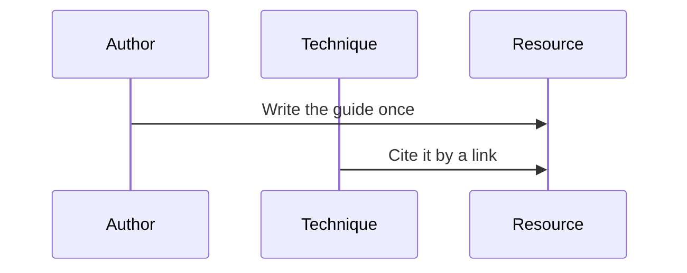
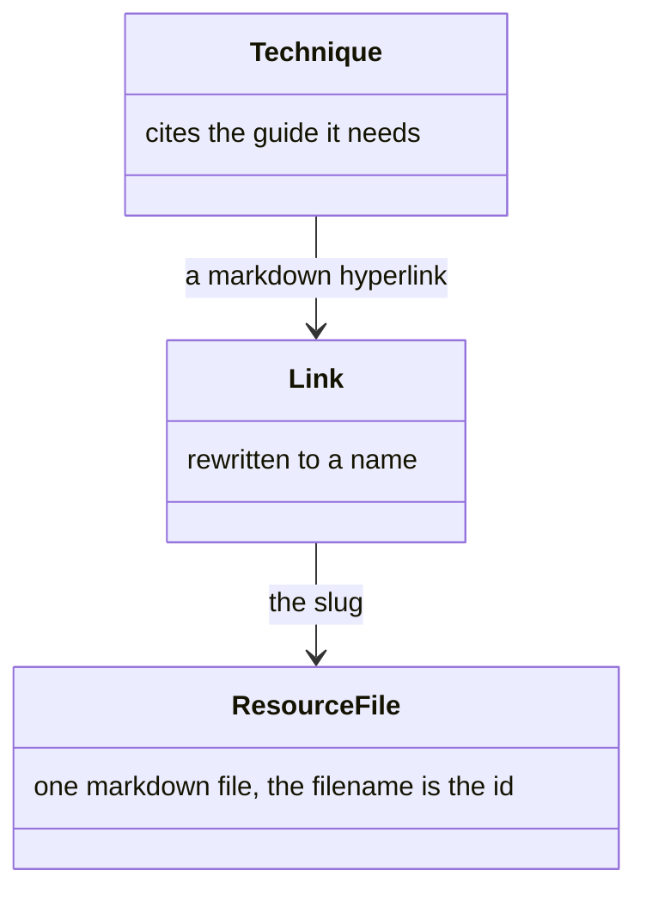
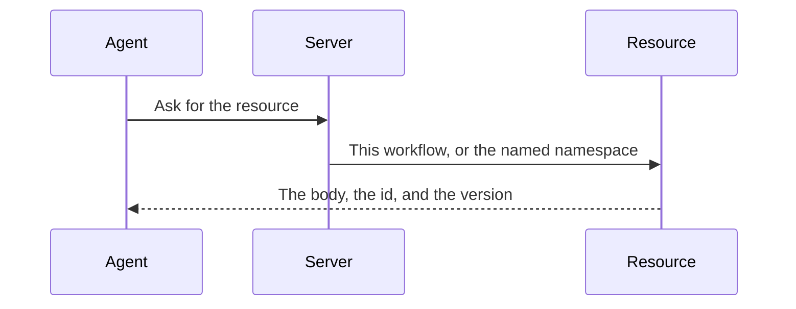
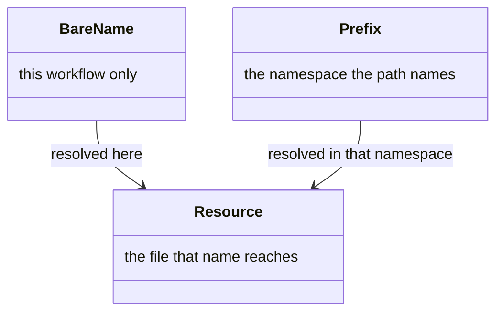
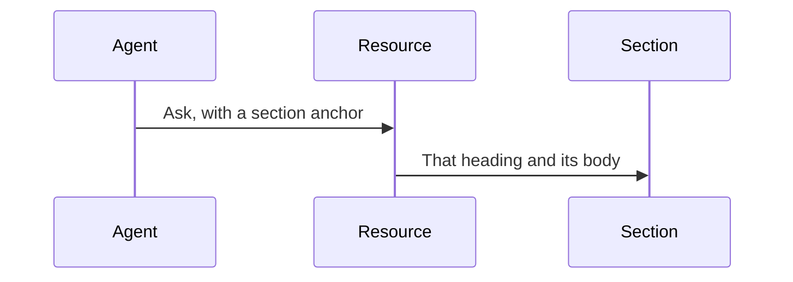
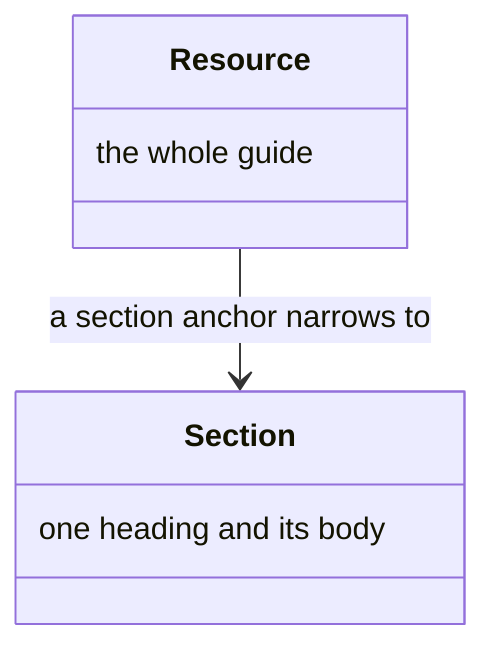
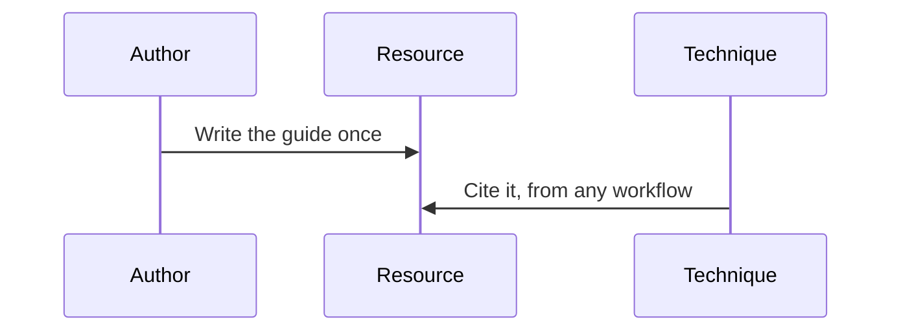
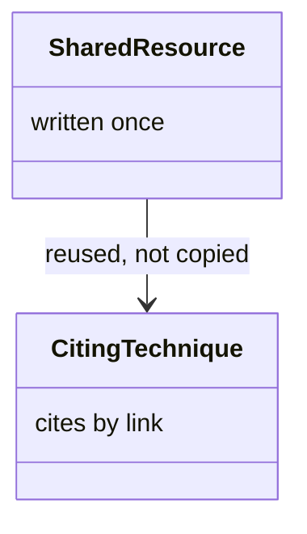

# Resource

A **resource** is a guide a **technique** cites and does not inline: a template, a command reference, a long explanation. A technique is a capability file. The author writes a resource when that material has more than one caller, or is too large to ride inside the technique. A **reference** is the name the agent asks for. A **section** is one heading of the file, fetched alone when the technique needs only that part.

The filename is the id. The server returns the body with that id and a **version**. How the name reaches the file is [resolution](resolution.md#resource). What a later send collapses to is [reference delivery](delivery.md#reference-delivery). The [calls](api.md) that ask for a resource are in the tool catalog.

## File

A resource is one markdown file, and a technique points at it with an ordinary link (Figure 1). The technique, the link, and the file are the pieces (Figure 2).



*Figure 1. A Technique Cites a Guide It Does Not Inline.*



*Figure 2. Technique, Link, and Resource File.*

The file is `resources/<id>.md` in the workflow that owns it. A navigation document in that directory is not a resource. Frontmatter carries `name` and `version`. The name is the id a caller may use when it differs from the filename. The version is a top-level `version` or `metadata.version`.

When a technique is projected for delivery, a resource hyperlink is rewritten into a name the agent can ask for: the bare id, or `{workflow}/{id}`, with an optional section. Links to other techniques are left untouched. The body is not placed in the technique. The agent loads it when the step needs it.

#### Sample Resource

```markdown
---
name: pull-request-body
version: 1.0.0
---

## Summary

What changed, in a few lines.

## Test plan

How the change was checked.
```

## Asking

The agent asks when it reaches a reference it needs (Figure 3). A bare name stays in this workflow, and a prefix names another namespace (Figure 4).



*Figure 3. The Agent Asks. The Server Returns the Body.*



*Figure 4. Bare Name, Prefix, and Resource.*

#### A Call

```javascript
get_resource({ session_index, resource_id: "meta/pull-request-body" })
```

A bare slug resolves within the session's workflow. A prefixed reference resolves from the named namespace. The prefix is the longest leading run of segments that names one, so `shared/indexer/index-reading` reads the namespace `shared/indexer` and the slug `index-reading`.

## One Section

A section anchor returns that heading and its body, not the whole file (Figure 5). The whole resource and the one section are the pieces (Figure 6).



*Figure 5. A Section Anchor Returns That Heading and Its Body.*



*Figure 6. Resource, and the Section an Anchor Narrows To.*

The anchor is a heading slug. That is how a technique fetches the template it cites without the rest of the file. A whole resource and one section of it occupy independent ledger keys, so a marker for one does not stand for the other. A refetch of a body the calling context already holds collapses to a short marker. Each call appends a fetch to the history.

## Shared Guide

A guide with several callers is written once and linked from every technique that needs it (Figure 7). The shared file and the techniques that cite it are the pieces (Figure 8).



*Figure 7. One Guide, Cited from Every Technique That Needs It.*



*Figure 8. Shared Resource, and a Technique That Cites It.*

An agent carries only the guides the technique in front of it cites. The prefixed form lets a technique in one workflow reach a guide in the shared meta layer, or in another namespace, so the file is reused rather than copied.
