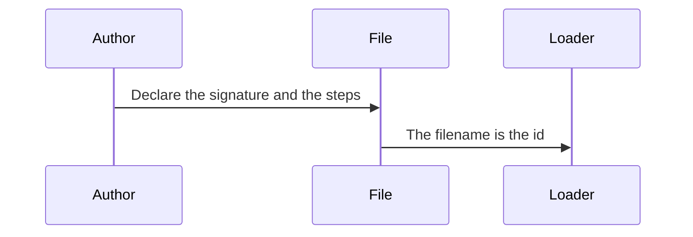
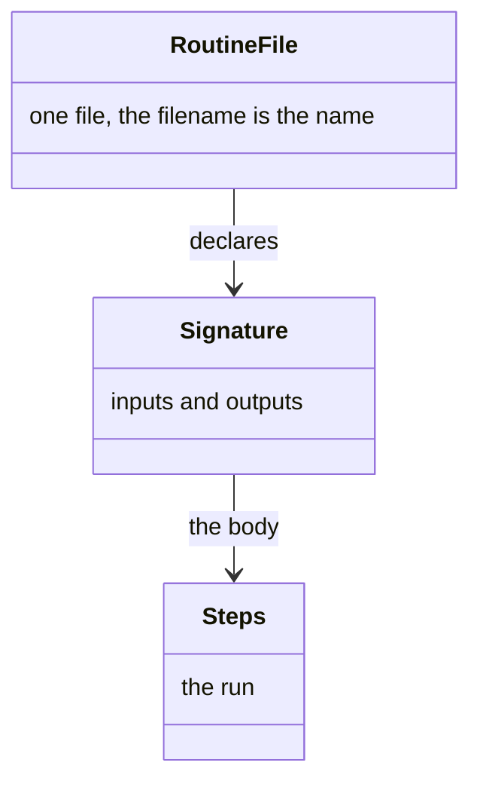
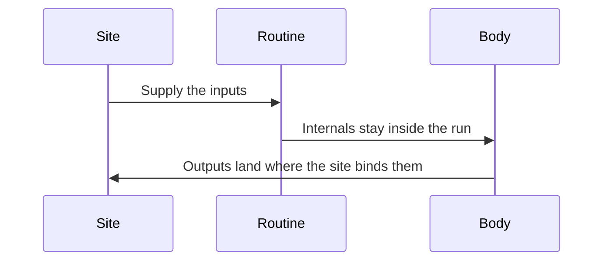
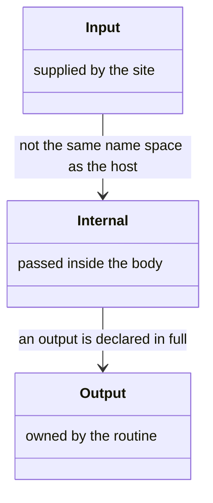
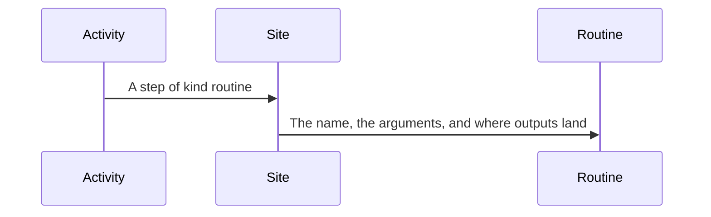
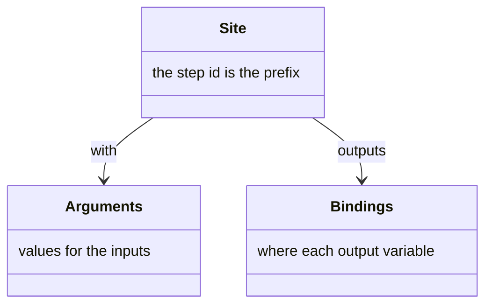
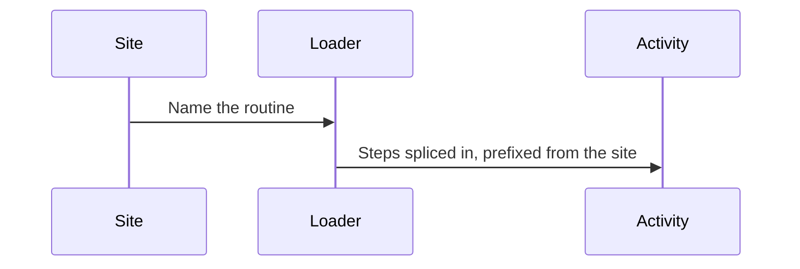
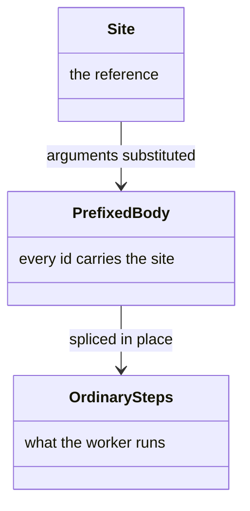

# Routine

A **routine** is a named run of steps, written once and referred to from more than one **site**. A site is a step in an **activity** — one phase of a **workflow** — that points at the routine. The loader substitutes the site's arguments, prefixes every identifier from that step, and splices the steps in place of the reference. Downstream, the manifest, the guards, and the worker see ordinary steps.

An **input** is a parameter the site supplies. An **output** is a value the run produces, owned here. An **internal** is a name the body's steps pass between themselves, and it never enters the workflow's variables. A **reference** is the name the site uses. How that name reaches the file is [resolution](resolution.md#routine). The fields of the file are the [schema](../schemas/README.md#routine-routineschemajson). The fields of the referring step are the [schema](../schemas/README.md#routine-step).

## File

The file is one routine, and the filename is the name a reference resolves (Figure 1). The file, the signature, and the steps are the pieces (Figure 2).



*Figure 1. The Filename Is the Name a Reference Resolves.*



*Figure 2. File, Signature, and Steps.*

The file is `routines/<name>.yaml`, beside `activities/`. It has no place in an order, so the filename carries no number. The file's id agrees with the filename, is kebab-case, and carries no double colon. A routine with no steps is a signature with nothing behind it.

The home is the workflow whose activities reach it, or the shared meta layer where more than one workflow does. A library that offers routines and declares no workflow is a third home, for a run that binds that library's own techniques.

#### Sample Routine

```yaml
id: confirm-target
version: 1.0.0
name: Confirm the target
description: Ask before a destructive step, wherever that question arises.
inputs:
  - id: target
    description: The path about to be changed.
outputs:
  - id: confirmed
    type: boolean
    description: Whether the person accepted the target.
steps:
  - kind: checkpoint
    id: confirm
    message: "Is this the right target?"
    options:
      - id: yes
        label: "Yes"
        effect:
          setVariable:
            confirmed: true
      - id: no
        label: "No"
        effect:
          setVariable:
            confirmed: false
```

## Signature

Every name the body reads or writes is an input, an output, or an internal (Figure 3). Those three are the pieces (Figure 4).



*Figure 3. Inputs Come from the Site. Outputs Go Back. Internals Stay Inside.*



*Figure 4. Input, Internal, and Output.*

An input declares an id, a description, and an optional default. An output declares an id, a type, a description, an optional closed set of values, and whether it may be absent. An internal declares an id and a description, and nothing else: no type, no default, no value set. It never enters the workflow's variables. Its materialised name carries the host activity and the reference path, so two activities that use one routine do not share it.

A routine declares no exits, no outcome, no rules, no triggers, and no activity-wide techniques. It takes no place in the graph, costs no hand-off, and has no delivery of its own.

## Site

The referring step names the routine, passes arguments, and says where each output lands (Figure 5). The step, the arguments, and the output bindings are the pieces (Figure 6).



*Figure 5. A Site Names the Routine and Binds Its Results.*



*Figure 6. Site, Arguments, and Output Bindings.*

A reference is `[namespace::]name`. A qualified name resolves in that namespace only. A bare name resolves against the referring activity's source workflow, then meta. The last segment is the routine. Every segment before it is the namespace. A routine name carries no group grammar.

#### Arguments and Bindings

```yaml
- kind: routine
  id: confirm-before-write
  routine: confirm-target
  with:
    target: "{path}"
  outputs:
    confirmed: target_confirmed
```

A braced value is a host variable. A bare value is a literal. A declared input left unbound takes its default, or the host's value under the input's own id. An output the site leaves unbound produces no write, and fails the load unless the declaration says it is optional.

The step's id is the prefix every identifier in the materialised body carries. Its gate is `when` alone. A structured condition is rejected: on a checkpoint that field is what makes the gate dismissible, and a site condition pushed into the body would hand every gate in the run a capability its author never declared.

## Splice

The loader substitutes arguments, prefixes identifiers, and splices the steps in place of the reference (Figure 7). The site, the prefixed body, and the ordinary steps are the pieces (Figure 8).



*Figure 7. The Loader Splices the Routine's Steps in Place of the Site.*



*Figure 8. Site, Prefixed Body, and Ordinary Steps.*

A site gate applies to every step the reference stands for. A body step with a gate of its own takes both, conjoined: the site gate says whether the run happens, and the body gate says whether that step happens within it.

Two references to one routine do not collide. Each body is prefixed from its own step. A routine may refer to another. Prefixes compose, and a cycle fails the load.
