# State

Ask a model what to do next and it will not always answer the same way twice. **State** is the record of the run: the facts it holds and the place it has reached. The server does not ask the model which way to go.

A **variable** is a named fact the workflow declares. The **bag** is the set of those variables one **session**, one run, holds. A **condition** is a test against the bag. An **activity** is one phase of the workflow. An **exit** is the outcome an activity names when it is complete. The **graph** says where each exit leads, and the first condition that holds decides the next activity.

The session lives in the **planning folder**. The **state file** in that folder is the session written down. An agent holds a **session index**, a short name that finds the state file. A **seal** is the mark on the state file, bound to the server's **signing key**. A **read** is the server opening the state file.

**Seeding** writes each declared starting value into the bag when the session opens. A **checkpoint** is a pause for a person. A **worker** carries out one activity. An **orchestrator** tracks the workflow. A **user-facing agent** is the one that can ask a person. After seeding, a checkpoint answer and a worker's outputs are what change the bag.

## Where Variables Come From

A variable is declared by the file that owns it, gathered when a workflow includes that file, and seeded into the bag when the session opens (Figure 1). The declaration, the workflow, and the bag are the pieces (Figure 2).

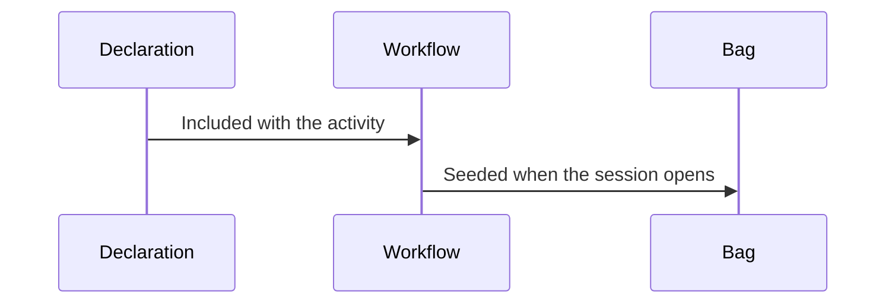

*Figure 1. A Declaration Is Gathered, Then Seeded.*

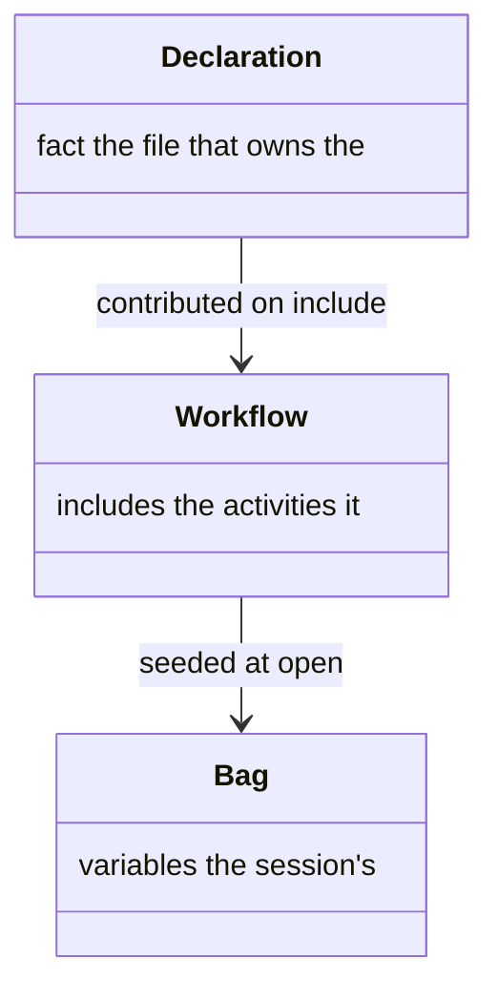

*Figure 2. Declaration, Workflow, and Bag.*

### Declared Where It Is Owned

The workflow file holds the facts a session starts with and the policy that spans its activities. Everything an activity produces is declared by that activity, beside the reads it needs (Figure 3). The workflow file and the activity file are the two homes (Figure 4).

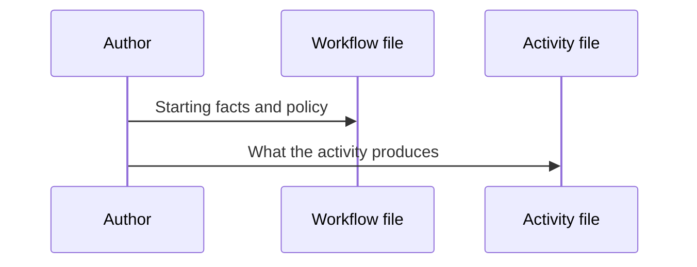

*Figure 3. Each Fact Is Declared Where It Is Owned.*

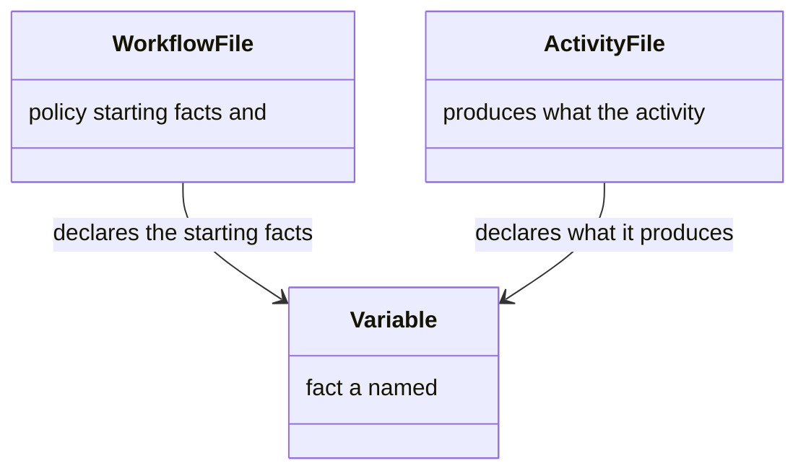

*Figure 4. Workflow File, Activity File, and Variable.*

`workflow.yaml` holds those starting facts. An activity declares what it produces under `variables.writes`, beside the reads it needs.

```yaml
variables:
  - name: needs_migration
    type: boolean
    defaultValue: false
  - name: planning_folder_path
    type: string
    required: true
```

### How the Lists Become One

Including an activity in a workflow's graph contributes its write declarations to that workflow (Figure 5). The workflow's list and the activity's list are one set by the time the workflow loads (Figure 6). An activity that two workflows run states its needs once, in the file that holds it.

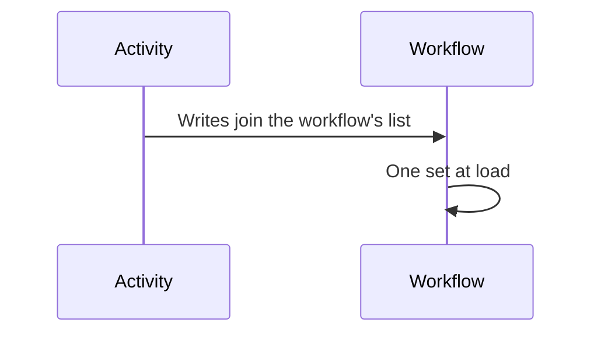

*Figure 5. An Activity's Writes Join the Workflow's List.*

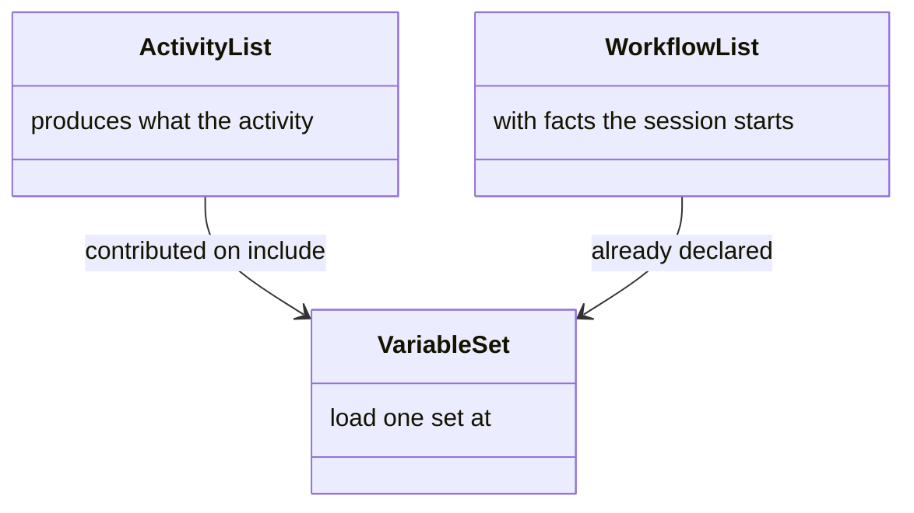

*Figure 6. Activity List, Workflow List, and the One Set.*

Two declarations of one name that disagree about type, starting value or value set describe two different variables under one name. The workflow does not load, and the disagreement is named.

#### Silence Is No Opinion

A declaration saying nothing about a starting value agrees with one that names it, and the named value is what the session seeds. So a variable gains its starting value at the one site that owns the policy, without every other site having to repeat it.

### Seeding at Session Creation

The bag is empty until the session opens, and then it holds every declared starting value (Figure 7). The combined declarations and the bag are the pieces (Figure 8).

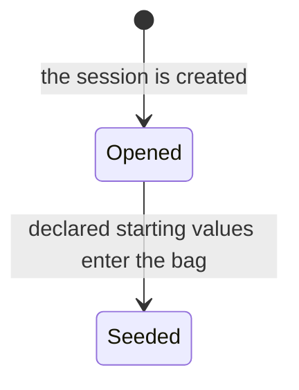

*Figure 7. The Bag Is Seeded When the Session Opens.*

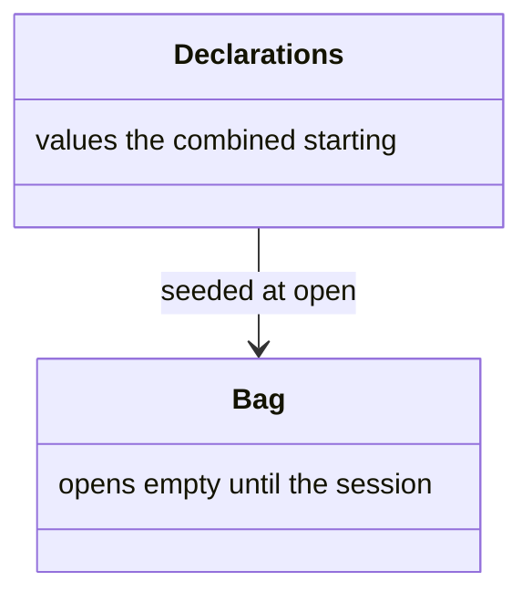

*Figure 8. Declarations, and the Bag They Seed.*

The server seeds every declared default from the combined set when the session opens: at `start_session` for a top-level session, and at `dispatch_child` for an embedded child, which seeds from the child workflow's own declarations. The seeded map is recorded as a single `variables_seeded` event.

Seeding at creation keeps the orchestrator's copy of the state and the server's bag in agreement from the first call, so `get_workflow_status` returns the seeded values rather than an empty map.

### Absence Carries Meaning

A variable with no declared default stays absent until something writes it (Figure 9). Absence is what a gate can test (Figure 10).

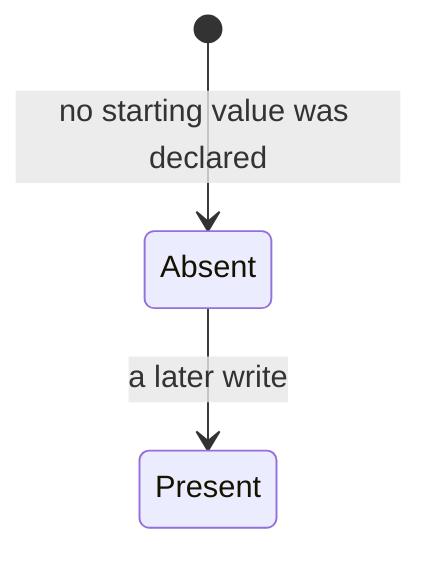

*Figure 9. A Variable Stays Absent Until a Write.*

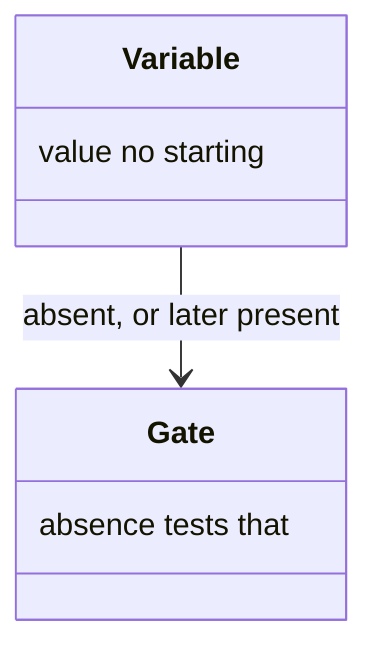

*Figure 10. A Variable With No Starting Value, and the Gate That Tests It.*

That absence is what an `exists` or `notExists` gate tests. Gating a defaulted variable that way asks a question with only one possible answer, so `check:variable-model` reports it.

### What the Server Does Not Check

A declared type is one of `string`, `number`, `boolean`, `array` or `object`, and types are advisory. A write that disagrees with one is stored as written and surfaced in `_meta.validation`. Marking a variable `required` is authoring metadata the server does not act on.

## How State Changes

After seeding, a checkpoint answer and a worker's output are what write the bag, and both go through the same server routine (Figure 11). The bag is the union of what the user decided and what the workers found (Figure 12).

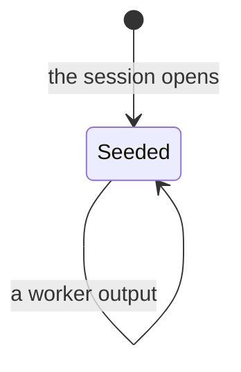

*Figure 11. After Seeding, a Checkpoint Answer or a Worker Output Writes the Bag.*

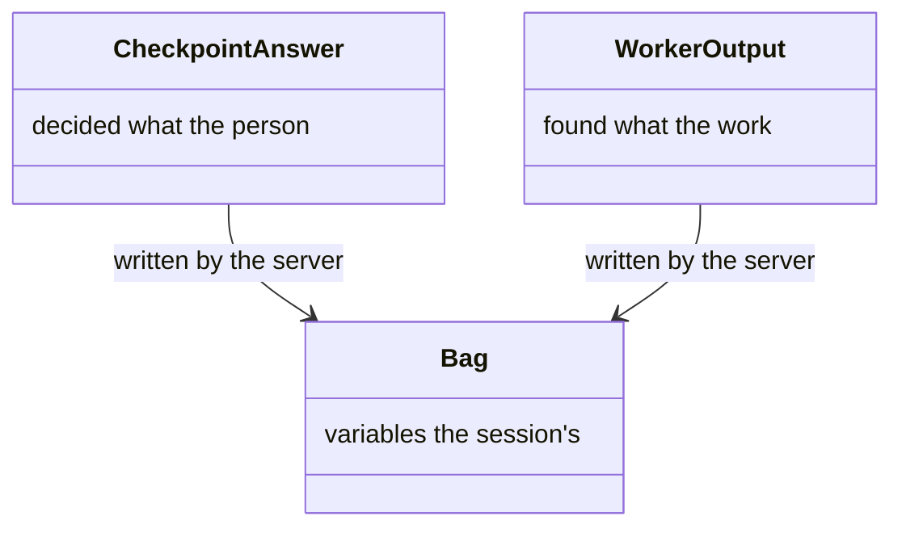

*Figure 12. Bag, Checkpoint Answer, and Worker Output.*

### An Answer at a Checkpoint

A worker that reaches a checkpoint pauses, and the question travels up to the user-facing agent (Figure 13). The option the person picks may write a variable, and that write is the effect (Figure 14). The chain is [dispatch](dispatch.md).

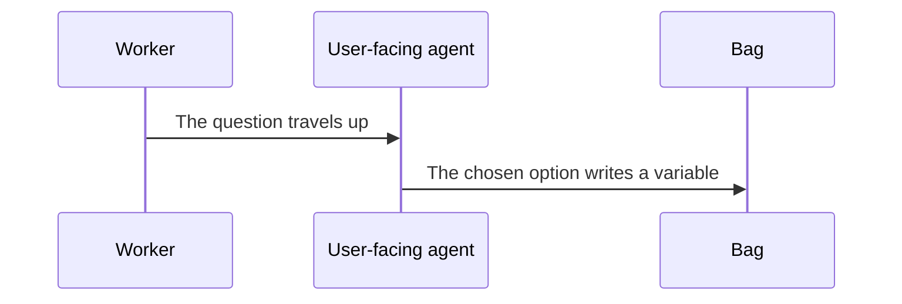

*Figure 13. A Checkpoint Answer Writes a Variable Into the Bag.*

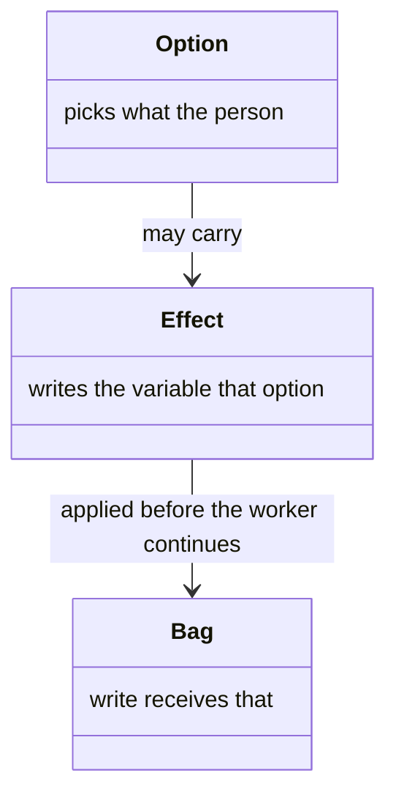

*Figure 14. Option, the Effect It Carries, and the Bag.*

```json
"effect": {
  "setVariable": { "needs_migration": true }
}
```

The user-facing agent passes the update down to the orchestrator, which applies it to its own copy of the state before passing it on to the worker.

### A Worker's Outputs

A worker that finishes an activity names the variables its work settled, and the server writes them on the transition (Figure 15). The worker's result and the bag are the pieces (Figure 16).

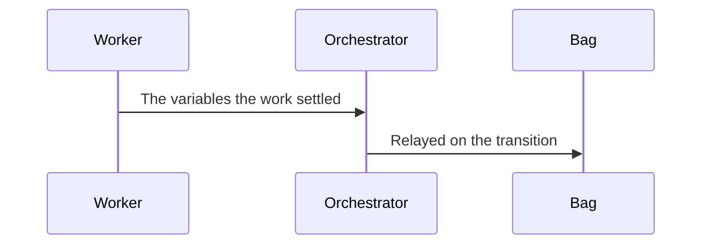

*Figure 15. A Worker's Outputs Are Written on the Transition.*

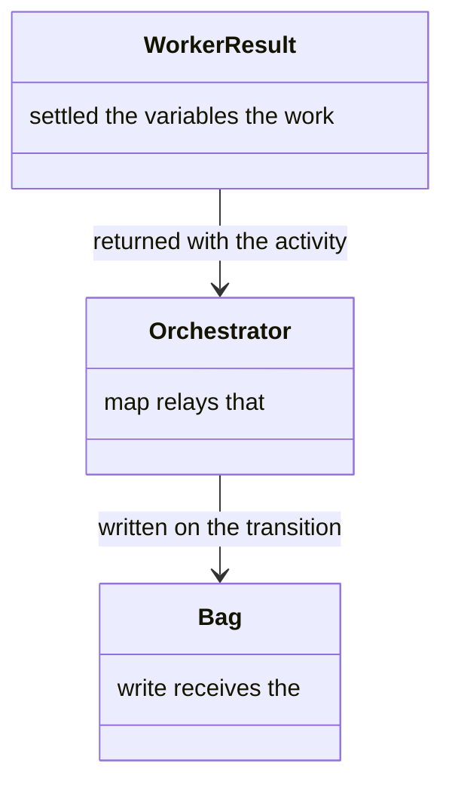

*Figure 16. Worker Result, Orchestrator, and Bag.*

The orchestrator relays that map verbatim as `next_activity`'s `variables_changed`, and the server writes it into the bag, recording one `variable_set` event per name against the activity being left.

Because those outputs land in the bag rather than in a prompt, `get_workflow_status` and `inspect_session` report the state the run actually reached, and an orchestrator that has lost its context window recovers that state from the server.

An action step is carried out by the worker rather than by the engine, so the way its result reaches the bag is the worker reporting it among these outputs.

<a id="choosing-the-next-activity"></a>

## Choosing the Next Activity

An activity that is complete names the exit it reached. The graph says where that exit leads (Figure 17). The exits and the graph are the two halves (Figure 18).

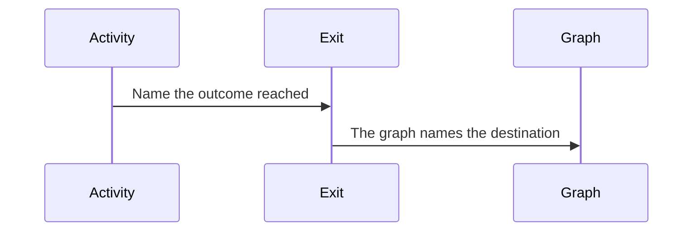

*Figure 17. An Exit Is Named, Then the Graph Says Where It Leads.*

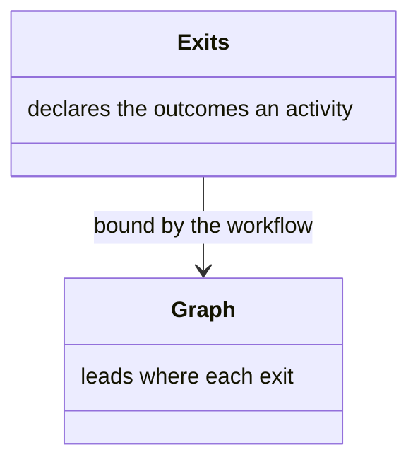

*Figure 18. Exits, and the Graph That Binds Them.*

### Decision and Destination

An activity that is complete names the outcome it reached, from the outcomes it declares:

```yaml
exits:
  - id: migration
    when: needs_migration == true
  - id: standard
    isDefault: true
```

The workflow that runs the activity says where each outcome leads:

```yaml
graph:
  detect-layout:
    migration: migrate-layout
    standard: analyse-sources
```

### How the Orchestrator Decides

The orchestrator tests the exits in order, takes the first whose condition holds, and otherwise takes the default (Figure 19). A checkpoint option that names an exit wins over that test (Figure 20).

```mermaid
stateDiagram-v2
  [*] --> Evaluating
  Evaluating --> Chosen: the first condition holds
  Evaluating --> Default: no condition holds
  Chosen --> Next: the graph names the destination
  Default --> Next: the graph names the destination
```

*Figure 19. The First Condition That Holds Chooses the Exit. Otherwise the Default.*

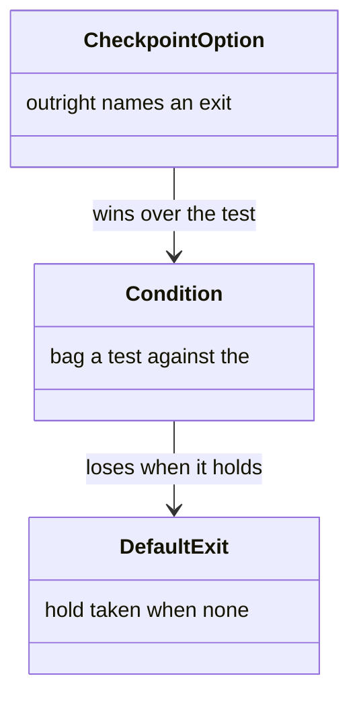

*Figure 20. Condition, Default Exit, and a Checkpoint Option.*

It then reads the destination from the graph and calls `next_activity` with that id, reporting the exit it took as the `exit` parameter. It asks neither the user nor the model, which is what the declared form is for.

An exit's `when` is the same inline expression a step gate uses: comparisons with `==`, `!=`, `>`, `<`, `>=` and `<=`, bare identifier truthiness, unary `!`, and `&&` / `||` with parentheses.

### Each Audience Gets What It Acts On

The orchestrator receives the whole graph. The worker receives only its own activity's row (Figure 21). The graph and that row are the pieces (Figure 22).

```mermaid
sequenceDiagram
  participant Server
  participant Orchestrator
  participant Worker
  Server->>Orchestrator: The whole graph
  Server->>Worker: That activity's row of it
```

*Figure 21. The Orchestrator Gets the Graph. The Worker Gets Its Row.*

```mermaid
classDiagram
  class Graph {
    destination every exit and
  }
  class ActivityRow {
    lead where this activity's exits
  }
  Graph --> ActivityRow : the worker's share
```

*Figure 22. Graph, and the Activity's Row of It.*

`get_workflow` gives the orchestrator the whole graph. `get_activity` gives the worker its own activity's row of it, as `exit_destinations` — the destination each declared exit leads to, exactly as the graph names it: an activity id, `__terminal__`, a list of members, or one activity together with the collection it runs over.

So a worker selects its exit from the predicates in front of it and reports that destination unread, rather than reaching for a tool its role does not hold. A checkpoint option may name an exit too, and `present_checkpoint` resolves it through the same graph, which is how the orchestrator states each option's consequence before the user chooses.

### What the Split Buys

Splitting the two halves lets one activity sit in two workflows. A workflow that reuses another's activities binds their exits in its own file, so it can place them in a different order without editing files it does not own.

It also lets an outcome end the run: a graph may send an exit to `__terminal__`, which completes the session without landing on an activity.

### Leaving an Activity Early

The steps run until an immediate exit is chosen, and then they stop (Figure 23). The exit and the remaining steps are the pieces (Figure 24).

```mermaid
stateDiagram-v2
  [*] --> Stepping
  Stepping --> Stepping: the next step
  Stepping --> Ended: an immediate exit is chosen
```

*Figure 23. An Immediate Exit Ends the Steps.*

```mermaid
classDiagram
  class ImmediateExit {
    checkpoint chosen at a
  }
  class Steps {
    ahead the sequence still
  }
  ImmediateExit --> Steps : ends them
```

*Figure 24. Immediate Exit, and the Steps It Ends.*

An exit may be declared `immediate`. Selecting one at a checkpoint ends the activity's step sequence there, so a user who aborts does not then watch the remaining steps run. The step-manifest check reads the recorded exit and accounts for the steps it skipped.

## Varying the Path

A variable set early marks the variant, and later exits and step gates read it (Figure 25). The variable and those gates are the pieces (Figure 26).

```mermaid
stateDiagram-v2
  [*] --> Marked: a step or a checkpoint sets the variable
  Marked --> Skipped: an exit or a step gate reads it
  Marked --> Taken: an exit or a step gate reads it
```

*Figure 25. A Variable Set Early Steers Later Exits and Gates.*

```mermaid
classDiagram
  class Variable {
    variant marks the
  }
  class Exit {
    path reads it to choose a
  }
  class StepGate {
    step reads it to skip a
  }
  Variable --> Exit : lives in the one bag
  Variable --> StepGate : lives in the one bag
```

*Figure 26. Variable, Exit, and Step Gate.*

A workflow varies its path through ordinary state rather than through a mechanism of its own. A boolean set early, by a detection step or by a checkpoint, marks the variant, and exit predicates and step gates branch on it to skip or redirect activities. Because the variable lives in the single bag, the variant persists across activities without anything carrying it. A review mode, an update mode, a dry run — each is built this way rather than by a mode switch the engine knows about.

<a id="opening-a-session"></a>

## Opening a Session

A new session is opened, or a named planning folder resumes the one already there (Figure 27). A session index is not the only thing a call can return (Figure 28).

```mermaid
sequenceDiagram
  participant Agent
  participant Server
  Agent->>Server: Open a session, or name a planning folder
  Server-->>Agent: A session index, or a decision
```

*Figure 27. A Session Is Opened, or an Existing One Is Resumed.*

```mermaid
classDiagram
  class SessionIndex {
    opened the run that was
  }
  class Decision {
    yet the server cannot open one
  }
  class CatalogMatch {
    index a client returned with the
  }
  Decision --> SessionIndex : not both
  CatalogMatch --> SessionIndex : returned beside it
```

*Figure 28. Session Index, a Decision, and a Catalog Match.*

`start_session` opens a top-level session, defaulting to the `meta` workflow. Pass `working_directory` as the checkout under work: the server derives `owner/repo` from that checkout's origin, even when the folder is named for a branch. `repo` is optional, and must equal the derived origin when supplied.

A named `planning_folder` resumes an existing session. Where a derived dated slug already holds one, the server opens the next free numbered folder rather than joining it. `user_request` seeds the opening request into the variable bag, and children inherit it.

### What Comes Back Instead of a Session

Not every call returns a session index.

| Response | When |
|----------|------|
| `client` beside the session | A unique catalog match, with no resume phrasing in the request |
| A `decision`, and no `session_index` | A durable meta start that cannot uniquely open a client. The decision is `workflow-selection` or `resume-session` |

Every response carries `execution_path`: `agent` where a caller walks the definition, `runner` where the server does.

<a id="persistence"></a>

## Persistence

<a id="the-planning-folder"></a>

### Planning Folder

The code change stays in the workspace. The notes of the run stay in the planning folder the session opens (Figure 29). The workspace, the folder, and the state file are the pieces (Figure 30).

```mermaid
sequenceDiagram
  participant Session
  participant Workspace
  participant Folder as Planning folder
  Session->>Workspace: The code change stays here
  Session->>Folder: The notes, and the state file, stay here
```

*Figure 29. Notes and the State File Stay in the Planning Folder.*

```mermaid
classDiagram
  class Workspace {
    change the code
  }
  class PlanningFolder {
    run the notes of the
  }
  class StateFile {
    folder the session, in that
  }
  PlanningFolder --> StateFile : holds
  Workspace --> PlanningFolder : does not hold the notes
```

*Figure 30. Workspace, Planning Folder, and State File.*

Session files live under the engineering root rather than under the feature worktree. Where that folder sits is the workspace [project layout](https://github.com/m2ux/workflow-server/blob/workspace/docs/layout.md#a-sessions-notes). The [slug](configuration.md#root-binding) overrides the `artifacts/planning` segment. How the server is pointed at the two roots is [root binding](configuration.md#root-binding).

The folder holds a `README.md` a person can open to see what the work is and how far it has got. Documents an activity produces are written here and nowhere else. How those documents are named is in [naming](delivery.md#how-documents-are-named). The history of tool calls lives in the state file. How that history is recorded and read back is in [fidelity](fidelity.md).

The `README.md` carries a Progress table. The orchestrator marks a row in progress before it hands the activity to a worker, and complete once that activity's work is committed. The worker reports the documents it produced. It does not edit the table. The table still advances when a worker is lost and replaced.

### Session Files

The server writes the state file, then the seal, on every authenticated call (Figure 31). Those two files are the pieces (Figure 32).

```mermaid
sequenceDiagram
  participant Server
  participant StateFile as State file
  participant Seal
  Server->>StateFile: Write the session
  Server->>Seal: Bind those bytes
```

*Figure 31. The State File Is Written, Then the Seal.*

```mermaid
classDiagram
  class StateFile {
    plaintext the session, in
  }
  class Seal {
    key binds those bytes to the
  }
  Seal --> StateFile : checked on every read
```

*Figure 32. State File, and the Seal on It.*

The server owns the canonical session state and writes it to disk atomically. Agents hold a six-character session index, derived deterministically from the planning slug, and nothing else. They neither read nor write the state themselves. Each session folder holds two files:

* **`session.json`** is the state file, validated against the [schema](../schemas/session-file.schema.json). It holds where the run has got to, what it decided, and what it did — the workflow and version it started against, the variable bag, the activities completed and skipped, the checkpoint responses, the history, any launched children, and for a child, a snapshot of its parent. A person can read it, and it is reproducible from the workflow definition. Read the schema for the field-by-field shape rather than a list here, which would drift from it.
* **`.session-token`** is the seal, binding those exact bytes to the engineering root and to the server's signing key. The server verifies it on every read, and a disagreement fails the read. What the seal does and does not prove is in [fidelity](fidelity.md#layer-1-session-integrity).

### Writes Against One Session

A write lands only while the state file still holds the bytes the call read. Otherwise the call is refused and nothing is written (Figure 33). The bytes read and the write are the pieces (Figure 34).

```mermaid
stateDiagram-v2
  [*] --> Holding: the call read these bytes
  Holding --> Written: the file still holds them
  Holding --> Refused: the file has moved on
```

*Figure 33. A Write Lands Only While the File Still Holds the Bytes It Read.*

```mermaid
classDiagram
  class BytesRead {
    saw what the call
  }
  class Write {
    composed the change it
  }
  class StateFile {
    matches replaced only while it
  }
  BytesRead --> StateFile : must still be these bytes
  Write --> StateFile : refused when they are not
```

*Figure 34. Bytes Read, the Write, and the State File.*

Writes are atomic and ordered — the state file first, then the seal — and a read verifies the seal before returning anything.

A call whose file has moved on since is refused with `STALE_WRITE`, and nothing is written, so two calls in flight against one session end with one refused rather than one silently discarded.

That pairing is ordinary rather than exotic, because a parent and its launched children live in a single file with the child's state inside its parent's. A parent recording a figure while one of its children advances is two writes against the same bytes.

#### A Refusal Is the Caller's to Retry

The server does not retry on the caller's behalf, because the change a call composed is the caller's, and re-deriving it is a call rather than a write.

The error text tells the agent to make the same call again, and states that nothing was written. That is the fact deciding whether an agent retries or stalls: it can tell that repeating records once rather than twice. The repeat reads the state as it then stands. An orchestrator keeping one call in flight per session never meets this.

### Pause, Stop, Resume

A running session can pause or stop, and resume returns it to the same place (Figure 35). The state file, not the agent's memory, holds that place (Figure 36).

```mermaid
stateDiagram-v2
  [*] --> Running: the session opens
  Running --> Paused: the agent stops
  Running --> Stopped: the agent stops
  Paused --> Running: resume reads the state file
  Stopped --> Running: resume reads the state file
```

*Figure 35. Pause or Stop, Then Resume at the Same Place.*

```mermaid
classDiagram
  class StateFile {
    reached the place the run has
  }
  class Agent {
    index holds only the session
  }
  StateFile --> Agent : resume returns the same index
```

*Figure 36. State File, and the Agent That Holds the Index.*

Because the state lives in the file rather than in an agent's context, a session can pause, stop or resume without losing its place.

Resume is a single call, `start_session({ agent_id, planning_folder })`: the server loads the file, verifies the seal, and returns the same index. A server restart is transparent, and there is no adoption or recovery step for an agent to perform.

The install script on the `docker` branch creates the host layout, and product checkouts live under `HOST_PROJECTS_ROOT`, for which [setup](setup.md) has the sequence.
