# Technique

A **technique** is a reusable capability file: what it does, what it needs, the ordered steps to follow, and any rules that hold across them. An author writes one when an **activity** — one phase of a **workflow**, the guide an operator follows — needs the agent to act the same way at more than one step. A **step** is the place in that activity that names the technique.

A **protocol** is the ordered work. A **rule** is an invariant that holds across the technique, not one action. An **input** is a value the caller supplies. An **output** is a value the technique exposes when it finishes. A **reference** is the name a step uses to reach a technique or a rule. A **nested technique** is a technique inside another's folder, and it is itself a technique.

A **contract** is the inputs, outputs, and rules a folder shares with the techniques it contains. A **bundle** is what the server then sends: each technique's own body, the contracts beside it, and the role's rules. A **protocol variable** is a value one step produces for a later step in the same protocol, and it is not part of the interface. A **symbol** is a rule named by walking its ancestry, without invoking anything. How an id is spelled is the [identifier conventions](https://github.com/m2ux/workflow-server/blob/workflows/docs/README.md). The fields a workflow file declares are the [schema](schemas.md). The [calls](api.md) that deliver a technique are in the tool catalog.

## File Layout

A file is a standalone technique, a folder index, or a nested file, and the loader reads it as the technique that path names (Figure 1). Those shapes are the pieces (Figure 2).

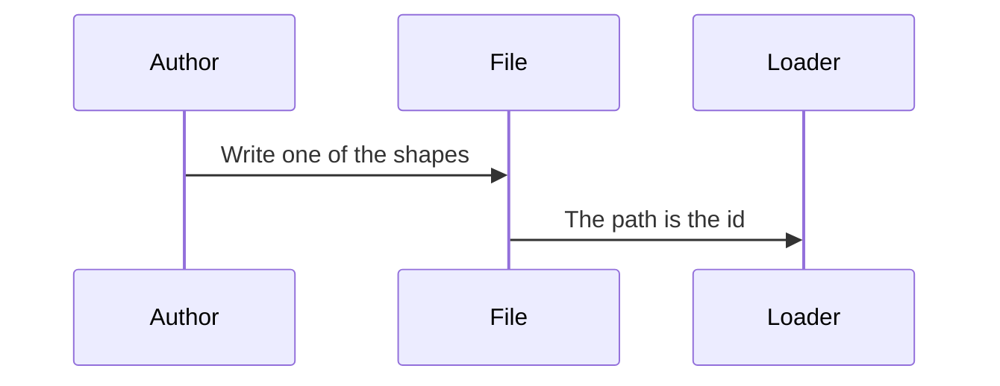

*Figure 1. A Path Names the Technique the Loader Reads.*

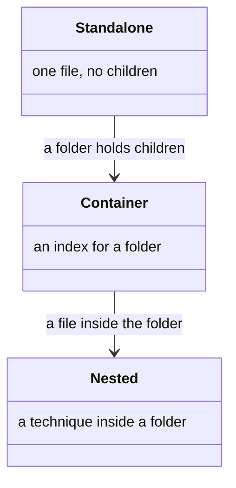

*Figure 2. Standalone File, Container Index, and Nested Technique.*

| Shape | Path | Role |
|-------|------|------|
| Standalone | `<wf>/techniques/<id>.md` | A technique with no children |
| Container | `<wf>/techniques/<group>/TECHNIQUE.md` | The group technique; its folder holds child techniques |
| Nested | `<wf>/techniques/<group>/<id>.md` | A technique within that group, at any depth |

The id `TECHNIQUE` at the root of a workflow's `techniques/` directory is the workflow-root technique. It is the ancestor of every technique in that workflow, it carries shared contract, and it is excluded from the addressable list. An unprefixed reference resolves against the current workflow first, then the shared meta layer.

<a id="file-anatomy"></a>

## File Anatomy

The file is read as a capability, an interface, a protocol, and rules (Figure 3). Those are the pieces (Figure 4).

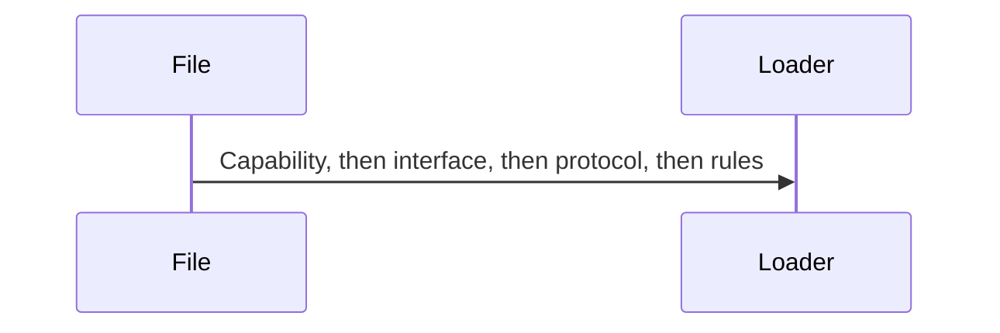

*Figure 3. A File Is Read as Capability, Interface, Protocol, and Rules.*

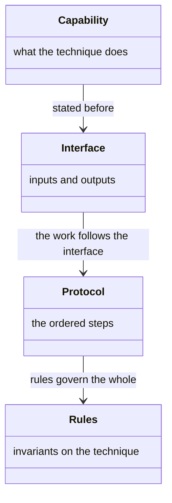

*Figure 4. Capability, Interface, Protocol, and Rules.*

Frontmatter declares `metadata.version`, and the loader uses it as the technique's version. `## Capability` is a single paragraph stating what the technique does. The file has no title heading. The section headings are Capability, Inputs, Outputs, Protocol, and Rules, in that order, each at most once.

#### Sample File

```markdown
---
metadata:
  version: 1.0.0
---

## Capability

<one paragraph: what this technique does>

## Inputs
### <input-id>
<description>

## Outputs
### <output-id>
<description>

## Protocol
### <Title>
- <imperative step>

## Rules
### <rule-name>
<rule text>
```

<a id="inputs-and-outputs"></a>

### Inputs and Outputs

Each `###` heading under Inputs or Outputs is an entry: a description, and optional `####` members. The headings are the plurals `## Inputs` and `## Outputs`. The loader rejects a singular heading.

* `#### <member>` is a named component of the entry.
* `##### <field>` under an output is a field one entry of that component carries, where the component holds a list. A component with fields becomes an object. One without stays the description string. A loop's item name appears in no signature, so without the declaration a step reading a field of that item is a claim nothing can settle.
* `#### entry` is reserved, for an output that is a list rather than a value with parts. Its `#####` children are the fields one entry carries. Reserving the name keeps `####` meaning a part of the value everywhere else.
* `#### artifact` is the persistence filename: a literal, or a `{token}` template the worker fills in. One filename per output, one path segment ending in an extension. A technique that writes several files declares one output per file.
* `#### audience` is who reads the output: `human` or `agent`. Absent means `human`. An agent artifact is JSON on disk. A human artifact is prose.
* `#### values` is the closed set the output admits. Backticked tokens in the body are the output's own set. `#####` children are the set one field admits.
* `#### default` is an input's default value.
* An entry whose description opens with `optional` is not required.

#### Audience

Pick the audience from who reads the artifact.

* **Agent** — written only for the next agent to consume as state: tables that carry ids, routing or index state, anything a later step reads back.
* **Human** — a person reads it linearly: a design write-up, a summary, a README.
* **Absent** — human, the case when the declaration omits audience.

An agent artifact carries no prose narrative and does not restate another artifact. A human artifact states a thing once and links the rest. The declaration says who reads the artifact as it exists. It does not fix the shape of a particular payload. That shape belongs to the artifact's own guide.

#### Symbols

A technique has one namespace of mutable symbols, and direction is structural. An input is populated on entry. An output is exposed on completion. A protocol variable is neither. A symbol may be declared as both an input and an output, so a value one technique produces can be hoisted to a common ancestor as a shared input, with the producing technique also declaring it as an output.

<a id="protocol"></a>

### Protocol

`## Protocol` is an ordered list of blocks. A `###` heading is a titled block, and its bullets are the block's steps. A flat list is one untitled block. Titled blocks group phases. A flat list suits an atomic procedure. A title carries no composition meaning.

A step is an imperative action the agent performs. A standing prohibition is not a step. A constraint that governs the technique is a rule. A constraint that qualifies one step folds into that step, or sits in a blockquote note immediately beneath the bullet. An indented sub-bullet is read as a new step. A genuine enumeration may stay a sub-bullet.

<a id="protocol-variables"></a>

### Protocol Variables

A step binds an intermediate value, and later steps read it (Figure 5). The binding, the later read, and the interface it is not part of are the pieces (Figure 6).

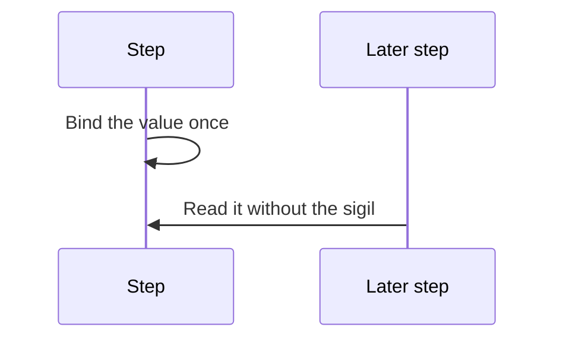

*Figure 5. One Step Binds a Value. Later Steps Read It.*

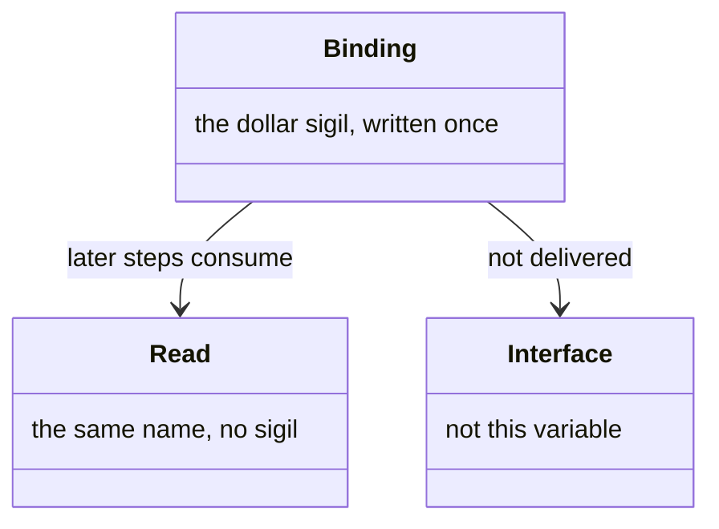

*Figure 6. Binding, Later Read, and the Interface.*

The binding carries the dollar sigil, `{$name}`, and marks the single point where the value is produced. Every later reference drops the sigil and reads `{name}`. The sigil is the act of declaration, written once.

A protocol variable is scoped to one protocol run. It is not delivered in the bundle and is not addressable by a reference. The binding must textually precede every read. Where a value is produced in mutually exclusive branches, each producing branch carries the sigil. Reads after the branches rejoin stay bare.

A value the technique computes itself is a protocol variable, never an input. A value a caller consumes is an output, never a protocol variable. A read that nothing binds is an unbound local. A binding that nothing reads is a dead binding.

Every reference is written in backticks, so the sigil sits inside a code span. A literal dollar sign left in prose outside code is escaped. One already inside a code span stays raw.

<a id="rules"></a>

### Rules

A `###` heading under `## Rules` is an invariant that governs the technique as a whole. A rule lives at the smallest scope that covers everything it governs.

* A constraint specific to one step belongs in that step.
* A constraint a protocol step already states is not restated as a rule.
* A constraint shared by sibling techniques belongs on their common container, which delivers it by inheritance.
* A constraint that governs only one child belongs on that child.

A rule name is kebab-case and states the invariant as a positive assertion. How that name is spelled is the [identifier conventions](https://github.com/m2ux/workflow-server/blob/workflows/docs/README.md).

### Error Handling

An error arises from a specific step, so its handling lives in that step: the failure condition and the recovery, inline. A recovery that applies another technique names it inline, as any protocol reference does.

## Addressing

A reference is parsed, then located in the current workflow or the one it names (Figure 7). The reference, the technique, and a rule on it are the pieces (Figure 8).

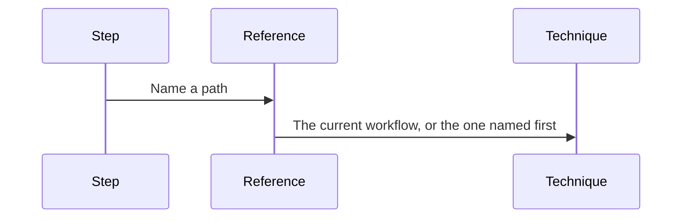

*Figure 7. A Reference Is Parsed, Then Located.*

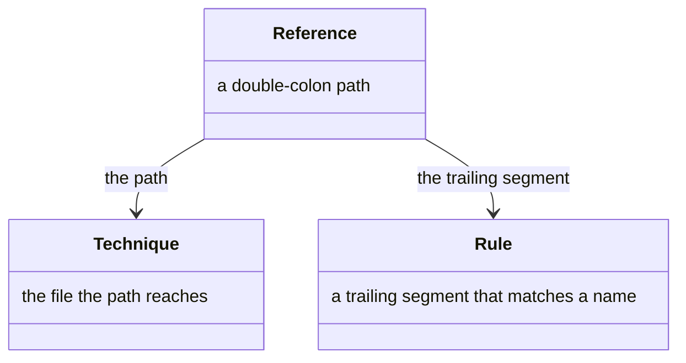

*Figure 8. Reference, Technique, and Rule.*

#### Reference Path

```
[<workflow>::]<technique>[::<nested>…]
```

* The workflow is implicit for a same-workflow reference. A leading workflow name targets another workflow, when the corpus declares one of that name and at least one segment follows. Otherwise every segment is a path inside the referring workflow's own techniques directory.
* The technique segment delivers the technique itself.
* Further segments address a technique inside that folder. Depth is unbounded.
* A trailing segment matching a rule name resolves to that rule. A group prefix expands to every rule whose name begins with that prefix.
* A slash form spells the same workflow prefix. The slash appears once, before the technique, and names a workflow.
* A reference with an empty segment, or a slash anywhere else, addresses no file and is refused at load.

### Executable Reference and Symbol

A double-colon path invokes a technique. A dotted path names a symbol (Figure 9). The two forms are the pieces (Figure 10).

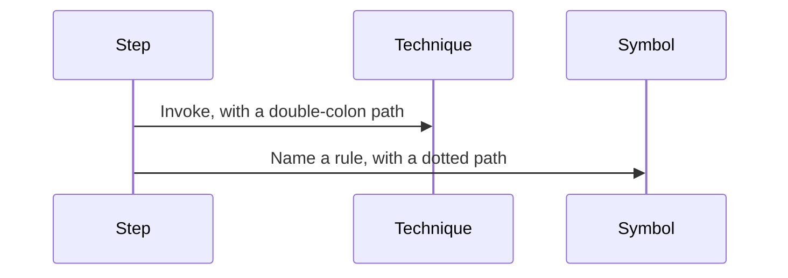

*Figure 9. A Double-Colon Path Invokes. A Dotted Path Names.*

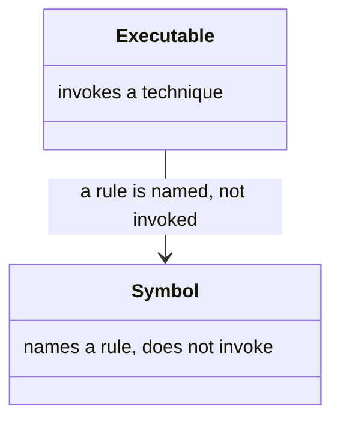

*Figure 10. Executable Reference and Symbol Reference.*

A protocol step that cites a rule uses the dotted address. When the rule is in the citing technique's own ancestry, the reference shortens to the bare rule name. The full path is needed only to reach a rule outside that ancestry.

### Invocation Arguments

Arguments are written in parentheses attached to the reference, never in curly braces. Braces are reserved for a designator: an input, an output, or a protocol variable. Inside the parentheses, a value that is itself a variable keeps its braces. A literal stays bare. The argument keys are the technique's own parameter names.

### Backticks

Every literal code-like token in prose is written in backticks: a designator, a symbol address, a command, a tool call, a resource URI, a path. A token already inside a larger code span is not wrapped again. A token that contains a designator is one span, with the braces inside it. A hyperlink, and the target of an executable or symbol reference, carries its own markup and is not backticked. A code token left un-backticked in prose is a defect. A token with backticks but no braces is still an unanchored reference.

## Contract Inheritance

Ancestors contribute shared inputs, outputs, and rules, and the technique's own entry wins on the same id (Figure 11). The ancestor contract and the local technique are the pieces (Figure 12).

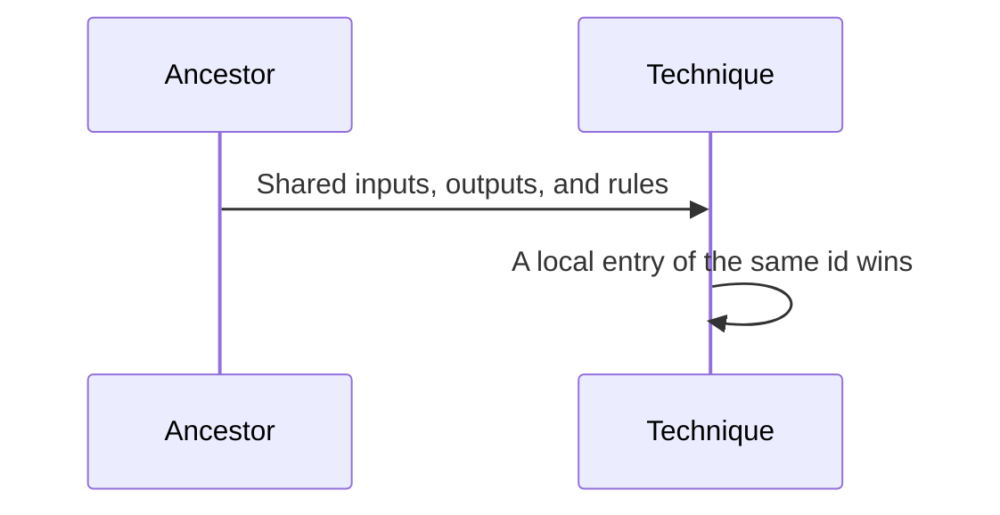

*Figure 11. Ancestors Contribute a Contract. The Local Entry Wins.*

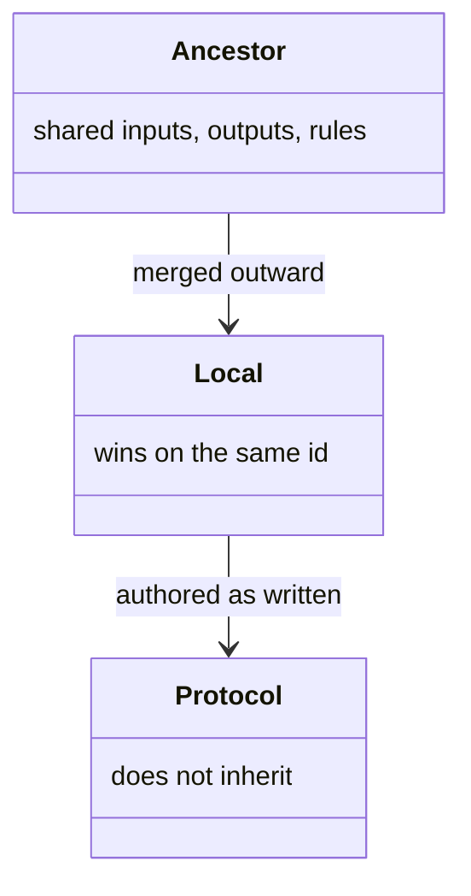

*Figure 12. Ancestor Contract, Local Entry, and Protocol.*

### What Merges

Both delivery paths use the same composition. In memory the merge is complete. On the wire:

* Inputs and outputs are merged from every ancestor outward to the executing workflow root. The local entry overrides an ancestor entry of the same id. Own entries ride the body. Ancestor entries ride that ancestor's block under contracts.
* Rules are merged the same way. Own rules ride the body. Shared rules ride contracts. Role-level rules that govern no one technique remain entries in the bundle's rules list.

A container contributes a contract, never a procedure. Protocol does not inherit. A technique's protocol is delivered as authored.

### Whose Ancestors Count

Ancestry follows the executing workflow: its root technique file, and each containing group's index along the path. Containers from a different workflow are not included. Only the executing workflow's containers apply.

## Delivery

Composition gathers the body and the contracts, and the bundle is what travels (Figure 13). The body, the contracts, and the role rules are the pieces (Figure 14).

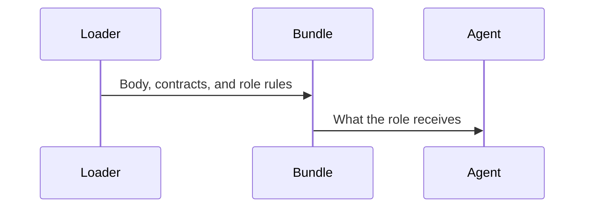

*Figure 13. Composition Becomes the Bundle the Agent Receives.*

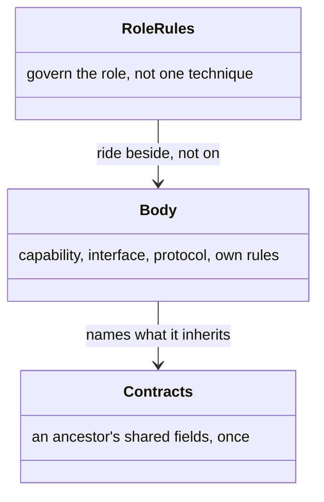

*Figure 14. Body, Contracts, and Role Rules.*

### Body

A delivered body carries the capability, the inputs as authored on that technique, the protocol, the outputs, the rules that technique itself declares, and the names of the ancestor scopes whose contracts ride beside it.

### Bundle

| Key | Contents |
|-----|----------|
| `techniques` | Each delivered body, keyed by path. A nested technique by its full reference, a standalone by its id. Own rules ride the body. |
| `contracts` | Each ancestor's rules and shared inputs and outputs, once per scope. |
| `rules` | The role's own rules, which govern no one technique. |
| `unresolved` | References that did not resolve. A non-empty list is a definition defect. |

An activity load and a workflow load deliver the activity's technique list through this bundle. Asking for one technique delivers that body and the contracts beside it. Which call does which is in the [catalog](api.md).

### Binding

The engine binds by name: session variables a worker sets from a technique's result, and the entry ids a consumer references. Components document an entry's shape. Fields beneath a component document what one entry of it carries. A consumer references an entry by its id. A read that names a member nothing declares is reported.

### Step Manifest

A worker reports what a step produced through the manifest entry passed when the activity advances, one entry per completed step. The output is an object keyed by the output id the technique declares. A key the technique does not declare lands a value under a name nothing downstream reads, and is surfaced on the response. A declared id with no key is not reported: an output can be optional, and a gated path produces fewer values than the declarations allow.

An output lands in the session under its declared id, unless the step binding remaps it. In that case the delivery of that technique annotates the output with the session variable it lands under.

## Authoring

The interface stays free of any one workflow. The full set is the [anti-patterns](https://github.com/m2ux/workflow-server/blob/workflows/docs/README.md). What binds a technique file:

* An input or output describes what a value is. A technique names another technique only in the protocol or the capability, as utilisation.
* A protocol references data by its input or output id. An artifact filename lives in the artifact declaration, one filename per output.
* A capability states what a construct is. The sequence of steps lives in the protocol.
* A protocol step is an action. A standing prohibition is a rule, or a guard folded into the step it qualifies.
* A behavioral constraint is a rule. It lives at the smallest container that covers what it governs.
* A resource describes what it is. It does not name the techniques that use it.
* An identifier's alphabet and grammatical shape both carry meaning. That spelling is the [identifier conventions](https://github.com/m2ux/workflow-server/blob/workflows/docs/README.md).

## Validation

The server validates every parsed technique before delivery. On failure it logs a warning and treats the technique as unloadable. A technique declares a version and a capability. A technique that does work declares a protocol. A reference resolves to a technique or a rule. An unresolved entry in a bundle is a definition defect.

The file shape is normative, and the template guard enforces it: frontmatter carries the version and nothing else; no title heading; the five sections in order, with outputs before protocol; entry ids are snake case, and a mirror of a tool parameter may keep that tool's spelling; rule names are kebab-case; every protocol-variable binding is snake case. A navigation document inside a techniques directory is exempt.
