# Workflow Fidelity Enforcement

How the workflow server ensures agents follow workflows correctly.

## The Problem

AI agents executing multi-step workflows face two reliability challenges:

1. **Context degradation** — as conversations grow, earlier instructions (including workflow definitions) fall out of the model's effective attention window, leading to skipped steps, wrong transitions, and hallucinated procedures
2. **Behavioral drift** — without enforcement, agents may take shortcuts, skip checkpoints, or fabricate state rather than following the defined execution path

The workflow server addresses these through seven layers of enforcement, each operating at a different granularity.

## Enforcement Layers

```
┌─────────────────────────────────────────────┐
│  Layer 1: Token Integrity (HMAC)            │
│  Every call — prevents fabrication           │
├─────────────────────────────────────────────┤
│  Layer 2: Checkpoint Gate                    │
│  At transitions — blocks until resolved      │
├─────────────────────────────────────────────┤
│  Layer 3: Cross-Activity Validation          │
│  Between activities — checks consistency     │
├─────────────────────────────────────────────┤
│  Layer 4: Transition Condition Tracking      │
│  At transitions — verifies condition logic   │
├─────────────────────────────────────────────┤
│  Layer 5: Step Completion Manifest           │
│  Within activities — verifies completeness   │
├─────────────────────────────────────────────┤
│  Layer 6: Activity Manifest                  │
│  Across activities — tracks workflow journey  │
├─────────────────────────────────────────────┤
│  Layer 7: Execution Trace                    │
│  Entire session — mechanical audit trail      │
└─────────────────────────────────────────────┘
```

### Enforcement Flow

The following diagram shows a typical two-activity progression through a workflow, annotating where each enforcement layer activates. Hard gates (blocking) are marked with solid borders; advisory checks (warnings) are marked with dashed borders.

```mermaid
flowchart TD
    subgraph bootstrap [Session Bootstrap]
        startSession["start_session(agent_id)"]
        getWorkflow["get_workflow(session_index)"]
        startSession -->|"L1: HMAC signed token issued"| getWorkflow
    end

    subgraph actA [Activity A]
        nextA["next_activity(activity_id=A)"]
        cpGateA{{"L2: bcp populated\nwith required checkpoints"}}
        toolsBlocked["All tools BLOCKED\nexcept present_checkpoint\nand respond_checkpoint"]
        respondCp["respond_checkpoint\nfor each pending checkpoint"]
        cpTiming{{"L2: Timing enforced\noption validated against definition"}}
        bcpClear["bcp cleared — tools unblocked"]
        getTechnique["get_technique(step_id) + get_resource"]
        executeSteps["Execute activity steps"]
    end

    subgraph transition [Transition A to B]
        nextB["next_activity(activity_id=B,\nstep_manifest, activity_manifest,\ntransition_condition)"]
        hardGate{{"L2: bcp empty?\nHARD GATE"}}
        transCheck["L3: A→B in transition graph?"]
        condCheck["L4: condition matches table?"]
        stepCheck["L5: step_manifest complete?"]
        actCheck["L6: activity_manifest valid?"]
        tracePackage["L7: Trace token packaged\nfor Activity A"]
    end

    subgraph actB [Activity B]
        cpGateB{{"L2: bcp populated\nfor Activity B checkpoints"}}
        continueB["Resolve checkpoints,\nexecute steps..."]
    end

    getWorkflow -->|"L7: trace event"| nextA
    nextA --> cpGateA
    cpGateA --> toolsBlocked
    toolsBlocked --> respondCp
    respondCp --> cpTiming
    cpTiming -->|"Each checkpoint resolved"| respondCp
    cpTiming -->|"All checkpoints resolved"| bcpClear
    bcpClear --> getTechnique
    getTechnique -->|"L1: HMAC verified"| executeSteps

    executeSteps --> nextB
    nextB --> hardGate
    hardGate -->|"bcp non-empty"| toolsBlocked
    hardGate -->|"bcp empty"| transCheck
    transCheck -.-> condCheck
    condCheck -.-> stepCheck
    stepCheck -.-> actCheck
    actCheck --> tracePackage
    tracePackage --> cpGateB
    cpGateB --> continueB
```



**Legend:**
- Double-bordered nodes (`{{...}}`) are hard enforcement gates — they block execution until satisfied
- Dashed lines (`-.-`) indicate advisory validation that produces warnings but does not block
- `L1` through `L7` reference the enforcement layers described below
- Every tool call in the diagram verifies the HMAC signature (L1) and records a trace event (L7); only the first occurrence is annotated to avoid clutter

### Layer 1: Token Integrity

Every session token is HMAC-SHA256 signed using a server-held key. Default path is `~/.workflow-server/secret`. Override with `WORKFLOW_SERVER_KEY_DIR` (key file `<dir>/secret`) or `WORKFLOW_SERVER_STATE_DIR`. Docker `start.sh` mounts `$INSTALL/state` → `/var/lib/workflow-server` and sets `WORKFLOW_SERVER_KEY_DIR` so the key does not depend on `HOME` (non-root containers often have `HOME=/`). The token format is `<base64url-payload>.<hmac-signature>`.

The token payload carries:

| Field | Purpose |
|-------|---------|
| `wf` | Workflow ID — locks the session to a single workflow |
| `act` | Current activity — records the agent's position |
| `technique` | Last loaded technique — tracks technique usage |
| `cond` | Last transition condition — records the agent's claimed reason for transitioning |
| `v` | Workflow version — detects definition drift |
| `seq` | Sequence counter — increments on every call, ensuring uniqueness |
| `ts` | Creation timestamp |
| `sid` | Session UUID — uniquely identifies this execution session across all tool calls |
| `aid` | Agent ID — identifies which agent (orchestrator vs. worker) made the call |
| `bcp` | Active blocking checkpoint ID — gates activity transitions until resolved |
| `psid` | Parent session ID — for trace correlation when a workflow is dispatched from another |
| `pwf` | Parent workflow ID — for resume routing in dispatched workflows |
| `pact` | Parent activity — for resume routing in dispatched workflows |
| `pv` | Parent workflow version — for resume routing in dispatched workflows |

**What it enforces:**
- Agents cannot fabricate tokens — the server rejects any token it didn't issue
- Agents cannot tamper with token fields — modifying any field invalidates the signature
- Each tool call produces a new token with an incremented counter, ensuring tokens are unique per exchange
- The `sid` field binds all tool calls to a single session, enabling trace correlation
- The `aid` field distinguishes orchestrator from worker calls in multi-agent execution patterns
- The `bcp` field blocks activity transitions until the checkpoint is resolved via `respond_checkpoint`
- Parent context fields (`psid`, `pwf`, `pact`, `pv`) link dispatched child workflows back to their parent for trace correlation

**How it works:** The server verifies the HMAC signature on every tool call before processing. Invalid signatures cause immediate rejection — with one exception: `start_session` implements **token adoption** to handle server restarts gracefully. When a saved session token is passed to `start_session` but fails HMAC verification (because the server was restarted and generated a new signing key), the server decodes the payload without signature verification. If the payload is structurally valid and the workflow matches, the server re-signs it with the current key and returns `adopted: true` — the session state (ID, activity position) is fully preserved. If the payload is also corrupted, the server falls back to a fresh session and returns `recovered: true` — the previous state was NOT inherited and must be reconstructed from saved state. This recovery mechanism prevents the common failure mode where a server restart makes all saved tokens permanently unusable.

### Layer 2: Checkpoint Gate

When a worker yields a checkpoint via `yield_checkpoint`, the server embeds the checkpoint ID in the token's `bcp` field. The token then **hard-blocks** most tool calls until the checkpoint is resolved. `assertCheckpointsResolved()` is called in nearly every tool handler to enforce this gate.

**Tools exempt from the checkpoint gate:**
- `present_checkpoint` — the orchestrator needs this to read checkpoint details for resolution
- `respond_checkpoint` — this is the resolution mechanism itself

**Resolution via `respond_checkpoint`:**

The agent must call `respond_checkpoint` for each pending checkpoint, using exactly one of three resolution modes:

| Mode | When to use | Timing enforcement |
|------|-------------|-------------------|
| `option_id` | User selected an option | Minimum response time (default 3s since token timestamp) |
| `auto_advance` | Checkpoint declares `defaultOption` + `autoAdvanceMs` and the timer elapsed | Full `autoAdvanceMs` must elapse since token timestamp |
| `condition_not_met` | Conditional checkpoint's condition is false (agent-evaluated) | None (but checkpoint must have a structured `condition` field — a `when` gate does not qualify) |

**What it enforces:**
- Agents cannot skip checkpoints — `next_activity` throws a hard error if `bcp` is set when transitioning to a different activity
- Agents cannot forge responses — `option_id` is validated against the checkpoint definition
- Agents cannot instant-auto-resolve — the server enforces minimum elapsed time for user-answered checkpoints and the full `autoAdvanceMs` timer for auto-advanced ones
- Agents cannot dismiss unconditional checkpoints — `condition_not_met` is rejected unless the checkpoint has a `condition` field
- Agents cannot tamper with `bcp` — the field is in the HMAC-signed token payload

**How it works:** `yield_checkpoint` populates `bcp` on the outgoing token. The agent calls `respond_checkpoint` with the checkpoint handle (or session token), which clears `bcp` and returns effects (`setVariable`, `transitionTo`, `skipActivities`). The server applies `setVariable` to the session variable bag; `transitionTo` and `skipActivities` are recorded and returned for the orchestrator to enact. Only when `bcp` is cleared can the agent transition to the next activity.

**Anti-gaming:** The timing enforcement prevents the pathological case where an orchestrator calls `respond_checkpoint` immediately after `yield_checkpoint` without presenting the checkpoint to the user. In legitimate orchestrator-worker flows, worker execution naturally takes minutes, so the timing check is transparent. The token's `ts` timestamp is used to estimate elapsed time since the checkpoint was yielded.

### Layer 3: Cross-Activity Validation

When an agent makes a tool call, the server compares the token's recorded state (from the previous call) against the current call's explicit parameters. Warnings are returned in `_meta.validation`.

**Checks performed:**

| Check | What it detects |
|-------|----------------|
| Workflow consistency | Agent switched workflows mid-session without starting a new session |
| Activity transition | Agent jumped to an activity that isn't a valid transition from the previous one |
| Technique association | Agent loaded a technique not declared by the current activity |
| Version drift | Workflow definition changed on disk since the session started |

**Design principle:** Warnings don't block execution — the tool still returns its result. This allows agents to self-correct rather than being hard-blocked, while making violations visible. All validation warnings are captured in the execution trace (Layer 7).

### Layer 4: Transition Condition Tracking

When calling `next_activity` to transition to a new activity, agents can include a `transition_condition` parameter — the condition string (from the `transitions` field of the current activity's definition) that caused the transition.

**What it enforces:**
- The claimed condition actually maps to the target activity in the transition table
- Default transitions are correctly reported (no false condition claims)
- The condition is recorded in the HMAC-signed token, creating an immutable audit trail

**What it cannot verify in real-time:** Whether the condition is actually true in the agent's state. However, conditions are typically set by user choices at checkpoints, which are logged. Post-hoc review can cross-reference claimed conditions against checkpoint responses and trace data.

### Layer 5: Step Completion Manifest

When transitioning between activities via `next_activity`, agents include a `step_manifest` parameter — a structured summary of each step completed in the previous activity.

```json
{
  "step_manifest": [
    { "step_id": "resolve-target", "output": "Target verified at /path" },
    { "step_id": "initialize-target", "output": "Checked out main" },
    { "step_id": "detect-project-type", "output": "project_type=other" }
  ]
}
```

**What it enforces (advisory — every check warns rather than blocks):**
- Every ungated top-level step is present (missing steps produce a warning)
- Top-level steps appear in declaration order (out-of-order steps produce a warning; the check is a relative-order comparison, so omitted gated steps do not shift it)
- Each step has a non-empty output description (empty outputs produce a warning)
- Step ids not defined in the activity produce a warning

**Gated and loop-body steps:** a step gated by `when` or `condition` may be omitted from the manifest — the agent evaluated the gate and skipped the step. Loop-body step ids are accepted (one entry per iteration if useful) but never required, since the iteration count is agent-determined and may be zero. `step.required` is a worker hint the validator does not consult.

**Technique-fetch fidelity:** the server records every `get_technique` fetch as a `technique_fetched` event in the session history (resolved technique id, bound `step_id` when supplied, agent — recorded on both delivery paths, so an unchanged-reference answer in persistent context mode still counts), and every inline step-technique delivery from a bundling activity's `get_activity` as a `technique_bundled` event. `get_resource` fetches are recorded as `resource_fetched` events for observability only. When validating a `step_manifest`, a manifested technique step with no delivery recorded during the current activity visit warns — the step was reported complete but its composed technique content was never loaded, the silent-degradation signature. A step is covered by a step-bound fetch, by any in-activity fetch that resolved to the same technique operation, or by an inline bundle delivery, and a loop-back revisit needs its own fetches. Advisory, like the rest of the layer. Inline delivery mechanics: [Hybrid Technique Bundling](resource_resolution_model.md#12-hybrid-technique-bundling).

### Layer 6: Activity Manifest

When transitioning between activities via `next_activity`, agents can include an `activity_manifest` — a structured summary of activities completed so far in the workflow.

```json
{
  "activity_manifest": [
    { "activity_id": "start-work-package", "outcome": "completed", "transition_condition": "default" },
    { "activity_id": "design-philosophy", "outcome": "completed", "transition_condition": "skip_optional_activities == true" },
    { "activity_id": "plan-prepare", "outcome": "revised", "transition_condition": "needs_research == true" }
  ]
}
```

**What it enforces (advisory):**
- Activity IDs reference activities that exist in the workflow definition
- Outcomes are non-empty
- The claimed transition condition matches one defined in the workflow for that activity

**Design principle:** Activity manifest validation is advisory — it produces warnings, not rejections. This matches the design principle of Layer 3. The manifest provides a workflow-level audit trail that complements the step-level detail of Layer 5, particularly in orchestrator/worker patterns where the orchestrator tracks the workflow journey and the worker tracks step execution.

### Layer 7: Execution Trace

The server automatically captures a mechanical trace of every tool call in a session. Trace data is packaged as HMAC-signed trace tokens — opaque, compact references that the agent accumulates and can resolve via `get_trace`.

**What it captures automatically (via `withAuditLog`):**

| Field | Description |
|-------|-------------|
| `name` | Tool name |
| `ts` | Timestamp (Unix seconds) |
| `ms` | Duration (milliseconds) |
| `s` | Status (`ok` or `error`) |
| `wf`, `act`, `aid` | Workflow, activity, and agent ID from the decoded token |
| `err` | Error message (on failure) |
| `vw` | Validation warnings from `_meta.validation` |
| `psid` | Parent session ID (for dispatched workflows) |

**How trace tokens work:**

1. The server accumulates trace events in an in-memory `TraceStore` during the session
2. When `next_activity` is called (activity transition), the server packages all events since the last transition into an HMAC-signed trace token and returns it in `_meta.trace_token`
3. The agent accumulates these opaque tokens without parsing them
4. At any point, `get_trace` resolves the accumulated tokens into full event data, or returns the in-memory trace if no tokens are provided

**What it enables:**
- **Post-execution audit** — the complete tool call sequence with timing, errors, and validation warnings
- **Failure diagnosis** — the last call before silence identifies where an agent got stuck
- **Multi-agent attribution** — the `aid` field distinguishes orchestrator from worker calls
- **Parent-child correlation** — the `psid` field links dispatched child workflows to their parent
- **Validation warning history** — every warning issued during the session is recorded, not just the most recent

**Two-layer trace architecture:** The server captures the mechanical trace (tool calls, timing, validation) automatically. Agents write a complementary semantic trace (step outputs, checkpoint responses, decision branches, variable changes) to the planning folder per workflow technique instructions. Together they provide complete execution visibility.

**Trace token properties:**
- Self-contained — full event data is embedded, not just references to in-memory state
- HMAC-signed — tamper-proof, uses the same signing mechanism as session tokens
- Compact — compressed field names minimize context window impact
- Degradation-resilient — tokens remain valid attestations even if the server restarts

## Context Pressure Mitigation

Beyond enforcement, the server reduces the context burden on agents:

### Lightweight Workflow Metadata

`get_workflow` returns lightweight metadata (~2KB) rather than the full workflow definition (~13KB): the orchestrator gets rules, variables, `initialActivity`, and activity stubs without consuming its context window with step-level detail. Step detail and the worker-facing `rules.activity` / `techniques.activity` reach workers through `get_activity`. The response is preceded by the technique bundle (the workflow's `techniques.workflow` plus the core orchestrator techniques), so the orchestrator receives its execution surface in a single round-trip.

### Transitions in Activity Definitions

`get_activity` returns the complete activity definition including its `transitions` field with human-readable conditions. The agent matches conditions against its state variables to determine the next activity:

```json
{
  "transitions": [
    { "to": "requirements-elicitation", "condition": "needs_elicitation == true" },
    { "to": "implementation-analysis", "isDefault": true }
  ]
}
```

Transitions are also derived from `decisions` (branch `transitionTo` fields) and `checkpoints` (option `effect.transitionTo` fields), giving the orchestrator a complete view of all possible next activities.

### Technique and Resource Loading

`get_workflow` and `get_activity` pre-resolve the activity's `techniques[]` references and return them as the bundled technique set in the response preamble — agents read technique bodies (capability, flow, inputs, protocol, outputs) directly from the bundle rather than chasing per-step loads. `get_technique` loads a single fully composed technique on demand — the workflow's first declared technique before any activity, or the technique for the current activity (optionally a `step_id`'s technique). Call `get_resource` with the resource index when a technique references reference material that wasn't bundled.

### Self-Describing Bootstrap

The `discover` tool returns the complete bootstrap procedure and available workflows. Agents learn how to use the server from the server itself, reducing reliance on IDE-side configuration that may go stale.

### Trace Token Efficiency

Trace tokens use compressed field names and HMAC-signed opaque encoding. A 10-activity session produces ~3KB of accumulated tokens. The agent stores tokens as opaque strings without parsing, keeping the mechanical trace out of the reasoning context until explicitly resolved via `get_trace`.

## State Persistence

State persistence is **server-managed**. The server owns the canonical session state and writes it to disk atomically on every authenticated tool call. Agents pass only a 6-character `session_index` (base32, deterministically derived from the planning slug); they do not read or write session state themselves.

For each session the server maintains two files under the planning folder:

* **`session.json`** — Plaintext, JSON-Schema-validated state (`schemas/session-file.schema.json`).
* **`.session-token`** — A sealed, HMAC-signed envelope binding `session.json` to the workspace + server signing key. Mismatch between the two raises a hard `SealMismatchError`.

Resume is a single call: `start_session({ agent_id, planning_slug })`. The server loads `session.json`, verifies the seal, and returns the same `session_index`. Because state lives in `session.json` rather than in an agent-held token, server restarts are transparent — there is no separate adoption, re-signing, or recovery step the agent has to handle. See [State Management & Deterministic Transitions](state_management_model.md#5-persistence) for the full file layout.

## Limitations

- **Step execution is not provable** — the manifest validates that the agent *reported* each step, not that it *performed* the work. The output descriptions are agent-generated. However, the mechanical trace independently confirms which tool calls were made, providing corroborating evidence.
- **Condition truth is not verified** — the server checks that a claimed condition maps to the target activity, but cannot verify whether the condition is actually true in the agent's state. Post-hoc audit via checkpoint logs and trace data can cross-reference claimed conditions against observed behavior.
- **Checkpoint user presence is not provable** — the checkpoint gate ensures the agent *calls* `respond_checkpoint` with a valid option, but cannot prove a human saw the checkpoint. The timing enforcement raises the bar (instant auto-resolve is rejected), and the trace records all checkpoint interactions for audit. However, an agent could wait the minimum time and then submit a fabricated response. This is an inherent limitation of agent-mediated systems where the agent controls the communication channel.
- **Conditional checkpoint dismissal relies on agent honesty** — when an agent calls `respond_checkpoint` with `condition_not_met`, the server validates that the checkpoint has a `condition` field but cannot verify the condition is actually false. The trace records the dismissal for post-hoc audit.
- **Replay is not detected** — an agent could present an old valid token. The HMAC proves authenticity but not freshness (the server is stateless). The `sid` field makes replay across sessions detectable, but within-session replay remains possible.
- **Warnings are advisory** — a confused agent may ignore validation warnings. The enforcement is detection-oriented, not prevention-oriented. Validation warnings are captured in the execution trace, making ignored warnings visible in post-hoc review.
- **In-memory trace lifespan** — the `TraceStore` lives in server memory. On server restart, accumulated events are lost. Trace tokens issued before the restart remain valid as self-contained attestations (event data is embedded), but ad-hoc `get_trace` queries without tokens return empty results for prior sessions.
- **Semantic trace is agent-dependent** — the agent-written semantic trace (step outputs, checkpoint responses, variable changes) relies on agent discipline. The server cannot verify that the agent wrote it or that it is complete.

## Related

- [API Reference](api-reference.md) — tool catalog
- [Site API](../site/api/tools.html) — wire descriptions from source
- [IDE Setup](ide-setup.md) — bootstrap configuration
