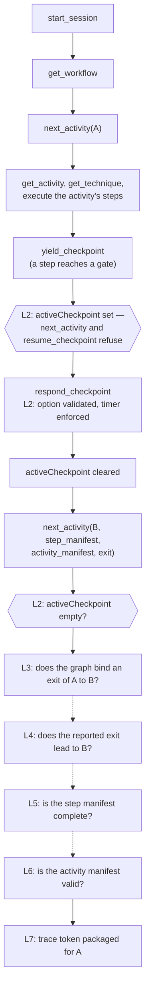

# Workflow fidelity enforcement

An agent's claim to have followed a workflow has to be checkable. Two things make it hard. As a conversation grows, the earliest instructions — the workflow definition among them — fall out of the model's effective attention, so steps get skipped and transitions go wrong. And with nothing checking, an agent can take a shortcut, skip a gate, or report state it never reached.

Seven layers answer that, each working at a different grain. Two are hard gates that refuse the call. The other five record a warning and move on, so a drifting agent is visible rather than stopped — which lets an agent correct itself, and leaves every warning in the trace for review afterwards.

## The shape of a transition

Most enforcement happens where one activity hands over to the next, so that moment is worth seeing whole. The labels `L1` to `L7` are the seven layers, taken in turn below.


```mermaid
flowchart TD
    startSession["start_session"] --> getWorkflow["get_workflow"]
    getWorkflow --> nextA["next_activity(A)"]
    nextA --> steps["get_activity, get_technique,\nexecute the activity's steps"]
    steps --> yieldCp["yield_checkpoint\n(a step reaches a gate)"]
    yieldCp --> gate{{"L2: activeCheckpoint set —\nnext_activity and resume_checkpoint refuse"}}
    gate --> respond["respond_checkpoint\nL2: option validated, timer enforced"]
    respond --> cleared["activeCheckpoint cleared"]
    cleared --> nextB["next_activity(B, step_manifest,\nactivity_manifest, exit)"]
    nextB --> hardGate{{"L2: activeCheckpoint empty?"}}
    hardGate --> transCheck["L3: does the graph bind an exit of A to B?"]
    transCheck -.-> condCheck["L4: does the reported exit lead to B?"]
    condCheck -.-> stepCheck["L5: is the step manifest complete?"]
    stepCheck -.-> actCheck["L6: is the activity manifest valid?"]
    actCheck --> tracePackage["L7: trace token packaged for A"]
```

Double-bordered nodes are hard gates; they refuse the call until satisfied. Dashed arrows are advisory checks that add a warning to `_meta.validation` and let the call through. Every call verifies the seal (L1) and records a trace event (L7), so those are left off the edges.

## Layer 1: session integrity

Session state is not something an agent carries. An agent holds a six-character `session_index`; the server keeps the state on disk beside the planning folder. So what needs protecting is the file, not a credential in a prompt.

`session.json` is plaintext and schema-validated. `.session-token` beside it is a sealed envelope, binding those exact bytes to the engineering root and to a server-held signing key using a keyed hash (HMAC-SHA256). The server verifies the seal on every read and raises `SEAL_MISMATCH` when the two disagree. The file layout itself is in [the state management model](state-management-model.md#persistence).

Where the signing key lives, and how the server finds it, is in [the configuration reference](configuration.md#signing-key).

What the seal buys:

- State edited outside the server is caught on the next read rather than trusted.
- A session index is a lookup key, not a bearer credential. The seal attests that the state is the server's own; the index attests nothing.
- Rotating or losing the signing key invalidates existing seals. That surfaces as `SEAL_MISMATCH` rather than as quiet acceptance.

## Layer 2: the checkpoint gate

When a worker yields a checkpoint, the server records it in the session's `activeCheckpoint` field.

### What refuses while a gate is open

Some operations guard the run's own progress, each with its own inline check:

| Operation | Why it refuses |
|-----------|----------------|
| `next_activity` | The run must not advance past a question nobody answered |
| `yield_checkpoint` | A second pause on top of an outstanding one cannot be unwound |
| `resume_checkpoint` | A worker must not continue before the answer exists |

Others deliver content — `get_workflow`, `get_activity`, `get_technique`, `get_resource` and `get_trace` — and refuse through the shared `assertNoActiveCheckpoint` helper, which gives one blanket reason for all of them.

### What stays open, and why

| Operation | Why it must not gate |
|-----------|----------------------|
| `present_checkpoint`, `respond_checkpoint` | They are the resolution mechanism |
| `inspect_session`, `get_workflow_status` | Diagnostics, so an orchestrator can examine a run that has stopped |
| `record_usage` | It accounts for work already done |
| `dispatch_child` | A run holding an unanswered question can still open a child workflow |

### What the gate enforces

- An agent cannot advance past an unresolved checkpoint. `next_activity` throws while `activeCheckpoint` is set.
- An agent cannot forge a response. `option_id` is validated against the checkpoint definition.
- An agent cannot resolve instantly. Both timers run from the recorded pause, so answering faster than a person could read is refused. This closes the cheapest way to fake a gate: calling `respond_checkpoint` straight after `yield_checkpoint` without showing anyone anything. Real worker execution takes minutes, so the check never fires on a legitimate run.
- An agent cannot dismiss an unconditional checkpoint. `condition_not_met` is rejected without a `condition` field.

The three resolution modes and the timers each one waits out are specified in [the checkpoint model](checkpoint-model.md#three-ways-to-resolve-one).

## Layer 3: cross-activity validation

On every tool call the server compares the position it recorded last time against what this call claims. A disagreement produces a warning in `_meta.validation`:

| Check | What it detects |
|-------|-----------------|
| Workflow consistency | The agent switched workflows mid-session without starting a new one |
| Activity transition | The agent jumped to an activity the graph binds no exit of the previous one to |
| Technique association | The agent loaded a technique the current activity does not declare |
| Version drift | The workflow definition changed on disk since the session started |

## Layer 4: the reported exit

On `next_activity` an agent may name the outcome the activity it is leaving reached, as the `exit` parameter. The server checks that the activity declares an exit by that name, and that the graph binds that exit to the requested target. The exit is then recorded in the sealed state and in the trace, so the agent cannot revise it afterwards.

What this cannot check is whether the exit's predicate is actually true. Exits are often selected by a user's answer at a checkpoint, and those answers are logged, so a later review can cross-reference reported exits against checkpoint responses.

## Layer 5: the step manifest

On `next_activity` an agent passes a `step_manifest`: one entry per step completed in the activity being left.

```json
{
  "step_manifest": [
    { "step_id": "resolve-target", "output": { "target_path": "/path" } },
    { "step_id": "prepare-target", "output": { "checked_out_ref": "main" } },
    { "step_id": "detect-layout", "output": { "needs_migration": false } }
  ]
}
```

### The checks

Each warns rather than blocks:

| Check | Warns when |
|-------|-----------|
| Presence | An ungated top-level step is missing |
| Order | Top-level steps are out of declaration order — a relative comparison, so omitted gated steps do not shift it |
| Output | A step reports no value at all — an absent map, or one with no keys |
| Declaration | A reported key names no output the step's bound operation declares |
| Identity | A step id names no step of the activity |

### Steps that may be left out

A step gated by `when` or `condition`, and a loop carrying a `continueWhile` continuation test, may be omitted: the agent evaluated the gate and skipped the step. A loop's continuation test decides whether its body runs at all, which is why a loop carrying one is gated on the same terms as a conditional step.

Those three fields are the only ones the validator reads. `step.required` is a hint for the worker, not a check.

### What a loop body owes the manifest

One entry per body step per iteration, under the step's declared id each time — three passes of a two-step body are six entries, in the order they ran. A body run three times and reported once says it ran once.

No loop-body id is ever required: the iteration count is the agent's, possibly zero, and the server holds no count of its own to check against. What the validator does check is that every id names a step of the activity, so a repeated id reads as a repeated run rather than a duplicate. The order check is a subsequence comparison over top-level ids alone, so body entries interleaved between them shift nothing.

### Technique-fetch fidelity

The server records every delivery of technique or resource content into the session history:

| Event | Recorded on |
|-------|-------------|
| `technique_fetched` | a `get_technique` call, with the resolved id, the bound `step_id` where supplied, and the agent |
| `technique_bundled` | each step technique inlined by `get_activity` |
| `resource_fetched` | a `get_resource` call — observability only |
| `activity_delivered` | each `get_activity`, naming what that call resolved and spent |

All three delivery events carry `chars`, the full payload size on either path, and `delivery: "full" | "unchanged"` — so characters delivered and characters saved are both summable from the history rather than estimated. An unchanged-reference answer under persistent context mode still counts as a delivery.

Against that record, a manifested technique step with no delivery during the current activity visit warns. The step was reported complete but its technique content was never loaded, which is the signature of silent degradation. A step counts as covered by a step-bound fetch, by any in-activity fetch that resolved to the same technique operation, or by an inline bundle delivery. A loop-back revisit needs its own fetches. Delivery mechanics are in [reference delivery](delivery-model.md#reference-delivery) and [hybrid technique bundling](delivery-model.md#eager-technique-bundling).

## Layer 6: the activity manifest

An agent may also pass an `activity_manifest` on `next_activity`: a summary of the activities completed so far.

```json
{
  "activity_manifest": [
    { "activity_id": "detect-layout", "outcome": "completed", "exit": "standard" },
    { "activity_id": "analyse-sources", "outcome": "completed", "exit": "skip-optional" },
    { "activity_id": "draft-plan", "outcome": "revised", "exit": "done" }
  ]
}
```

Each check warns: that every activity id exists in the workflow, that outcomes are non-empty, and that each claimed exit is one that activity declares.

Where Layer 5 records step-level detail, this records the workflow-level journey. The split matters in the orchestrator and worker pattern, where the orchestrator tracks the journey and the worker tracks the steps.

## Layer 7: the execution trace

### What each event carries

The server captures a mechanical trace of every tool call through `withAuditLog`:

| Field | Description |
|-------|-------------|
| `name` | Tool name |
| `ts` | Timestamp (Unix seconds) |
| `ms` | Duration in milliseconds |
| `s` | Status, `ok` or `error` |
| `wf`, `act`, `aid` | Workflow, activity and agent id the call was made under |
| `err` | Error message, on failure |
| `vw` | Validation warnings from `_meta.validation` |

### How a trace token travels

Events accumulate in an in-memory `TraceStore`. On each `next_activity` the server packages everything since the last transition into a trace token, signed with the same key that seals session state, and returns it in `_meta.trace_token`.

The agent accumulates these tokens as opaque strings without parsing them, which keeps the mechanical trace out of its reasoning context. `get_trace` resolves accumulated tokens into full event data, or returns the in-memory trace when given none.

A token is self-contained rather than a pointer into server memory, so it stays a valid attestation across a restart. Field names are compressed, which is what keeps an accumulating set of tokens small enough to carry without thinking about it.

What the trace makes possible after the fact:

- **Audit** — the complete call sequence, with timing and errors.
- **Failure diagnosis** — the last call before silence says where an agent got stuck.
- **Attribution** — the `aid` field tells orchestrator calls from worker calls.
- **Warning history** — every warning the session issued, not only the most recent.
- **Parent and child correlation** — a launched workflow's events carry their own `sid`, and the session file records which session launched it.

Agents write a second, semantic trace — step outputs, checkpoint responses, decision branches, variable changes — into the planning folder, per the workflow's own technique instructions. The server's mechanical trace and that semantic one together give complete visibility.

## What this cannot prove

Every layer above detects rather than prevents, and the limits are worth stating plainly.

- **Step execution is not provable.** The manifest shows that an agent *reported* each step, not that it did the work, and the output descriptions are the agent's own. The mechanical trace independently confirms which tool calls were made, which corroborates but does not settle it.
- **Condition truth is not verified.** The server checks that a claimed exit maps to the target activity. Whether the predicate holds in the agent's state is beyond it.
- **Checkpoint user presence is not provable.** The gate ensures the agent calls `respond_checkpoint` with a valid option. It cannot show a person saw the question. The timers raise the bar by rejecting an instant resolve, but an agent could wait the minimum and submit a fabricated answer. This is inherent wherever the agent controls the channel to the user.
- **Conditional dismissal relies on honesty.** On `condition_not_met` the server validates that the checkpoint carries a `condition`, not that the condition is false. The dismissal is recorded for later audit.
- **A repeated call is not distinguished from a fresh one.** A call is checked against the position the server recorded, so it cannot tell that an agent is re-issuing a call it already made. The trace records both, so a repeat is visible afterwards.
- **Warnings are advisory.** A confused agent may ignore them. They are captured in the trace, so ignored warnings show up in review.
- **The in-memory trace does not survive a restart.** Tokens issued before it remain valid, since the event data is embedded in them, but a `get_trace` with no tokens returns nothing for prior sessions.
- **The semantic trace depends on the agent.** The server cannot verify that the agent wrote it, or that it is complete.

## Where else to look

The tools these layers sit behind are catalogued in the [API reference](api-reference.md), with the [generated wire descriptions](../site/api/tools.html) giving each parameter schema. How instructions reach an agent without swamping its context is [resource resolution](resource-resolution-model.md). Getting an agent talking to the server in the first place is [setup](setup.md#3-setup-cursor-workspace).
