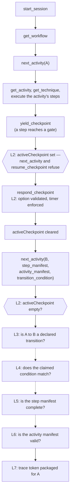

# Workflow Fidelity Enforcement

How the workflow server ensures agents follow workflows correctly.

## The Problem

AI agents executing multi-step workflows face two reliability challenges:

1. **Context degradation** — as conversations grow, earlier instructions (including workflow definitions) fall out of the model's effective attention window, leading to skipped steps, wrong transitions, and hallucinated procedures
2. **Behavioral drift** — without enforcement, agents may take shortcuts, skip checkpoints, or fabricate state rather than following the defined execution path

The workflow server addresses these through seven layers of enforcement, each operating at a different granularity. Two are hard gates that refuse the call; the other five record warnings and evidence, so a drifting agent is visible rather than stopped.

## Enforcement Layers

### The shape of a transition

Most enforcement happens where one activity hands over to the next, so that moment is worth seeing whole.


```mermaid
flowchart TD
    startSession["start_session"] --> getWorkflow["get_workflow"]
    getWorkflow --> nextA["next_activity(A)"]
    nextA --> steps["get_activity, get_technique,\nexecute the activity's steps"]
    steps --> yieldCp["yield_checkpoint\n(a step reaches a gate)"]
    yieldCp --> gate{{"L2: activeCheckpoint set —\nnext_activity and resume_checkpoint refuse"}}
    gate --> respond["respond_checkpoint\nL2: option validated, timer enforced"]
    respond --> cleared["activeCheckpoint cleared"]
    cleared --> nextB["next_activity(B, step_manifest,\nactivity_manifest, transition_condition)"]
    nextB --> hardGate{{"L2: activeCheckpoint empty?"}}
    hardGate --> transCheck["L3: is A to B a declared transition?"]
    transCheck -.-> condCheck["L4: does the claimed condition match?"]
    condCheck -.-> stepCheck["L5: is the step manifest complete?"]
    stepCheck -.-> actCheck["L6: is the activity manifest valid?"]
    actCheck --> tracePackage["L7: trace token packaged for A"]
```

Double-bordered nodes are hard gates: they refuse the call until satisfied. Dashed arrows are advisory checks that add a warning to `_meta.validation` and let the call through. Every call verifies the session seal (L1) and records a trace event (L7); annotating those on each edge would only clutter the picture.

### Layer 1: Session Integrity

Session state is not something an agent carries. Agents hold a six-character `session_index`, derived deterministically from the planning slug, and the server keeps the state itself on disk beside the planning folder. So what has to be protected is the file, not a credential in a prompt.

Each session folder holds two files. `session.json` is plaintext and schema-validated. `.session-token` beside it is a sealed envelope binding those exact bytes to the engineering root and to a server-held signing key, using HMAC-SHA256. The server verifies the seal on every read and raises `SEAL_MISMATCH` when the two disagree.

The signing key lives in a file named `secret`. The server looks for its directory in `WORKFLOW_SERVER_KEY_DIR` first, then `WORKFLOW_SERVER_STATE_DIR`, falling back to `~/.workflow-server`. Docker's `start.sh` sets the key directory explicitly, because non-root containers often run with `HOME=/` and the key would otherwise land somewhere unwritable.

**What it enforces:**
- State edited outside the server is detected on the next read rather than silently trusted
- A session index is a lookup key, not a bearer credential — the seal, not the index, attests that the state is the server's own
- Rotating or losing the signing key invalidates existing seals, which surfaces as `SEAL_MISMATCH` rather than as quiet acceptance

Because the state lives in the file rather than in an agent's context, a server restart is transparent. There is no adoption, re-signing or recovery step for an agent to perform.

### Layer 2: Checkpoint Gate

When a worker yields a checkpoint, the server records it in the session's `activeCheckpoint` field. Three operations then refuse until it is cleared:

| Operation | Why it refuses |
|-----------|----------------|
| `next_activity` | The run must not advance past a question nobody answered |
| `yield_checkpoint` | A second pause on top of an outstanding one cannot be unwound |
| `resume_checkpoint` | A worker must not continue before the answer exists |

Everything else stays open, deliberately. `inspect_session` in particular is usable while a checkpoint is active, which is how an orchestrator diagnoses a run that has stopped.

**Resolution via `respond_checkpoint`** takes exactly one of three modes:

| Mode | When to use | Timing enforcement |
|------|-------------|-------------------|
| `option_id` | The user selected an option | At least three seconds since the pause was recorded |
| `auto_advance` | The checkpoint declares `defaultOption` and `autoAdvanceMs`, and the timer elapsed | The full `autoAdvanceMs` since the pause was recorded |
| `condition_not_met` | The checkpoint's condition is false, as the agent evaluated it | None, but the checkpoint must carry a structured `condition`; a `when` gate does not qualify |

**What it enforces:**
- Agents cannot advance past an unresolved checkpoint — `next_activity` throws while `activeCheckpoint` is set
- Agents cannot forge a response — `option_id` is validated against the checkpoint definition
- Agents cannot resolve instantly — both timers run from the recorded pause time, so answering faster than a person could read is refused
- Agents cannot dismiss an unconditional checkpoint — `condition_not_met` is rejected without a `condition` field

**Anti-gaming:** the timers close off the cheapest way to fake a checkpoint, which is calling `respond_checkpoint` straight after `yield_checkpoint` without showing anyone anything. Real worker execution takes minutes, so the check never fires on a legitimate run. What it cannot do is prove a person saw the question; that limit is recorded below.

### Layer 3: Cross-Activity Validation

When an agent makes a tool call, the server compares the position it recorded on the previous call against what this call claims. Warnings are returned in `_meta.validation`.

**Checks performed:**

| Check | What it detects |
|-------|----------------|
| Workflow consistency | Agent switched workflows mid-session without starting a new session |
| Activity transition | Agent jumped to an activity that isn't a valid transition from the previous one |
| Technique association | Agent loaded a technique not declared by the current activity |
| Version drift | Workflow definition changed on disk since the session started |

**Design principle:** Warnings don't block execution — the tool still returns its result. This allows agents to self-correct rather than being hard-blocked, while making violations visible. All validation warnings are captured in the execution trace (Layer 7).

### Layer 4: Transition Condition Tracking

When calling `next_activity` to transition to a new activity, agents can include a `transition_condition` parameter — the condition string (from the `transitions` field of the current activity's definition) that caused the transition.

**What it enforces:**
- The claimed condition actually maps to the target activity in the transition table
- Default transitions are correctly reported (no false condition claims)
- The condition is recorded in the sealed session state and in the trace, so the agent cannot revise it afterwards

**What it cannot verify in real-time:** Whether the condition is actually true in the agent's state. However, conditions are typically set by user choices at checkpoints, which are logged. Post-hoc review can cross-reference claimed conditions against checkpoint responses and trace data.

### Layer 5: Step Completion Manifest

When transitioning between activities via `next_activity`, agents include a `step_manifest` parameter — a structured summary of each step completed in the previous activity.

```json
{
  "step_manifest": [
    { "step_id": "resolve-target", "output": "Target verified at /path" },
    { "step_id": "initialize-target", "output": "Checked out main" },
    { "step_id": "detect-project-type", "output": "project_type=other" }
  ]
}
```

**What it enforces (advisory — every check warns rather than blocks):**
- Every ungated top-level step is present (missing steps produce a warning)
- Top-level steps appear in declaration order (out-of-order steps produce a warning; the check is a relative-order comparison, so omitted gated steps do not shift it)
- Each step has a non-empty output description (empty outputs produce a warning)
- Step ids not defined in the activity produce a warning

**Gated and loop-body steps:** a step gated by `when` or `condition` may be omitted from the manifest — the agent evaluated the gate and skipped the step. Loop-body step ids are accepted (one entry per iteration if useful) but never required, since the iteration count is agent-determined and may be zero. `step.required` is a worker hint the validator does not consult.

**Technique-fetch fidelity:** the server records every `get_technique` fetch as a `technique_fetched` event in the session history (resolved technique id, bound `step_id` when supplied, agent — recorded on both delivery paths, so an unchanged-reference answer in persistent context mode still counts), and every inline step-technique delivery from a bundling activity's `get_activity` as a `technique_bundled` event. `get_resource` fetches are recorded as `resource_fetched` events for observability only. All three delivery events carry the payload magnitude — `chars` (the full payload size, on both delivery paths) and `delivery: "full" | "unchanged"` — so delivered and saved characters are summable from the history rather than estimated ([Reference delivery](resource-resolution-model.md#11-reference-delivery)). When validating a `step_manifest`, a manifested technique step with no delivery recorded during the current activity visit warns — the step was reported complete but its composed technique content was never loaded, the silent-degradation signature. A step is covered by a step-bound fetch, by any in-activity fetch that resolved to the same technique operation, or by an inline bundle delivery, and a loop-back revisit needs its own fetches. Advisory, like the rest of the layer. Inline delivery mechanics: [Hybrid Technique Bundling](resource-resolution-model.md#12-hybrid-technique-bundling).

### Layer 6: Activity Manifest

When transitioning between activities via `next_activity`, agents can include an `activity_manifest` — a structured summary of activities completed so far in the workflow.

```json
{
  "activity_manifest": [
    { "activity_id": "start-work-package", "outcome": "completed", "transition_condition": "default" },
    { "activity_id": "design-philosophy", "outcome": "completed", "transition_condition": "skip_optional_activities == true" },
    { "activity_id": "plan-prepare", "outcome": "revised", "transition_condition": "needs_research == true" }
  ]
}
```

**What it enforces (advisory):**
- Activity IDs reference activities that exist in the workflow definition
- Outcomes are non-empty
- The claimed transition condition matches one defined in the workflow for that activity

**Design principle:** Activity manifest validation is advisory — it produces warnings, not rejections. This matches the design principle of Layer 3. The manifest provides a workflow-level audit trail that complements the step-level detail of Layer 5, particularly in orchestrator/worker patterns where the orchestrator tracks the workflow journey and the worker tracks step execution.

### Layer 7: Execution Trace

The server automatically captures a mechanical trace of every tool call in a session. Trace data is packaged as HMAC-signed trace tokens — opaque, compact references that the agent accumulates and can resolve via `get_trace`.

**What it captures automatically (via `withAuditLog`):**

| Field | Description |
|-------|-------------|
| `name` | Tool name |
| `ts` | Timestamp (Unix seconds) |
| `ms` | Duration (milliseconds) |
| `s` | Status (`ok` or `error`) |
| `wf`, `act`, `aid` | Workflow, activity, and agent id the call was made under |
| `err` | Error message (on failure) |
| `vw` | Validation warnings from `_meta.validation` |
| `psid` | Parent session ID (for dispatched workflows) |

**How trace tokens work:**

1. The server accumulates trace events in an in-memory `TraceStore` during the session
2. When `next_activity` is called (activity transition), the server packages all events since the last transition into an HMAC-signed trace token and returns it in `_meta.trace_token`
3. The agent accumulates these opaque tokens without parsing them
4. At any point, `get_trace` resolves the accumulated tokens into full event data, or returns the in-memory trace if no tokens are provided

**What it enables:**
- **Post-execution audit** — the complete tool call sequence with timing, errors, and validation warnings
- **Failure diagnosis** — the last call before silence identifies where an agent got stuck
- **Multi-agent attribution** — the `aid` field distinguishes orchestrator from worker calls
- **Parent-child correlation** — the `psid` field links dispatched child workflows to their parent
- **Validation warning history** — every warning issued during the session is recorded, not just the most recent

**Two-layer trace architecture:** The server captures the mechanical trace (tool calls, timing, validation) automatically. Agents write a complementary semantic trace (step outputs, checkpoint responses, decision branches, variable changes) to the planning folder per workflow technique instructions. Together they provide complete execution visibility.

**Trace token properties:**
- Self-contained — full event data is embedded, not just references to in-memory state
- HMAC-signed — tamper-evident, using the same key that seals session state
- Compact — compressed field names minimize context window impact
- Degradation-resilient — tokens remain valid attestations even if the server restarts

## Context Pressure Mitigation

Beyond enforcement, the server reduces the context burden on agents:

### Lightweight Workflow Metadata

`get_workflow` returns lightweight metadata (~2KB) rather than the full workflow definition (~13KB): the orchestrator gets rules, variables, `initialActivity`, and activity stubs without consuming its context window with step-level detail. Step detail and the worker-facing `rules.activity` / `techniques.activity` reach workers through `get_activity`. The response is preceded by the technique bundle (the workflow's `techniques.workflow` plus the core orchestrator techniques), so the orchestrator receives its execution surface in a single round-trip.

### Transitions in Activity Definitions

`get_activity` returns the complete activity definition including its `transitions` field with human-readable conditions. The agent matches conditions against its state variables to determine the next activity:

```json
{
  "transitions": [
    { "to": "requirements-elicitation", "condition": "needs_elicitation == true" },
    { "to": "implementation-analysis", "isDefault": true }
  ]
}
```

Transitions are also derived from `decisions` (branch `transitionTo` fields) and `checkpoints` (option `effect.transitionTo` fields), giving the orchestrator a complete view of all possible next activities.

### Technique and Resource Loading

`get_workflow` and `get_activity` pre-resolve the activity's `techniques[]` references and return them as the bundled technique set in the response preamble — agents read technique bodies (capability, flow, inputs, protocol, outputs) directly from the bundle rather than chasing per-step loads. `get_technique` loads a single fully composed technique on demand — the workflow's first declared technique before any activity, or the technique for the current activity (optionally a `step_id`'s technique). Call `get_resource` with the resource index when a technique references reference material that wasn't bundled.

### Self-Describing Bootstrap

The `discover` tool returns the complete bootstrap procedure and available workflows. Agents learn how to use the server from the server itself, reducing reliance on IDE-side configuration that may go stale.

### Trace Token Efficiency

Trace tokens use compressed field names and HMAC-signed opaque encoding. A 10-activity session produces ~3KB of accumulated tokens. The agent stores tokens as opaque strings without parsing, keeping the mechanical trace out of the reasoning context until explicitly resolved via `get_trace`.

## State Persistence

State persistence is **server-managed**. The server owns the canonical session state and writes it to disk atomically on every authenticated tool call. Agents pass only a 6-character `session_index` (base32, deterministically derived from the planning slug); they do not read or write session state themselves.

For each session the server maintains two files under the planning folder (under the **engineering root** — see [State Management](state-management-model.md#5-persistence)):

* **`session.json`** — Plaintext, JSON-Schema-validated state (`schemas/session-file.schema.json`).
* **`.session-token`** — A sealed, HMAC-signed envelope binding `session.json` to the engineering root + server signing key. Mismatch between the two raises a hard `SealMismatchError`.

Resume is a single call: `start_session({ agent_id, planning_folder })`. The server loads `session.json`, verifies the seal, and returns the same `session_index`. Because state lives in `session.json` rather than in an agent-held token, server restarts are transparent — there is no separate adoption, re-signing, or recovery step the agent has to handle. See [State Management & Deterministic Transitions](state-management-model.md#5-persistence) for the full file layout.

## Limitations

- **Step execution is not provable** — the manifest validates that the agent *reported* each step, not that it *performed* the work. The output descriptions are agent-generated. However, the mechanical trace independently confirms which tool calls were made, providing corroborating evidence.
- **Condition truth is not verified** — the server checks that a claimed condition maps to the target activity, but cannot verify whether the condition is actually true in the agent's state. Post-hoc audit via checkpoint logs and trace data can cross-reference claimed conditions against observed behavior.
- **Checkpoint user presence is not provable** — the checkpoint gate ensures the agent *calls* `respond_checkpoint` with a valid option, but cannot prove a human saw the checkpoint. The timing enforcement raises the bar (instant auto-resolve is rejected), and the trace records all checkpoint interactions for audit. However, an agent could wait the minimum time and then submit a fabricated response. This is an inherent limitation of agent-mediated systems where the agent controls the communication channel.
- **Conditional checkpoint dismissal relies on agent honesty** — when an agent calls `respond_checkpoint` with `condition_not_met`, the server validates that the checkpoint has a `condition` field but cannot verify the condition is actually false. The trace records the dismissal for post-hoc audit.
- **A repeated call is not distinguished from a fresh one** — the server holds the session state, so a call is checked against the position it recorded rather than against anything the agent presents. What it cannot tell is whether an agent is re-issuing a call it already made in the same session. The trace records both, so a repeat is visible after the fact.
- **Warnings are advisory** — a confused agent may ignore validation warnings. The enforcement is detection-oriented, not prevention-oriented. Validation warnings are captured in the execution trace, making ignored warnings visible in post-hoc review.
- **In-memory trace lifespan** — the `TraceStore` lives in server memory. On server restart, accumulated events are lost. Trace tokens issued before the restart remain valid as self-contained attestations (event data is embedded), but ad-hoc `get_trace` queries without tokens return empty results for prior sessions.
- **Semantic trace is agent-dependent** — the agent-written semantic trace (step outputs, checkpoint responses, variable changes) relies on agent discipline. The server cannot verify that the agent wrote it or that it is complete.

## Related

- [API Reference](api-reference.md) — tool catalog
- [Site API](../site/api/tools.html) — wire descriptions from source
- [IDE Setup](ide-setup.md) — bootstrap configuration
