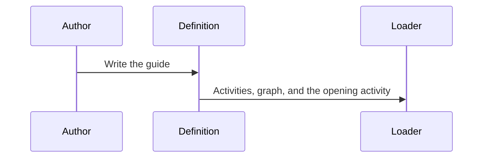
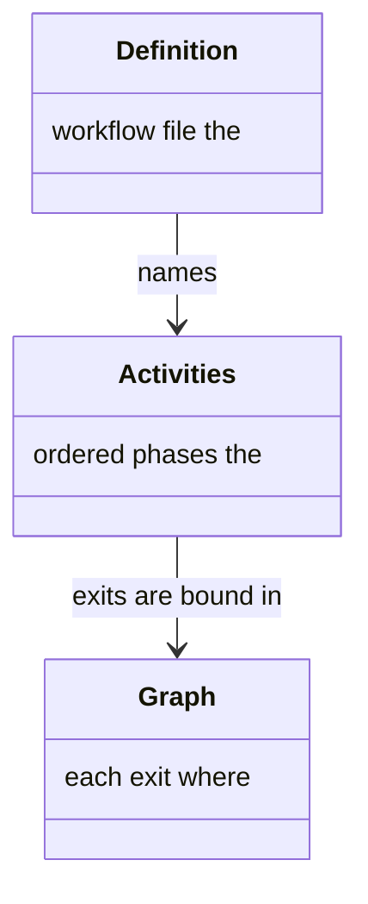
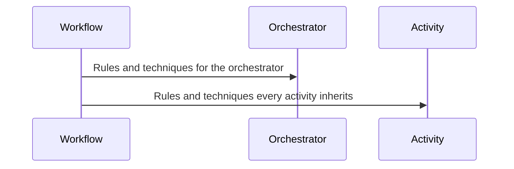
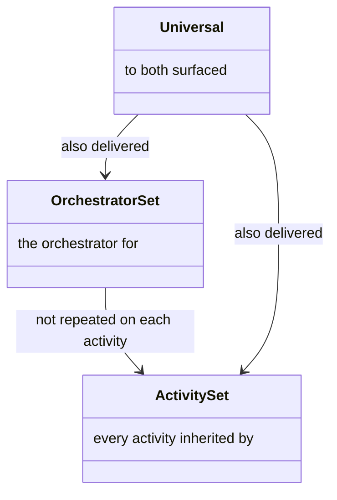
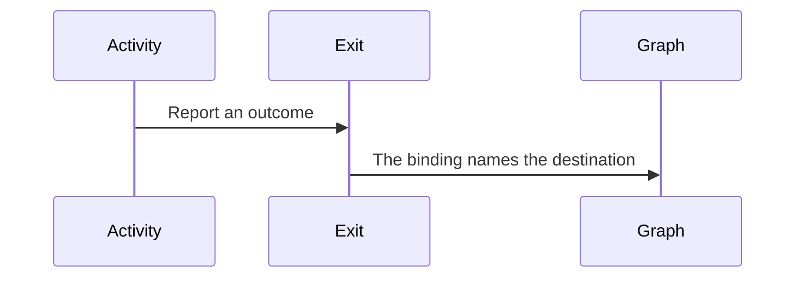
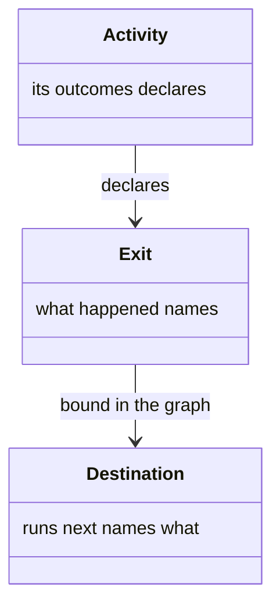

# Workflow

A **workflow** is a guide an operator follows, end to end, to fulfill a set of objectives. An author writes one when that work has more than one phase. An **activity** is one phase. The **graph** says where each of an activity's **exits** leads. An **exit** is a named outcome in the activity's own words. The **initial activity** is the phase the run opens on.

A **variable** is a name the run holds, with a type and a starting value. A **rule** is an invariant. A **technique** is a capability file a step or a role applies. **Audience** says who receives a rule or a technique: the **orchestrator**, which tracks the workflow, or every activity's **worker**. A **reference** is the name that reaches a technique. How a name reaches its file is [resolution](resolution.md). The fields are the [schema](../schemas/README.md#workflow-root-entity).

## File

The definition is one file, and the loader reads the activities, the graph, and the opening activity from it (Figure 1). The definition, the activities, and the graph are the pieces (Figure 2).



*Figure 1. The Loader Reads the Guide from One File.*



*Figure 2. Definition, Activities, and Graph.*

The file is `workflow.yaml` in the workflow's directory. The directory name is the workflow's id. Activities live in that directory's `activities/` folder, or inline. A filename may begin with a number. That number is the prefix put in front of each document the activity writes. How documents are named is [naming](delivery.md#how-documents-are-named).

#### Sample Definition

```yaml
id: review
version: 1.0.0
title: Review a change
initialActivity: gather
activitiesDir: activities
techniques:
  workflow:
    - workflow-engine::dispatch-activity
  activity:
    - agent-conduct::checkpoint-discipline
graph:
  gather:
    ready: inspect
    nothing: __terminal__
```

## Audience

Rules and techniques are partitioned by who they are for (Figure 3). The orchestrator's set and the set every activity inherits are the pieces (Figure 4).



*Figure 3. Audience Splits What the Orchestrator Receives from What Every Activity Inherits.*



*Figure 4. Orchestrator Set, Activity Set, and Universal Rules.*

`techniques.workflow` arrives with the orchestrator. `techniques.activity` is injected into every activity, ahead of that activity's own techniques. A technique common to all activities is declared once here.

`rules.workflow` is for the orchestrator. `rules.activity` is injected into every activity. `rules.universal` is delivered to both. A rule two workflows both need is not owned by either. Its home is the conduct technique whose audience it binds.

## Graph

An exit names what happened. The graph names what runs next (Figure 5). The activity, the exit, and the destination are the pieces (Figure 6).



*Figure 5. An Exit Reports an Outcome. The Graph Names the Destination.*



*Figure 6. Activity, Exit, and Destination.*

Every exit of every activity is bound. An unbound exit, an unknown exit, and an unknown destination each fail the load. An activity that declares no exits is terminal.

A destination is one of these:

* One activity.
* The terminal sentinel, and the run ends.
* A list of at least two activities the run opens together.
* One activity, with the collection to run it once per element.

Where the destination the orchestrator moves to disagrees with the exit it reports, the advance warns and is not blocked. Selecting an immediate exit at a checkpoint ends that activity's remaining steps.

## Variables

A variable is declared on the workflow, and the session is seeded from its default when the run opens. After that, a checkpoint option's variable effect is the write the server applies. A variable with no default stays absent. The declaration is what an agent is shown: the name, the type, the values it may take, and the starting value. Prose about what the variable is for rides the activity that produces it and the activity that consumes it, not this roster.
