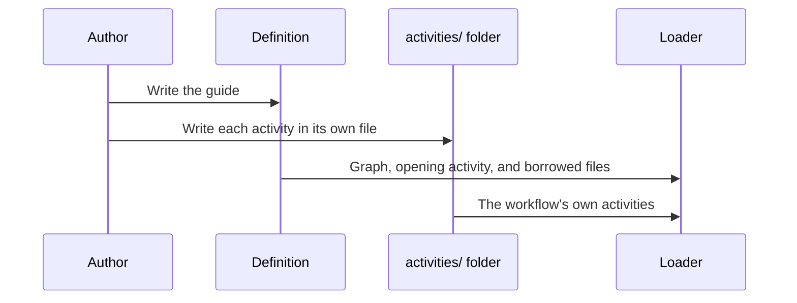
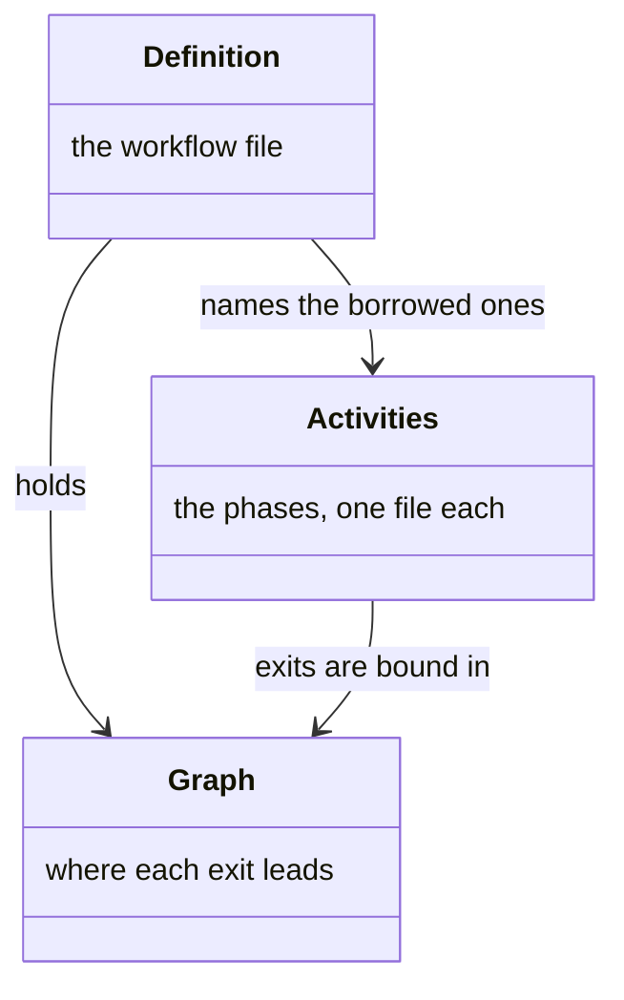
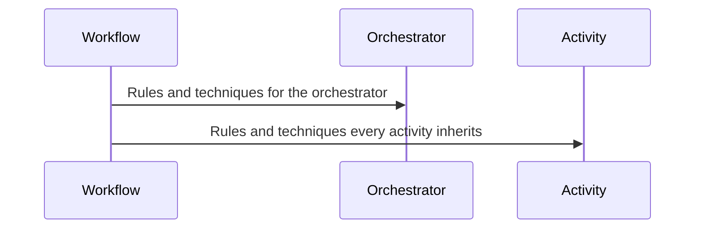
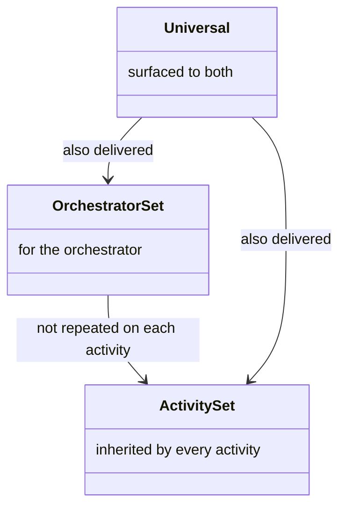
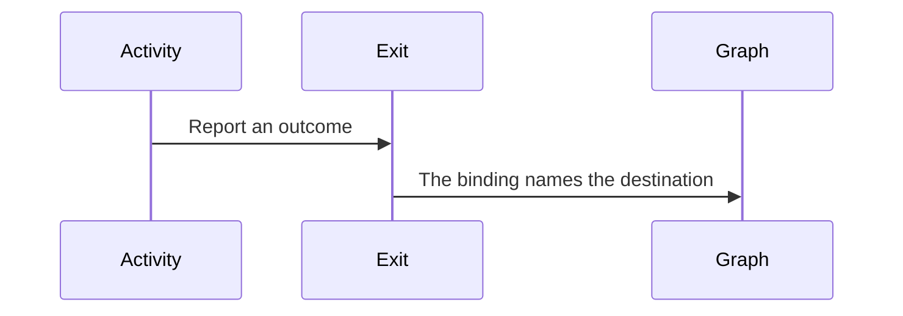
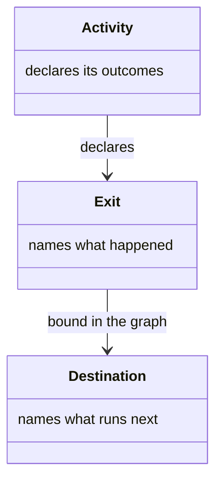

# Workflow

A **workflow** is a guide an operator follows, end to end, to fulfill a set of objectives. An author writes one when that work has more than one phase. An **activity** is one phase. The **graph** says where each of an activity's **exits** leads. An **exit** is a named outcome in the activity's own words. The **initial activity** is the phase the run opens on.

A **variable** is a name the run holds, with a type and a starting value. A **rule** is an invariant. A **technique** is a capability file a step or a role applies. **Audience** says who receives a rule or a technique: the **orchestrator**, which tracks the workflow, or every activity's **worker**. A **reference** is the name that reaches a technique. How a name reaches its file is [resolution](resolution.md). The fields are the [schema](../schemas/workflow.schema.json#L9).

## File

The definition is one file. The loader reads the graph and the opening activity from it, and the activities from the workflow's `activities/` folder and the files the definition borrows (Figure 1). The definition, the activities, and the graph are the pieces (Figure 2).


```mermaid
sequenceDiagram
  participant Author
  participant Definition
  participant Folder as activities/ folder
  participant Loader
  Author->>Definition: Write the guide
  Author->>Folder: Write each activity in its own file
  Definition->>Loader: Graph, opening activity, and borrowed files
  Folder->>Loader: The workflow's own activities
```

*Figure 1. The Loader Reads the Definition and the Activities Folder.*


```mermaid
classDiagram
  class Definition {
    the workflow file
  }
  class Activities {
    the phases, one file each
  }
  class Graph {
    where each exit leads
  }
  Definition --> Graph : holds
  Definition --> Activities : names the borrowed ones
  Activities --> Graph : exits are bound in
```

*Figure 2. Definition, Activities, and Graph.*

The file is `workflow.yaml` in the workflow's directory. The directory name is the workflow's id. Activities live in that directory's `activities/` folder, one file each. A workflow borrows another's activity by listing a reference to its file under `activities` (`other-flow/03-survey.yaml`). An activity identifier appears once in a workflow, so borrowing one the workflow already holds fails the load, and a borrowed file that fails validation is left out of the load, as a file of the workflow's own is. An activity filename begins with a number and a hyphen (`01-gather.yaml`), and a file without one is not loaded. The rest of the filename is the activity's id, so `01-gather.yaml` declares `id: gather`, and a file whose id disagrees is left out of the load. That number is the prefix put in front of each document the activity writes. How documents are named is [naming](delivery.md#how-documents-are-named).

#### Sample Definition

```yaml
id: review
version: 1.0.0
title: Review a change
initialActivity: gather
techniques:
  workflow:
    - run-engine::hand-off
  activity:
    - conduct::confirm-before-deleting
graph:
  gather:
    ready: inspect
    nothing: __terminal__
```

## Audience

Rules and techniques are partitioned by who they are for (Figure 3). The orchestrator's set and the set every activity inherits are the pieces (Figure 4).


```mermaid
sequenceDiagram
  participant Workflow
  participant Orchestrator
  participant Activity
  Workflow->>Orchestrator: Rules and techniques for the orchestrator
  Workflow->>Activity: Rules and techniques every activity inherits
```

*Figure 3. Audience Splits What the Orchestrator Receives from What Every Activity Inherits.*


```mermaid
classDiagram
  class OrchestratorSet {
    for the orchestrator
  }
  class ActivitySet {
    inherited by every activity
  }
  class Universal {
    surfaced to both
  }
  OrchestratorSet --> ActivitySet : not repeated on each activity
  Universal --> OrchestratorSet : also delivered
  Universal --> ActivitySet : also delivered
```

*Figure 4. Orchestrator Set, Activity Set, and Universal Rules.*

`techniques.workflow` arrives with the orchestrator. `techniques.activity` is injected into every activity, ahead of that activity's own techniques. A technique common to all activities is declared once here.

`rules.workflow` is for the orchestrator. `rules.activity` is injected into every activity. `rules.universal` is delivered to both. A rule two workflows both need is not owned by either. Its home is the conduct technique whose audience it binds.

## Graph

An exit names what happened. The graph names what runs next (Figure 5). The activity, the exit, and the destination are the pieces (Figure 6).


```mermaid
sequenceDiagram
  participant Activity
  participant Exit
  participant Graph
  Activity->>Exit: Report an outcome
  Exit->>Graph: The binding names the destination
```

*Figure 5. An Exit Reports an Outcome. The Graph Names the Destination.*


```mermaid
classDiagram
  class Activity {
    declares its outcomes
  }
  class Exit {
    names what happened
  }
  class Destination {
    names what runs next
  }
  Activity --> Exit : declares
  Exit --> Destination : bound in the graph
```

*Figure 6. Activity, Exit, and Destination.*

Every exit of every activity is bound. An unbound exit, an unknown exit, and an unknown destination each fail the load. An activity that declares no exits is terminal.

A destination is one of these:

* One activity.
* The terminal sentinel, and the run ends.
* A list of at least two members the run opens together, each an activity or an activity with its collection.
* One activity, with the collection to run it once per element.

The run enters the destination the graph binds to the exit the orchestrator reports. Where the destination the orchestrator names disagrees, the advance warns. A fan branch that names anything but the fan's meeting point is refused. Selecting an immediate exit at a checkpoint ends that activity's remaining steps.

## Variables

A variable is declared on the workflow or in the writes of an activity it contains, and the session is seeded from its default when the run opens. After that, the server applies a checkpoint option's variable effect, the values an advance or a checkpoint yield reports, and the per-branch slots a fan opens. A variable with no default stays absent. The declaration is what an agent is shown: the name, the type, the values it may take, and the starting value. Prose about what the variable is for rides the activity that produces it and the activity that consumes it, not this roster.
