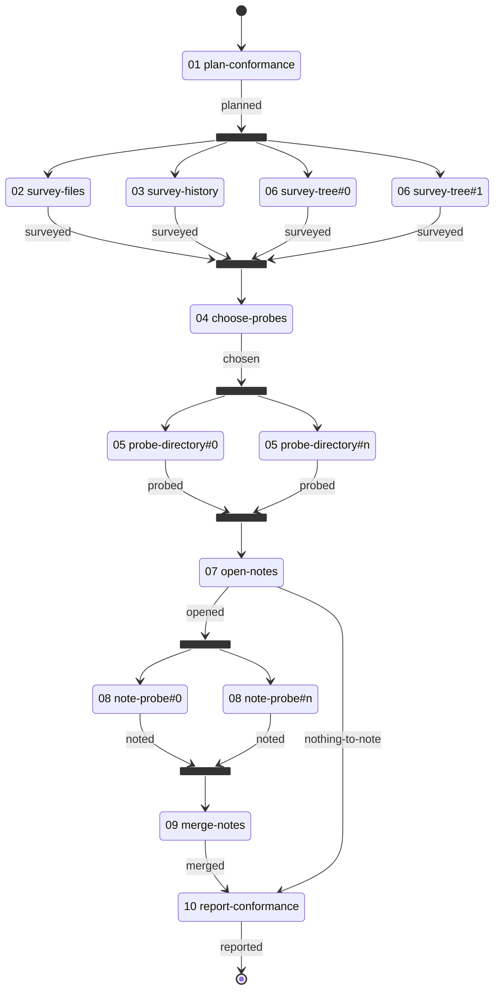

# Fan Conformance Workflow

> Runs every form of graph fan against a real checkout and reports what the routing did — one worker per branch, each with an identity and a container slot of its own, entering the activity they converge on exactly once.

---

## Overview

This workflow exists to make the fanning behaviour observable. A session supplies it two things: a planning folder to write its report into, and a path to the repository or submodule it looks at; everything else the run produces.

The work its branches do is deliberately trivial — counting files by extension, ranking directories by size, reading how many commits landed recently and where, measuring how deep a directory nests. All of that only reads, so the run costs about what the routing costs. The one stage that writes commits a short note per finding, and each writer does it in a checkout of its own. That is the point: the evidence the run leaves behind is about which branch ran when and got handed what, not about the repository it counted.

It serves two readers. One wants to know whether this server's fanning works, and takes that from the report a run leaves behind. The other is writing a fan of their own and wants a worked example of each shape one can take — so every part of the destination grammar is reached somewhere in the graph, for a reason that stage would have anyway rather than as a demonstration.

| # | Activity | Description |
|---|----------|-------------|
| 01 | [**Plan Conformance**](./activities/README.md#01-plan-conformance) | Fix the baseline instant, name the survey roots, settle the probe width |
| 02 | [**Survey Files**](./activities/README.md#02-survey-files) | Count files by extension and rank directories by size |
| 03 | [**Survey History**](./activities/README.md#03-survey-history) | Summarise recent commits and the directories they touched |
| 06 | [**Survey Tree**](./activities/README.md#06-survey-tree) | Walk one root of the component, one instance per root |
| 04 | [**Choose Probes**](./activities/README.md#04-choose-probes) | Read every survey container whole and pick the directories to probe |
| 05 | [**Probe Directory**](./activities/README.md#05-probe-directory) | Describe one picked directory, one instance per pick |
| 07 | [**Open Notes**](./activities/README.md#07-open-notes) | Choose which findings are worth committing, or route past the writers |
| 08 | [**Note Probe**](./activities/README.md#08-note-probe) | Write and commit one note in a checkout of its own |
| 09 | [**Merge Notes**](./activities/README.md#09-merge-notes) | Account for every branch the writers committed on |
| 10 | [**Report Conformance**](./activities/README.md#10-report-conformance) | Read every container whole and write the report |

**Detailed documentation:**

- **Activities:** See [activities/README.md](./activities/README.md) for per-activity orientation (purpose, the position it holds in a fan, and an internal flow diagram) and a link to each activity's authoritative YAML definition.
- **Techniques:** See [techniques/README.md](./techniques/README.md) for the technique inventory orientation; per-technique protocols live in the technique files.
- **Resources:** See [resources/README.md](./resources/README.md) for the resource index.

The cross-cutting [`variable-binding`](../meta/techniques/variable-binding.md) technique applies to every activity.

---

## Workflow Flow

The first fork is one destination naming three members — two activities directly, and a third with a collection to run it over. The other two name one activity and a collection. Suffixes read `#0` through `#n` because a fan's width is settled when it opens, not when it is authored.

Each branch finishes the way any activity does, naming the activity they converge on. The session record keeps a list of the branches still outstanding; a branch finishing takes itself off that list, and for all but one of them that is the whole effect of the call. The call that empties the list is the one that enters the convergence.

So nothing detects that a fan is complete and announces it — completeness is simply what the record shows once the last branch has reported. Nor does any activity declare itself the meeting point: the meeting point is wherever the branches' exits lead. This convergence is what the canon calls the fan's barrier.

---

## Orchestration Model

Inherits the meta orchestrator/worker pattern — [workflow-orchestrator](../meta/techniques/workflow-engine/workflow-orchestrator.md) / [activity-worker](../meta/techniques/workflow-engine/activity-worker.md) via [dispatch-activity](../meta/techniques/workflow-engine/dispatch-activity.md). Fanning adds [dispatch-fan](../meta/techniques/workflow-engine/dispatch-fan.md), which is delivered only to a workflow whose graph holds a fan: it is what tells an orchestrator to open every branch in one turn, give each its own identity, and take the convergence from what the record shows rather than judging for itself when the fan is done.

---

## The Destination Grammar

An exit's destination takes three written forms, and one reserved id ends the run:

| Destination | What it opens | Reached in |
|-------------|---------------|------------|
| An activity id | One branch, no fan | Most exits here |
| A list of members, each an id **or** an instance fan | Every member's branches, flattened into one set | Stage one |
| One activity with a collection to run it over | One branch per element | Stages two and three |
| `__terminal__` | Nothing — the run ends | The report's exit |

`__terminal__` is a reserved activity id rather than a form of its own, which is why a destination is a string, a list, or an instance fan and nothing else. A list member is only ever an activity id or an instance fan, never another list, so one destination cannot be nested inside another: the schema has no way to write it down, rather than the load refusing it after the fact. A branch activity may still have a fanning exit of its own — that is the next destination, reached after this one converges, not a destination inside this one.

Four properties are reached only in the first destination, and each is there for a reason that destination would have anyway:

- **The members answer to one bound.** The server's ceiling counts branches after every member is flattened, so the named members and the fanned member spend the same budget. That is why the fanned member declares an instance cap — it holds itself to a width that leaves room for its siblings, whatever the plan puts in the collection. A member's own cap can only ever narrow the server's ceiling, never widen it.
- **The collection is reached at a path.** A fan's `over` takes a variable's name or a dotted path into a named value, and this one takes the path. The variable that has to exist is the head of that path.
- **The elements are plain strings.** An element is a slug string or an object carrying a string `id`; the other two fans here use objects and this one uses strings. Either way the element's id names its container slot, its row in the gather manifest, and its artifact filename.
- **The fan is seeded by the call that opens it.** The activity whose exit opens this destination is also the one that writes the collection it fans over. A collection is read from the variable bag as the fan is entered, including what that same call just wrote.

---

## Isolated Branches

Branches of a fan share one working tree and one git index, and a commit derives its paths from that tree's status — so no instance could stage or attribute its own change, and the load refuses a fanned activity that commits. The exception is evidence rather than assertion: an activity that materialises its own checkout binds [`version-control::create-worktree`](../meta/techniques/version-control/create-worktree.md), the load looks for that binding, and finding it admits the commit operations. The claim and the thing claimed are one artifact, so there is nothing to declare and nothing to take on trust.

What a split working tree does not split is the session record and the planning folder. Those are shared however the checkouts are arranged, which is why persisting the session stays at the activity the fan converges on.

A fan of no instances is refused when it opens, because the activity the branches converge on would be entered with an activity the graph says runs having never run. So where nothing is worth committing, a predicate on the source's exit routes the run past the writers entirely — **a graph that fans over a collection that may be empty says what happens when it is.**

---

## Where a Branch's Outputs Land

No meeting point names a slot. Each reads its containers whole, and a container's own order carries the correspondence — the width of a fan is a run-time value no authored index could be checked against, which is why an index is never written down. An empty slot is a branch that did not report, and it stays in the account as an empty row rather than being dropped.

A container's name is its activity's id with dashes as underscores and `_outputs` appended. That holds whether the activity was named directly or fanned, and whether it opened one branch or several, so a convergence reads one form regardless of the shape of the fan that filled it.

---

## Running It

Every fan here is sized to fit inside the server's default ceiling, and each is sized by something different: one by a cap declared on the member, one by a width the run settles before it surveys anything, and one by how many findings turned out to be worth committing. The server refuses a destination wider than its ceiling at the moment the fan opens and names the bound that refused it, so widening a fan means raising the server's ceiling too — and each extra branch costs a whole further delivery of its activity.

The run writes nothing outside its planning folder until the note writers, and each of those works in a checkout of its own on a branch of its own.

---

## Appendix: Artifact Locations

| Location | Path | Purpose |
|----------|------|---------|
| Planning | `{planning_folder_path}` | The conformance report, and the notes the isolated writers commit |
| Writer checkouts | Under the planning folder, keyed per instance | One checkout per note writer, so each commit is attributable to the unit that produced it |
