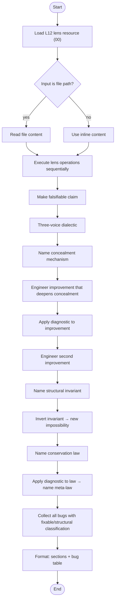
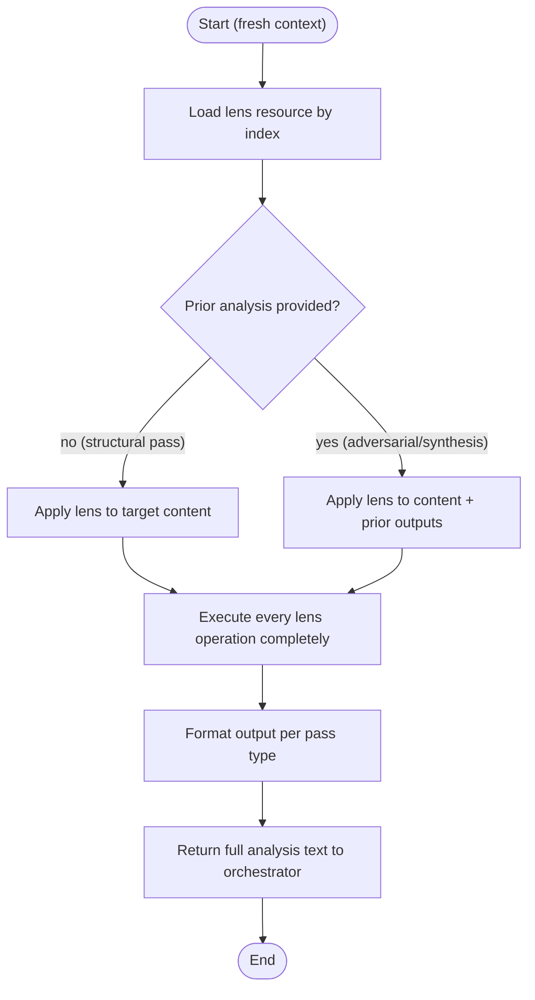
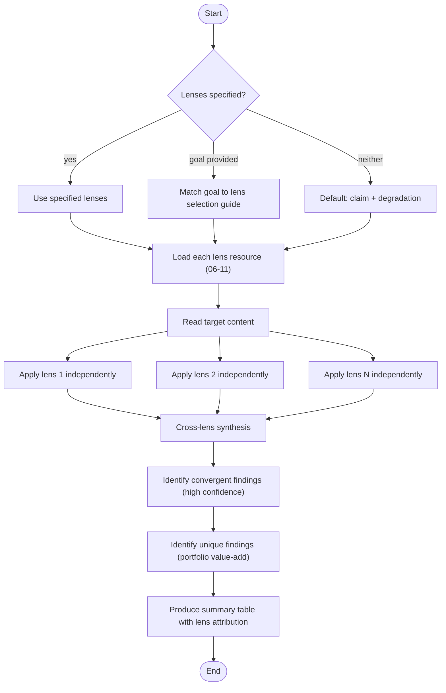
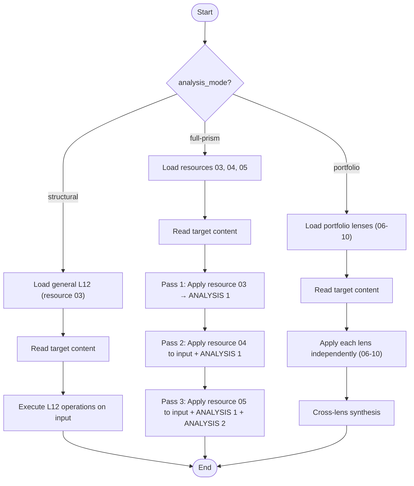
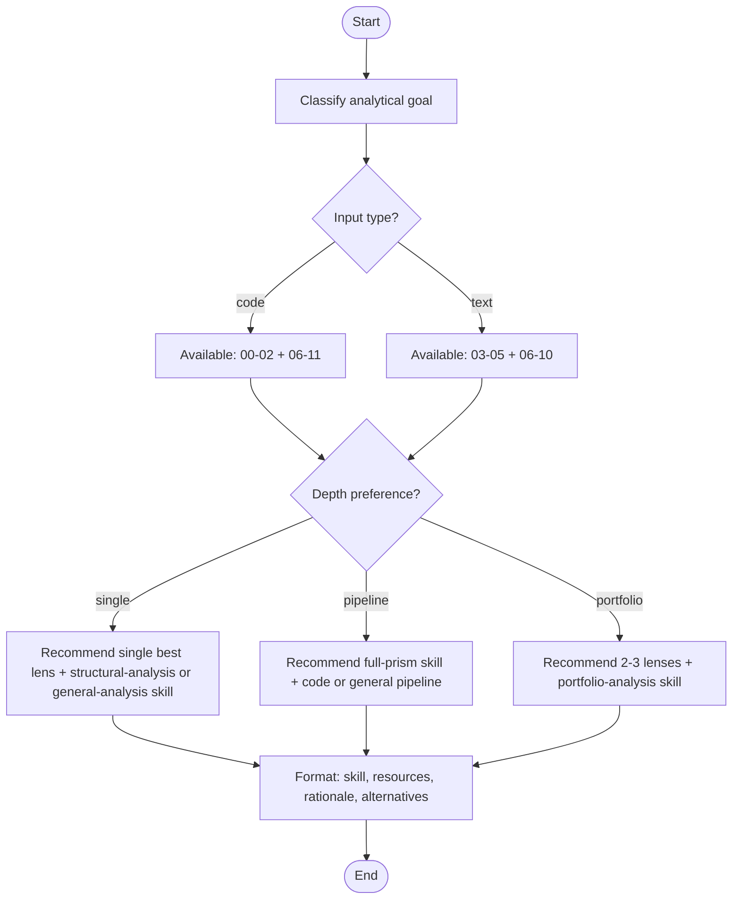
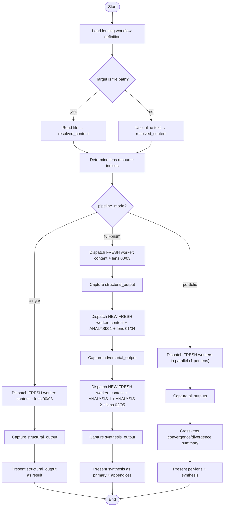

# Lensing Skills

> Part of the [Structural Analysis Lensing Workflow](../README.md)

## Skills (6 workflow-specific)

The lensing workflow provides 6 skills organized by role. Skills `orchestrate-lensing` and `full-prism` form the isolation pipeline. The remaining skills are usable standalone by any workflow.

| # | Skill ID | Capability | Role |
|---|----------|------------|------|
| 00 | `structural-analysis` | Single-pass L12 structural analysis on code | Standalone / Worker |
| 01 | `full-prism` | Execute one pass of the Full Prism pipeline in isolation | Worker |
| 02 | `portfolio-analysis` | Run 2+ complementary portfolio lenses | Standalone |
| 03 | `general-analysis` | Apply lenses to non-code input (requirements, designs, plans) | Standalone |
| 04 | `select-lens` | Recommend optimal lens(es) for an analytical goal | Advisory |
| 05 | `orchestrate-lensing` | Dispatch isolated workers for the Full Prism pipeline | Orchestrator |

> The universal skills `orchestrate-workflow` and `execute-activity` from [meta/skills/](../../meta/skills/) are **not used** by this workflow. Lensing uses its own orchestration skill (`orchestrate-lensing`) because it requires disposable (non-resumed) workers for context isolation.

---

### Skill Protocol: `structural-analysis` (00)

Single-pass L12 structural analysis. Loads the L12 lens prompt and applies it to code, producing a conservation law, meta-law, and severity-classified bug table. This is the foundational lensing operation — other workflows can reference it directly.

**Protocol steps:**

| Step Key | Action |
|----------|--------|
| `load-lens` | Load resource `00` from lensing workflow via `get_resource` |
| `read-target` | Read file or accept inline code; note optional analysis focus |
| `execute-lens` | Execute every L12 operation: claim → dialectic → concealment → improvements → invariant → inversion → conservation law → meta-law → bug table |
| `format-output` | Structure output with section headers; classify bugs as fixable/structural |

**Output:** Conservation law, meta-law, concealment mechanism, structural invariant, bug table with locations and severity.

---

### Skill Protocol: `full-prism` (01)

Worker-side skill for one pass of the 3-pass pipeline. Runs in a fresh isolated context dispatched by `orchestrate-lensing`. Receives target content, prior pass outputs (if any), and a resource index. Self-bootstraps by loading the lens via `get_resource`.

**Protocol steps:**

| Step Key | Action |
|----------|--------|
| `load-lens` | Load lens resource by index (00-05) via `get_resource("lensing", index)` |
| `apply-lens` | Apply lens operations to content; use prior outputs as context if provided |
| `format-output` | Structure per pass: structural → sections + bug table; adversarial → wrong predictions + overclaims + underclaims; synthesis → refined law + definitive classification |

**Key rule:** No context leakage — do not reference anything beyond what was provided in the prompt.

---

### Skill Protocol: `portfolio-analysis` (02)

Run 2+ portfolio lenses independently against the same artifact. Each lens finds genuinely different structural properties (zero overlap confirmed across 3+ real codebases). Produces per-lens findings plus a convergence/divergence synthesis.

**Protocol steps:**

| Step Key | Action |
|----------|--------|
| `select-lenses` | Use provided lenses, match goal to selection guide, or default to claim + degradation |
| `load-lenses` | Load each lens resource: pedagogy=06, claim=07, scarcity=08, rejected-paths=09, degradation=10, contract=11 |
| `read-target` | Read file or accept inline content |
| `execute-lenses` | Apply each lens independently — do not let one lens influence another |
| `cross-lens-synthesis` | Identify convergent (same property, multiple lenses) and unique (single lens) findings |

**Lens selection guide:**

| Analytical Goal | Recommended Lenses |
|-----------------|-------------------|
| Trade-off analysis | scarcity + rejected-paths |
| Hidden assumptions | claim + pedagogy |
| Maintainability risks | degradation + contract |
| Design rationale | pedagogy + rejected-paths |
| Interface quality | contract + claim |

---

### Skill Protocol: `general-analysis` (03)

Apply lenses to non-code input — requirements, designs, plans, strategies. Uses the general-domain lens set (resources 03-05) which has identical operations to code lenses but domain-neutral language.

**Protocol steps:**

| Step Key | Action |
|----------|--------|
| `determine-mode` | Route to structural (single L12), full-prism (3-pass), or portfolio based on `analysis_mode` |
| `read-target` | Read file or accept inline text |
| `execute-structural` | Load resource 03, execute all operations |
| `execute-full-prism` | Sequential: resource 03 → 04 (with ANALYSIS 1) → 05 (with both) |
| `execute-portfolio` | Load resources 06-10 (excluding 11-contract), apply independently, synthesize |

**Key rule:** The contract lens (resource 11) is code-specific — never use it for general analysis.

---

### Skill Protocol: `select-lens` (04)

Advisory skill that maps analytical goals to the optimal lens or combination. Returns a recommendation with skill ID, resource indices, and rationale. Does not execute analysis.

**Goal → Lens mapping matrix:**

| Goal | Lens(es) | Resource(s) |
|------|----------|-------------|
| Bug detection | L12 | 00 |
| Code review augmentation | L12 + contract | 00, 11 |
| Design review | claim + rejected-paths | 07, 09 |
| Codebase comprehension | pedagogy + rejected-paths | 06, 09 |
| Pre-commit validation | L12 pipeline | 00, 01, 02 |
| Planning review | L12 general | 03 |
| Maintainability assessment | degradation + contract | 10, 11 |
| Assumption validation | claim + scarcity | 07, 08 |

---

### Skill Protocol: `orchestrate-lensing` (05)

Coordination skill that dispatches each analytical pass to a fresh, isolated sub-agent. Captures full text output from each pass and forwards it verbatim to subsequent workers. Manages the pipeline lifecycle for single, full-prism, and portfolio modes.

**Protocol steps:**

| Step Key | Action |
|----------|--------|
| `load-workflow` | Load lensing workflow definition, initialize state variables |
| `resolve-target` | Read file path or use inline content as `resolved_content` |
| `determine-lens-indices` | Map target_type + pipeline_mode to resource indices |
| `dispatch-structural-pass` | Create FRESH worker with content + resource index; capture output |
| `dispatch-adversarial-pass` | Create NEW FRESH worker with content + ANALYSIS 1 + resource index |
| `dispatch-synthesis-pass` | Create NEW FRESH worker with content + ANALYSIS 1 + ANALYSIS 2 + resource index |
| `dispatch-portfolio-passes` | Create parallel FRESH workers (up to 4 concurrent), one per lens |
| `present-result` | Present final output per mode (single/full-prism/portfolio) |

**Key rule:** NEVER use Task `resume` between passes. Each pass MUST be a fresh sub-agent.
