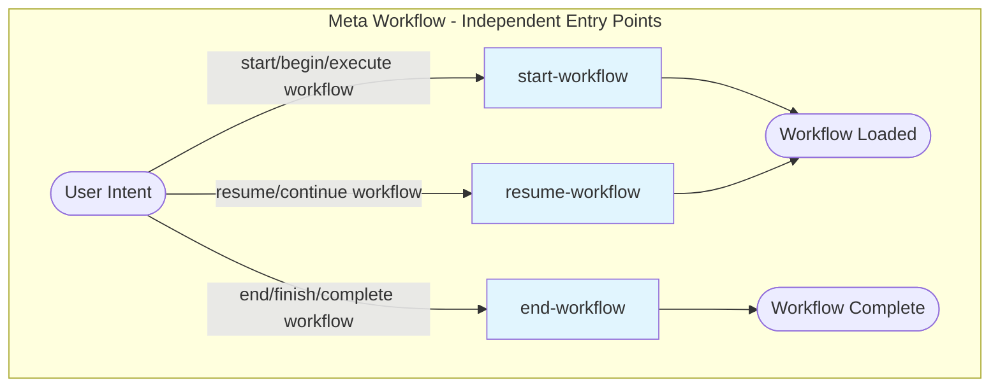
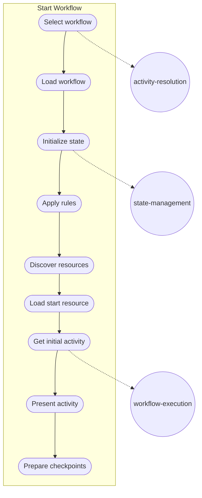
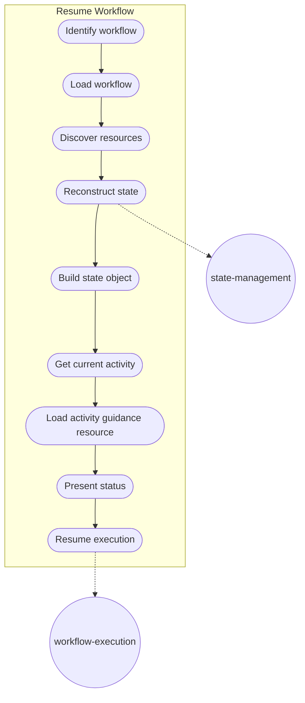
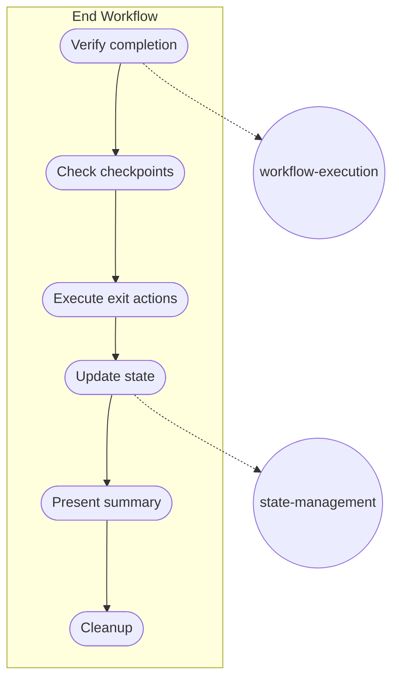

# Meta Workflow

> Bootstrap workflow for the workflow-server. Provides self-contained activities for workflow lifecycle management (start, resume, end). Each activity is an independent entry point matched via recognition patterns.

## Overview

The Meta workflow is the **entrypoint for all workflow operations**. Unlike other workflows with sequential activity flows, the Meta workflow provides three independent activities that are matched directly via user intent recognition patterns.

**Key characteristics:**
- Each activity is an independent entry point
- Activities are matched via recognition patterns (not sequential flow)
- Skills in this workflow are universal and apply to all workflows

## Workflow Structure

## Activities

### 1. Start Workflow

**Purpose:** Begin executing a new workflow from the beginning.

**Primary Skill:** `workflow-execution`  
**Supporting Skills:** `activity-resolution`, `state-management`

| Step | Description |
|------|-------------|
| Select workflow | If workflow not specified, call `list_workflows` to show options |
| Load workflow | Call `get_workflow` to load the selected workflow |
| Initialize state | Initialize state per state-management skill |
| Apply rules | Read and apply workflow rules |
| Discover resources | Call `list_workflow_resources` to discover available resources |
| Load start resource | Call `get_resource` for index 00 (start-here resource) if available |
| Get initial activity | Call `get_activity` for the initialActivity |
| Present activity | Present first activity to user with steps and entry actions |
| Prepare checkpoints | If activity has checkpoints, prepare to present when reached |

**Outcome:**
- Workflow is selected and loaded
- Initial state is created with correct initial activity
- First activity is entered
- Agent is ready to guide user through workflow

---

### 2. Resume Workflow

**Purpose:** Continue a workflow that was previously started.

**Primary Skill:** `workflow-execution`  
**Supporting Skills:** `activity-resolution`, `state-management`

| Step | Description |
|------|-------------|
| Identify workflow | Ask user to identify the workflow being resumed |
| Load workflow | Call `get_workflow` to load workflow definition |
| Discover resources | Call `list_workflow_resources` to discover available resources |
| Reconstruct state | Ask user: Which activity? What's completed? Key decisions? |
| Build state object | Build state object per state-management skill |
| Get current activity | Call `get_activity` for current activity |
| Load activity guidance resource | Call `get_resource` for activity-specific guidance resource if available |
| Present status | Present current activity status |
| Resume execution | Resume execution from current position |

**Outcome:**
- Previous state is restored or reconstructed
- Current activity is identified
- Remaining work is presented
- Agent is ready to continue guiding user

---

### 3. End Workflow

**Purpose:** Complete and finalize a workflow execution.

**Primary Skill:** `workflow-execution`  
**Supporting Skills:** `state-management`

| Step | Description |
|------|-------------|
| Verify completion | Verify all required activities are complete |
| Check checkpoints | Ensure all blocking checkpoints have responses |
| Execute exit actions | Execute any exit actions from final activity |
| Update state | Set workflow status to 'completed' with timestamp |
| Present summary | Present completion summary to user |
| Cleanup | Clear workflow context if appropriate |

**Outcome:**
- Workflow is marked as complete
- Final state is recorded
- User is informed of completion

---

## Skills Summary

The Meta workflow defines universal skills used by all workflows:

| Skill | Capability | Description |
|-------|------------|-------------|
| `activity-resolution` | Resolve user goals to activities | Maps user intent to appropriate activities and skills |
| `workflow-execution` | Execute workflows | Follows schema patterns for workflow execution |
| `state-management` | Manage workflow state | Handles state across sessions |
| `artifact-management` | Manage planning artifacts | Ensures artifacts are created in correct folder structure |

---

## Recognition Patterns

Activities are matched via these patterns:

| Pattern | Activity |
|---------|----------|
| start a workflow, begin workflow, execute workflow, run workflow | `start-workflow` |
| resume workflow, continue workflow, pick up where I left off | `resume-workflow` |
| end workflow, finish workflow, complete workflow, we're done | `end-workflow` |
