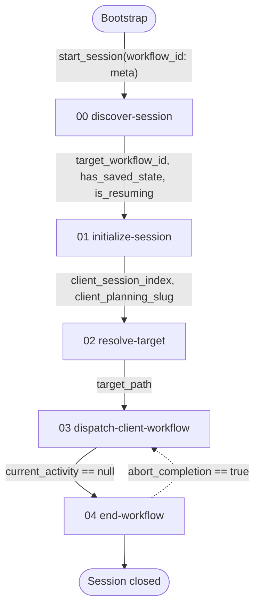

# Meta Workflow

> v5.2.0 — Top-level lifecycle workflow for the workflow-server. Bootstrap navigates here directly. The meta session runs five activities that identify a target client workflow, match any saved session, create or resume the client session as a child of meta, resolve target_path, drive the client workflow's activity loop and mediate its checkpoint yields, and close out. Provides the universal technique repository for all client workflows.

---

## Overview

The meta workflow is the structural home for the orchestration logic that used to live in technique prose. Every meta activity runs in the meta session as a real activity with formal steps (each binding a technique operation via `step.technique`), checkpoints, transitions, and — for `dispatch-client-workflow` — a `while` loop. Universal techniques live under [techniques/](techniques/) and are auto-resolved for any client workflow via the loader's workflow-local → `meta` fallback.

**Key characteristics:**

- Excluded from `list_workflows` — not a user-facing workflow.
- Bootstrap (resource [`bootstrap-protocol`](./resources/bootstrap-protocol.md)) is the pre-session stub served by `discover`: schema fetch → `start_session` → `get_workflow`. Ongoing delivery policy lives in the operations bundle ([workflow-engine](./techniques/workflow-engine/TECHNIQUE.md)). There is no separate START / RESUME branching in bootstrap — `discover-session` owns target identification and saved-session matching.
- Universal techniques resolve for any session via the loader's workflow-local → `meta` fallback chain.
- State persistence is server-managed (no agent-side persist/restore); on-disk shape: [`docs/state_management_model.md`](../../docs/state_management_model.md).

| # | Activity | Role |
|---|----------|------|
| 00 | [**Discover Session**](./activities/README.md#00-discover-session) | Identify the target client workflow and surface any saved session to resume |
| 01 | [**Initialize Session**](./activities/README.md#01-initialize-session) | Give the work package a stable identity and create or resume the client session as a child of meta |
| 02 | [**Resolve Target**](./activities/README.md#02-resolve-target) | Detect the repo structure (regular vs. submodule monorepo) and resolve `target_path` |
| 03 | [**Dispatch Client Workflow**](./activities/README.md#03-dispatch-client-workflow) | Drive the client workflow end to end inline, mediating its checkpoints with the user |
| 04 | [**End Workflow**](./activities/README.md#04-end-workflow) | Verify the client workflow's outcomes, summarise the session, and confirm closure |

**Detailed documentation:**

- **Activities:** see [activities/README.md](./activities/README.md) for the role each activity plays and links to its authoritative definition.
- **Pattern library:** see [activities/patterns/README.md](./activities/patterns/README.md) for borrowable mid-phase multi-agent pipelines (`orchestration-patterns` technique group).
- **Techniques:** see [techniques/](./techniques/) for the universal techniques and the rule-authority map (the [`agent-conduct`](./techniques/agent-conduct.md) technique is the single source of truth for cross-cutting rules). The [`orchestration-patterns`](./techniques/orchestration-patterns/TECHNIQUE.md) group supplies atomic dispatch/gather/synthesise ops for those pattern activities.
- **Resources:** see [resources/README.md](./resources/README.md) for the bootstrap protocol and prompt templates.

---

## Workflow Flow


```mermaid
graph TD
    startNode(["Bootstrap"]) -->|"start_session(workflow_id: meta)"| DS["00 discover-session"]
    DS -->|"target_workflow_id, has_saved_state, is_resuming"| INI["01 initialize-session"]
    INI -->|"client_session_index, client_planning_slug"| RT["02 resolve-target"]
    RT -->|"target_path"| DSP["03 dispatch-client-workflow"]
    DSP -->|"current_activity == null"| END["04 end-workflow"]
    END -.->|"abort_completion == true"| DSP
    END --> doneNode(["Session closed"])
```

---

## Hierarchical Orchestration Model

Meta is the user-facing orchestrator; the client session is a child driven inline by [`03-dispatch-client-workflow`](./activities/03-dispatch-client-workflow.yaml). Dispatch, checkpoint mediation, and role boundaries live in [workflow-engine](./techniques/workflow-engine/TECHNIQUE.md) ([dispatch-activity](./techniques/workflow-engine/dispatch-activity.md), [workflow-orchestrator](./techniques/workflow-engine/workflow-orchestrator.md), [activity-worker](./techniques/workflow-engine/activity-worker.md)) and [agent-conduct](./techniques/agent-conduct.md) — do not restate that HOW here.

---

## Techniques and the cross-workflow shared layer

The `meta/techniques/` and `meta/resources/` folders carry double duty. They
are the local content for the meta workflow itself AND the cross-workflow
shared layer — when any workflow asks for a technique that has no
workflow-local definition, the loader resolves it from `meta/techniques/`.
The ontology and section conventions every technique follows are defined in
[`meta/resources/workflow-canonical.md`](./resources/workflow-canonical.md).

Markdown techniques live under [`meta/techniques/`](techniques/). A standalone
technique is a single `<slug>.md` file; a grouped technique is a `<group>/`
folder containing `TECHNIQUE.md` (the index/base contract) plus one `<op>.md`
per operation, each addressed `<group>::<op>`. The
[`meta/techniques/TECHNIQUE.md`](techniques/TECHNIQUE.md) root base contract
is inherited by every meta technique.

---

## Techniques

Universal techniques referenced by canonical ID (the file/folder slug).

| Technique | Capability |
|-----------|------------|
| [`workflow-engine`](techniques/workflow-engine/TECHNIQUE.md) | Operations and rules for executing a workflow's structured flow — session lifecycle, activity dispatch, agent entry, transitions, planning Progress, and the checkpoint protocol. |
| [`agent-conduct`](techniques/agent-conduct.md) | Cross-cutting behavioural boundaries — single source of truth for file sensitivity, communication tone, attribution, code commentary, operational discipline, checkpoint discipline (worker / workflow-orchestrator / meta-orchestrator role split), and orchestrator discipline (`no-domain-work`, `no-inline-on-resume`, `target-path-scope`, `automatic-transitions`, `no-ad-hoc-interaction`) |
| [`version-control`](techniques/version-control/TECHNIQUE.md) | Planning-folder lifecycle, conventional commits, regular-vs-submodule commit workflows |
| [`github-cli-protocol`](techniques/github-cli-protocol/TECHNIQUE.md) | GitHub CLI usage with GraphQL-deprecation workarounds — REST API for mutations |
| [`knowledge-base-search`](techniques/knowledge-base-search/TECHNIQUE.md) | Optimised concept-rag searches via pre-indexed domain maps |
| [`atlassian-operations`](techniques/atlassian-operations/TECHNIQUE.md) | Atlassian Jira and Confluence operations via the Atlassian MCP server |
| [`gitnexus-operations`](techniques/gitnexus-operations/TECHNIQUE.md) | Codebase queries via the GitNexus knowledge graph: explore, impact, debug, refactor |
| [`cargo-operations`](techniques/cargo-operations/TECHNIQUE.md) | Resource-constrained cargo subcommands (build, check, clippy, test, fmt, doc, preflight) with an inline resource budget |
| [`harness-compat`](techniques/harness-compat/TECHNIQUE.md) | Harness-independent operations (`spawn-agent`, `continue-agent`, `spawn-concurrent`, `resolve-harness-operation`) abstracting cross-tool dispatch |

> Cross-cutting rules live in `agent-conduct`. Capability techniques (`workflow-engine`, `version-control`, etc.) reference but do not restate them. This is the single-source-of-truth boundary anti-pattern 27 calls for.

---

## Resources

| Resource ID | Resource | Purpose |
|-------------|----------|---------|
| `bootstrap-protocol` | [Bootstrap Protocol](./resources/bootstrap-protocol.md) | Pre-session stub served by `discover` — schema fetch, `start_session`, `get_workflow`. Ongoing delivery policy is in the operations bundle. |
| `session-summary-template` | [Session Summary Template](./resources/session-summary-template.md) | Skeleton for the markdown session summary composed by `generate-summary` at workflow close. |
| `planning-readme` | [Planning Folder README Guide](./resources/planning-readme.md) | Universal Template + Progress Status policy for planning-folder `README.md`. |

Agent entry Protocol: [`workflow-engine::activity-worker`](./techniques/workflow-engine/activity-worker.md) and [`workflow-engine::workflow-orchestrator`](./techniques/workflow-engine/workflow-orchestrator.md); spawn stubs from [`compose-prompt`](./techniques/workflow-engine/compose-prompt.md).

> The on-disk session-state shape is defined by [`schemas/session-file.schema.json`](../../schemas/session-file.schema.json); see [`docs/state_management_model.md`](../../docs/state_management_model.md) for the persistence model.

---

## Outputs

Meta itself produces no domain artefacts. Its outputs are session-state side-effects:

- A meta session that lives for the duration of the user's request.
- A child client session for the matched workflow, tracked alongside the meta session via the recursive `parentSession` snapshot the server captures inside the child's `session.json`.
- A planning folder under `.engineering/artifacts/planning/` containing the client workflow's server-managed `session.json` + `.session-token` (seal) pair and downstream artifacts.
- A session summary presented to the user at the completion checkpoint.

---

## File Structure

```
workflows/meta/
├── workflow.yaml                            # Meta workflow definition (16 variables, 3 rules)
├── README.md                                # This file
├── activities/
│   ├── 00-discover-session.yaml             # Match user request, scan saved sessions
│   ├── 01-initialize-session.yaml           # Create or resume the client session
│   ├── 02-resolve-target.yaml               # Detect repo type, set target_path
│   ├── 03-dispatch-client-workflow.yaml     # Drive the client activity loop (while current_activity != null)
│   └── 04-end-workflow.yaml                 # Outcome verification, summary
├── techniques/
│   ├── TECHNIQUE.md                         # Root base contract (inherited by every meta technique)
│   ├── agent-conduct.md                     # Cross-cutting rules (single source of truth)
│   ├── variable-binding.md                  # Strategy technique — bind step inputs/outputs to variables
│   ├── scatter-gather.md                    # Strategy technique — forEach fan-out / gather
│   ├── workflow-engine/                     # Session lifecycle, dispatch, transitions, checkpoint protocol
│   │   ├── TECHNIQUE.md                     #   group index / base contract
│   │   └── {op}.md                          #   one file per operation (start-session, create-session, dispatch-activity, ...)
│   ├── version-control/
│   │   ├── TECHNIQUE.md
│   │   └── {op}.md
│   ├── github-cli-protocol/
│   ├── knowledge-base-search/
│   ├── atlassian-operations/
│   ├── gitnexus-operations/
│   ├── cargo-operations/
│   └── harness-compat/
└── resources/
    ├── README.md                            # Resource index
    ├── bootstrap-protocol.md                # Pre-session stub (discover)
    ├── session-summary-template.md
    ├── planning-readme.md                   # Universal planning README Template + Progress policy
    └── workflow-canonical.md                # Ontology / section conventions
```
