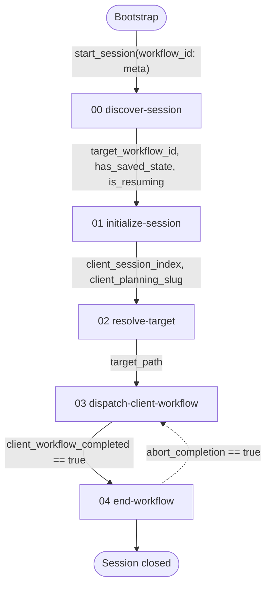
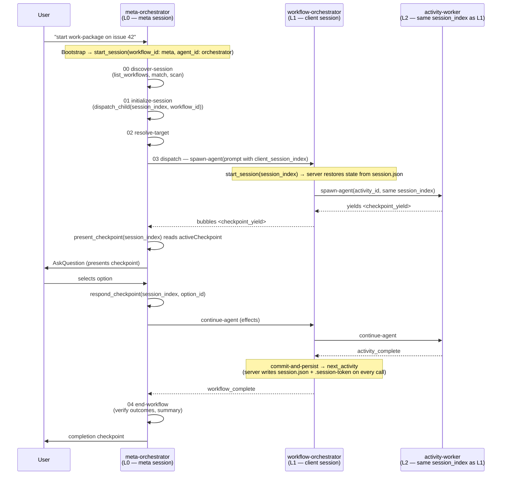

# Meta Workflow

> v5.0.0 — Top-level lifecycle workflow for the workflow-server. Bootstrap navigates here directly. The meta session runs five activities that identify a target client workflow, match any saved session, create or resume the client session as a child of meta, resolve target_path, dispatch the client orchestrator and mediate its checkpoint loop, and close out. Provides the universal technique repository for all client workflows.

---

## Overview

The meta workflow is the structural home for the orchestration logic that used to live in technique prose. Every meta activity runs in the meta session as a real activity with formal steps, checkpoints, decisions, and transitions. Universal techniques live under [techniques/](techniques/) and are auto-resolved for any client workflow via the loader's workflow-local → `meta` fallback.

**Key characteristics:**

- Excluded from `list_workflows` — not a user-facing workflow.
- Bootstrap (resource [`bootstrap-protocol`](./resources/bootstrap-protocol.md)) calls `start_session({ workflow_id: "meta", agent_id: "orchestrator" })` directly and saves the returned `session_index`. There is no separate START / RESUME branching in bootstrap — `discover-session` owns target identification and saved-session matching.
- Universal techniques resolve for any session via the loader's workflow-local → `meta` fallback chain.
- State persistence is server-managed. Every authenticated tool call atomically writes `session.json` + `.session-token` (seal) into the planning folder, so there are no agent-side persist or restore steps.

| # | Activity | Est. Time | Purpose |
|---|----------|-----------|---------|
| 00 | [**Discover Session**](./activities/README.md#00-discover-session) | 1-2m | Catalog workflows, match user request to `target_workflow_id`, scan for saved client sessions, present resume / workflow-selection checkpoints |
| 01 | [**Initialize Session**](./activities/README.md#01-initialize-session) | 1-2m | Dispatch the client workflow as a child of meta via `dispatch_child({ session_index, workflow_id, agent_id })`; server embeds the child SessionFile inline (or creates a new top-level folder when meta is transient). Variables are restored automatically by the server on resume. |
| 02 | [**Resolve Target**](./activities/README.md#02-resolve-target) | 1-2m | Detect repo type (regular vs. submodule monorepo) and resolve `target_path` for downstream git operations |
| 03 | [**Dispatch Client Workflow**](./activities/README.md#03-dispatch-client-workflow) | variable | Compose the orchestrator prompt, dispatch the orchestrator, drive the doWhile checkpoint-yield loop until `client_workflow_completed` |
| 04 | [**End Workflow**](./activities/README.md#04-end-workflow) | 2-3m | Verify outcomes, generate summary, completion checkpoint (with abort-back path to dispatch). Final state is already on disk — the server has persisted every authenticated call. |

**Detailed documentation:**

- **Activities:** see [activities/README.md](./activities/README.md) for steps, checkpoints, transitions, and condition tables.
- **Techniques:** see [techniques/](./techniques/) for the universal techniques and the rule-authority map (the [`agent-conduct`](./techniques/agent-conduct.md) technique is the single source of truth for cross-cutting rules).
- **Resources:** see [resources/README.md](./resources/README.md) for the bootstrap protocol and prompt templates.

---

## Workflow Flow


```mermaid
graph TD
    startNode(["Bootstrap"]) -->|"start_session(workflow_id: meta)"| DS["00 discover-session"]
    DS -->|"target_workflow_id, has_saved_state, is_resuming"| INI["01 initialize-session"]
    INI -->|"client_session_index, client_planning_slug"| RT["02 resolve-target"]
    RT -->|"target_path"| DSP["03 dispatch-client-workflow"]
    DSP -->|"client_workflow_completed == true"| END["04 end-workflow"]
    END -.->|"abort_completion == true"| DSP
    END --> doneNode(["Session closed"])
```

---

## Hierarchical Orchestration Model

The workflow-server implements a 3-tier hierarchical orchestration model. Meta runs as Level 0 (user-facing); each dispatched client workflow runs in its own child session as Level 1 (workflow-orchestrator); the activity-worker runs at Level 2 with the same `session_index` as its parent orchestrator. The server snapshots parent context recursively under the child session's `parentSession` field on creation.


```mermaid
sequenceDiagram
    participant User
    participant Meta as meta-orchestrator<br/>(L0 — meta session)
    participant Client as workflow-orchestrator<br/>(L1 — client session)
    participant Worker as activity-worker<br/>(L2 — same session_index as L1)

    User->>Meta: "start work-package on issue 42"
    Note over Meta: Bootstrap → start_session(workflow_id: meta, agent_id: orchestrator)
    Meta->>Meta: 00 discover-session<br/>(list_workflows, match, scan)
    Meta->>Meta: 01 initialize-session<br/>(dispatch_child(session_index, workflow_id))
    Meta->>Meta: 02 resolve-target

    Meta->>Client: 03 dispatch — spawn-agent(prompt with client_session_index)
    Note over Client: start_session(session_index) → server restores state from session.json

    Client->>Worker: spawn-agent(activity_id, same session_index)
    Worker-->>Client: yields <checkpoint_yield>
    Client-->>Meta: bubbles <checkpoint_yield>
    Meta->>Meta: present_checkpoint(session_index) reads activeCheckpoint
    Meta->>User: AskQuestion (presents checkpoint)
    User->>Meta: selects option
    Meta->>Meta: respond_checkpoint(session_index, option_id)
    Meta->>Client: continue-agent (effects)
    Client->>Worker: continue-agent

    Worker-->>Client: activity_complete
    Note over Client: commit-and-persist → next_activity<br/>(server writes session.json + .session-token on every call)
    Client-->>Meta: workflow_complete
    Meta->>Meta: 04 end-workflow<br/>(verify outcomes, summary)
    Meta->>User: completion checkpoint
```

---

## Techniques and the cross-workflow shared layer

The `meta/techniques/` and `meta/resources/` folders carry double duty. They
are the local content for the meta workflow itself AND the cross-workflow
shared layer — when any workflow asks for a technique that has no
workflow-local definition, the loader resolves it from `meta/techniques/`.
The ontology and section conventions every technique follows are defined in
[`meta/resources/workflow-canonical.md`](./resources/workflow-canonical.md).

Markdown techniques live under [`meta/techniques/`](techniques/). A standalone
technique is a single `<slug>.md` file; a grouped technique is a `<group>/`
folder containing `TECHNIQUE.md` (the index/base contract) plus one `<op>.md`
per operation, each addressed `<group>::<op>`. The
[`meta/techniques/TECHNIQUE.md`](techniques/TECHNIQUE.md) root base contract
is inherited by every meta technique.

---

## Techniques

Universal techniques referenced by canonical ID (the file/folder slug).

| Technique | Capability |
|-----------|------------|
| [`workflow-engine`](techniques/workflow-engine/TECHNIQUE.md) | Operations and rules for workflow execution — session lifecycle, activity dispatch, transition evaluation, checkpoint protocol. Server-managed state (no agent-side persist/restore). |
| [`agent-conduct`](techniques/agent-conduct.md) | Cross-cutting behavioural boundaries — single source of truth for file sensitivity, communication tone, attribution, code commentary, operational discipline, checkpoint discipline (worker / workflow-orchestrator / meta-orchestrator role split), and orchestrator discipline (`no-domain-work`, `no-inline-on-resume`, `target-path-scope`, `automatic-transitions`, `no-ad-hoc-interaction`) |
| [`version-control`](techniques/version-control/TECHNIQUE.md) | Planning-folder lifecycle, conventional commits, regular-vs-submodule commit workflows |
| [`github-cli-protocol`](techniques/github-cli-protocol/TECHNIQUE.md) | GitHub CLI usage with GraphQL-deprecation workarounds — REST API for mutations |
| [`knowledge-base-search`](techniques/knowledge-base-search/TECHNIQUE.md) | Optimised concept-rag searches via pre-indexed domain maps |
| [`atlassian-operations`](techniques/atlassian-operations/TECHNIQUE.md) | Atlassian Jira and Confluence operations via the Atlassian MCP server |
| [`gitnexus-operations`](techniques/gitnexus-operations/TECHNIQUE.md) | Codebase queries via the GitNexus knowledge graph: explore, impact, debug, refactor |
| [`harness-compat`](techniques/harness-compat/TECHNIQUE.md) | Harness-independent operations (`spawn-agent`, `continue-agent`, `spawn-concurrent`) abstracting cross-tool dispatch |

> Cross-cutting rules live in `agent-conduct`. Capability techniques (`workflow-engine`, `version-control`, etc.) reference but do not restate them. This is the single-source-of-truth boundary anti-pattern 27 calls for.

---

## Resources

| Resource ID | Resource | Purpose |
|-------------|----------|---------|
| `bootstrap-protocol` | [Bootstrap Protocol](./resources/bootstrap-protocol.md) | Pre-session navigation primer — load schemas, then `start_session({ workflow_id: "meta", agent_id: "orchestrator" })`. The meta workflow does the rest. |
| `activity-worker-prompt` | [Activity Worker Prompt](./resources/activity-worker-prompt.md) | Template prompt for spawning an activity-worker sub-agent (substitutes `session_index`). |
| `workflow-orchestrator-prompt` | [Workflow Orchestrator Prompt](./resources/workflow-orchestrator-prompt.md) | Template prompt for spawning a workflow-orchestrator sub-agent (substitutes `session_index`). |

> The on-disk session-state shape is defined by [`schemas/session-file.schema.json`](../../schemas/session-file.schema.json); see [`docs/state_management_model.md`](../../docs/state_management_model.md) for the persistence model.

---

## Variables

| Variable | Type | Description |
|----------|------|-------------|
| `target_workflow_id` | string | Client workflow to dispatch (set by `discover-session`) |
| `meta_session_index` | string | 6-character base32 `session_index` of the meta session itself — passed as `parent_session_index` when `create-session` creates the client session |
| `workflow_match_ambiguous` | boolean | Multiple workflows could match the request — gates the workflow-selection checkpoint |
| `has_saved_state` | boolean | A saved client session matched the request |
| `saved_planning_slug` | string | Planning slug of the matched saved client session — passed to `start_session` to resume |
| `is_resuming` | boolean | User chose to resume the matched saved session |
| `planning_folder_path` | string | Canonical absolute path to the client workflow's planning folder, resolved by the server under its workspace `.engineering` root — the single artifact location, never anchored to `target_path`/CWD |
| `client_session_index` | string | 6-character base32 `session_index` returned by `start_session` for the dispatched client workflow |
| `client_planning_slug` | string | Planning slug of the dispatched client workflow's planning folder — stable identifier the server uses to locate `session.json` |
| `is_monorepo` | boolean | Target is a submodule monorepo |
| `target_path` | string | Resolved target directory — `.` for regular repos, a submodule path for monorepos |
| `client_workflow_completed` | boolean | Dispatched client workflow reached `workflow_complete` |
| `target_workflow_outcomes` | string | The client workflow's declared outcomes, read by `verify-outcomes` during end-workflow close-out |
| `client_state` | string | The dispatched client workflow's final variable state, read by `verify-outcomes` during end-workflow |
| `client_trace` | string | The dispatched client workflow's execution trace, read by `generate-summary` during end-workflow |
| `abort_completion` | boolean | User chose to return to dispatch from end-workflow instead of closing |

---

## Outputs

Meta itself produces no domain artefacts. Its outputs are session-state side-effects:

- A meta session that lives for the duration of the user's request.
- A child client session for the matched workflow, tracked alongside the meta session via the recursive `parentSession` snapshot the server captures inside the child's `session.json`.
- A planning folder under `.engineering/artifacts/planning/` containing the client workflow's server-managed `session.json` + `.session-token` (seal) pair and downstream artifacts.
- A session summary presented to the user at the completion checkpoint.

---

## File Structure

```
workflows/meta/
├── workflow.toon                            # Meta workflow definition (16 variables, 3 rules)
├── README.md                                # This file
├── activities/
│   ├── 00-discover-session.toon             # Match user request, scan saved sessions
│   ├── 01-initialize-session.toon           # Create or resume the client session
│   ├── 02-resolve-target.toon               # Detect repo type, set target_path
│   ├── 03-dispatch-client-workflow.toon     # Dispatch + doWhile checkpoint loop
│   └── 04-end-workflow.toon                 # Outcome verification, summary
├── techniques/
│   ├── TECHNIQUE.md                         # Root base contract (inherited by every meta technique)
│   ├── agent-conduct.md                     # Cross-cutting rules (single source of truth)
│   ├── workflow-engine/                     # Session lifecycle, dispatch, transitions, checkpoint protocol
│   │   ├── TECHNIQUE.md                     #   group index / base contract
│   │   └── {op}.md                          #   one file per operation (create-session, dispatch-activity, ...)
│   ├── version-control/
│   │   ├── TECHNIQUE.md
│   │   └── {op}.md
│   ├── github-cli-protocol/
│   ├── knowledge-base-search/
│   ├── atlassian-operations/
│   ├── gitnexus-operations/
│   └── harness-compat/
└── resources/
    ├── bootstrap-protocol.md                # Pre-session navigation primer
    ├── activity-worker-prompt.md
    └── workflow-orchestrator-prompt.md
```
