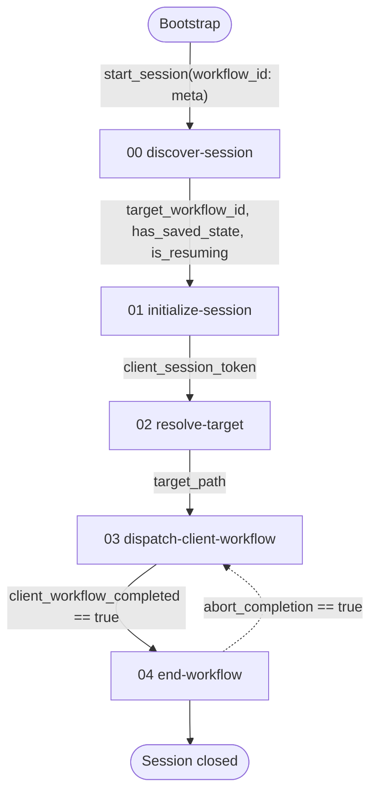
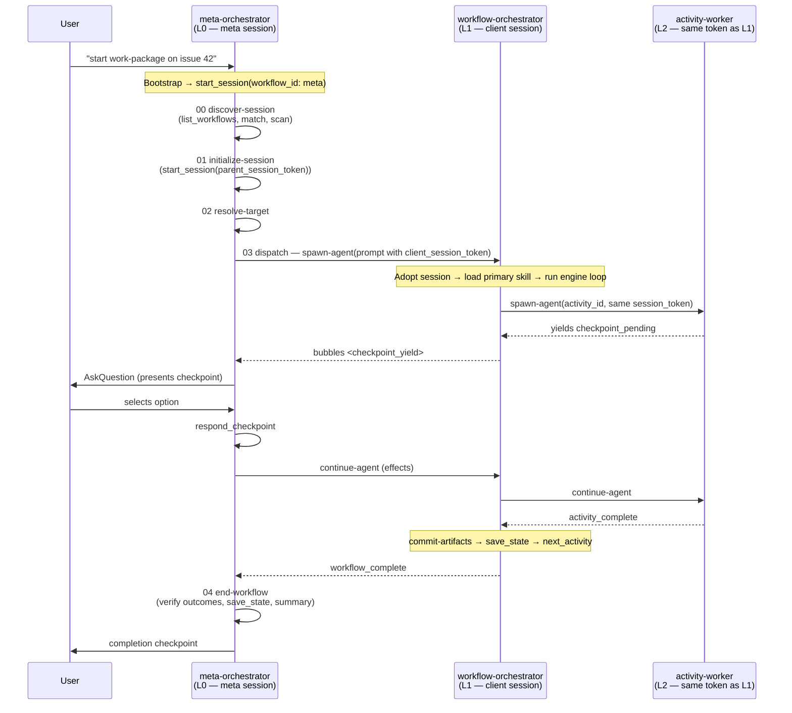

# Meta Workflow

> v4.0.0 — Top-level lifecycle workflow for the workflow-server. Bootstrap navigates here directly. The meta session runs five activities that identify a target client workflow, match any saved session, create or adopt the client session as a child of meta, resolve target_path, dispatch the client orchestrator and mediate its checkpoint loop, and close out. Provides the universal skill repository for all client workflows.

---

## Overview

The meta workflow is the structural home for the orchestration logic that used to live in skill prose. Every meta activity runs in the meta session as a real activity with formal steps, checkpoints, decisions, and transitions. Universal skills live under [skills/](skills/) and are auto-resolved for any client workflow via the loader's universal-skill fallback.

**Key characteristics:**

- Excluded from `list_workflows` — not a user-facing workflow.
- Bootstrap (resource [`bootstrap-protocol`](resources/00-bootstrap-protocol.md)) calls `start_session({ workflow_id: "meta" })` directly. There is no separate START / RESUME branching in bootstrap — `discover-session` owns target identification and saved-session matching.
- Universal skills resolve for any session via the loader's workflow-specific → cross-workflow → universal fallback chain.

| # | Activity | Est. Time | Purpose |
|---|----------|-----------|---------|
| 00 | [**Discover Session**](activities/README.md#00-discover-session) | 1-2m | Catalog workflows, match user request to `target_workflow_id`, scan for saved client sessions, present resume / workflow-selection checkpoints |
| 01 | [**Initialize Session**](activities/README.md#01-initialize-session) | 1-2m | Create a fresh child session via `start_session(parent_session_token)` or adopt the saved client session; restore variables on resume; create the planning folder on fresh starts |
| 02 | [**Resolve Target**](activities/README.md#02-resolve-target) | 1-2m | Detect repo type (regular vs. submodule monorepo) and resolve `target_path` for downstream git operations |
| 03 | [**Dispatch Client Workflow**](activities/README.md#03-dispatch-client-workflow) | variable | Compose the orchestrator prompt, dispatch the orchestrator, drive the doWhile checkpoint-yield loop until `client_workflow_completed` |
| 04 | [**End Workflow**](activities/README.md#04-end-workflow) | 2-3m | Verify outcomes, generate summary, persist final state, completion checkpoint (with abort-back path to dispatch) |

**Detailed documentation:**

- **Activities:** see [activities/README.md](activities/README.md) for steps, checkpoints, transitions, and condition tables.
- **Skills:** see [skills/README.md](skills/README.md) for the 12 universal skills and the rule-authority map.
- **Resources:** see [resources/README.md](resources/README.md) for the bootstrap protocol, prompt templates, and reference docs.

---

## Workflow Flow


```mermaid
graph TD
    startNode(["Bootstrap"]) -->|"start_session(workflow_id: meta)"| DS["00 discover-session"]
    DS -->|"target_workflow_id, has_saved_state, is_resuming"| INI["01 initialize-session"]
    INI -->|"client_session_token"| RT["02 resolve-target"]
    RT -->|"target_path"| DSP["03 dispatch-client-workflow"]
    DSP -->|"client_workflow_completed == true"| END["04 end-workflow"]
    END -.->|"abort_completion == true"| DSP
    END --> doneNode(["Session closed"])
```

---

## Hierarchical Orchestration Model

The workflow-server implements a 3-tier hierarchical orchestration model. Meta runs as Level 0 (user-facing); each dispatched client workflow runs in its own child session as Level 1 (workflow-orchestrator); the activity-worker runs at Level 2 with the same session token as its parent orchestrator.


```mermaid
sequenceDiagram
    participant User
    participant Meta as meta-orchestrator<br/>(L0 — meta session)
    participant Client as workflow-orchestrator<br/>(L1 — client session)
    participant Worker as activity-worker<br/>(L2 — same token as L1)

    User->>Meta: "start work-package on issue 42"
    Note over Meta: Bootstrap → start_session(workflow_id: meta)
    Meta->>Meta: 00 discover-session<br/>(list_workflows, match, scan)
    Meta->>Meta: 01 initialize-session<br/>(start_session(parent_session_token))
    Meta->>Meta: 02 resolve-target

    Meta->>Client: 03 dispatch — spawn-agent(prompt with client_session_token)
    Note over Client: Adopt session → load primary skill → run engine loop

    Client->>Worker: spawn-agent(activity_id, same session_token)
    Worker-->>Client: yields checkpoint_pending
    Client-->>Meta: bubbles <checkpoint_yield>
    Meta->>User: AskQuestion (presents checkpoint)
    User->>Meta: selects option
    Meta->>Meta: respond_checkpoint
    Meta->>Client: continue-agent (effects)
    Client->>Worker: continue-agent

    Worker-->>Client: activity_complete
    Note over Client: commit-artifacts → save_state → next_activity
    Client-->>Meta: workflow_complete
    Meta->>Meta: 04 end-workflow<br/>(verify outcomes, save_state, summary)
    Meta->>User: completion checkpoint
```

---

## Skills

12 universal skills referenced by canonical ID. Numeric prefixes order the files for humans; the loader strips them.

| # | Skill | Capability |
|---|-------|------------|
| 00 | [`session-protocol`](skills/00-session-protocol.toon) | Session token mechanics, checkpoint-handle discipline, step manifests, resource-loading conventions |
| 01 | [`agent-conduct`](skills/01-agent-conduct.toon) | Cross-cutting behavioural boundaries — single source of truth for file sensitivity, communication tone, attribution, code commentary, operational discipline, checkpoint discipline (worker / workflow-orchestrator / meta-orchestrator role split), and orchestrator discipline (no-domain-work, target-path-scope, automatic-transitions, no-ad-hoc-interaction) |
| 02 | [`state-management`](skills/02-state-management.toon) | Concept reference for variable mutation, persist-after-activity invariant, and adopted/recovered token semantics. Persistence is via the `save_state` and `restore_state` MCP tools |
| 03 | [`version-control`](skills/03-version-control.toon) | Planning-folder lifecycle, conventional commits, regular-vs-submodule commit workflows |
| 04 | [`github-cli-protocol`](skills/04-github-cli-protocol.toon) | GitHub CLI usage with GraphQL-deprecation workarounds — REST API for mutations |
| 05 | [`knowledge-base-search`](skills/05-knowledge-base-search.toon) | Optimised concept-rag searches via pre-indexed domain maps |
| 06 | [`atlassian-operations`](skills/06-atlassian-operations.toon) | Atlassian Jira and Confluence operations via the Atlassian MCP server |
| 07 | [`gitnexus-operations`](skills/07-gitnexus-operations.toon) | Codebase queries via the GitNexus knowledge graph: explore, impact, debug, refactor |
| 08 | [`meta-orchestrator`](skills/08-meta-orchestrator.toon) | Inline meta-workflow role: checkpoint mediation rules, sub-agent dispatch, meta-level error recovery. Activity protocols live in the activity TOON files, not here |
| 09 | [`activity-worker`](skills/09-activity-worker.toon) | Engine logic for the activity-worker role: bootstrap, step iteration, checkpoint yielding, artifact production |
| 10 | [`workflow-orchestrator`](skills/10-workflow-orchestrator.toon) | Engine logic for driving an arbitrary client workflow: doWhile-over-activities, transition evaluation, persist hooks |
| 11 | [`harness-compat`](skills/11-harness-compat.toon) | Harness-independent operations (`spawn-agent`, `continue-agent`, `spawn-concurrent`) abstracting cross-tool dispatch |

> Cross-cutting rules live in `agent-conduct`. Per-role skills (`meta-orchestrator`, `workflow-orchestrator`, `activity-worker`) reference but do not restate them. This is the single-source-of-truth boundary anti-pattern 27 calls for.

---

## Resources

| # | Resource | Purpose |
|---|----------|---------|
| 00 | [Bootstrap Protocol](resources/00-bootstrap-protocol.md) | Pre-session navigation primer — load schemas, then `start_session({ workflow_id: "meta" })`. The meta workflow does the rest |
| 01 | [Activity Worker Prompt](resources/01-activity-worker-prompt.md) | Template prompt for spawning an activity-worker sub-agent |
| 02 | [Workflow Orchestrator Prompt](resources/02-workflow-orchestrator-prompt.md) | Template prompt for spawning a workflow-orchestrator sub-agent |
| 03 | [GitNexus Reference](resources/03-gitnexus-reference.md) | Checklists, pattern tables, examples, and CLI commands for GitNexus workflows |
| 04 | [Atlassian Tools](resources/04-atlassian-tools.md) | Complete reference for Atlassian MCP server tools (Jira and Confluence) |
| 05 | [Workflow State Format](resources/05-workflow-state-format.md) | Schema reference for `workflow-state.toon` (the file `save_state` and `restore_state` operate on) |

---

## Variables

| Variable | Type | Description |
|----------|------|-------------|
| `target_workflow_id` | string | Client workflow to dispatch (set by `discover-session`) |
| `workflow_match_ambiguous` | boolean | Multiple workflows could match the request — gates the workflow-selection checkpoint |
| `has_saved_state` | boolean | A saved client session matched the request |
| `saved_session_token` | string | Saved client session token from a matched `workflow-state.toon` |
| `is_resuming` | boolean | User chose to resume the matched saved session |
| `planning_folder_path` | string | Absolute path to the client workflow's planning folder |
| `client_session_token` | string | Session token for the dispatched client workflow |
| `session_recovered` | boolean | `start_session` returned `recovered: true` (state must be reconstructed) |
| `session_adopted` | boolean | `start_session` returned `adopted: true` (token re-signed; payload preserved) |
| `is_monorepo` | boolean | Target is a submodule monorepo |
| `target_path` | string | Resolved target directory — `.` for regular repos, a submodule path for monorepos |
| `client_workflow_completed` | boolean | Dispatched client workflow reached `workflow_complete` |
| `pending_checkpoint_handle` | string | Most recently yielded checkpoint awaiting resolution |
| `abort_completion` | boolean | User chose to return to dispatch from end-workflow instead of closing |

---

## Output

Meta itself produces no domain artefacts. Its outputs are session-state side-effects:

- A meta session that lives for the duration of the user's request.
- A child client session for the matched workflow, tracked alongside the meta session via parent-context fields in the token.
- A planning folder under `.engineering/artifacts/planning/` containing the client workflow's `workflow-state.toon` and downstream artifacts.
- A session summary presented to the user at the completion checkpoint.

---

## File Structure

```
workflows/meta/
├── workflow.toon                            # Meta workflow definition (14 variables, 3 rules)
├── README.md                                # This file
├── activities/
│   ├── 00-discover-session.toon             # Match user request, scan saved sessions
│   ├── 01-initialize-session.toon           # Create or adopt the client session
│   ├── 02-resolve-target.toon               # Detect repo type, set target_path
│   ├── 03-dispatch-client-workflow.toon     # Dispatch + doWhile checkpoint loop
│   └── 04-end-workflow.toon                 # Outcome verification, summary, final persist
├── skills/
│   ├── 00-session-protocol.toon
│   ├── 01-agent-conduct.toon                # Cross-cutting rules (single source of truth)
│   ├── 02-state-management.toon
│   ├── 03-version-control.toon
│   ├── 04-github-cli-protocol.toon
│   ├── 05-knowledge-base-search.toon
│   ├── 06-atlassian-operations.toon
│   ├── 07-gitnexus-operations.toon
│   ├── 08-meta-orchestrator.toon
│   ├── 09-activity-worker.toon
│   ├── 10-workflow-orchestrator.toon
│   └── 11-harness-compat.toon
└── resources/
    ├── 00-bootstrap-protocol.md             # Pre-session navigation primer
    ├── 01-activity-worker-prompt.md
    ├── 02-workflow-orchestrator-prompt.md
    ├── 03-gitnexus-reference.md
    ├── 04-atlassian-tools.md
    └── 05-workflow-state-format.md
```
