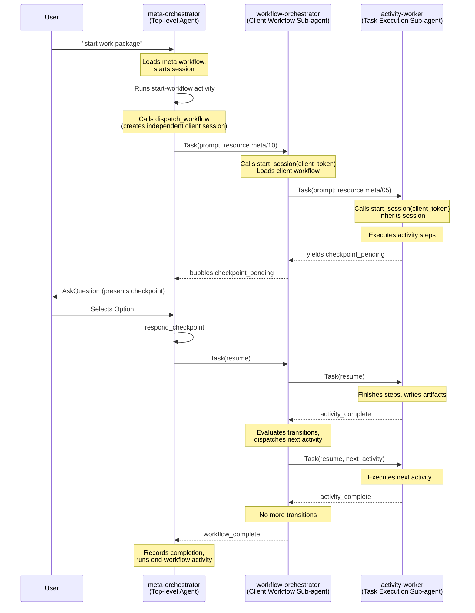
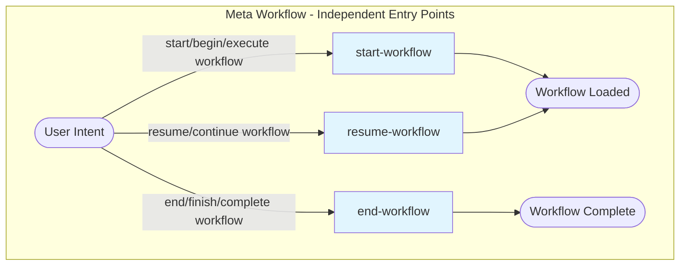
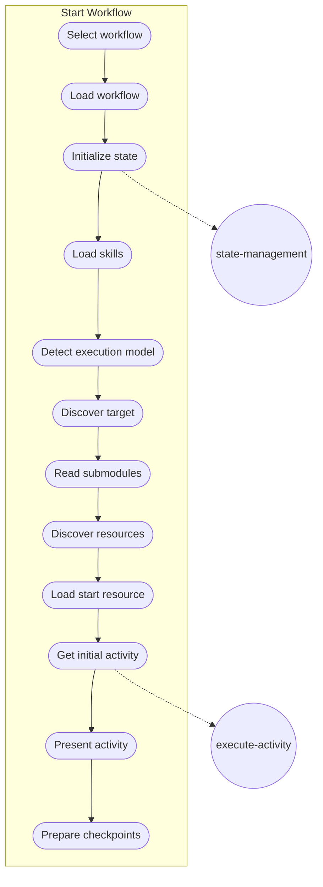
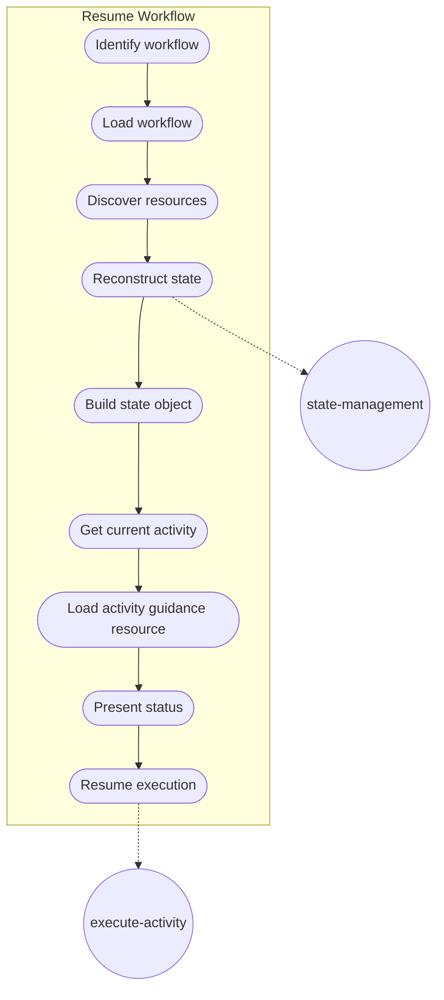
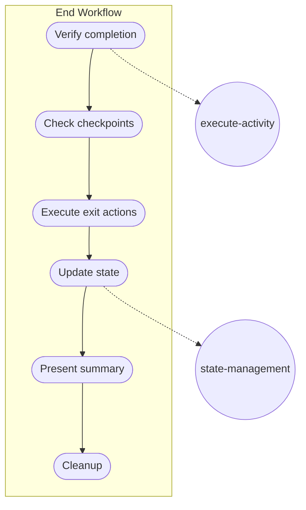

# Meta

> Skill and resource repository for the workflow-server. Provides universal skills (auto-included on first `get_skills` call) and self-contained activities for workflow lifecycle management (start, resume, end). Excluded from `list_workflows`.

## Overview

Meta is the **skill and resource repository** for the workflow server. It provides universal skills that apply to all workflows, plus three independent activities for workflow lifecycle management matched via user intent recognition patterns.

**Key characteristics:**
- Excluded from `list_workflows` — not a user-facing workflow
- Skills are universal and auto-included on the first `get_skills` call for any session
- Activities are independent entry points matched via recognition patterns (not sequential flow)

## Hierarchical Execution Model

The workflow-server implements a 3-tier hierarchical orchestration model. The top-level `meta-orchestrator` manages the outer session and user interaction, while client workflows are delegated to a `workflow-orchestrator` sub-agent, which in turn dispatches an `activity-worker` for discrete task execution.

```mermaid
sequenceDiagram
    participant User
    participant Meta as meta-orchestrator<br/>(Top-level Agent)
    participant Client as workflow-orchestrator<br/>(Client Workflow Sub-agent)
    participant Worker as activity-worker<br/>(Task Execution Sub-agent)

    User->>Meta: "start work package"
    Note over Meta: Loads meta workflow,<br/>starts session
    Meta->>Meta: Runs start-workflow activity

    Note over Meta: Calls dispatch_workflow<br/>(creates independent client session)
    Meta->>Client: Task(prompt: resource meta/10)

    Note over Client: Calls start_session(client_token)<br/>Loads client workflow
    
    Client->>Worker: Task(prompt: resource meta/05)
    Note over Worker: Calls start_session(client_token)<br/>Inherits session
    
    Note over Worker: Executes activity steps

    Worker-->>Client: yields checkpoint_pending
    Client-->>Meta: bubbles checkpoint_pending
    Meta->>User: AskQuestion (presents checkpoint)
    User->>Meta: Selects Option
    Meta->>Meta: respond_checkpoint
    
    Meta->>Client: Task(resume)
    Client->>Worker: Task(resume)
    
    Note over Worker: Finishes steps, writes artifacts
    Worker-->>Client: activity_complete

    Note over Client: Evaluates transitions,<br/>dispatches next activity
    
    Client->>Worker: Task(resume, next_activity)
    Note over Worker: Executes next activity...
    Worker-->>Client: activity_complete
    
    Note over Client: No more transitions
    Client-->>Meta: workflow_complete
    Note over Meta: Records completion,<br/>runs end-workflow activity
```

## Workflow Structure

```mermaid
graph TD
    subgraph meta[Meta Workflow - Independent Entry Points]
        Start([User Intent])
        
        Start -->|"start/begin/execute workflow"| SW[start-workflow]
        Start -->|"resume/continue workflow"| RW[resume-workflow]
        Start -->|"end/finish/complete workflow"| EW[end-workflow]
        
        SW --> WF([Workflow Loaded])
        RW --> WF
        EW --> Done([Workflow Complete])
    end
    
    style SW fill:#e1f5fe
    style RW fill:#e1f5fe
    style EW fill:#e1f5fe
```

## Activities

### 1. Start Workflow

**Purpose:** Begin executing a new workflow from the beginning.

**Primary Skill:** `execute-activity`  
**Supporting Skills:** `state-management`

```mermaid
graph TD
    subgraph start-workflow[Start Workflow]
        s1([Select workflow])
        s2([Load workflow])
        s3([Initialize state])
        s4([Load skills])
        s5([Detect execution model])
        s6([Discover target])
        s7([Read submodules])
        s8([Discover resources])
        s9([Load start resource])
        s10([Get initial activity])
        s11([Present activity])
        s12([Prepare checkpoints])
        
        s1 --> s2 --> s3 --> s4 --> s5 --> s6 --> s7 --> s8 --> s9 --> s10 --> s11 --> s12
    end
    
    skill1((execute-activity))
    skill3((state-management))
    
    s3 -.-> skill3
    s10 -.-> skill1
```

| Step | Description |
|------|-------------|
| Select workflow | Identify target workflow from user request or present available workflows |
| Load workflow | Load the selected workflow definition and extract metadata |
| Initialize state | Initialize workflow state with variable defaults |
| Load skills | Load behavioral protocols via get_skills (session-protocol, agent-conduct, workflow skills) |
| Detect execution model | Check for EXECUTION MODEL rule; load orchestrate-workflow skill if present |
| Discover target | Check for .gitmodules to determine repository type and resolve target_path |
| Read submodules | Parse .gitmodules for submodule selection (only when is_monorepo is true) |
| Discover resources | Load the workflow resource index for reference |
| Load start resource | Load the index-00 start resource if available |
| Get initial activity | Load the activity at initialActivity to begin execution |
| Present activity | Present first activity to user with steps and entry actions |
| Prepare checkpoints | Identify blocking checkpoints for presentation when reached |

**Outcome:**
- Workflow is selected and loaded
- Initial state is created with correct initial activity
- First activity is entered
- Agent is ready to guide user through workflow

---

### 2. Resume Workflow

**Purpose:** Continue a workflow that was previously started.

**Primary Skill:** `execute-activity`  
**Supporting Skills:** `state-management`

```mermaid
graph TD
    subgraph resume-workflow[Resume Workflow]
        r1([Identify workflow])
        r2([Load workflow])
        r3([Discover resources])
        r4([Reconstruct state])
        r5([Build state object])
        r6([Get current activity])
        r7([Load activity guidance resource])
        r8([Present status])
        r9([Resume execution])
        
        r1 --> r2 --> r3 --> r4 --> r5 --> r6 --> r7 --> r8 --> r9
    end
    
    skill1((execute-activity))
    skill3((state-management))
    
    r4 -.-> skill3
    r9 -.-> skill1
```

| Step | Description |
|------|-------------|
| Identify workflow | Ask user to identify the workflow being resumed |
| Load workflow | Call `get_workflow` to load workflow definition |
| Discover resources | Call `list_workflow_resources` to discover available resources |
| Reconstruct state | Ask user: Which activity? What's completed? Key decisions? |
| Build state object | Build state object per state-management skill |
| Get current activity | Call `get_activity` for current activity |
| Load activity guidance resource | Call `get_resource` for activity-specific guidance resource if available |
| Present status | Present current activity status |
| Resume execution | Resume execution from current position |

**Outcome:**
- Previous state is restored or reconstructed
- Current activity is identified
- Remaining work is presented
- Agent is ready to continue guiding user

---

### 3. End Workflow

**Purpose:** Complete and finalize a workflow execution.

**Primary Skill:** `execute-activity`  
**Supporting Skills:** `state-management`

```mermaid
graph TD
    subgraph end-workflow[End Workflow]
        e1([Verify completion])
        e2([Check checkpoints])
        e3([Execute exit actions])
        e4([Update state])
        e5([Present summary])
        e6([Cleanup])
        
        e1 --> e2 --> e3 --> e4 --> e5 --> e6
    end
    
    skill1((execute-activity))
    skill3((state-management))
    
    e1 -.-> skill1
    e4 -.-> skill3
```

| Step | Description |
|------|-------------|
| Verify completion | Verify all required activities are complete |
| Check checkpoints | Ensure all blocking checkpoints have responses |
| Execute exit actions | Execute any exit actions from final activity |
| Update state | Set workflow status to 'completed' with timestamp |
| Present summary | Present completion summary to user |
| Cleanup | Clear workflow context if appropriate |

**Outcome:**
- Workflow is marked as complete
- Final state is recorded
- User is informed of completion

---

## Skills Summary

Meta defines universal skills used by all workflows:

| Skill | Capability | Description |
|-------|------------|-------------|
| `session-protocol` | Session lifecycle protocol | Bootstrap sequence (start_session → get_skills → get_workflow → next_activity), token handling, step manifests, resource loading via get_resource |
| `agent-conduct` | Agent behavioral boundaries | File sensitivity, communication tone, resource loading discipline, build command priority |
| `execute-activity` | Execute a single activity | Self-bootstraps and executes activity steps using get_skill for step-level skill loading. Includes checkpoint yielding and artifact production. |
| `state-management` | Manage workflow state | Initialize, update, and persist state across sessions. Agent writes session token + variables + trace to disk; resumes via start_session(session_token) |
| `artifact-management` | Manage planning artifacts | Planning folder creation, regular file and submodule commit workflows |
| `version-control-protocol` | Version control practices | Conventional commits, branch management, destructive operation guardrails |
| `github-cli-protocol` | GitHub CLI usage | GraphQL deprecation workarounds, REST API for mutations |
| `knowledge-base-search` | Optimise knowledge base searches | Pre-indexes domain maps before querying concept-rag |
| `atlassian-operations` | Atlassian Jira and Confluence operations | Guides correct tool call sequences for the Atlassian MCP server |
| `gitnexus-operations` | Query codebases via knowledge graph | GitNexus MCP tools for impact analysis, debugging, refactoring |
| `orchestrator-management` | Consolidated orchestrator skill | Workflow coordination, state management, worker dispatch, checkpoint presentation. Inline-only — never delegated to a sub-agent. |
| `worker-management` | Consolidated worker skill | Activity execution, step-level skill loading via get_skill, checkpoint yielding, artifact production. Loaded by worker sub-agents. |

> **Note:** `workflow-execution` was absorbed into `execute-activity`. `orchestrator-management` and `worker-management` are consolidated role-based skills — the orchestrator manages workflow lifecycle and dispatches workers; the worker self-bootstraps and executes activity steps. Agent behavioral rules are delivered through `session-protocol` and `agent-conduct` skills.

---

## Recognition Patterns

Activities are matched via these patterns:

| Pattern | Activity |
|---------|----------|
| start a workflow, begin workflow, execute workflow, run workflow | `start-workflow` |
| resume workflow, continue workflow, pick up where I left off | `resume-workflow` |
| end workflow, finish workflow, complete workflow, we're done | `end-workflow` |
