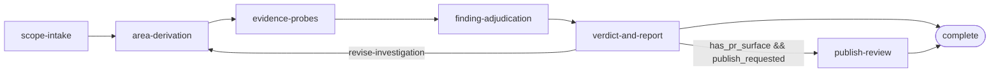

# Midnight System Review Workflow

Evidence-driven system-level review of a midnight-node change-set, rendering a 1-5 merge-readiness verdict with per-area accounting and optionally publishing it to the pull request.

## Overview

Given a PR reference or local diff, the workflow derives investigation areas from the changed surface and a subsystem map, runs bounded evidence probes per area, adjudicates rubric-graded findings, and computes the verdict from accepted findings only. The methodology recreates the Jina simulation bot's system-review runs against midnight-node (PR #1849 evidence): plan-approved autonomous investigation, a six-dimension grade tuple per finding, an accepted-issue confidence threshold, and reconciled per-area accounting.

Four user decision points bound the run — scope confirmation (non-blocking, 30s auto-advance), investigation-plan approval (blocking, with an amendment loop), verdict sign-off (blocking, with a rework path back to area derivation), and publish authorization (blocking, only when a PR surface exists). Probing and adjudication run checkpoint-free between the plan and verdict gates.

Declared variables are run configuration and boolean gates only (`review_target`, `target_repo_path`, `base_ref`, `planning_folder_path`, `insight_repo_path`, `probe_budget_per_area`, plus the `has_pr_surface`, toolchain, `plan_approved`, and `publish_requested` gates); rich data flows through step outputs and the planning-folder artifacts (`change-surface.md`, `investigation-plan.md`, `evidence-log.md`, `findings-register.md`, `review-report.md`, `publication-record.md`).

## Getting Started

**To start a review, say:** `"run a system review of midnight-node PR #1849"` or `"system-review the changes on this branch against origin/main"`

### Required Inputs

| Input | Description | Example |
|-------|-------------|---------|
| **`review_target`** | PR reference (number or URL) or local diff spec identifying the change-set under review | `#1849` |
| **`target_repo_path`** | Path to the midnight-node checkout under review | `/path/to/midnight-node` |

### Optional Inputs

| Input | Description | Default |
|-------|-------------|---------|
| **`base_ref`** | Base ref for the three-dot merge-base change surface | `origin/main` |
| **`insight_repo_path`** | Local midnight-agent-eng insight checkout enriching the bundled subsystem-map snapshot | bundled snapshot only |
| **`probe_budget_per_area`** | Maximum evidence probes per investigation area | `4` |

The toolchain gates (`gitnexus_available`, `cargo_available`, `node_binary_available`) are detected during scope-intake, not supplied; when a gate is false the affected probes degrade to fallbacks or are recorded as blocked validations, and the run completes regardless.

## Workflow Flow



## Activities

| # | Activity | Role |
|---|----------|------|
| 01 | [`scope-intake`](activities/01-scope-intake.yaml) | Resolve the authoritative change surface (GitHub file list / three-dot merge-base diff), set the toolchain gates, confirm scope |
| 02 | [`area-derivation`](activities/02-area-derivation.yaml) | Map the change surface onto the subsystem map, derive bounded investigation areas, and secure plan approval through the amendment loop |
| 03 | [`evidence-probes`](activities/03-evidence-probes.yaml) | Execute the plan area by area — at most `probe_budget_per_area` catalog probes each, degrading per toolchain gates — and consolidate the evidence log |
| 04 | [`finding-adjudication`](activities/04-finding-adjudication.yaml) | Grade every candidate with the full tuple, disposition against the accepted-issue threshold, write the findings register |
| 05 | [`verdict-and-report`](activities/05-verdict-and-report.yaml) | Compute the 1-5 verdict from accepted findings, render the report with reconciled accounting, secure sign-off, decide publication |
| 06 | [`publish-review`](activities/06-publish-review.yaml) *(conditional)* | Post the signed-off review to the PR and record the publication |

## Techniques

| Technique | Kind | Capability |
|-----------|------|------------|
| [`scope-intake`](techniques/scope-intake/TECHNIQUE.md) | group | Surface resolution and toolchain detection |
| [`area-derivation`](techniques/area-derivation/TECHNIQUE.md) | group | Investigation-plan derivation and amendment |
| [`evidence-probes`](techniques/evidence-probes/TECHNIQUE.md) | group | Per-area probe execution and evidence consolidation (the scatter-gather pair) |
| [`finding-adjudication`](techniques/finding-adjudication/TECHNIQUE.md) | group | Rubric grading and threshold disposition |
| [`verdict-and-report`](techniques/verdict-and-report/TECHNIQUE.md) | group | Verdict computation and report rendering |
| [`publish-review`](techniques/publish-review/TECHNIQUE.md) | group | Publication recording |
| `meta::variable-binding` | strategy | Step input/output binding against the session variable bag (workflow-level) |
| `meta::scatter-gather` | strategy | Sequential per-area scatter with ordered gather and delegated combine (declared on `evidence-probes`) |
| `meta::gitnexus-operations` | reuse | Code-graph probes when `gitnexus_available` is true |
| `work-package::update-pr::post-review-comment` | reuse | Posts `review_summary` to the PR verbatim as a `gh pr review` with the verdict-derived `review_type` |

## Resources

| Resource | Owns |
|----------|------|
| [`subsystem-map.md`](resources/subsystem-map.md) | The midnight-node subsystem topology — paths, failure classes, probe affinities — that area derivation maps changes onto |
| [`probe-catalog.md`](resources/probe-catalog.md) | The six bounded probe classes, their instruments, toolchain gates, and blocked-validation handling |
| [`grading-rubric.md`](resources/grading-rubric.md) | The six-dimension grade tuple, the accepted-issue threshold, and calibration anchors from real findings |
| [`verdict-rubric.md`](resources/verdict-rubric.md) | The 1-5 merge-readiness scale, run status vocabulary, and the verdict-to-review-type mapping |
| [`review-format.md`](resources/review-format.md) | The canonical review structure and the Review Details accounting rules the reconciliation gate checks |

## File Structure

```
midnight-system-review/
├── workflow.yaml
├── README.md
├── activities/
│   ├── README.md
│   └── 01…06 activity YAML (one per activity above)
├── techniques/
│   ├── README.md
│   ├── TECHNIQUE.md            # base contract: planning_folder_path, target_repo_path
│   ├── scope-intake/           # TECHNIQUE.md, resolve-change-surface, detect-toolchain
│   ├── area-derivation/        # TECHNIQUE.md, derive-areas, amend-plan
│   ├── evidence-probes/        # TECHNIQUE.md, probe-area, consolidate-evidence
│   ├── finding-adjudication/   # TECHNIQUE.md, grade-findings, register-findings
│   ├── verdict-and-report/     # TECHNIQUE.md, compute-verdict, render-review
│   └── publish-review/         # TECHNIQUE.md, record-publication
└── resources/
    ├── README.md
    ├── subsystem-map.md
    ├── probe-catalog.md
    ├── grading-rubric.md
    ├── verdict-rubric.md
    └── review-format.md
```
