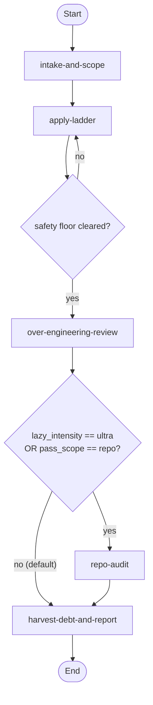

# Ponytail Lean-Coding Workflow

> v1.0.0 — Drive a coding task, change, or codebase toward the leanest solution that still clears a non-negotiable safety floor, tracking every deliberate simplification as ponytail debt.

---

## Overview

Ponytail encodes the discipline of the lazy senior developer — lazy meaning *efficient*, not careless. The best code is the code that is never written, because every line that exists is a line to read, test, secure, and maintain. The workflow drives a change toward the leanest rung of [the ladder](resources/the-ladder.md#rungs) that still works, while holding a [safety floor](resources/the-ladder.md#safety-floor) that no shortcut may cross, and records each deliberate simplification as a [ponytail marker](resources/ponytail-marker-convention.md#convention) so the debt is tracked rather than forgotten.

**Use this workflow when you want to:**

- Build a change at the leanest rung that solves the real problem, not the imagined one
- Review a diff or a whole repo for over-engineering and quantify the cut
- Surface and track the deliberate simplifications already sitting in a codebase
- Get an honest accounting of the lean gain without fabricated savings numbers

The lazy lens has two dials. **Intensity** (`lite` / `full` / `ultra`) sets how aggressively a construct is flagged and how the code is built; **scope** (`change` / `repo`) sets whether the pass covers the diff or the whole tree. Setting either to its widest — `ultra` intensity or `repo` scope — adds the repo-wide audit.

---

## Adaptation notes (skill → workflow)

This workflow distills the original **[Ponytail](https://github.com/DietrichGebert/ponytail)** project by Dietrich Gebert — an always-on "lazy senior developer" skill set (the ladder, the safety floor, and the over-engineering review / repo audit / debt / gain skills) — into the workflow-server model. Two divergences from the source are intentional:

- **Invoked, not persistent.** The original skill is a per-response lens active on every reply until switched off. This workflow is invoked for a piece of work: intensity is selected once at intake and held for the pass, rather than persisting across a whole session.
- **Governs what is built, not how you talk.** The skill pairs with Caveman to also shape conversational style; that pairing is out of scope here. The `output-discipline` rule constrains only *unrequested* code-adjacent prose (design notes, feature tours) — not user-facing communication, and never the report artifacts the workflow's own techniques are asked to produce.

---

## Workflow Flow



---

## Activities

| # | Activity | Description |
|---|----------|-------------|
| 01 | **Intake and Scope** (`intake-and-scope`) | Capture the task and target, set intensity and scope, and trace the real end-to-end flow before climbing |
| 02 | **Apply Ladder** (`apply-ladder`) | Climb to the minimal solution, mark deliberate simplifications, leave one runnable check, and clear the safety floor |
| 03 | **Over-Engineering Review** (`over-engineering-review`) | Tag the change's over-engineering one line per finding, closing with a net line-count scoreboard |
| 04 | **Repo Audit** (`repo-audit`) | Hunt repo-wide over-engineering biggest-cut-first (gated; `required: false`) |
| 05 | **Harvest Debt and Report** (`harvest-debt-and-report`) | Harvest ponytail markers into a debt ledger and append an honest gain scoreboard |

**Detailed documentation:** See [activities/README.md](activities/README.md) and the per-activity YAML definitions.

---

## Variables

| Variable | Type | Default | Required | Purpose |
|----------|------|---------|----------|---------|
| `task_description` | string | — | yes | The coding task, change, or audit target to be made lean |
| `target_path` | string | `.` | no | Path to the code or repo under the lazy lens |
| `lazy_intensity` | string | `full` | no | `lite` / `full` / `ultra` — review depth; `ultra` gates in the repo audit |
| `pass_scope` | string | `change` | no | `change` (diff-scoped) or `repo` (whole-tree); `repo` gates in the repo audit |
| `safety_floor_cleared` | boolean | `false` | no | Set by the safety-floor checkpoint; gates the transition into review |
| `has_debt_markers` | boolean | `false` | no | Set during harvest; gates the gain-report tail |

---

## Techniques

The cross-cutting [`variable-binding`](../meta/techniques/variable-binding.md) technique is declared once at the workflow level and inherited by every activity. Every step binds one of the workflow's standalone techniques.

The lean-coding capability is owned by six standalone top-level techniques, each inheriting the workflow-root [`techniques/TECHNIQUE.md`](techniques/TECHNIQUE.md) base contract. The base contract holds the shared inputs (`task_description`, `target_path`, `lazy_intensity`, `pass_scope`) and rules (`output-discipline`, `take-higher-rung`, `deletion-over-addition`); every technique inherits them and is bound bare as `<op>`.

| Technique | Capability |
|-----------|------------|
| `scope-intake` | Capture and trace the change before a rung is chosen |
| `apply-ladder` | Climb to the minimal solution, mark ceilings, leave one check |
| `review-over-engineering` | Tag a change's over-engineering with a net-lines scoreboard |
| `audit-repo` | Hunt repo-wide over-engineering biggest-cut-first |
| `harvest-debt` | Harvest ponytail markers into a debt ledger |
| `report-gain` | Append an honesty-bounded gain scoreboard to the ledger |

`scope-intake` also binds the cross-workflow [`gitnexus-operations`](../meta/techniques/gitnexus-operations/TECHNIQUE.md) `query` / `context` operations for flow tracing when the codebase is indexed.

**Detailed documentation:** See [techniques/README.md](techniques/README.md) and [techniques/TECHNIQUE.md](techniques/TECHNIQUE.md).

---

## Resources

Four single-source reference files carry the discipline the operations apply:

| Resource | Owns |
|----------|------|
| [the-ladder.md](resources/the-ladder.md) | The understand-first trace, the seven rungs, and the safety floor |
| [review-taxonomy.md](resources/review-taxonomy.md) | The five over-engineering tags, the finding format, and the scoreboard |
| [ponytail-marker-convention.md](resources/ponytail-marker-convention.md) | The `ponytail: <ceiling>, add when <trigger>` marker convention and `no-trigger` flag |
| [honesty-boundary.md](resources/honesty-boundary.md) | The gain-reporting rule — benchmark medians only, never a fabricated per-repo figure |

**Detailed documentation:** See [resources/README.md](resources/README.md) for the catalog.

---

## File Structure

```
workflows/ponytail/
├── workflow.yaml                              # Workflow definition (6 variables, audience-partitioned rules, 5 activities)
├── README.md                                  # This file
├── activities/
│   ├── README.md                              # Activities orientation map
│   ├── 01-intake-and-scope.yaml               # Capture, set lens, trace; intensity-and-scope-confirmed checkpoint
│   ├── 02-apply-ladder.yaml                   # Climb the rungs; safety-floor-cleared blocking checkpoint
│   ├── 03-over-engineering-review.yaml        # Diff-scoped tagged review; gated transition to repo-audit
│   ├── 04-repo-audit.yaml                     # Repo-wide audit (required: false, gated-in)
│   └── 05-harvest-debt-and-report.yaml        # Harvest markers + gain report tail (terminal)
├── techniques/
│   ├── README.md                              # Techniques orientation map
│   ├── TECHNIQUE.md                           # Workflow-root base contract (shared inputs + rules)
│   ├── scope-intake.md                        # Capture and trace → lean-brief.md
│   ├── apply-ladder.md                        # Climb the rungs → lean-change.md
│   ├── review-over-engineering.md             # Diff-scoped tagged review → review-findings.md
│   ├── audit-repo.md                          # Repo-wide hunt → audit-findings.md
│   ├── harvest-debt.md                        # Grep ponytail markers → debt-ledger.md
│   └── report-gain.md                         # Honesty-bounded gain scoreboard (appends to debt-ledger.md)
└── resources/
    ├── README.md                              # Resource catalog
    ├── the-ladder.md                          # 7 rungs + safety floor + understand-first
    ├── review-taxonomy.md                     # 5 tags: delete / stdlib / native / yagni / shrink
    ├── ponytail-marker-convention.md          # ponytail: marker convention + no-trigger
    └── honesty-boundary.md                    # Gain-reporting honesty rule
```
