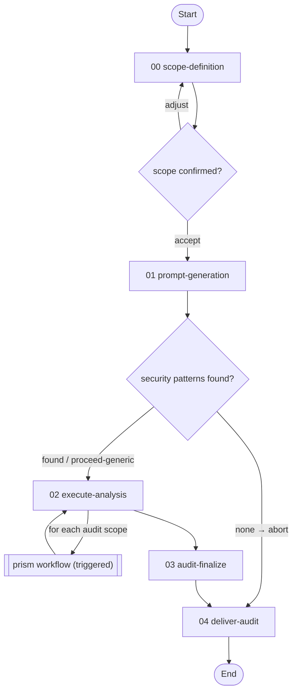

# Prism Audit Workflow

> v1.1.0 — Security audits that generate a codebase-tailored audit prompt, drive it through the [prism](../prism/README.md) analysis engine, and finalize prism's contract artifacts into an actionable, severity-calibrated report set.

---

## Overview

The prism-audit workflow orchestrates a security audit in two halves. First it **reads the target codebase** and composes a detailed, self-contained audit prompt grounded in that codebase's actual architecture, language, and risk exposure. Then it **triggers the generic [prism](../prism/README.md) workflow** to run the analysis against that prompt, and assembles prism's contract artifacts into the security-audit deliverables.

All audit-specific customisation — prompt generation, domain mapping, trust-boundary analysis, cross-scope consolidation, the report split — lives in this workflow. Everything prism already provides is reused, not reimplemented: prism runs its lenses, enriches findings with blast radius, strips methodology, assigns finding IDs, and writes its contract artifacts (RUN-MANIFEST.md, REPORT.md, DEFINITIVE-FINDINGS.md). This workflow reads those and never re-opens prism's raw pass artifacts.

**Why a dedicated audit workflow rather than prompting prism directly?**

- **Evidence-based domains.** The audit prompt names only the security domains that have corresponding code in the target — a cryptographic-correctness domain appears only when there is cryptography, an API-security domain only when there is a network surface. No generic checklist.
- **Risk calibration.** Domain risk levels reflect exposure and blast radius, not generic severity. The same primitive is `CRITICAL` when it signs transactions and `MEDIUM` when it only hashes logs.
- **Call-graph enrichment.** When GitNexus has indexed the target, the prompt gains a real trust-boundary map (cross-community call edges, security-critical symbol blast radii); prism then enriches its findings with blast-radius metrics, which the audit deliverables carry through — otherwise those sections are cleanly omitted.
- **Cross-validated deliverables.** prism's own adversarial pass challenges the structural analysis and severity-calibrates the result; finalization consolidates findings across audit scopes into a navigable report, expanded per-finding write-ups, and the design trade-offs behind the findings.

**Use this workflow when you want to:**
- Run a security audit of a codebase and get a report you can act on, not a wall of raw analysis
- Tailor the analysis to the target's real architecture instead of a one-size-fits-all security prompt
- Audit multiple scopes (services, crates, subsystems) in one run, with findings consolidated across them
- Feed the findings into remediation (see the [remediate-vuln](../remediate-vuln/README.md) workflow)

---

## Workflow Flow



The spine is linear — scope, prompt, analyse, finalize, deliver — with two branches: the `confirm-scope` checkpoint can loop back to re-scope, and a target with no security-relevant patterns can abort straight to delivery. The `execute-analysis` activity is a loop: each entry in `audit_scopes` triggers its own prism run.

---

## Activities

| # | Activity | Purpose |
|---|----------|---------|
| 00 | [**Define Audit Scope**](./activities/README.md#00-define-audit-scope) (`scope-definition`) | Collect the target, description, and output path; validate the target; index it with GitNexus when available; confirm scope |
| 01 | [**Generate Audit Prompt**](./activities/README.md#01-generate-audit-prompt) (`prompt-generation`) | Survey the codebase, map trust boundaries and audit domains, and compose the tailored audit prompt + the scope list prism will run |
| 02 | [**Execute Prism Analysis**](./activities/README.md#02-execute-prism-analysis) (`execute-analysis`) | Trigger the prism workflow once per audit scope and record each run from its `RUN-MANIFEST.md` |
| 03 | [**Audit Report Finalization**](./activities/README.md#03-audit-report-finalization) (`audit-finalize`) | Assemble prism's `REPORT.md` + `DEFINITIVE-FINDINGS.md` into the three audit deliverables and cross-validate them |
| 04 | [**Deliver Audit Results**](./activities/README.md#04-deliver-audit-results) (`deliver-audit`) | Present the deliverables with finding counts, the core finding, top remediations, and a full artifact index |

**Detailed documentation:** See [activities/README.md](./activities/README.md) for the per-activity orientation map. The authoritative step/checkpoint/transition definitions live in each activity YAML and are served by `get_activity`.

---

## Deliverables

The workflow writes all artifacts under the user-supplied `output_path`:

| Artifact | Produced by | Contents |
|----------|-------------|----------|
| `audit-prompt.md` | prompt-generation | The self-contained, codebase-tailored audit prompt (also the `analysis_focus` handed to prism) |
| `RUN-MANIFEST.md`, `REPORT.md`, `DEFINITIVE-FINDINGS.md` + analysis artifacts | triggered prism run(s) | prism's contract artifacts (the audit's inputs) plus the underlying raw pass artifacts prism produced |
| `AUDIT-REPORT.md` | audit-finalize | Summary report — domain tables, systemic patterns, risk assessment, prioritized remediations (with an Impact column), appendices |
| `DETAILED-FINDINGS.md` | audit-finalize | One expanded write-up per finding, taken from prism's `DEFINITIVE-FINDINGS.md` (Description, Impact, Location, Recommendation, Adversarial confirmation, and Graph Evidence carried from prism's blast-radius enrichment) |
| `DESIGN-TRADE-OFFS.md` | audit-finalize | Falsifiable design trade-offs behind the findings, each with code-level evidence and actionable design questions |

Severity labels throughout are computed from an **Impact × Feasibility** rubric, not assigned intuitively.

---

## Techniques

Each activity step binds exactly one operation via `step.technique`. The operations are organised into four operation-groups (one per authoring activity) plus one standalone technique, all inheriting the workflow-root [`TECHNIQUE.md`](./techniques/TECHNIQUE.md) base contract. The cross-cutting meta [`variable-binding`](../meta/techniques/variable-binding.md) strategy technique is declared once at `workflow.techniques.activity` and inherited by every activity; `execute-analysis` additionally declares the meta [`scatter-gather`](../meta/techniques/scatter-gather.md) strategy technique for its per-scope trigger loop.

| Technique | Capability |
|-----------|------------|
| [`scope-definition`](./techniques/scope-definition/TECHNIQUE.md) | Collect and validate the audit target, summarise the scope, and create the output directory |
| [`compose-audit-prompt`](./techniques/compose-audit-prompt/TECHNIQUE.md) | Survey the codebase, scan for security characteristics, map trust boundaries and audit domains, and compose the tailored prompt + scope list |
| [`execute-analysis`](./techniques/execute-analysis/TECHNIQUE.md) | Compose the prism trigger context for a scope and record the triggered run from its manifest |
| [`audit-finalize`](./techniques/audit-finalize/TECHNIQUE.md) | Assemble prism's contract artifacts into the three deliverables and cross-validate them |
| [`deliver-audit`](./techniques/deliver-audit.md) | Present the deliverables with metrics, the core finding, top remediations, and an artifact index |

Two capabilities are drawn from other workflows rather than authored here: [`gitnexus-operations::analyze`](../meta/techniques/gitnexus-operations/analyze.md) indexes the target during scope-definition, and [`workflow-engine::handle-sub-workflow`](../meta/techniques/workflow-engine/handle-sub-workflow.md) triggers the prism child workflow during execute-analysis.

**Detailed documentation:** See [techniques/README.md](./techniques/README.md) for the full library index with per-operation breakdowns.

---

## Resources

| Resource | Purpose | Used by |
|----------|---------|---------|
| [audit-prompt-template.md](./resources/audit-prompt-template.md) | The template and "what good looks like" for the self-contained audit prompt | prompt-generation (`compose-audit-prompt::compose-prompt`) |

**Detailed documentation:** See [resources/README.md](./resources/README.md).

---

## Orchestration Model

Like the other workflows in this library, prism-audit runs under the **orchestrator with disposable workers** pattern defined in the `meta` layer. The orchestrator manages transitions and triggers; workers execute activities in fresh contexts with full read/write permission and write artifacts directly to the target paths.

The prism analysis is reached through the **trigger mechanism**, not called inline: `execute-analysis` uses [`workflow-engine::handle-sub-workflow`](../meta/techniques/workflow-engine/handle-sub-workflow.md) to dispatch prism as a child workflow per audit scope. Two rules keep the boundary clean:

- **Contract reuse.** The orchestrator sets prism's `analysis_focus` to the generated audit-prompt content (naming the scope's security domains so prism assigns domain-prefixed finding IDs). The audit then reads only prism's contract artifacts — `RUN-MANIFEST.md`, `REPORT.md`, `DEFINITIVE-FINDINGS.md` — and never re-derives what prism already produced (finding extraction, blast-radius enrichment, methodology-stripping, within-run consolidation).
- **Sequential execution.** Audit scopes are triggered one prism run at a time, so each run has full system resources and no cross-analysis context interference.

---

## File Structure

```
workflows/prism-audit/
├── workflow.yaml                              # Workflow metadata, rules, and variable declarations
├── README.md                                  # This file
├── activities/
│   ├── README.md                              # Per-activity orientation map
│   ├── 00-scope-definition.yaml               # Collect + validate target, index, confirm scope
│   ├── 01-prompt-generation.yaml              # Compose the tailored audit prompt + scope list
│   ├── 02-execute-analysis.yaml               # Trigger prism per scope (forEach loop)
│   ├── 03-audit-finalize.yaml                 # Assemble the three deliverables from prism's contract artifacts
│   └── 04-deliver-audit.yaml                  # Present results + artifact index
├── techniques/
│   ├── README.md                              # Technique library index
│   ├── TECHNIQUE.md                           # Workflow-root base contract (inherited by all)
│   ├── scope-definition/                      # Scope operation-group
│   │   ├── TECHNIQUE.md                        # Group contract
│   │   ├── collect-inputs.md                   # Collect target, description, output path
│   │   ├── validate-target.md                  # Verify the target is an analysable codebase
│   │   ├── summarize-scope.md                  # Summarise the assembled scope for confirmation
│   │   └── create-output-folder.md             # Create the output directory
│   ├── compose-audit-prompt/                  # Prompt-composition operation-group
│   │   ├── TECHNIQUE.md                        # Group contract
│   │   ├── survey-structure.md                 # Survey module layout and LOC
│   │   ├── identify-security-characteristics.md # Scan for security-relevant patterns
│   │   ├── map-trust-boundaries.md             # Map cross-community edges + blast radii (GitNexus)
│   │   ├── map-audit-domains.md                # Derive evidence-based audit domains
│   │   ├── identify-cross-cutting-concerns.md  # Error handling, feature flags, dependencies
│   │   ├── compose-prompt.md                   # Assemble the self-contained audit prompt
│   │   └── build-audit-scopes.md               # Partition the audit into prism scopes
│   ├── execute-analysis/                      # Prism-trigger operation-group
│   │   ├── TECHNIQUE.md                        # Group contract
│   │   ├── compose-trigger-context.md          # Unpack a scope into prism trigger variables
│   │   └── read-run-manifest.md                # Record a prism run from its RUN-MANIFEST.md
│   ├── audit-finalize/                        # Finalization operation-group
│   │   ├── TECHNIQUE.md                        # Group contract
│   │   ├── split-report.md                     # Split REPORT.md → AUDIT-REPORT.md
│   │   ├── create-detailed-findings.md         # Build DETAILED-FINDINGS.md from DEFINITIVE-FINDINGS.md
│   │   ├── create-trade-off-analysis.md        # Build DESIGN-TRADE-OFFS.md from DEFINITIVE-FINDINGS.md
│   │   ├── apply-formatting-rules.md           # Apply severity rubric + formatting rules
│   │   └── verify-audit-consistency.md         # Cross-validate the deliverables
│   └── deliver-audit.md                       # Standalone: present final deliverables
└── resources/
    ├── README.md                              # Resource index
    └── audit-prompt-template.md               # Audit-prompt template + "what good looks like"
```
