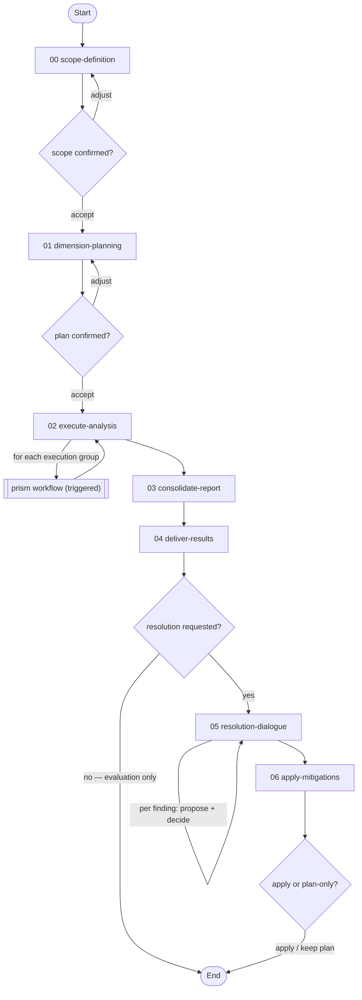
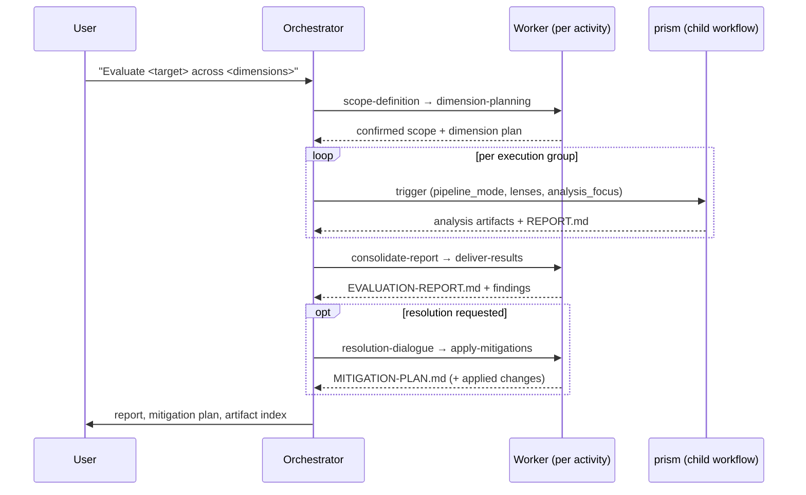

# Evaluation Workflow

> v1.1.0 — Orchestrate multi-dimensional evaluations of any target by mapping evaluation dimensions to [prism](../prism/README.md) analytical lenses, then optionally resolve and apply mitigations for the findings.

---

## Overview

`prism-evaluate` codifies a repeatable pattern for evaluating documents, proposals, codebases, or mixed artifact sets through multiple analytical dimensions. A user provides a target and evaluation description; the workflow classifies the target, derives or accepts evaluation dimensions, maps each dimension to prism modes and lenses, triggers prism runs, and consolidates results into a standalone evaluation report.

**Relationship to other workflows:**

| Workflow | Purpose |
|----------|---------|
| [`prism`](../prism/README.md) | Core analytical engine (lenses, passes, modes) — unchanged |
| [`prism-audit`](../prism-audit/README.md) | Security-specific audit orchestration over prism — unchanged |
| `prism-evaluate` | General evaluation orchestration over prism |

`prism-evaluate` does NOT replace `prism-audit`. Security audits have domain-specific logic (trust-boundary scanning, GitNexus integration) that belongs in a specialised workflow. `prism-evaluate` is for evaluating any target through user-defined analytical dimensions.

---

## Workflow Flow



The spine is linear — scope, plan, analyse, consolidate, deliver — and ends at `deliver-results` unless the user opts into the resolution dialogue, which then iterates through findings one at a time and applies the accepted mitigations. Two scope/plan checkpoints can loop back to re-scope or re-plan, and `execute-analysis` is a loop: each execution group triggers its own prism run.

User checkpoints gate the scope, the plan, the resolution offer, each finding's mitigation, and the final apply; the authoritative options and effects live in each activity's YAML.

---

## Activities

| # | Activity | Purpose |
|---|----------|---------|
| 00 | [**Define Evaluation Scope**](./activities/README.md#00-define-evaluation-scope) (`scope-definition`) | Collect the target, classify its type, and derive evaluation dimensions; user confirms scope before planning |
| 01 | [**Plan Dimension Analysis**](./activities/README.md#01-plan-dimension-analysis) (`dimension-planning`) | Survey the target, map each dimension to prism lenses, and group dimensions for execution; user confirms the plan |
| 02 | [**Execute Prism Analyses**](./activities/README.md#02-execute-prism-analyses) (`execute-analysis`) | Trigger a prism run per execution group and collect the results |
| 03 | [**Consolidate Evaluation Report**](./activities/README.md#03-consolidate-evaluation-report) (`consolidate-report`) | Extract findings, identify cross-dimensional patterns, and compose the evaluation report |
| 04 | [**Deliver Evaluation Results**](./activities/README.md#04-deliver-evaluation-results) (`deliver-results`) | Present the results and artifact index, then offer the optional resolution dialogue |
| 05 | [**Resolution Dialogue**](./activities/README.md#05-resolution-dialogue) (`resolution-dialogue`) | Tier-classify findings and propose mitigations one finding at a time, compiling a mitigation plan |
| 06 | [**Apply Accepted Mitigations**](./activities/README.md#06-apply-accepted-mitigations) (`apply-mitigations`) | Apply the accepted mitigations to the target after a final user confirmation |

**Detailed documentation:** See [activities/README.md](./activities/README.md) for the per-activity orientation map. The authoritative step/checkpoint/transition definitions live in each activity YAML and are served by `get_activity`.

---

## Techniques

Each activity step binds exactly one operation via `step.technique`. The operations are organised into four operation-groups (a `TECHNIQUE.md` shared contract plus one operation file per phase), all inheriting the workflow-root [`TECHNIQUE.md`](./techniques/TECHNIQUE.md) base contract. The cross-cutting meta [`variable-binding`](../meta/techniques/variable-binding.md) strategy technique is declared once at `workflow.techniques.activity` and inherited by every activity; `execute-analysis` and `resolution-dialogue` additionally declare the meta [`scatter-gather`](../meta/techniques/scatter-gather.md) strategy technique for their fan-out loops.

| Technique group | Capability |
|-----------------|------------|
| [`plan-evaluation`](./techniques/plan-evaluation/TECHNIQUE.md) | Target classification, dimension derivation, target survey, dimension-to-lens mapping, execution grouping, and plan authoring |
| [`execute-analysis`](./techniques/execute-analysis/TECHNIQUE.md) | Prism-run result collection and completion verification |
| [`compose-evaluation-report`](./techniques/compose-evaluation-report/TECHNIQUE.md) | Cross-artifact extraction, cross-dimensional synthesis, report composition and verification, result presentation |
| [`resolve-findings`](./techniques/resolve-findings/TECHNIQUE.md) | Finding tier-classification, one-by-one mitigation proposal, mitigation-plan composition, and change application |

The prism analysis itself is reached through the trigger mechanism: `execute-analysis` binds meta [`workflow-engine::handle-sub-workflow`](../meta/techniques/workflow-engine/handle-sub-workflow.md) to dispatch prism as a child workflow per execution group, and `apply-mitigations` binds meta [`version-control::commit-regular-files`](../meta/techniques/version-control/commit-regular-files.md) to commit applied changes.

**Detailed documentation:** See [techniques/README.md](./techniques/README.md) for the full library index with per-group operation breakdowns.

---

## Resources

| Resource | Description |
|----------|-------------|
| [Default Dimensions](./resources/default-dimensions.md) | Default dimension sets by target type (proposal, codebase, mixed) |
| [Dimension-Lens Mapping](./resources/dimension-lens-mapping.md) | Standard and custom dimension-to-prism-lens mapping matrix |
| [Evaluation Plan Template](./resources/evaluation-plan-template.md) | Structure for the `evaluation-plan.md` artifact |
| [Evaluation Report Template](./resources/evaluation-report-template.md) | Structure for the `EVALUATION-REPORT.md` artifact |
| [Mitigation Plan Template](./resources/mitigation-plan-template.md) | Structure for the `MITIGATION-PLAN.md` artifact |

**Detailed documentation:** See [resources/README.md](./resources/README.md).

---

## Orchestration Model

This workflow uses an **orchestrator with disposable workers**, the pattern defined in the `meta` layer. The orchestrator manages transitions and triggers; workers execute activities in fresh contexts with full read/write permission and write artifacts directly to the output path. The prism analysis is reached through the trigger mechanism, not called inline: each execution group triggers a separate prism run with its own pipeline mode, lens selection, and output subdirectory.



**Trigger isolation:** the orchestrator sets prism's `analysis_focus` to the dimension-specific evaluation guidance and never to a bare audit label (`"security audit"`, `"audit"`, …), so prism's own built-in audit-finalize path never fires — all evaluation-specific post-processing belongs to this workflow's `consolidate-report` activity.

---

## Output Artifact Structure

For a standard 4-dimension evaluation (Consistency, Veracity, Plausibility, Feasibility):

```
{output_path}/
├── evaluation-plan.md              (dimension-to-lens mapping)
├── EVALUATION-REPORT.md            (consolidated evaluation)
├── consistency/
│   ├── structural-analysis.md      (from full-prism)
│   ├── adversarial-analysis.md     (from full-prism)
│   └── synthesis.md                (from full-prism)
└── dimensions/
    ├── claim-inversion.md          (Veracity — lens 07)
    ├── knowledge-audit.md          (Veracity — lens 40)
    ├── rejected-paths.md           (Plausibility — lens 09)
    └── scarcity.md                 (Feasibility — lens 08)
```

The resolution dialogue additionally produces a `MITIGATION-PLAN.md`.

---

## File Structure

```
workflows/prism-evaluate/
├── workflow.yaml                     # Workflow definition (8 rules, 23 variables)
├── README.md                         # This file
├── activities/
│   ├── README.md                     # Per-activity orientation map
│   ├── 00-scope-definition.yaml      # Collect inputs, classify target, derive dimensions
│   ├── 01-dimension-planning.yaml    # Survey target, map to lenses, group for execution
│   ├── 02-execute-analysis.yaml      # Trigger prism per execution group (forEach loop)
│   ├── 03-consolidate-report.yaml    # Extract findings, compose EVALUATION-REPORT.md
│   ├── 04-deliver-results.yaml       # Present results and artifact index; offer resolution
│   ├── 05-resolution-dialogue.yaml   # Tier-classify findings, propose mitigations, compile plan
│   └── 06-apply-mitigations.yaml     # Apply accepted mitigations to the target and commit
├── techniques/
│   ├── README.md                     # Technique library index
│   ├── TECHNIQUE.md                  # Workflow-root base contract (inherited by all)
│   ├── plan-evaluation/              # Target classification, dimension-to-lens mapping (one op per phase)
│   ├── execute-analysis/             # Prism-run result collection and completion verification
│   ├── compose-evaluation-report/    # Cross-dimensional synthesis, report composition
│   └── resolve-findings/             # Finding tier-classification, mitigation, change application
└── resources/
    ├── README.md                     # Resource index
    ├── default-dimensions.md         # Default dimension sets by target type
    ├── dimension-lens-mapping.md     # Dimension-to-lens mapping matrix
    ├── evaluation-plan-template.md   # evaluation-plan.md structure
    ├── evaluation-report-template.md # EVALUATION-REPORT.md structure
    └── mitigation-plan-template.md   # MITIGATION-PLAN.md structure
```
