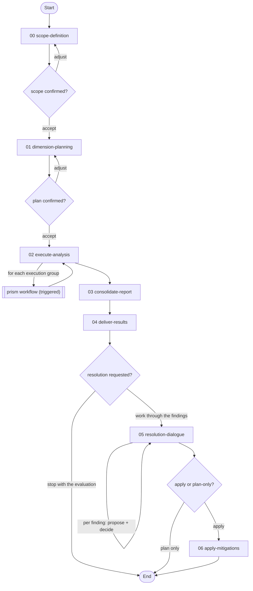
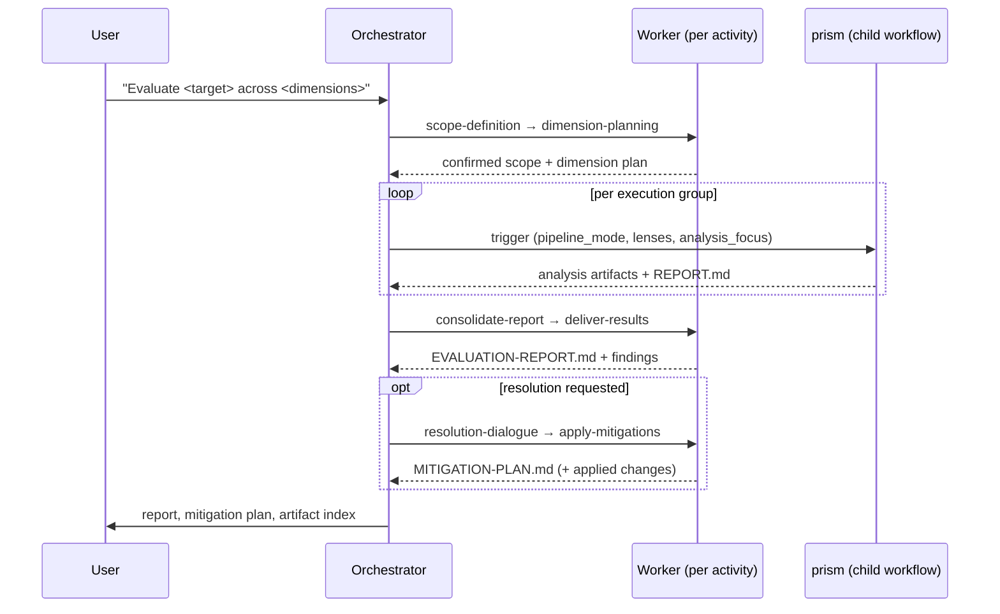

# Evaluation Workflow

> Evaluate any target across several analytical dimensions at once, by mapping each dimension onto [prism](../prism/README.md) lenses, consolidating what the runs found into one report, and optionally working the findings through into applied mitigations.

---

## Overview

`prism-evaluate` is for judging a document, proposal, codebase, or mixed artifact set along more than one axis in a single pass. A user supplies a target and says what the evaluation is for; the workflow classifies the target, settles the dimensions that judge it, maps each dimension to the lenses that will surface its findings, runs one analysis per group, and consolidates the results into a report that stands on its own.

**Where it sits among its siblings:**

| Workflow | Purpose |
|----------|---------|
| [`prism`](../prism/README.md) | The analytical engine — lenses, passes, and pipeline modes |
| [`prism-audit`](../prism-audit/README.md) | Security audit orchestration over prism, with trust-boundary scanning and GitNexus integration |
| `prism-evaluate` | General evaluation orchestration over prism, along user-defined dimensions |

A security audit belongs in `prism-audit`, whose domain logic this workflow does not carry.

---

## Workflow Flow


```mermaid
graph TD
    Start([Start]) --> SD["00 scope-definition"]
    SD --> CS{"scope confirmed?"}
    CS -->|"adjust"| SD
    CS -->|"accept"| DP["01 dimension-planning"]

    DP --> CP{"plan confirmed?"}
    CP -->|"adjust"| DP
    CP -->|"accept"| EA["02 execute-analysis"]

    EA -->|"for each execution group"| PRISM[["prism workflow (triggered)"]]
    PRISM --> EA
    EA --> CR["03 consolidate-report"]
    CR --> DR["04 deliver-results"]

    DR --> RO{"resolution requested?"}
    RO -->|"stop with the evaluation"| Done([End])
    RO -->|"work through the findings"| RES["05 resolution-dialogue"]

    RES -->|"per finding: propose + decide"| RES
    RES --> AC{"apply or plan-only?"}
    AC -->|"apply"| AM["06 apply-mitigations"]
    AC -->|"plan only"| Done
    AM --> Done
```

The spine is linear — scope, plan, analyse, consolidate, deliver — and ends at delivery unless the user opts into resolving the findings, which then works through them one at a time and applies the ones they accepted. The scope and plan gates can each send the run back a stage, and analysis is a loop: one triggered prism run per execution group.

The authoritative gates, options and effects live in each activity's YAML.

---

## Activities

| # | Activity | Purpose |
|---|----------|---------|
| 00 | [**Define Evaluation Scope**](./activities/README.md#00-define-evaluation-scope) (`scope-definition`) | Settle what is being evaluated, what kind of thing it is, and along which dimensions |
| 01 | [**Plan Dimension Analysis**](./activities/README.md#01-plan-dimension-analysis) (`dimension-planning`) | Fix each dimension's lens configuration and group the dimensions into runs |
| 02 | [**Execute Prism Analyses**](./activities/README.md#02-execute-prism-analyses) (`execute-analysis`) | Run the analysis once per group and record what each run produced |
| 03 | [**Consolidate Evaluation Report**](./activities/README.md#03-consolidate-evaluation-report) (`consolidate-report`) | Bring the per-dimension findings into one evaluation, with what holds across them |
| 04 | [**Deliver Evaluation Results**](./activities/README.md#04-deliver-evaluation-results) (`deliver-results`) | Present the evaluation and its deliverables, and offer to resolve the findings |
| 05 | [**Resolution Dialogue**](./activities/README.md#05-resolution-dialogue) (`resolution-dialogue`) | Decide a mitigation for each finding and compile them into a plan |
| 06 | [**Apply Accepted Mitigations**](./activities/README.md#06-apply-accepted-mitigations) (`apply-mitigations`) | Make the accepted changes to the target and commit them |

**Detailed documentation:** [activities/README.md](./activities/README.md) for the per-activity orientation map; the authoritative definitions are the activity YAMLs.

---

## Techniques

| Technique group | Capability |
|-----------------|------------|
| [`plan-evaluation`](./techniques/plan-evaluation/TECHNIQUE.md) | Turning an evaluation request into a runnable plan |
| [`execute-analysis`](./techniques/execute-analysis/TECHNIQUE.md) | Composing each run's trigger context and recording its result |
| [`compose-evaluation-report`](./techniques/compose-evaluation-report/TECHNIQUE.md) | Consolidating sibling runs into one evaluation of the target |
| [`resolve-findings`](./techniques/resolve-findings/TECHNIQUE.md) | Carrying a finding from criticism to decided change |

The analysis itself is reached by trigger: `execute-analysis` dispatches prism as a child workflow per execution group, and `apply-mitigations` commits through a shared version-control operation.

**Detailed documentation:** [techniques/README.md](./techniques/README.md) for the operation index.

---

## Resources

| Resource | Description |
|----------|-------------|
| [Default Dimensions](./resources/default-dimensions.md) | Dimension sets by target kind, for when the user names none |
| [Dimension-Lens Mapping](./resources/dimension-lens-mapping.md) | Which lens configuration a dimension takes |
| [Evaluation Plan Template](./resources/evaluation-plan-template.md) | Structure for the `evaluation-plan.md` artifact |
| [Evaluation Report Template](./resources/evaluation-report-template.md) | Structure for the `EVALUATION-REPORT.md` artifact |
| [Mitigation Plan Template](./resources/mitigation-plan-template.md) | Mitigation tiers, and structure for the `MITIGATION-PLAN.md` artifact |

**Detailed documentation:** [resources/README.md](./resources/README.md).

---

## Orchestration Model

An orchestrator drives the graph and triggers the analyses; workers execute activities in fresh contexts and write their artifacts directly. Each execution group is a separate child run with its own pipeline mode, lens selection, and output subdirectory, so the dimensions do not contend for one analysis.


```mermaid
sequenceDiagram
    participant User
    participant Orch as Orchestrator
    participant W as Worker (per activity)
    participant Prism as prism (child workflow)

    User->>Orch: "Evaluate <target> across <dimensions>"
    Orch->>W: scope-definition → dimension-planning
    W-->>Orch: confirmed scope + dimension plan

    loop per execution group
        Orch->>Prism: trigger (pipeline_mode, lenses, analysis_focus)
        Prism-->>Orch: analysis artifacts + REPORT.md
    end

    Orch->>W: consolidate-report → deliver-results
    W-->>Orch: EVALUATION-REPORT.md + findings

    opt resolution requested
        Orch->>W: resolution-dialogue → apply-mitigations
        W-->>Orch: MITIGATION-PLAN.md (+ applied changes)
    end
    Orch->>User: report, mitigation plan, artifact index
```

Each run's `analysis_focus` names its dimension, which is what yields dimension-prefixed finding IDs the consolidation can carry through unchanged. What consolidation adds over any single run is the reading across them.

---

## Output Artifact Structure

For a four-dimension evaluation of a proposal (Consistency, Veracity, Plausibility, Feasibility):

```
{output_path}/
├── evaluation-plan.md              (dimension-to-lens mapping)
├── EVALUATION-REPORT.md            (consolidated evaluation)
├── consistency/                    (a full-prism dimension's own run)
│   ├── RUN-MANIFEST.json
│   ├── REPORT.md
│   ├── DEFINITIVE-FINDINGS.md
│   └── …                           (the run's internal pass artifacts)
└── dimensions/                     (the portfolio dimensions, one run)
    ├── RUN-MANIFEST.json
    ├── REPORT.md
    ├── DEFINITIVE-FINDINGS.md
    └── …                           (one artifact per selected lens)
```

Consolidation reads each run's contract artifacts, located from its manifest. The resolution dialogue adds a `MITIGATION-PLAN.md`.

---

## File Structure

```
workflows/prism-evaluate/
├── workflow.yaml                     # Workflow metadata, rules, and variable declarations
├── README.md                         # This file
├── activities/                       # One YAML per activity, plus the orientation map
├── techniques/                       # Operation groups, each with a shared contract
│   ├── TECHNIQUE.md                  # The evaluation's standing context
│   ├── plan-evaluation/              # Request → runnable plan
│   ├── execute-analysis/             # Trigger context and run records
│   ├── compose-evaluation-report/    # Consolidation and delivery figures
│   └── resolve-findings/             # Finding → decided change
└── resources/                        # Dimension sets, lens mapping, artifact guides
```
