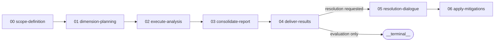

# Evaluation Workflow — Activities

> Part of the [Evaluation Workflow](../README.md)

## Activities (7)

A pipeline that classifies a target, plans dimension-to-lens mappings, runs prism per dimension group, consolidates a report, and optionally resolves and applies mitigations. Several activities gate on a user checkpoint; the final two run only when the user opts into resolution.

This file is an orientation map. The authoritative definition of each activity — its steps, checkpoints, conditions, loops, and transitions — lives in the per-activity YAML linked from each section below and is served by `get_activity`.

Steps bind their domain operation via `step.technique`; the cross-cutting `variable-binding` strategy technique is declared once at the workflow level and inherited by every activity. The bound operations per activity are catalogued in the [technique library](../techniques/README.md).

---

### 00. Define Evaluation Scope

Collect the target, evaluation description, and output path; classify the target type (document / document-set / codebase / mixed); derive or validate the evaluation dimensions; create the output directory; and summarise the assembled scope. A blocking `confirm-scope` checkpoint settles the target, dimensions, and configuration before planning — choosing *adjust* loops the activity back to re-scope. **Value:** planning starts against a confirmed, classified target with an agreed dimension set and a place to land outputs.

Definition: [`00-scope-definition.yaml`](00-scope-definition.yaml). Leads to [Plan Dimension Analysis](#01-plan-dimension-analysis).

---

### 01. Plan Dimension Analysis

Survey the target, map each dimension to prism pipeline modes and lenses (respecting any user lens overrides), group dimensions that share a pipeline mode into execution groups, and write the human-readable `evaluation-plan.md`. A blocking `confirm-plan` checkpoint settles the mapping before any prism run — choosing *adjust* loops back to re-plan. **Value:** each dimension is matched to the lenses that will surface its target-specific findings, grouped into runnable batches the analysis stage can execute directly.

Definition: [`01-dimension-planning.yaml`](01-dimension-planning.yaml). Leads to [Execute Prism Analyses](#02-execute-prism-analyses).

---

### 02. Execute Prism Analyses

After verifying `execution_groups` is non-empty, a `forEach` loop processes each group: set the prism trigger context (target, mapped target type, output subdir, pipeline mode, lenses, analysis focus), trigger prism as a child workflow via `workflow-engine::handle-sub-workflow`, collect its results, and verify completion. Groups run sequentially, and any failed run is recorded with an error status rather than left silent. **Value:** every planned dimension is analysed through the prism pipeline, yielding the per-dimension findings consolidation draws on, with gaps made visible.

Definition: [`02-execute-analysis.yaml`](02-execute-analysis.yaml). Leads to [Consolidate Evaluation Report](#03-consolidate-evaluation-report).

---

### 03. Consolidate Evaluation Report

Locate the per-dimension analysis artifacts, extract findings, identify cross-dimensional patterns, compose the unified `EVALUATION-REPORT.md`, and verify it. The report is methodology-stripped (no lens or pipeline-mode names), standalone, and severity-calibrated on an Impact × Feasibility rubric. **Value:** the consumer gets a single severity-calibrated evaluation — cross-dimensional findings and actionable recommendations to decide from.

Definition: [`03-consolidate-report.yaml`](03-consolidate-report.yaml). Leads to [Deliver Evaluation Results](#04-deliver-evaluation-results).

---

### 04. Deliver Evaluation Results

Compile the delivery metrics and present the results with a complete artifact index, then a blocking `resolution-offer` checkpoint asks whether to proceed into the resolution dialogue, end with the report as the final deliverable, or end and address findings externally. **Value:** the user can see what the evaluation found and where every deliverable lives, and decides whether to move into resolving the findings or stop here.

Definition: [`04-deliver-results.yaml`](04-deliver-results.yaml). Leads to [Resolution Dialogue](#05-resolution-dialogue) when resolution is requested; otherwise the workflow ends.

---

### 05. Resolution Dialogue

Load the findings from the report and tier-classify them by mitigation difficulty, then work through them one finding at a time — proposing a finding-specific mitigation and collecting the user's decision on each — and compile the dispositions into `MITIGATION-PLAN.md`. **Value:** every finding has a mitigation the user has explicitly decided on, preserving the nuance a batch review would lose.

Definition: [`05-resolution-dialogue.yaml`](05-resolution-dialogue.yaml). Leads to [Apply Accepted Mitigations](#06-apply-accepted-mitigations).

---

### 06. Apply Accepted Mitigations

A blocking `confirm-apply` checkpoint gates the final apply (apply all accepted mitigations, or keep the plan without modifying the target); accepted changes are then applied to the target in priority order and committed via `version-control::commit-regular-files`. **Value:** the target reflects every accepted mitigation, applied in priority order and committed, with verification confirming what changed.

Definition: [`06-apply-mitigations.yaml`](06-apply-mitigations.yaml). Terminal activity.
