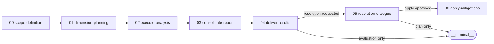

# Evaluation Workflow — Activities

> Part of the [Evaluation Workflow](../README.md)

## Activities

A pipeline that classifies a target, plans its dimension-to-lens mappings, runs one analysis per dimension group, consolidates a report, and optionally resolves and applies mitigations.

This file orients. Each activity's steps, checkpoints, conditions, loops and transitions are defined in the YAML linked from its section.

```mermaid
graph LR
    SD["00 scope-definition"] --> DP["01 dimension-planning"]
    DP --> EA["02 execute-analysis"]
    EA --> CR["03 consolidate-report"]
    CR --> DR["04 deliver-results"]
    DR -->|"resolution requested"| RES["05 resolution-dialogue"]
    DR -->|"evaluation only"| End(["__terminal__"])
    RES -->|"apply approved"| AM["06 apply-mitigations"]
    RES -->|"plan only"| End
```

---

### 00. Define Evaluation Scope

**Value:** planning starts against a target whose kind is known, a dimension set the user agreed to, and a directory the outputs can land in.

Definition: [`00-scope-definition.yaml`](00-scope-definition.yaml). Leads to [Plan Dimension Analysis](#01-plan-dimension-analysis).

---

### 01. Plan Dimension Analysis

**Value:** each dimension is matched to the lenses that will surface its findings in this particular target, grouped into runs the analysis stage can execute directly.

Definition: [`01-dimension-planning.yaml`](01-dimension-planning.yaml). Leads to [Execute Prism Analyses](#02-execute-prism-analyses).

---

### 02. Execute Prism Analyses

**Value:** every planned dimension is analysed, and a run that came back incomplete is visible as a coverage gap rather than a missing dimension.

Definition: [`02-execute-analysis.yaml`](02-execute-analysis.yaml). Leads to [Consolidate Evaluation Report](#03-consolidate-evaluation-report).

---

### 03. Consolidate Evaluation Report

**Value:** one severity-calibrated evaluation to decide from, carrying what holds across dimensions and reading as a document about the target rather than about the analysis.

Definition: [`03-consolidate-report.yaml`](03-consolidate-report.yaml). Leads to [Deliver Evaluation Results](#04-deliver-evaluation-results).

---

### 04. Deliver Evaluation Results

**Value:** the user can see what the evaluation found and where every deliverable lives, and chooses whether to carry on into resolving the findings.

Definition: [`04-deliver-results.yaml`](04-deliver-results.yaml). Leads to [Resolution Dialogue](#05-resolution-dialogue) when resolution is requested; otherwise the workflow ends.

---

### 05. Resolution Dialogue

**Value:** every finding gets a mitigation the user decided on individually, preserving the nuance a batch review loses, and the plan carries their decision on whether it reaches the target at all.

Definition: [`05-resolution-dialogue.yaml`](05-resolution-dialogue.yaml). Leads to [Apply Accepted Mitigations](#06-apply-accepted-mitigations) under an approved apply; otherwise the plan is the deliverable.

---

### 06. Apply Accepted Mitigations

**Value:** the target reflects every accepted mitigation, applied in priority order and committed, with verification recording what landed and what did not.

Definition: [`06-apply-mitigations.yaml`](06-apply-mitigations.yaml). Terminal activity.
