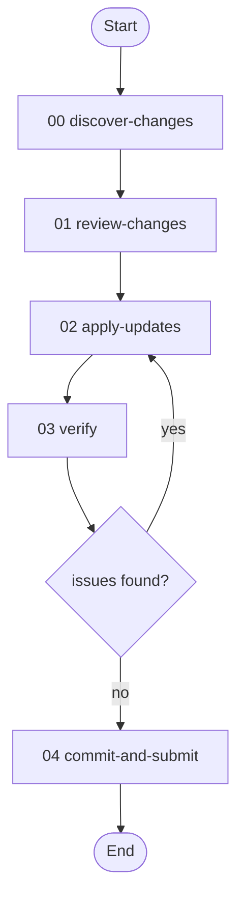

# Prism Update Workflow

> v1.1.0 — Sync the prism workflow's resources, techniques, and documentation with upstream changes from the agi-in-md project.

---

## Overview

When the upstream [agi-in-md](https://github.com/Cranot/agi-in-md) project adds, renames, or modifies prisms, those changes need to be imported into the prism workflow as indexed resources, with corresponding updates to skill routing (goal-mapping, portfolio catalog, model sensitivity) and documentation (READMEs, prompt guide).

This workflow codifies that process into a repeatable 7-activity pipeline: discover what changed, review with the user, import resources, update routing, update docs, verify consistency, and submit a PR.

**Use this workflow when:**
- Upstream agi-in-md has new commits that add or modify prisms
- Prism names have changed upstream (renames)
- Upstream prisms have been removed or deprecated

**What it does:**
- Diffs the upstream prisms/ directory against current workflow resources
- Categorizes changes as new, modified, renamed, or deleted
- Copies resource files with proper indexed naming
- Updates skill routing tables (plan-analysis, portfolio-analysis, behavioral-pipeline, orchestrate-prism)
- Rebuilds documentation (prompt guide, resource catalog, model sensitivity)
- Verifies consistency (no stale references, no routing mismatches, no duplicate indices)
- Creates a feature branch and PR

---

## Workflow Flow



---

## Activities

Each activity's authoritative definition lives in its [`activities/NN-<id>.toon`](activities/) file (served by `get_activity`). This is the at-a-glance map; see the [activities README](activities/README.md) for per-activity orientation.

| # | Activity | Role |
|---|----------|------|
| 00 | **[Discover Changes](activities/00-discover-changes.toon)** | Diff upstream prisms/ against current resources and categorize what changed |
| 01 | **[Review Changes](activities/01-review-changes.toon)** | Present the change set so the user can confirm scope and exclusions |
| 02 | **[Apply Updates](activities/02-apply-updates.toon)** | Import resource changes, then bring skill routing and docs into line with them |
| 03 | **[Verify Consistency](activities/03-verify.toon)** | Confirm no stale references, routing mismatches, or count/index errors remain |
| 04 | **[Commit and Submit](activities/04-commit-and-submit.toon)** | Land the update as a feature branch and open a pull request |

---

## Techniques

| Technique | Capability |
|-----------|------------|
| [`diff-upstream`](techniques/diff-upstream.md) | Diff upstream prisms against current resources, classify changes by type and family |
| [`review-change-set::present-summary`](techniques/review-change-set/present-summary.md) | Present the categorized change set to the user as a reviewable summary |
| [`review-change-set::apply-exclusions`](techniques/review-change-set/apply-exclusions.md) | Apply user-requested exclusion adjustments, yielding the approved change set |
| [`sync-resources`](techniques/sync-resources.md) | Apply file changes: copy modified, git mv renames, import new with indexed names, remove deleted |
| [`update-skill-routing`](techniques/update-skill-routing.md) | Update goal-mapping matrix, portfolio catalog, model sensitivity, resource lists in all prism techniques |
| [`update-prism-docs`](techniques/update-prism-docs.md) | Rebuild resource catalog, prompt guide entries, model sensitivity table, file structure |
| [`verify-prism-consistency`](techniques/verify-prism-consistency.md) | Verify content integrity, stale references, prompt routing, counts, and duplicate indices |
| [`submit-update`](techniques/submit-update.md) | Ensure a feature branch, push commits, open a pull request, and report the result |

`review-change-set` is an operation-group ([`review-change-set/`](techniques/review-change-set/) with a `TECHNIQUE.md` shared contract plus one file per operation); the rest are flat standalones. The cross-cutting `variable-binding` strategy technique is inherited by every activity.

---

## Usage

```
Sync the prism workflow with upstream agi-in-md changes.

User provides:
- upstream_path: /path/to/agi-in-md/prisms/
- exclusions (optional): [arc_code.md, codegen.md]

Workflow executes:
1. Discovers 16 new, 28 modified, 4 renamed, 0 deleted prisms
2. Presents summary for user review
3. Imports resources (up to 4 commits: sync modified, apply renames, import new, remove deleted)
4. Updates plan-analysis, portfolio-analysis, behavioral-pipeline, orchestrate-prism
5. Updates READMEs with expanded catalog and prompt guide
6. Verifies no stale references or routing mismatches
7. Creates PR against workflows branch

User receives:
- Feature branch with clean commit history
- PR with change summary
```

---

## File Structure

```
workflows/prism-update/
├── workflow.toon
├── README.md
├── activities/
│   ├── README.md
│   ├── 00-discover-changes.toon
│   ├── 01-review-changes.toon
│   ├── 02-apply-updates.toon
│   ├── 03-verify.toon
│   └── 04-commit-and-submit.toon
└── techniques/
    ├── TECHNIQUE.md
    ├── diff-upstream.md
    ├── sync-resources.md
    ├── update-skill-routing.md
    ├── update-prism-docs.md
    ├── verify-prism-consistency.md
    ├── submit-update.md
    └── review-change-set/
        ├── TECHNIQUE.md
        ├── present-summary.md
        └── apply-exclusions.md
```
