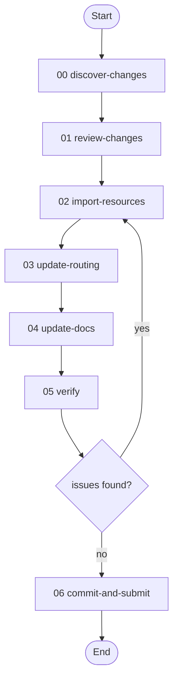

# Prism Update Workflow

> v1.0.0 — Sync the prism workflow's resources, skills, and documentation with upstream changes from the agi-in-md project.

---

## Overview

When the upstream [agi-in-md](https://github.com/Cranot/agi-in-md) project adds, renames, or modifies prisms, those changes need to be imported into the prism workflow as indexed resources, with corresponding updates to skill routing (goal-mapping, portfolio catalog, model sensitivity) and documentation (READMEs, prompt guide).

This workflow codifies that process into a repeatable 7-activity pipeline: discover what changed, review with the user, import resources, update routing, update docs, verify consistency, and submit a PR.

**Use this workflow when:**
- Upstream agi-in-md has new commits that add or modify prisms
- Prism names have changed upstream (renames)
- Upstream prisms have been removed or deprecated

**What it does:**
- Diffs the upstream prisms/ directory against current workflow resources
- Categorizes changes as new, modified, renamed, or deleted
- Copies resource files with proper indexed naming
- Updates skill routing tables (plan-analysis, portfolio-analysis, behavioral-pipeline, orchestrate-prism)
- Rebuilds documentation (prompt guide, resource catalog, model sensitivity)
- Verifies consistency (no stale references, no routing mismatches, no duplicate indices)
- Creates a feature branch and PR

---

## Workflow Flow



---

## Activities

| # | Activity | Skill | Description |
|---|----------|-------|-------------|
| 00 | **Discover Changes** | `diff-upstream` | Diff upstream prisms/ against current resources, categorize changes |
| 01 | **Review Changes** | — | Present change summary, user confirms scope and exclusions |
| 02 | **Import Resources** | `sync-resources` | Copy/rename/delete resource files, commit per change type |
| 03 | **Update Routing** | `update-skill-routing` | Fix renamed refs, add goal-mapping entries, expand catalogs |
| 04 | **Update Docs** | `update-prism-docs` | Rebuild resource README, prompt guide, model sensitivity |
| 05 | **Verify** | `verify-prism-consistency` | Check for stale refs, routing mismatches, count/index errors |
| 06 | **Commit and Submit** | — | Create branch, push, create PR |

---

## Skills

| # | Skill | Capability |
|---|-------|------------|
| 00 | `diff-upstream` | Diff upstream prisms against current resources, classify changes by type and family |
| 01 | `sync-resources` | Apply file changes: copy modified, git mv renames, import new with indexed names, remove deleted |
| 02 | `update-skill-routing` | Update goal-mapping matrix, portfolio catalog, model sensitivity, resource lists in all prism skills |
| 03 | `update-prism-docs` | Rebuild resource catalog, prompt guide entries, model sensitivity table, file structure |
| 04 | `verify-prism-consistency` | Grep for stale references, verify prompt routing, check counts and duplicate indices |

---

## Usage

```
Sync the prism workflow with upstream agi-in-md changes.

User provides:
- upstream_path: /path/to/agi-in-md/prisms/
- exclusions (optional): [arc_code.md, codegen.md]

Workflow executes:
1. Discovers 16 new, 28 modified, 4 renamed, 0 deleted prisms
2. Presents summary for user review
3. Imports resources (4 commits: sync, rename, import, deprecate)
4. Updates plan-analysis, portfolio-analysis, behavioral-pipeline, orchestrate-prism
5. Updates READMEs with expanded catalog and prompt guide
6. Verifies no stale references or routing mismatches
7. Creates PR against workflows branch

User receives:
- Feature branch with clean commit history
- PR with change summary
```

---

## Variables

| Variable | Type | Required | Default | Description |
|----------|------|----------|---------|-------------|
| `upstream_path` | string | yes | — | Path to upstream prisms directory |
| `resource_path` | string | no | `prism/resources/` | Path to workflow resources directory |
| `changes` | object | — | — | Categorized diff: new, modified, renamed, deleted |
| `exclusions` | array | no | `[]` | Upstream filenames to exclude |
| `next_index` | number | — | — | Next available resource index |
| `branch_name` | string | — | — | Feature branch name |
| `has_issues` | boolean | — | `false` | Whether verification found issues |
| `stale_references` | array | — | `[]` | Stale name references found |

---

## Checkpoints

| Checkpoint | Activity | Blocking | Purpose |
|------------|----------|----------|---------|
| `change-review` | review-changes | yes | User confirms which changes to apply |
| `verification-result` | verify | no (30s) | User reviews consistency check findings |

---

## File Structure

```
workflows/prism-update/
├── workflow.toon
├── README.md
├── activities/
│   ├── 00-discover-changes.toon
│   ├── 01-review-changes.toon
│   ├── 02-import-resources.toon
│   ├── 03-update-routing.toon
│   ├── 04-update-docs.toon
│   ├── 05-verify.toon
│   └── 06-commit-and-submit.toon
└── skills/
    ├── 00-diff-upstream.toon
    ├── 01-sync-resources.toon
    ├── 02-update-skill-routing.toon
    ├── 03-update-prism-docs.toon
    └── 04-verify-prism-consistency.toon
```
