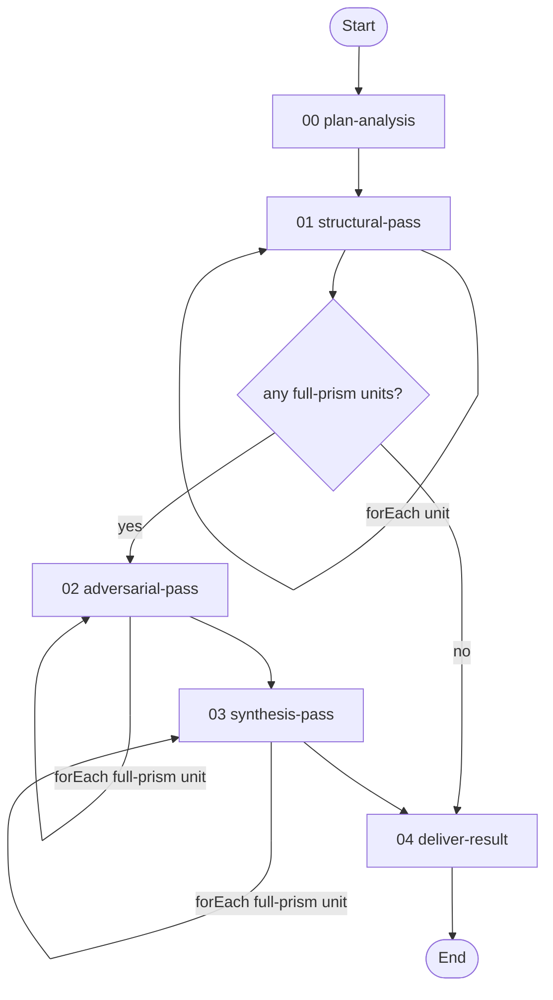
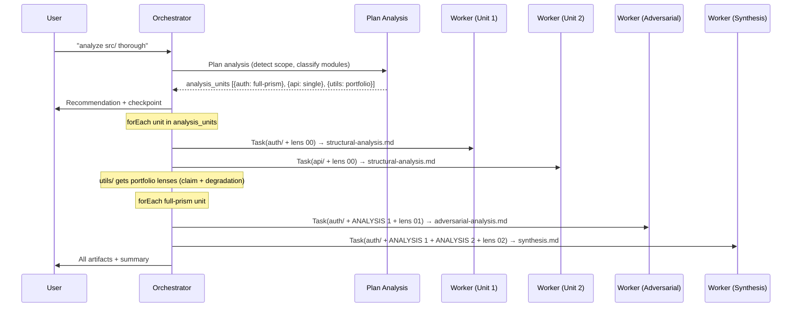

# Structural Analysis Prism Workflow

> v1.4.0 — Apply cognitive lenses to code, text, or entire codebases through isolated sub-agent passes.

---

## Overview

This workflow applies structural analysis lenses to any target — a single file, a question, a module, or an entire codebase. The `plan-analysis` skill detects the scope of the target and produces an execution plan that maps each unit of work to the appropriate analysis depth and lens selection.

**Structural analysis** is the foundation. When an AI agent reviews code without specific guidance, it produces surface-level observations — the kind of feedback you would find in a generic code review. It notices style inconsistencies, missing error handling, and obvious logic errors. What it does not do is discover the *structural properties* of the code: the trade-offs the design is forced to make, the problems that persist through every attempted improvement, or the assumptions that will fail silently under conditions the author never considered. Lenses change this. Each lens is a short sequence of imperative operations (50–330 words) that directs the model through a specific analytical process. Rather than asking "what's wrong with this code?", the L12 lens instructs the model to make a falsifiable claim, attack it from three perspectives, name what the gap conceals, engineer an improvement that deepens the concealment, and trace the chain through to a conservation law. The model executes these operations as a program, and the output shifts from description to construction-based reasoning.

**Adversarial correction** addresses the structural pass's blind spots. A single analytical pass, however deep, cannot see what its own framing conceals. Every conservation law is itself a lens that makes certain properties visible while hiding others. The adversarial pass receives only the textual output from the structural pass — never the generation history — and treats it as an opponent's work to defeat with evidence from the code. It searches for wrong predictions (where the analysis claims something the code disproves), overclaims (bugs classified as structural that are actually fixable), and underclaims (problems the structural analysis missed entirely). This is why the workflow enforces strict context isolation between passes: shared generation history turns the adversary into a collaborator, which defeats the purpose of the pipeline.

**Synthesis** reconciles the structural analysis and its adversarial challenge into a result stronger than either alone. The synthesis agent receives the code, the structural output (ANALYSIS 1), and the adversarial output (ANALYSIS 2) in a fresh context. It produces a corrected conservation law that survives both perspectives, reclassifies every finding based on the combined evidence, and names the "deepest finding" — a property that becomes visible only from having both the structural analysis and its correction. Research confirms that the synthesis consistently discovers properties that neither pass alone could find, which is the justification for the cost of three passes rather than one.

| # | Activity | Required | Description |
|---|----------|----------|-------------|
| 00 | [**Plan Analysis**](activities/00-select-mode.toon) | yes | Detect scope, recommend pipeline mode, present confirmation checkpoint |
| 01 | [**Structural Pass**](activities/01-structural-pass.toon) | yes | Iterate over analysis units — run L12 or portfolio lenses per unit |
| 02 | [**Adversarial Pass**](activities/02-adversarial-pass.toon) | full-prism units only | Iterate over full-prism units — adversarial challenge per unit |
| 03 | [**Synthesis Pass**](activities/03-synthesis-pass.toon) | full-prism units only | Iterate over full-prism units — reconcile into corrected findings |
| 04 | [**Deliver Result**](activities/04-deliver-result.toon) | yes | Read and present final artifacts |

**Detailed documentation:**

- **Activities:** See [activities/](activities/) for per-activity TOON definitions with steps, loops, rules, and transitions.
- **Skills:** See [skills/README.md](skills/README.md) for the full skill inventory (5 skills) and protocol flow diagrams.
- **Resources:** See [resources/README.md](resources/README.md) for the 12 lens resources.

**Pipeline modes:**

| Mode | Passes | When to use |
|------|--------|-------------|
| `single` | Structural only | Quick analysis, code review augmentation |
| `full-prism` | Structural → Adversarial → Synthesis | Maximum depth with self-correction |
| `portfolio` | Multiple independent lenses | Breadth — complementary structural perspectives |

**Target scopes** (detected by `plan-analysis`):

| Scope | Target | Behaviour |
|-------|--------|-----------|
| `query` | Question, concept, inline text | Single-unit, general lenses |
| `file` | Single source file or document | Single-unit, code or general lenses |
| `module` | Directory of related source files | Single-unit, code lenses |
| `codebase` | Repository with multiple modules | Multi-unit — survey, classify, plan per-module |
| `document-set` | Directory of non-code files | Multi-unit, general lenses |

For multi-unit scopes, `plan-analysis` produces an `analysis_units` array. Each unit specifies its own `pipeline_mode` and lens selection based on the module's role and a configurable `budget` (`quick`, `standard`, `thorough`). The workflow iterates over this array, applying the appropriate analysis to each unit.

---

## Workflow Flow



---

## Execution Model

This workflow uses an **orchestrator with disposable workers** — distinct from workflows that use a persistent, resumed worker.



**Why disposable workers?** In workflows that use a persistent worker, context accumulates across activities — codebase understanding, file locations, implementation decisions. That shared context is valuable for implementation workflows. In the prism workflow, shared context is *harmful*. The adversarial worker must treat the structural analysis as an opponent's work to defeat. If it shares generation history with the structural worker, it pulls punches. Fresh agents guarantee genuine independence.

**Orchestrator** (skill: `orchestrate-prism`):
- Runs `plan-analysis` to detect scope and produce `analysis_units`
- Dispatches each pass to a **fresh** sub-agent (NEVER resumes)
- Passes artifact paths between workers — workers read/write from the filesystem
- MUST NOT execute lens operations or generate analysis

**Workers** (skill: `full-prism`, `structural-analysis`, `portfolio-analysis`):
- Self-bootstrap by loading the lens resource via `get_resource`
- Read prior pass artifacts from the filesystem when provided
- Execute every operation in the lens prompt completely
- Write analysis artifacts to the unit's output subdirectory
- Run in isolation — no shared context between passes

---

## Examples

### Single file analysis

```
# "analyze src/auth.ts"
# plan-analysis detects: scope=file, target_type=code, recommends single
# → 1 unit, 1 structural pass, writes structural-analysis.md
```

### Deep analysis of a critical module

```
# "deep analysis of src/auth/"
# plan-analysis detects: scope=module, recommends full-prism
# → 1 unit, 3 passes (structural → adversarial → synthesis)
# writes structural-analysis.md, adversarial-analysis.md, synthesis.md
```

### Codebase-wide analysis

```
# "analyze this codebase thoroughly"
# plan-analysis detects: scope=codebase, budget=thorough
# → N units, each classified by role and priority
# high-priority modules get full-prism, others get single or portfolio
# artifacts namespaced per module: auth/synthesis.md, api/structural-analysis.md, etc.
```

### Analyzing a question or strategy

```
# "what are the trade-offs of event sourcing vs CRUD?"
# plan-analysis detects: scope=query, target_type=general
# → 1 unit, general lenses (claim + rejected-paths for trade-off analysis)
```

### Cross-workflow usage

Any workflow's skill can invoke prism resources and skills directly:

```
# Load a lens resource
get_resource({ workflow_id: "prism", index: "00" })

# Load a skill
get_skill({ skill_id: "structural-analysis", workflow_id: "prism" })

# Or follow the orchestrate-prism protocol for isolated multi-pass analysis
```

---

## Background

The lenses in this workflow are derived from the [agi-in-md](https://github.com/m2ux/agi-in-md) research project (29 rounds, 650+ experiments). The core finding: short imperative prompts ("lenses") reliably activate specific analytical operations in language models, producing structurally deeper findings than vanilla analysis.

- **The prompt is the dominant variable.** Haiku + L12 lens (9.8 depth, 28 bugs) outperforms Opus vanilla (7.3 depth, 18 bugs) at 5x lower cost.
- **Construction-based reasoning (L8+) works on all models.** Unlike meta-analysis which requires larger models, construction — building improvements and observing what they reveal — is a universal cognitive operation.
- **5 portfolio lenses find 5 genuinely different things.** Zero overlap confirmed across 3 real codebases. Each lens activates a distinct analytical operation.
- **The 3-pass pipeline self-corrects.** The adversarial pass finds what the structural pass conceals. The synthesis produces properties visible only from having both perspectives.

The L12 pipeline encodes 12 sequential operations: falsifiable claim → three-voice dialectic → concealment mechanism → engineered improvement → diagnostic recursion → structural invariant → invariant inversion → conservation law → meta-diagnostic → meta-law → concrete findings collection.
