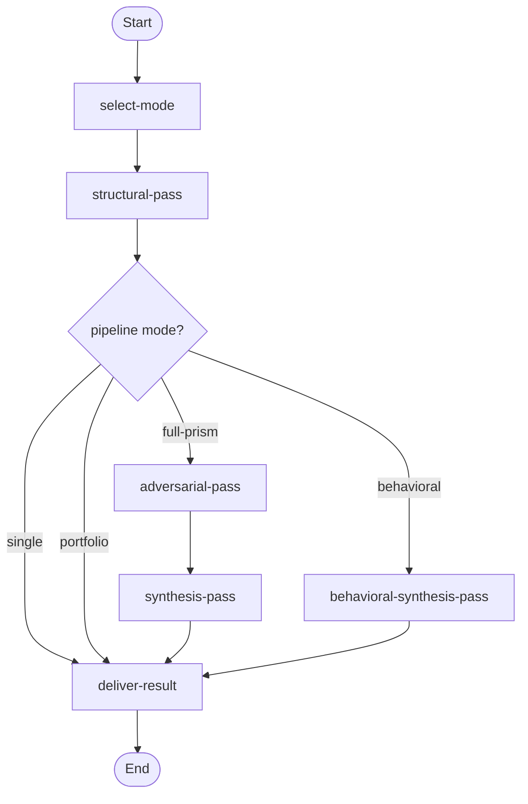
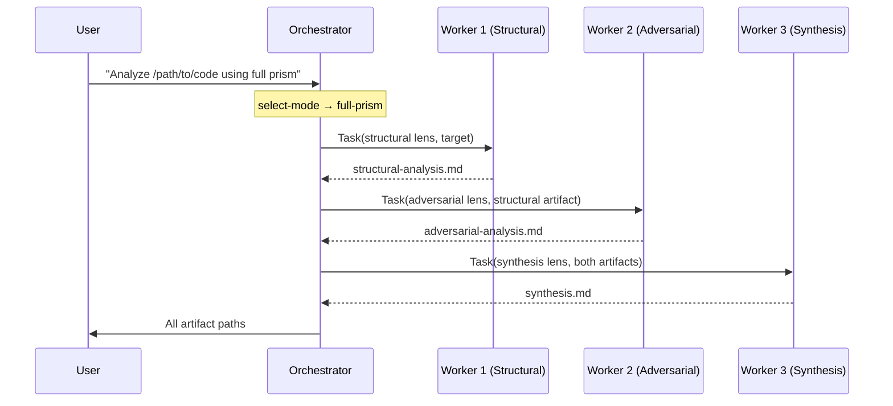

# Structural Analysis Prism Workflow

> v1.4.0 — Apply cognitive lenses to code or text through isolated sub-agent passes. Each pass runs in a fresh context window to guarantee analytical independence. Supports four modes: single-pass L12, 3-pass Full Prism, multi-lens portfolio, and 4+1 behavioral pipeline.

---

## Overview

The Prism Workflow dispatches analytical lenses as isolated sub-agent passes against a target (code, document, or proposal). Isolation is the core invariant — the adversarial pass receives only the textual output of the structural pass, never the generation history.

**Use this workflow when:**
- Performing deep structural analysis of code or text
- Running self-correcting analysis (structural → adversarial → synthesis)
- Applying multiple complementary lenses for breadth
- Analyzing error resilience, performance, evolution, and API surface as a behavioral pipeline

---

## Modes

| Mode | Passes | Description |
|------|--------|-------------|
| **Single** | 1 | L12 structural lens — conservation law, meta-law, bug table |
| **Full Prism** | 3 | Structural → adversarial → synthesis (self-correcting) |
| **Portfolio** | 2+ | Multiple independent lenses for breadth (24 available) |
| **Behavioral** | 4+1 | Error resilience + optimization + evolution + API surface → synthesis. Code-only. |

---

## Workflow Flow



---

## Activities

| # | Activity | Description |
|---|----------|-------------|
| 00 | **Select Mode** | Detect scope, classify targets, recommend pipeline mode |
| 01 | **Structural Pass** | Execute L12 structural lens, portfolio lenses, or behavioral lenses per unit |
| 02 | **Adversarial Pass** | Challenge structural analysis (full-prism only) |
| 03 | **Synthesis Pass** | Reconcile structural + adversarial (full-prism only) |
| 04 | **Deliver Result** | Present final analysis with artifact paths |
| 05 | **Behavioral Synthesis Pass** | Synthesize 4 behavioral lens outputs (behavioral only) |

**Detailed documentation:** See [activities/](activities/) for per-activity TOON definitions.

---

## Skills

| # | Skill | Capability | Role |
|---|-------|------------|------|
| 00 | `structural-analysis` | Single-pass L12 structural analysis | Standalone / Worker |
| 01 | `full-prism` | Execute one isolated pass of the Full Prism pipeline | Worker |
| 02 | `portfolio-analysis` | Run 2+ complementary portfolio lenses | Standalone |
| 03 | `plan-analysis` | Detect scope, classify targets, plan analysis strategy | Planning |
| 04 | `orchestrate-prism` | Dispatch isolated workers, manage the analysis pipeline | Orchestrator |
| 05 | `behavioral-pipeline` | Execute 4+1 behavioral pipeline with labeled synthesis | Worker |

**Detailed documentation:** See [skills/README.md](skills/README.md) for protocol flows and skill details.

---

## Resources (30)

Resources are indexed markdown files containing lens prompts. Each lens encodes a specific analytical operation.

| Range | Family | Count | Description |
|-------|--------|-------|-------------|
| 00–02 | L12 Pipeline | 3 | Structural, adversarial, synthesis (code and general) |
| 06–11 | Portfolio | 6 | Pedagogy, claim, scarcity, rejected-paths, degradation, contract |
| 12–18 | Structural SDL | 7 | Deep-scan, trust topology, coupling clock, abstraction leak, rec, ident, 73w |
| 19–23 | Behavioral Pipeline | 5 | Error resilience, optim, evolution, API surface, behavioral synthesis |
| 24–26 | Domain-Neutral | 3 | Error resilience neutral, API surface neutral, evolution neutral |
| 27–28 | Compressed | 2 | Error resilience compact, error resilience 70w |
| 29–32 | Hybrid/Specialized | 4 | Evidence cost, reachability, fidelity, state audit |

Indices 03–05 are deprecated (upstream general L12 variants removed).

**Detailed documentation:** See [resources/README.md](resources/README.md) for the full catalog with model sensitivity, quality scores, and recommended combinations.

---

## Model Sensitivity

Prisms fall into two model-sensitivity categories:

| Category | Prisms | Guidance |
|----------|--------|----------|
| **Model-Independent** | L12, SDL family (12–18), portfolio (06–11) | Equivalent quality across Haiku, Sonnet, Opus |
| **Model-Sensitive** | Behavioral (19–22), domain-neutral (24–26) | Sonnet scores +0.5–1.3 over Haiku |
| **Sonnet-Only** | 73w (18) | Haiku fails below 73w compression floor |

Domain-neutral variants (24–26) have a ~0.5–0.7 quality gap vs code-specific versions on code targets. Plan-analysis prefers code-specific variants when `target_type` is `code`.

---

## Execution Model

This workflow uses an **orchestrator with disposable workers**. Each analytical pass is dispatched to a **fresh sub-agent** (never resumed) to guarantee context isolation.



Unlike the work-package workflow (which resumes a persistent worker), the prism workflow creates a **new worker for each pass**. This is the isolation guarantee — the adversarial worker has never seen the structural analysis being generated.

---

## Variables

| Variable | Type | Description |
|----------|------|-------------|
| `target` | string | What to analyze — file path, directory, inline text, question, or concept |
| `target_type` | string | `code` or `general` (default: `code`) |
| `pipeline_mode` | string | `single`, `full-prism`, `portfolio`, or `behavioral` (default: `single`) |
| `output_path` | string | Directory to write analysis artifacts (default: `.`) |
| `selected_lenses` | array | For portfolio mode: array of lens names |
| `analysis_focus` | string | Optional focus area to guide the analysis |
| `analysis_units` | array | Ordered list of analysis units (for multi-unit scopes) |
| `current_unit` | object | Current analysis unit during iteration loop |
| `structural_output_path` | string | File path to structural pass artifact |
| `adversarial_output_path` | string | File path to adversarial pass artifact |
| `synthesis_output_path` | string | File path to synthesis pass artifact |
| `portfolio_output_paths` | object | Map of lens name to file path for portfolio mode |
| `all_artifact_paths` | array | Accumulated list of all artifact paths across units |
| `behavioral_output_paths` | object | Map of behavioral lens name to artifact path |
| `behavioral_synthesis_output_path` | string | File path to behavioral synthesis artifact |

---

## File Structure

```
workflows/prism/
├── workflow.toon                         # Workflow definition (4 modes, 15 variables, 12 rules)
├── README.md                             # This file
├── activities/
│   ├── 00-select-mode.toon               # Plan analysis configuration
│   ├── 01-structural-pass.toon           # L12, portfolio, or behavioral lens dispatch
│   ├── 02-adversarial-pass.toon          # Adversarial lens (full-prism only)
│   ├── 03-synthesis-pass.toon            # L12 synthesis (full-prism only)
│   ├── 04-deliver-result.toon            # Present final analysis
│   └── 05-behavioral-synthesis-pass.toon # Behavioral synthesis (behavioral only)
├── skills/
│   ├── 00-structural-analysis.toon       # Single-pass L12
│   ├── 01-full-prism.toon               # Full Prism worker pass
│   ├── 02-portfolio-analysis.toon        # Portfolio lenses (24 lenses)
│   ├── 03-plan-analysis.toon             # Analysis planning (24 goal mappings)
│   ├── 04-orchestrate-prism.toon         # Pipeline orchestration
│   ├── 05-behavioral-pipeline.toon       # Behavioral pipeline worker pass
│   └── README.md
└── resources/
    ├── 00–02: L12 pipeline
    ├── 06–11: Portfolio lenses
    ├── 12–18: SDL structural family
    ├── 19–23: Behavioral pipeline
    ├── 24–26: Domain-neutral variants
    ├── 27–28: Compressed variants
    ├── 29–32: Hybrid/specialized
    └── README.md (30 resources)
```
