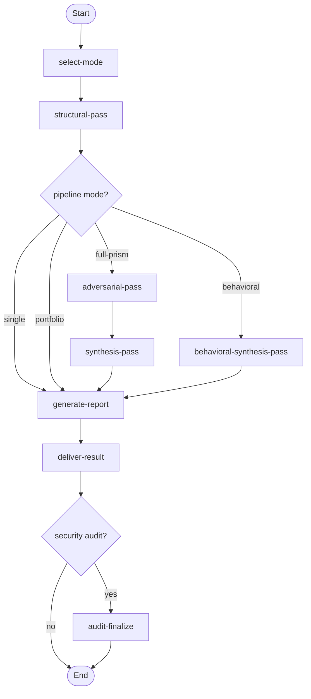
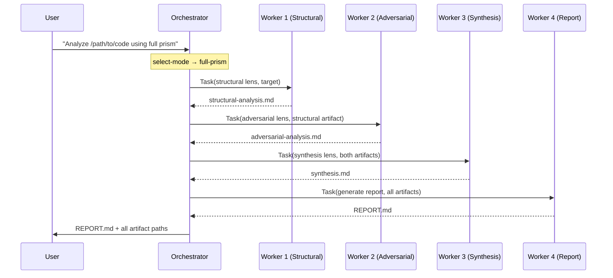

# Prism Analysis Workflow

> v1.5.0 — Structured analytical prompts that find what asking a model directly misses. Four modes, 58 lenses, isolated multi-pass pipelines, automated report generation.

---

## Overview

[Prisms](https://github.com/m2ux/workflow-server/blob/workflows/prism/resources/README.md) are succinct structured prompts (70–330 words) that force an LLM through a specific sequence of analytical operations — each one targeting a class of problem that free-form analysis reliably misses. The results are qualitatively different: conservation laws instead of style suggestions, quantified bug tables instead of vague warnings.

**Why use this workflow instead of prompting directly?**

- **Depth.** Each prism encodes a multi-step reasoning chain validated across hundreds of experiments (representing $$$$ in compute). The L12 prism, for example, forces the model through:
```claim → dialectic → concealment → improvement → invariant → inversion → conservation law → meta-law``` — producing findings that a single prompt never reaches.
- **Independence.** The full-prism pipeline runs three passes in separate context windows. The adversarial pass has never seen the structural analysis being generated — it receives only the final text. This prevents the model from defending its own prior output, producing genuine self-correction.
- **Breadth.** Portfolio mode runs multiple lenses that each ask a fundamentally different question about the same target. Research across real codebases confirms zero overlap between lenses — each finds properties the others are structurally blind to.
- **Reproducibility.** The same prism on the same input produces consistent analytical depth regardless of how the conversation started or what else is in context.

**Use this workflow when you want to:**
- Find bugs, design flaws, or structural problems that surface-level review misses
- Get a second opinion that genuinely challenges a prior analysis (full-prism mode)
- Understand how code breaks, what it costs, how it changes, and where names lie (behavioral pipeline)
- Apply multiple complementary perspectives to the same target (portfolio mode)
- Analyze non-code artifacts — proposals, strategies, architectures — with the same rigour

## Concepts

Definitions of the analytical [concepts](concept-lexicon.md) used within the Prism workflow (49 entries), including: [conservation law](concept-lexicon.md#conservation-law), [meta-law](concept-lexicon.md#meta-law), [structural invariant](concept-lexicon.md#structural-invariant), [concealment mechanism](concept-lexicon.md#concealment-mechanism), [code geology](concept-lexicon.md#code-geology), [calcification](concept-lexicon.md#calcification), [perturbation-response](concept-lexicon.md#perturbation-response), [confabulation](concept-lexicon.md#confabulation), [epistemic typing](concept-lexicon.md#epistemic-typing), [exploit chain](concept-lexicon.md#exploit-chain), and others.

---

## Prompt Guide

Each prism responds to a specific analytical question. The table below shows user prompts that reliably trigger each prism through the plan-analysis goal-mapping matrix.

| Prompt | Scope | Prism / Mode |
|--------|-------|-------------|
| `Analyze src/parser.ts` | file | L12 structural (00) — default for any code target |
| `Pre-commit review of src/handler.rs` | file | L12 full pipeline (00→01→02) |
| `Analyze this proposal using the full prism` | text | L12 full pipeline on general input |
| `What patterns from this design would transfer poorly to other problems?` | any | Pedagogy (06) |
| `What hidden assumptions does this architecture embed?` | any | Claim (07) |
| `What resource scarcity does this system gamble on?` | any | Scarcity (08) |
| `What rejected alternatives would swap these problems for different ones?` | any | Rejected-paths (09) |
| `How does this code decay over 12 months of neglect?` | file | Degradation (10) |
| `What does each function's interface contract promise vs actually deliver?` | file | Contract (11) |
| `Find conservation laws and information laundering in this code` | file | Deep-scan (12) |
| `Where do trust boundaries collapse? Find authority inversions` | module | Trust topology (13) |
| `Find hidden temporal coupling — ordering dependencies and TOCTOU gaps` | module | Coupling clock (14) |
| `Where do implementation details leak through abstraction boundaries?` | module | Abstraction leak (15) |
| `What structural defects persist through every attempted fix?` | file | Fix-cascade (16) |
| `Where does this code claim to be something different than it is?` | file | Identity (17) |
| `Quick structural scan of src/core.ts` | file | L12-universal (18) — Sonnet only |
| `How does error context get destroyed in this module?` | module | Error resilience (19) |
| `Find hidden performance costs — what optimization data is erased at boundaries?` | file | Optimize (20) |
| `Trace invisible coupling — what data flows between functions without signatures?` | module | Evolution (21) |
| `Where do function names lie about what the code actually does?` | file | API surface (22) |
| `Run a comprehensive behavioral analysis of src/pipeline/` | module | Behavioral pipeline (19→20→21→22→23) |
| `How does this business process destroy diagnostic information?` | text | Error resilience neutral (24) |
| `Where do the labels in this proposal lie about what it delivers?` | text | API surface neutral (25) |
| `What implicit dependencies bind the components of this strategy?` | text | Evolution neutral (26) |
| `Quick error resilience scan of src/handler.ts` | file | Error resilience compact (27) — 110w |
| `Ultra-brief error resilience check` | file | Error resilience 70w (28) — 70w |
| `Where does skipped validation waste both safety and performance?` | file | Evidence cost (29) |
| `Find dead code — functions defined but never called, stale config` | module | Reachability (30) |
| `Where has documentation drifted from actual behavior?` | module | Fidelity (31) |
| `Map every piece of mutable state as a state machine — find unhandled transitions` | file | State audit (32) |
| `Dig through the structural layers — what's foundation vs accumulated sediment?` | file | Archaeology (33) |
| `Find registration gaps — features wired but undocumented, or declared but unwired` | module | Audit-code (34) |
| `Plant a new requirement and trace what resists the change` | file | Cultivation (35) |
| `What breaks when a new developer joins? What becomes cargo cult?` | file | SDL-simulation (36) |
| `Map trust entry points and trace exploit chains` | file | Security V1 (37) |
| `Run this code forward through 5 maintenance cycles — what calcifies?` | file | Simulation (38) |
| `Which functions can't be unit tested? What's the isolation cost?` | file | Testability V1 (39) |
| `Attack this analysis for confabulated knowledge claims` | text | Knowledge-audit (40) |
| `Classify every claim by knowledge dependency — structural vs contextual vs temporal` | text | Knowledge-boundary (41) |
| `Type every finding with confidence, provenance, and falsifiability` | any | Knowledge-typed (42) |
| `Self-correcting structural analysis — L12 with built-in confabulation detection` | file | L12g (43) |
| `Maximum-trust analysis — 5-phase self-aware structural analysis, zero confabulation` | file | Oracle (44) |
| `Rewrite this README as a high-converting developer landing page` | text | Writer (45) |
| `Plan the optimal analysis strategy for this goal` | any | Strategist (48) |
| `Design 3 alternative architectures with migration paths` | file | Architect (51) |
| `What does my prism catalog systematically miss?` | any | Blindspot (52) |
| `Generate an interface-first implementation with failure prediction` | file | Codegen (53) |
| `What if the opposite design choice was made?` | file | Counterfactual (54) |
| `What emergent behaviors arise from component interactions?` | file | Emergence (55) |
| `Is this conservation law genuine or generic?` | any | Falsify (56) |
| `Design a system that would NOT obey this conservation law` | any | Genesis (57) |
| `Reconstruct decision history from structural fossils` | file | History (58) |
| `What knowledge prerequisites does this task require?` | any | Prereq (59) |
| `Which findings actually matter? Rank by surprise and action distance` | any | Significance (60) |
| `Extract testable claims and generate verification commands` | file | Verify Claims (61) |
| `Security review of this module` | module | Portfolio: trust (13) + security-v1 (37) |
| `Code review of src/api.ts` | file | Portfolio: L12 (00) + contract (11) |
| `Assess maintainability of this service` | module | Portfolio: degradation (10) + contract (11) |
| `Design review of this architecture` | any | Portfolio: claim (07) + rejected-paths (09) |
| `What are the trade-offs in this approach?` | text | Portfolio: scarcity (08) + rejected-paths (09) |
| `How does this code age? Archaeology + temporal simulation` | file | Portfolio: archaeology (33) + simulation (38) |
| `Verify this analysis has no confabulated claims` | text | Portfolio: knowledge-audit (40) + knowledge-boundary (41) |

Scope: **file** = single source file, **module** = directory or module (multiple files), **text** = inline text, question, or proposal (no file target), **any** = works at all scopes.

---

## Modes

| Mode | Passes | Description |
|------|--------|-------------|
| **Single** | 1 | L12 structural lens — conservation law, meta-law, bug table |
| **Full Prism** | 3 | Structural → adversarial → synthesis (self-correcting) |
| **Portfolio** | 2+ | Multiple independent lenses for breadth (52+ available) |
| **Behavioral** | 4+1 | Error resilience + optimization + evolution + API surface → synthesis. Code-only. |

---

## Workflow Flow



---

## Activities

| # | Activity | Description |
|---|----------|-------------|
| 00 | **Select Mode** | Detect scope, classify targets, recommend pipeline mode |
| 01 | **Structural Pass** | Execute L12 structural lens, portfolio lenses, or behavioral lenses per unit |
| 02 | **Adversarial Pass** | Challenge structural analysis (full-prism only) |
| 03 | **Synthesis Pass** | Reconcile structural + adversarial (full-prism only) |
| 04 | **Deliver Result** | Present final report with artifact paths |
| 05 | **Behavioral Synthesis Pass** | Synthesize 4 behavioral lens outputs (behavioral only) |
| 06 | **Audit Finalize** | Split report, create detailed findings + trade-off analysis (security audits only) |
| 07 | **Generate Report** | Produce clean REPORT.md from analysis artifacts — definitive findings only, no methodology language |

**Detailed documentation:** See [activities/](activities/) for per-activity TOON definitions.

---

## Skills

| # | Skill | Capability | Role |
|---|-------|------------|------|
| 00 | `structural-analysis` | Single-pass L12 structural analysis | Standalone / Worker |
| 01 | `full-prism` | Execute one isolated pass of the Full Prism pipeline | Worker |
| 02 | `portfolio-analysis` | Run 2+ complementary portfolio lenses | Standalone |
| 03 | `plan-analysis` | Detect scope, classify targets, plan analysis strategy | Planning |
| 04 | `orchestrate-prism` | Dispatch isolated workers, manage the analysis pipeline | Orchestrator |
| 05 | `behavioral-pipeline` | Execute 4+1 behavioral pipeline with labeled synthesis | Worker |
| 06 | `generate-report` | Produce clean final report from analysis artifacts | Worker |

**Detailed documentation:** See [skills/README.md](skills/README.md) for protocol flows and skill details.

---

## Resources (58)

Resources are indexed markdown files containing lens prompts. Each lens encodes a specific analytical operation.

| Range | Family | Count | Description |
|-------|--------|-------|-------------|
| 00–02 | L12 Pipeline | 3 | Structural, adversarial, synthesis (code and general) |
| 06–11 | Portfolio | 6 | Pedagogy, claim, scarcity, rejected-paths, degradation, contract |
| 12–18 | Structural SDL | 7 | Deep-scan, trust topology, coupling clock, abstraction leak, fix-cascade, identity, l12-universal |
| 19–23 | Behavioral Pipeline | 5 | Error resilience, optimize, evolution, API surface, behavioral synthesis |
| 24–26 | Domain-Neutral | 3 | Error resilience neutral, API surface neutral, evolution neutral |
| 27–28 | Compressed | 2 | Error resilience compact, error resilience 70w |
| 29–32 | Hybrid/Specialized | 4 | Evidence cost, reachability, fidelity, state audit |
| 33–39 | Analysis | 7 | Archaeology, audit-code, cultivation, sdl-simulation, security-v1, simulation, testability-v1 |
| 40–44 | Knowledge/Epistemic | 5 | Knowledge-audit, knowledge-boundary, knowledge-typed, l12g, oracle |
| 45–47 | Writer Pipeline | 3 | Writer, writer-critique, writer-synthesis |
| 48 | Meta | 1 | Strategist |
| 50–53 | Generative | 4 | Arc-code, architect, codegen, genesis |
| 54, 58 | Counterfactual/Historical | 2 | Counterfactual, history |
| 55 | Emergent | 1 | Emergence |
| 52, 56, 60 | Meta/Epistemic | 3 | Blindspot, falsify, significance |
| 59, 61 | Task/Verification | 2 | Prereq, verify-claims |

Indices 03–05 are deprecated (upstream general L12 variants removed). Index 49 (severity-rubric) has been removed.

**Detailed documentation:** See [resources/README.md](resources/README.md) for the full catalog with model sensitivity, quality scores, and recommended combinations.

---

## Model Sensitivity

Prisms fall into two model-sensitivity categories:

| Category | Prisms | Guidance |
|----------|--------|----------|
| **Model-Independent** | L12, SDL family (12–15), portfolio (06–11) | Equivalent quality across Haiku, Sonnet, Opus |
| **Haiku-Optimized** | sdl-simulation (36), security-v1 (37), testability-v1 (39), audit-code (34), arc-code (50) | Designed for Haiku; works on all models |
| **Sonnet-Recommended** | Behavioral (19–22), domain-neutral (24–26), knowledge (40–42), archaeology (33), cultivation (35), simulation (38), l12g (43), oracle (44), architect (51), blindspot (52), codegen (53), counterfactual (54), emergence (55), falsify (56), genesis (57), history (58), prereq (59), significance (60), verify-claims (61) | Sonnet scores +0.5–1.3 over Haiku |
| **Opus-Preferred** | Deep-scan (12), fix-cascade (16), writer-critique (46), writer-synthesis (47) | Best results on Opus |
| **Sonnet-Only** | l12-universal (18) | Haiku fails below compression floor |

Domain-neutral variants (24–26) have a ~0.5–0.7 quality gap vs code-specific versions on code targets. Plan-analysis prefers code-specific variants when `target_type` is `code`.

---

## Execution Model

This workflow uses an **orchestrator with disposable workers**. Each analytical pass is dispatched to a **fresh sub-agent** (never resumed) to guarantee context isolation.



Unlike the work-package workflow (which resumes a persistent worker), the prism workflow creates a **new worker for each pass**. This is the isolation guarantee — the adversarial worker has never seen the structural analysis being generated.

---

## Variables

| Variable | Type | Description |
|----------|------|-------------|
| `target` | string | What to analyze — file path, directory, inline text, question, or concept |
| `target_type` | string | `code` or `general` (default: `code`) |
| `pipeline_mode` | string | `single`, `full-prism`, `portfolio`, or `behavioral` (default: `single`) |
| `output_path` | string | Directory to write analysis artifacts (default: `.`) |
| `selected_lenses` | array | For portfolio mode: array of lens names |
| `analysis_focus` | string | Optional focus area to guide the analysis |
| `analysis_units` | array | Ordered list of analysis units (for multi-unit scopes) |
| `current_unit` | object | Current analysis unit during iteration loop |
| `structural_output_path` | string | File path to structural pass artifact |
| `adversarial_output_path` | string | File path to adversarial pass artifact |
| `synthesis_output_path` | string | File path to synthesis pass artifact |
| `portfolio_output_paths` | object | Map of lens name to file path for portfolio mode |
| `all_artifact_paths` | array | Accumulated list of all artifact paths across units |
| `behavioral_output_paths` | object | Map of behavioral lens name to artifact path |
| `behavioral_synthesis_output_path` | string | File path to behavioral synthesis artifact |
| `report_output_path` | string | File path to the generated REPORT.md |

---

## File Structure

```
workflows/prism/
├── workflow.toon                         # Workflow definition (4 modes, 16 variables, 12 rules)
├── README.md                             # This file
├── concept-lexicon.md                    # Analytical concept definitions (49 concepts)
├── activities/
│   ├── 00-select-mode.toon               # Plan analysis configuration
│   ├── 01-structural-pass.toon           # L12, portfolio, or behavioral lens dispatch
│   ├── 02-adversarial-pass.toon          # Adversarial lens (full-prism only)
│   ├── 03-synthesis-pass.toon            # L12 synthesis (full-prism only)
│   ├── 04-deliver-result.toon            # Present final report
│   ├── 05-behavioral-synthesis-pass.toon # Behavioral synthesis (behavioral only)
│   ├── 06-audit-finalize.toon            # Audit report finalization (security audits only)
│   └── 07-generate-report.toon           # Generate clean REPORT.md from analysis artifacts
├── skills/
│   ├── 00-structural-analysis.toon       # Single-pass L12
│   ├── 01-full-prism.toon               # Full Prism worker pass
│   ├── 02-portfolio-analysis.toon        # Portfolio lenses (40+ lenses)
│   ├── 03-plan-analysis.toon             # Analysis planning (58 goal mappings)
│   ├── 04-orchestrate-prism.toon         # Pipeline orchestration
│   ├── 05-behavioral-pipeline.toon       # Behavioral pipeline worker pass
│   ├── 06-generate-report.toon           # Report generation from analysis artifacts
│   └── README.md
└── resources/
    ├── 00–02: L12 pipeline
    ├── 06–11: Portfolio lenses
    ├── 12–18: SDL structural family
    ├── 19–23: Behavioral pipeline
    ├── 24–26: Domain-neutral variants
    ├── 27–28: Compressed variants
    ├── 29–32: Hybrid/specialized
    ├── 33–39: Analysis (archaeology, audit, cultivation, simulation, security-v1, testability-v1)
    ├── 40–44: Knowledge/epistemic (knowledge-audit, boundary, typed, l12g, oracle)
    ├── 45–47: Writer pipeline
    ├── 48: Strategist
    ├── 50–53: Generative (arc-code, architect, codegen, genesis)
    ├── 54, 58: Counterfactual/historical
    ├── 55: Emergent (emergence)
    ├── 56, 60: Meta/epistemic (falsify, significance)
    ├── 52: Meta (blindspot)
    ├── 59, 61: Task/verification (prereq, verify-claims)
    └── README.md (58 resources)
```
