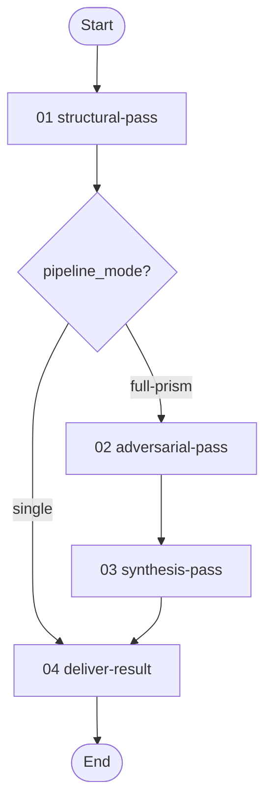
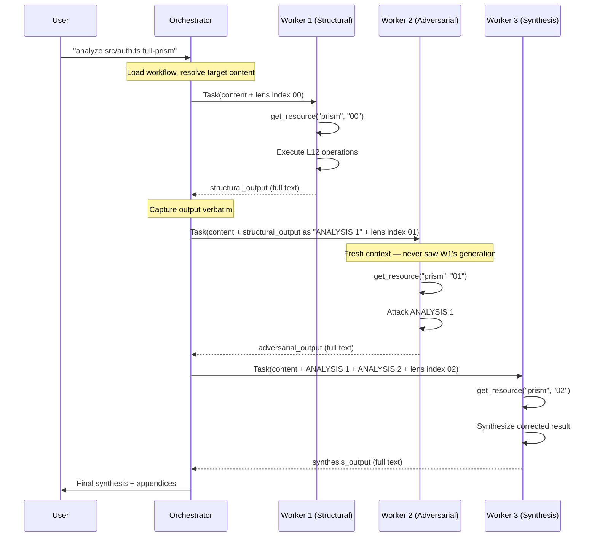

# Structural Analysis Lensing Workflow

> v1.1.0 — Apply cognitive lenses to code or text through isolated sub-agent passes.

---

## Overview

This workflow applies structural analysis lenses to code or text in three modes. Each analytical pass runs in an **isolated sub-agent** to guarantee independence — particularly critical for the adversarial pass, which must challenge the structural analysis without being biased by having generated it.

**Structural analysis** is the foundation. When an AI agent reviews code without specific guidance, it produces surface-level observations — the kind of feedback you would find in a generic code review. It notices style inconsistencies, missing error handling, and obvious logic errors. What it does not do is discover the *structural properties* of the code: the trade-offs the design is forced to make, the problems that persist through every attempted improvement, or the assumptions that will fail silently under conditions the author never considered. Lenses change this. Each lens is a short sequence of imperative operations (50–330 words) that directs the model through a specific analytical process. Rather than asking "what's wrong with this code?", the L12 lens instructs the model to make a falsifiable claim, attack it from three perspectives, name what the gap conceals, engineer an improvement that deepens the concealment, and trace the chain through to a conservation law. The model executes these operations as a program, and the output shifts from description to construction-based reasoning.

**Adversarial correction** addresses the structural pass's blind spots. A single analytical pass, however deep, cannot see what its own framing conceals. Every conservation law is itself a lens that makes certain properties visible while hiding others. The adversarial pass receives only the textual output from the structural pass — never the generation history — and treats it as an opponent's work to defeat with evidence from the code. It searches for wrong predictions (where the analysis claims something the code disproves), overclaims (bugs classified as structural that are actually fixable), and underclaims (problems the structural analysis missed entirely). This is why the workflow enforces strict context isolation between passes: shared generation history turns the adversary into a collaborator, which defeats the purpose of the pipeline.

**Synthesis** reconciles the structural analysis and its adversarial challenge into a result stronger than either alone. The synthesis agent receives the code, the structural output (ANALYSIS 1), and the adversarial output (ANALYSIS 2) in a fresh context. It produces a corrected conservation law that survives both perspectives, reclassifies every finding based on the combined evidence, and names the "deepest finding" — a property that becomes visible only from having both the structural analysis and its correction. Research confirms that the synthesis consistently discovers properties that neither pass alone could find, which is the justification for the cost of three passes rather than one.

| # | Activity | Required | Description |
|---|----------|----------|-------------|
| 01 | [**Structural Pass**](activities/01-structural-pass.toon) | yes | L12 structural analysis — conservation law, meta-law, classified findings |
| 02 | [**Adversarial Pass**](activities/02-adversarial-pass.toon) | full-prism only | Attack the structural analysis — wrong predictions, overclaims, underclaims |
| 03 | [**Synthesis Pass**](activities/03-synthesis-pass.toon) | full-prism only | Reconcile both perspectives into corrected, definitive findings |
| 04 | [**Deliver Result**](activities/04-deliver-result.toon) | yes | Present final analysis to the user |

**Detailed documentation:**

- **Activities:** See [activities/](activities/) for per-activity TOON definitions with steps, rules, and transitions.
- **Skills:** See [skills/README.md](skills/README.md) for the full skill inventory (6 skills) and protocol flow diagrams.
- **Resources:** See [resources/](resources/) for the 12 lens resources.

**Pipeline modes:**

| Mode | Passes | When to use |
|------|--------|-------------|
| `single` | Structural only | Quick analysis, code review augmentation |
| `full-prism` | Structural → Adversarial → Synthesis | Maximum depth with self-correction |
| `portfolio` | Multiple independent lenses | Breadth — complementary structural perspectives |

---

## Workflow Flow



---

## Execution Model

This workflow uses an **orchestrator with disposable workers** — distinct from workflows that use a persistent, resumed worker.



**Why disposable workers?** In workflows that use a persistent worker, context accumulates across activities — codebase understanding, file locations, implementation decisions. That shared context is valuable for implementation workflows. In the prism workflow, shared context is *harmful*. The adversarial worker must treat the structural analysis as an opponent's work to defeat. If it shares generation history with the structural worker, it pulls punches. Fresh agents guarantee genuine independence.

**Orchestrator** (skill: `orchestrate-prism`):
- Loads workflow, resolves target content
- Dispatches each pass to a **fresh** sub-agent (NEVER resumes)
- Captures full text output from each pass
- Forwards prior outputs verbatim to subsequent passes
- MUST NOT execute lens operations or generate analysis

**Workers** (skill: `full-prism`):
- Self-bootstrap by loading the lens resource via `get_resource`
- Execute every operation in the lens prompt completely
- Return the full analysis text
- Run in isolation — no shared context between passes

---

## Examples

### Standalone: Single-pass structural analysis on a file

The simplest use case. An agent loads the L12 lens resource and applies it to a source file.

```
# Agent loads the lens
lens = get_resource({ workflow_id: "prism", index: "00" })

# Agent reads the target file, then executes every operation
# in the lens prompt against the code
```

**What you get:** A conservation law naming the structural trade-off the code is forced to make, a meta-law predicting what that trade-off conceals, and a bug table classifying each finding as fixable or structural.

### Standalone: Full Prism pipeline via the prism workflow

Run the 3-pass self-correcting pipeline. The orchestrator dispatches three isolated agents.

```
# Start the prism workflow with full-prism mode
get_workflow({ workflow_id: "prism" })

# The orchestrator follows the orchestrate-prism skill:
# 1. Reads target file
# 2. Dispatches fresh agent → structural pass (resource 00)
# 3. Captures output, dispatches fresh agent → adversarial pass (resource 01)
# 4. Captures output, dispatches fresh agent → synthesis pass (resource 02)
# 5. Presents the synthesis as the final result
```

**What you get:** A corrected conservation law that survives adversarial challenge, a definitive fixable/structural classification for every finding, and the "deepest finding" — a property visible only from having both the structural analysis and its correction.

### Standalone: Portfolio analysis with two complementary lenses

Run two independent lenses to get breadth instead of depth.

```
# Agent loads two lenses and applies each independently
claim_lens = get_resource({ workflow_id: "prism", index: "07" })
degradation_lens = get_resource({ workflow_id: "prism", index: "10" })

# Apply claim lens → discovers hidden assumptions
# Apply degradation lens → discovers what decays with neglect
# Cross-lens synthesis → identifies convergent and unique findings
```

**What you get:** Two non-overlapping sets of structural findings. Convergent findings (discovered by both lenses) are high-confidence. Unique findings (one lens only) are the value-add of portfolio analysis.

### Cross-workflow: Augmenting a code review skill

Any workflow's code review skill can load the L12 lens to supplement its checklist-based review with structural depth.

```
# Inside another workflow's skill protocol step:
protocol:
  structural-analysis[3]:
    - "Load resource 00 from the prism workflow: get_resource(workflow_id: 'prism', index: '00')"
    - "Apply every operation in the lens prompt against each changed file"
    - "Append structural findings to the code review report"
```

**What you get:** The standard severity-rated code review findings *plus* conservation laws and structural/fixable classification for each file. The lens finds problems that checklist reviews miss — particularly silent failures and design-level trade-offs.

### Cross-workflow: Full Prism from within another workflow

When maximum depth is needed (e.g., during implementation analysis or a security audit), a worker in any workflow can act as the prism orchestrator, spawning isolated sub-agents directly.

```
# The calling worker follows the orchestrate-prism skill protocol:
# 1. Read target code
# 2. Task(fresh agent, content + resource index 00) → capture structural output
# 3. Task(fresh agent, content + ANALYSIS 1 + resource index 01) → capture adversarial output
# 4. Task(fresh agent, content + ANALYSIS 1 + ANALYSIS 2 + resource index 02) → capture synthesis
# 5. Include synthesis findings in the parent workflow's artifact
```

**What you get:** The self-corrected Full Prism analysis embedded within the calling workflow's artifact, with full isolation between passes even though the analysis is invoked from a parent workflow.

---

## Background

The lenses in this workflow are derived from the [agi-in-md](https://github.com/m2ux/agi-in-md) research project (29 rounds, 650+ experiments). The core finding: short imperative prompts ("lenses") reliably activate specific analytical operations in language models, producing structurally deeper findings than vanilla analysis.

- **The prompt is the dominant variable.** Haiku + L12 lens (9.8 depth, 28 bugs) outperforms Opus vanilla (7.3 depth, 18 bugs) at 5x lower cost.
- **Construction-based reasoning (L8+) works on all models.** Unlike meta-analysis which requires larger models, construction — building improvements and observing what they reveal — is a universal cognitive operation.
- **5 portfolio lenses find 5 genuinely different things.** Zero overlap confirmed across 3 real codebases. Each lens activates a distinct analytical operation.
- **The 3-pass pipeline self-corrects.** The adversarial pass finds what the structural pass conceals. The synthesis produces properties visible only from having both perspectives.

The L12 pipeline encodes 12 sequential operations: falsifiable claim → three-voice dialectic → concealment mechanism → engineered improvement → diagnostic recursion → structural invariant → invariant inversion → conservation law → meta-diagnostic → meta-law → concrete findings collection.

