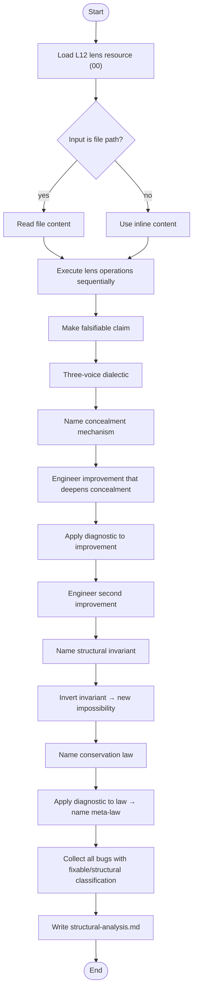
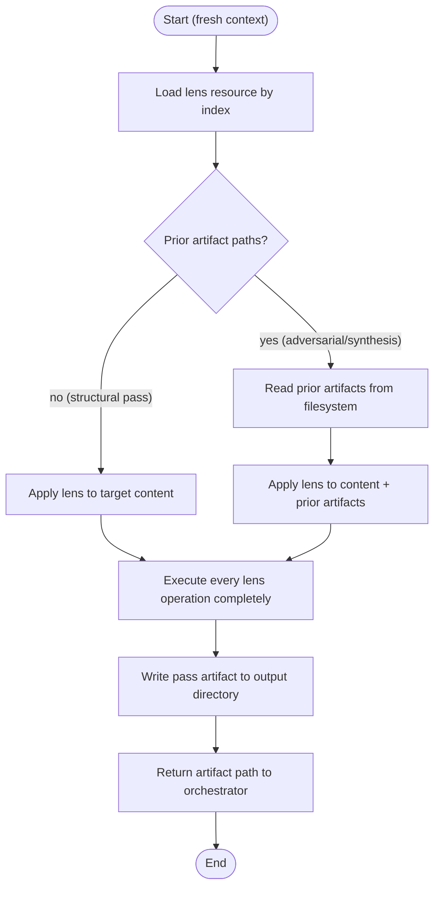
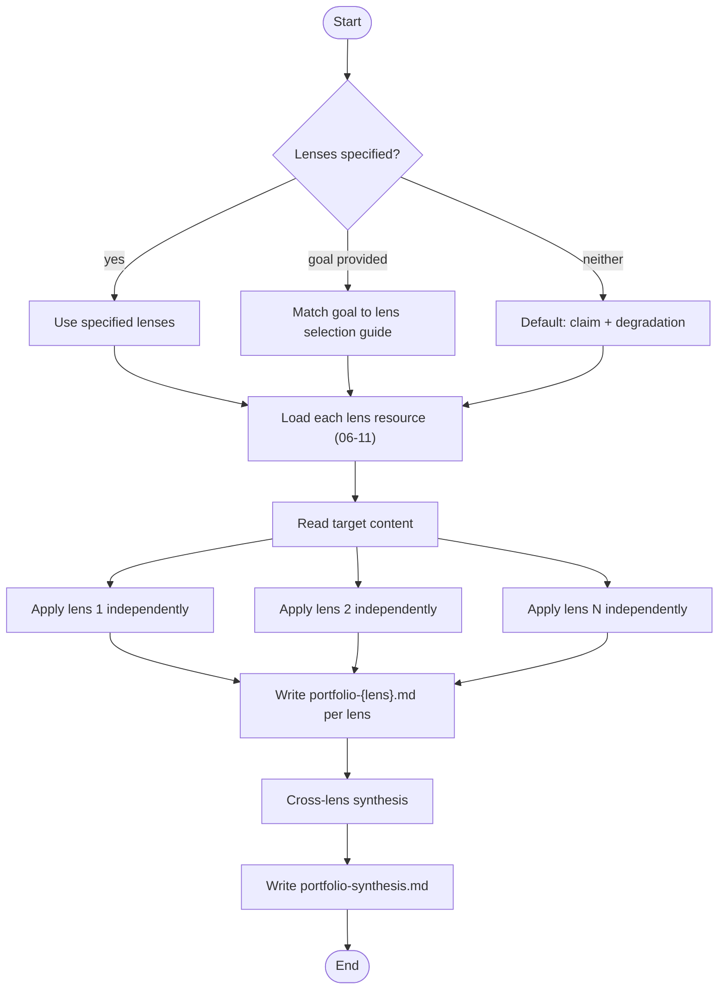
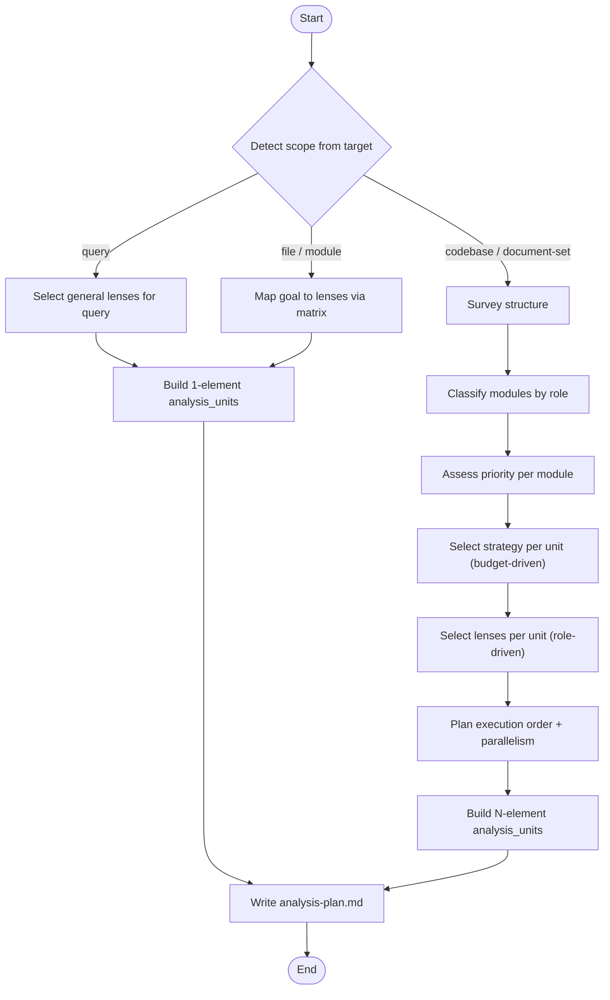
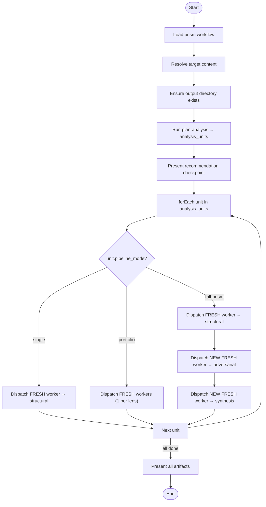
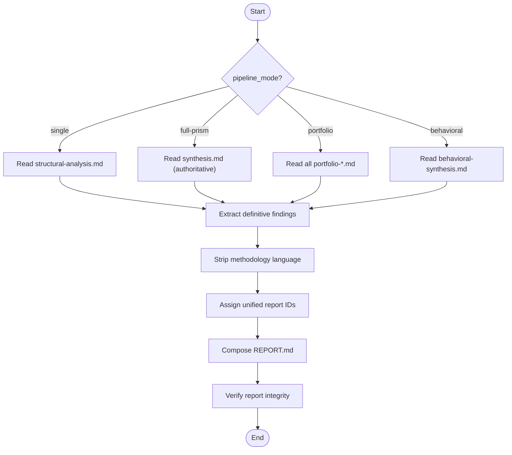

# Prism Skills

> Part of the [Structural Analysis Prism Workflow](../README.md)

## Skills (7 workflow-specific)

The prism workflow provides 7 skills organized by role. Skills `orchestrate-prism`, `full-prism`, and `behavioral-pipeline` form the isolation pipeline. `generate-report` produces the final clean output. The remaining skills are usable standalone by any workflow.

| # | Skill ID | Capability | Role |
|---|----------|------------|------|
| 00 | `structural-analysis` | Single-pass L12 structural analysis on code | Standalone / Worker |
| 01 | `full-prism` | Execute one isolated pass of the Full Prism pipeline | Worker |
| 02 | `portfolio-analysis` | Run 2+ complementary portfolio lenses (expanded catalog: 52 lenses) | Standalone |
| 03 | `plan-analysis` | Detect scope, classify targets, plan analysis strategy (58 goal mappings) | Planning / Advisory |
| 04 | `orchestrate-prism` | Dispatch isolated workers, manage all pipeline modes | Orchestrator |
| 05 | `behavioral-pipeline` | Execute a pass of the 4+1 behavioral pipeline | Worker |
| 06 | `generate-report` | Produce clean REPORT.md from analysis artifacts — methodology stripped | Worker |

> The universal skills `orchestrate-workflow` and `execute-activity` from [meta/skills/](../../meta/skills/) are **not used** by this workflow. Prism uses its own orchestration skill (`orchestrate-prism`) because it requires disposable (non-resumed) workers for context isolation.

---

### Skill Protocol: `structural-analysis` (00)

Single-pass L12 structural analysis. Loads the L12 lens prompt and applies it to code, producing a conservation law, meta-law, and severity-classified bug table. Writes the result to `structural-analysis.md`. This is the foundational prism operation — other workflows can reference it directly.

**Protocol steps:**

| Step Key | Action |
|----------|--------|
| `load-lens` | Load resource `00` via `get_resource` (works for all target types) |
| `read-target` | Read file or accept inline code; note optional analysis focus |
| `execute-lens` | Execute every L12 operation: claim → dialectic → concealment → improvements → invariant → inversion → conservation law → meta-law → bug table |
| `write-artifact` | Write analysis to `{output-path}/structural-analysis.md` |
| `format-output` | Structure output with section headers; classify bugs as fixable/structural |

**Output:** `structural-analysis.md` — conservation law, meta-law, concealment mechanism, structural invariant, bug table with locations and severity.

---

### Skill Protocol: `full-prism` (01)

Worker-side skill for one pass of the 3-pass pipeline. Runs in a fresh isolated context dispatched by `orchestrate-prism`. Receives target content, prior pass artifact paths to read, and a resource index. Self-bootstraps by loading the lens via `get_resource`. Writes its output artifact for downstream consumption.

**Protocol steps:**

| Step Key | Action |
|----------|--------|
| `load-lens` | Load lens resource by index (00-02) via `get_resource("prism", index)` |
| `read-prior-artifacts` | Read prior pass artifacts from filesystem; label as ANALYSIS 1 / ANALYSIS 2 |
| `apply-lens` | Apply lens operations to content; use prior artifacts as context if provided |
| `write-artifact` | Write analysis to `{output-path}/{artifact-filename}` |
| `format-output` | Structure per pass: structural → sections + bug table; adversarial → wrong predictions + overclaims + underclaims; synthesis → refined law + definitive classification |

**Key rules:** No context leakage. Read prior output from filesystem artifacts, not inline. Write output as an artifact for downstream passes.

---

### Skill Protocol: `portfolio-analysis` (02)

Run 2+ portfolio lenses independently against the same artifact. Each lens finds genuinely different structural properties (zero overlap confirmed across 3+ real codebases). Writes per-lens artifacts and a cross-lens synthesis.

**Protocol steps:**

| Step Key | Action |
|----------|--------|
| `select-lenses` | Use provided lenses, match goal to selection guide, or default to claim + degradation |
| `load-lenses` | Load each lens resource: pedagogy=06, claim=07, scarcity=08, rejected-paths=09, degradation=10, contract=11 |
| `read-target` | Read file or accept inline content |
| `execute-lenses` | Apply each lens independently — do not let one lens influence another |
| `write-artifacts` | Write `portfolio-{lens-name}.md` per lens |
| `cross-lens-synthesis` | Identify convergent and unique findings; write `portfolio-synthesis.md` |

**Lens selection guide:**

| Analytical Goal | Recommended Lenses |
|-----------------|-------------------|
| Trade-off analysis | scarcity + rejected-paths |
| Hidden assumptions | claim + pedagogy |
| Maintainability risks | degradation + contract |
| Design rationale | pedagogy + rejected-paths |
| Interface quality | contract + claim |

---

### Skill Protocol: `plan-analysis` (03)

Scope-aware analysis planner. Detects whether the target is a query, file, module, codebase, or document set, then produces an `analysis_units` array that drives the workflow's iteration loop. For codebase scope, classifies modules by role, assigns analytical priority, and selects per-module pipeline modes and lenses based on a configurable budget.

**Protocol steps:**

| Step Key | Action |
|----------|--------|
| `detect-scope` | Infer scope from target: filesystem path → file/module/codebase; non-path → query |
| `query-recommendation` | Select general lenses matched to analytical goal |
| `single-unit-recommendation` | Map goal to lenses via goal-mapping matrix; apply depth preference |
| `survey-structure` | List files/directories, detect module boundaries, use GitNexus if available |
| `classify-units` | Categorise by role (api, auth, business-logic, utilities, etc.) |
| `select-strategy-per-unit` | Map priority to pipeline mode based on budget (quick/standard/thorough) |
| `select-lenses-per-unit` | Pick lenses matched to each module's role |
| `build-analysis-units` | Produce the `analysis_units` array for the workflow loop |
| `plan-execution` | Order by priority, identify parallelism, estimate cost |
| `format-plan` | Write `analysis-plan.md` artifact |

**Budget → priority → depth mapping:**

| Priority | Budget: quick | Budget: standard | Budget: thorough |
|----------|--------------|-----------------|-----------------|
| High | single L12 | full-prism | full-prism |
| Medium | single L12 | single L12 | full-prism |
| Low | skip | portfolio (2 lenses) | single L12 |

**Goal → Lens mapping matrix:**

| Goal | Lens(es) | Resource(s) |
|------|----------|-------------|
| Bug detection | L12 | 00 |
| Code review augmentation | L12 + contract | 00, 11 |
| Design review | claim + rejected-paths | 07, 09 |
| Codebase comprehension | pedagogy + rejected-paths | 06, 09 |
| Pre-commit validation | L12 pipeline | 00, 01, 02 |
| Planning review | L12 | 00 |
| Maintainability assessment | degradation + contract | 10, 11 |
| Assumption validation | claim + scarcity | 07, 08 |
| Security review | L12 pipeline | 00, 01, 02 |
| Strategy evaluation | claim + scarcity | 07, 08 |
| Implication exploration | claim + rejected-paths | 07, 09 |

---

### Skill Protocol: `orchestrate-prism` (04)

Coordination skill that dispatches each analytical pass to a fresh, isolated sub-agent. Passes artifact paths between workers — workers read and write from the filesystem. Manages the pipeline lifecycle across all units in the `analysis_units` array.

**Protocol steps:**

| Step Key | Action |
|----------|--------|
| `load-workflow` | Load prism workflow definition, initialize state |
| `resolve-target` | Read file path or use inline content |
| `determine-lens-indices` | Map target_type + pipeline_mode to resource indices |
| `dispatch-structural-pass` | Create FRESH worker with content + resource index; capture artifact path |
| `dispatch-adversarial-pass` | Create NEW FRESH worker with content + structural artifact path + resource index |
| `dispatch-synthesis-pass` | Create NEW FRESH worker with content + both artifact paths + resource index |
| `dispatch-portfolio-passes` | Create parallel FRESH workers (up to 4 concurrent), one per lens |
| `present-result` | Read and present final artifacts; report all artifact paths |

**Key rules:** NEVER use Task `resume` between passes. Pass artifact paths, not inline text. Verify artifacts were written before dispatching subsequent passes.

---

### Skill Protocol: `behavioral-pipeline` (05)

Worker-side skill for the 4+1 behavioral pipeline. Runs 4 independent behavioral lenses (each in a fresh context), then a synthesis lens that reads all 4 outputs with labeled sections. Code-only — behavioral pipeline is not available for general targets.

**Label mapping:**

| Resource | Index | Role Label | Artifact |
|----------|-------|-----------|----------|
| error-resilience | 19 | ERRORS | behavioral-errors.md |
| optim | 20 | COSTS | behavioral-costs.md |
| evolution | 21 | CHANGES | behavioral-changes.md |
| api-surface | 22 | PROMISES | behavioral-promises.md |
| behavioral-synthesis | 23 | SYNTHESIS | behavioral-synthesis.md |

**Protocol steps:**

| Step Key | Action |
|----------|--------|
| `load-lens` | Load behavioral lens by index (19-23) via `get_resource("prism", index)` |
| `read-target` | Read target code file |
| `apply-independent-lens` | For passes 19-22: apply lens to target, write per-role artifact |
| `construct-synthesis-input` | For pass 23: read all 4 artifacts, construct labeled sections (## ERRORS, ## COSTS, ## CHANGES, ## PROMISES) |
| `apply-synthesis-lens` | Apply behavioral_synthesis lens to constructed input |
| `write-artifact` | Write output artifact |

**Key rules:** Code-only (no optim_neutral exists). Label mapping is fixed — synthesis expects exactly ERRORS, COSTS, CHANGES, PROMISES. Behavioral lenses favor Sonnet (+0.5-1.3 over Haiku).

---

### Skill Protocol: `generate-report` (06)

Post-analysis skill that reads all artifacts produced by prior passes and generates a clean `REPORT.md` presenting only definitive findings. Strips all methodology-specific language — the reader sees conclusions, not analytical process. Works across all pipeline modes (single, full-prism, portfolio, behavioral).

**Protocol steps:**

| Step Key | Action |
|----------|--------|
| `identify-authoritative-source` | Determine which artifact(s) contain definitive findings based on pipeline_mode |
| `read-artifacts` | Read authoritative artifacts from filesystem paths in all_artifact_paths |
| `extract-findings` | Extract each finding with: ID, title, severity, classification, location |
| `strip-methodology` | Remove analytical process language — no pass attribution, no dispute narratives |
| `assign-ids` | Map source IDs to unified report IDs; use dimension prefixes if analysis_focus provides them |
| `compose-report` | Write report: Executive Summary → Core Finding → Findings by severity → Corrections → Traceability |
| `write-artifact` | Write to `{output-path}/REPORT.md`; verify integrity |

**Authoritative source by mode:**

| Mode | Authoritative Artifact | Supporting Artifacts |
|------|----------------------|---------------------|
| single | structural-analysis.md | — |
| full-prism | synthesis.md | structural-analysis.md, adversarial-analysis.md (for evidence detail) |
| portfolio | all portfolio-*.md | portfolio-synthesis.md (for cross-lens findings) |
| behavioral | behavioral-synthesis.md | behavioral-errors/costs/changes/promises.md (for detail) |

**Key rules:** Severities are inherited from the authoritative source — never reassigned. Every finding in the source must appear in the report. Every report ID must have a traceability entry mapping to source artifact and original ID.
