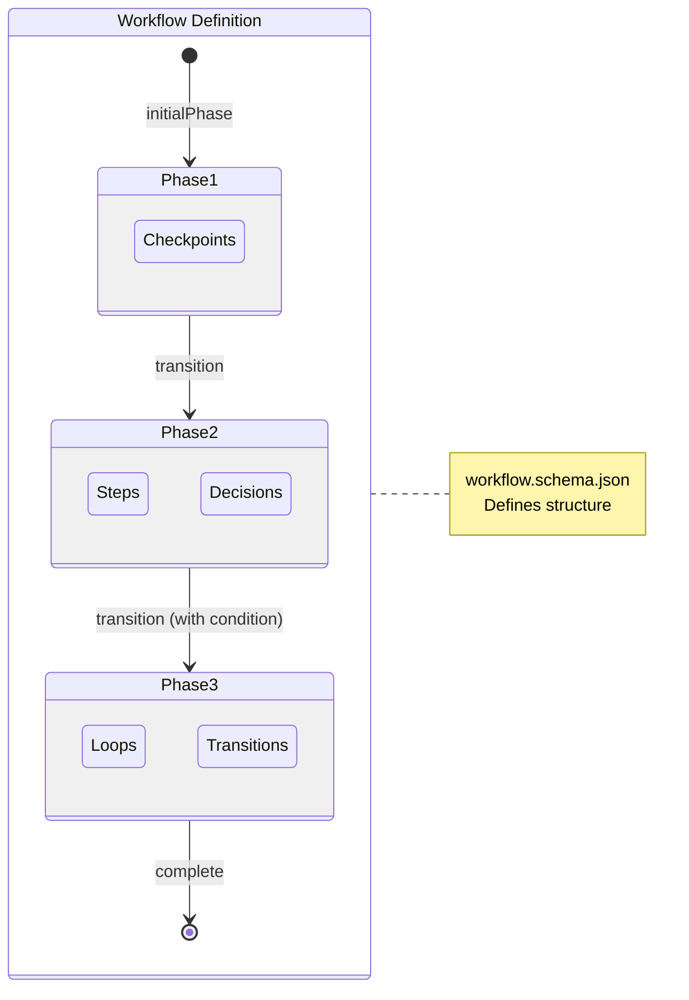
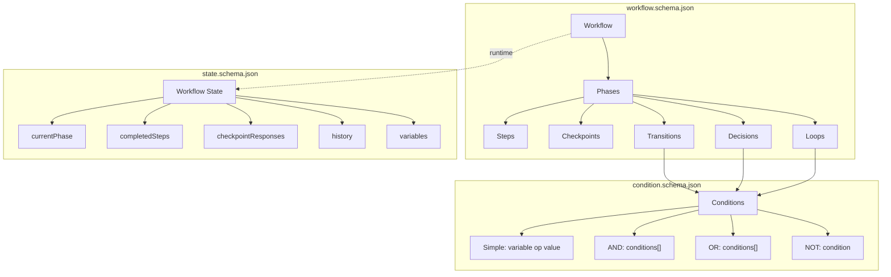

# Workflow Schema System

This folder contains JSON Schema definitions for the workflow server. These schemas define the structure for workflow definitions, conditional logic, and runtime state tracking.

## Overview

The workflow server uses three interconnected schemas:

| Schema | Purpose | Use Case |
|--------|---------|----------|
| `workflow.schema.json` | Defines workflow structure | Creating new workflows with phases, steps, checkpoints |
| `condition.schema.json` | Defines conditional expressions | Controlling transitions and decisions |
| `state.schema.json` | Tracks runtime execution state | Persisting workflow progress |

## Schema Relationships

<!-- TODO: Add descriptive context for the diagrams below -->





---

## Workflow Schema

The workflow schema (`workflow.schema.json`) defines the complete structure of a workflow, including metadata, variables, and phases.

### Top-Level Structure

```json
{
  "$schema": "../../schemas/workflow.schema.json",
  "id": "my-workflow",
  "version": "1.0.0",
  "title": "My Workflow",
  "description": "A sample workflow",
  "author": "author-name",
  "tags": ["sample", "documentation"],
  "rules": ["Rule 1", "Rule 2"],
  "variables": [],
  "initialPhase": "phase-1",
  "phases": []
}
```

### Required Properties

| Property | Type | Description |
|----------|------|-------------|
| `id` | string | Unique workflow identifier |
| `version` | string | Semantic version (e.g., `1.0.0`) |
| `title` | string | Human-readable title |
| `initialPhase` | string | ID of the first phase to execute |
| `phases` | array | Array of phase definitions |

### Optional Properties

| Property | Type | Description |
|----------|------|-------------|
| `$schema` | string | Path to schema file for validation |
| `description` | string | Workflow description |
| `author` | string | Author name |
| `tags` | string[] | Categorization tags |
| `rules` | string[] | Execution rules/guidelines |
| `variables` | array | Variable definitions with types and defaults |

### Variables

Variables store state that persists across phases. Define them at the workflow level:

```json
{
  "variables": [
    {
      "name": "user_confirmed",
      "type": "boolean",
      "description": "Whether user confirmed the action",
      "defaultValue": false,
      "required": false
    },
    {
      "name": "selected_option",
      "type": "string",
      "description": "User's selected option",
      "required": false
    }
  ]
}
```

**Variable Types:** `string`, `number`, `boolean`, `array`, `object`

### Phases

Phases are the major stages of a workflow. Each phase contains steps, checkpoints, and transitions.

```json
{
  "phases": [
    {
      "id": "phase-1",
      "name": "Initial Phase",
      "description": "The first phase of the workflow",
      "required": true,
      "estimatedTime": "10-15m",
      "steps": [],
      "checkpoints": [],
      "transitions": []
    }
  ]
}
```

**Phase Properties:**

| Property | Type | Description |
|----------|------|-------------|
| `id` | string | Unique phase identifier |
| `name` | string | Human-readable phase name |
| `description` | string | Phase description |
| `required` | boolean | Whether phase is required (default: true) |
| `estimatedTime` | string | Time estimate (e.g., `10-15m`, `1h`, `2-3h`) |
| `guide` | object | Optional reference to external guide |
| `steps` | array | Steps within the phase |
| `checkpoints` | array | User decision points |
| `decisions` | array | Automated branching points |
| `loops` | array | Iteration constructs |
| `transitions` | array | Phase transition rules |
| `entryActions` | array | Actions on entering phase |
| `exitActions` | array | Actions on exiting phase |

### Steps

Steps are individual tasks within a phase:

```json
{
  "steps": [
    {
      "id": "step-1-1",
      "name": "Verify prerequisites",
      "description": "Check that all requirements are met",
      "required": true,
      "guide": {
        "path": "https://example.com/guide.md",
        "section": "Prerequisites"
      }
    }
  ]
}
```

### Checkpoints

Checkpoints pause execution and require user input:

```json
{
  "checkpoints": [
    {
      "id": "checkpoint-1",
      "name": "Confirmation Checkpoint",
      "message": "Do you want to proceed?",
      "required": true,
      "blocking": true,
      "options": [
        {
          "id": "proceed",
          "label": "Yes, proceed",
          "description": "Continue to the next phase",
          "effect": {
            "setVariable": { "user_confirmed": true }
          }
        },
        {
          "id": "cancel",
          "label": "No, cancel",
          "effect": {
            "transitionTo": "phase-cancelled"
          }
        }
      ]
    }
  ]
}
```

**Checkpoint Option Effects:**
- `setVariable` - Set workflow variables
- `transitionTo` - Jump to a specific phase
- `skipPhases` - Skip specified phases

### Decisions

Decisions are automated branching points based on conditions:

```json
{
  "decisions": [
    {
      "id": "decision-1",
      "name": "Path Selection",
      "description": "Choose path based on variable",
      "branches": [
        {
          "id": "branch-a",
          "label": "Path A",
          "condition": {
            "type": "simple",
            "variable": "option",
            "operator": "==",
            "value": "a"
          },
          "transitionTo": "phase-a"
        },
        {
          "id": "branch-default",
          "label": "Default Path",
          "transitionTo": "phase-default",
          "isDefault": true
        }
      ]
    }
  ]
}
```

### Loops

Loops enable iteration over collections or while conditions:

```json
{
  "loops": [
    {
      "id": "loop-1",
      "name": "Task Loop",
      "type": "forEach",
      "variable": "current_task",
      "over": "tasks",
      "maxIterations": 100,
      "steps": [
        {
          "id": "step-loop-1",
          "name": "Process task"
        }
      ]
    }
  ]
}
```

**Loop Types:** `forEach`, `while`, `doWhile`

### Transitions

Transitions define how to move between phases:

```json
{
  "transitions": [
    {
      "to": "phase-2",
      "condition": {
        "type": "simple",
        "variable": "user_confirmed",
        "operator": "==",
        "value": true
      }
    },
    {
      "to": "phase-fallback",
      "isDefault": true
    }
  ]
}
```

---

## Condition Schema

The condition schema (`condition.schema.json`) defines expressions for controlling transitions, decisions, and loops.

### Simple Conditions

Compare a variable to a value:

```json
{
  "type": "simple",
  "variable": "status",
  "operator": "==",
  "value": "approved"
}
```

**Operators:**

| Operator | Description | Example |
|----------|-------------|---------|
| `==` | Equal | `"status" == "active"` |
| `!=` | Not equal | `"count" != 0` |
| `>` | Greater than | `"score" > 80` |
| `<` | Less than | `"attempts" < 3` |
| `>=` | Greater or equal | `"level" >= 5` |
| `<=` | Less or equal | `"errors" <= 10` |
| `exists` | Variable is defined | `"user_id" exists` |
| `notExists` | Variable is undefined | `"error" notExists` |

### Composite Conditions

Combine conditions with logical operators:

**AND - All conditions must be true:**

```json
{
  "type": "and",
  "conditions": [
    {
      "type": "simple",
      "variable": "status",
      "operator": "==",
      "value": "ready"
    },
    {
      "type": "simple",
      "variable": "count",
      "operator": ">",
      "value": 0
    }
  ]
}
```

**OR - At least one condition must be true:**

```json
{
  "type": "or",
  "conditions": [
    {
      "type": "simple",
      "variable": "role",
      "operator": "==",
      "value": "admin"
    },
    {
      "type": "simple",
      "variable": "role",
      "operator": "==",
      "value": "moderator"
    }
  ]
}
```

**NOT - Condition must be false:**

```json
{
  "type": "not",
  "condition": {
    "type": "simple",
    "variable": "blocked",
    "operator": "==",
    "value": true
  }
}
```

### Nested Conditions

Conditions can be nested for complex logic:

```json
{
  "type": "and",
  "conditions": [
    {
      "type": "simple",
      "variable": "authenticated",
      "operator": "==",
      "value": true
    },
    {
      "type": "or",
      "conditions": [
        {
          "type": "simple",
          "variable": "role",
          "operator": "==",
          "value": "admin"
        },
        {
          "type": "simple",
          "variable": "permissions",
          "operator": "exists"
        }
      ]
    }
  ]
}
```

---

## State Schema

The state schema (`state.schema.json`) tracks runtime execution of a workflow.

### State Structure

```json
{
  "workflowId": "my-workflow",
  "workflowVersion": "1.0.0",
  "stateVersion": 1,
  "startedAt": "2026-01-22T10:00:00.000Z",
  "updatedAt": "2026-01-22T10:05:00.000Z",
  "currentPhase": "phase-2",
  "currentStep": "step-2-1",
  "completedPhases": ["phase-1"],
  "skippedPhases": [],
  "completedSteps": {
    "phase-1": ["step-1-1", "step-1-2"]
  },
  "checkpointResponses": {},
  "decisionOutcomes": {},
  "activeLoops": [],
  "variables": {
    "user_confirmed": true
  },
  "history": [],
  "status": "running"
}
```

### Required Properties

| Property | Type | Description |
|----------|------|-------------|
| `workflowId` | string | ID of the workflow being executed |
| `workflowVersion` | string | Version of the workflow |
| `startedAt` | datetime | When execution started |
| `updatedAt` | datetime | Last state update |
| `currentPhase` | string | Currently active phase ID |

### Status Values

| Status | Description |
|--------|-------------|
| `running` | Workflow is actively executing |
| `paused` | Execution paused (awaiting input) |
| `completed` | Workflow finished successfully |
| `aborted` | Workflow was cancelled |
| `error` | Workflow encountered an error |

### History Events

The `history` array tracks all workflow events:

```json
{
  "history": [
    {
      "timestamp": "2026-01-22T10:00:00.000Z",
      "type": "workflow_started",
      "phase": "phase-1"
    },
    {
      "timestamp": "2026-01-22T10:01:00.000Z",
      "type": "step_completed",
      "phase": "phase-1",
      "step": "step-1-1"
    },
    {
      "timestamp": "2026-01-22T10:02:00.000Z",
      "type": "checkpoint_response",
      "phase": "phase-1",
      "checkpoint": "checkpoint-1",
      "data": { "optionId": "proceed" }
    }
  ]
}
```

**Event Types:**
- `workflow_started`, `workflow_completed`, `workflow_aborted`
- `phase_entered`, `phase_exited`, `phase_skipped`
- `step_started`, `step_completed`
- `checkpoint_reached`, `checkpoint_response`
- `decision_reached`, `decision_branch_taken`
- `loop_started`, `loop_iteration`, `loop_completed`, `loop_break`
- `variable_set`, `error`

---

## Complete Example

Here's a minimal valid workflow that demonstrates all key concepts:

```json
{
  "$schema": "../../schemas/workflow.schema.json",
  "id": "example-workflow",
  "version": "1.0.0",
  "title": "Example Workflow",
  "description": "A minimal workflow demonstrating key schema features",
  "variables": [
    {
      "name": "approved",
      "type": "boolean",
      "defaultValue": false
    }
  ],
  "initialPhase": "phase-review",
  "phases": [
    {
      "id": "phase-review",
      "name": "Review Phase",
      "description": "Initial review and approval",
      "estimatedTime": "5-10m",
      "steps": [
        {
          "id": "step-gather",
          "name": "Gather information",
          "required": true
        }
      ],
      "checkpoints": [
        {
          "id": "checkpoint-approve",
          "name": "Approval Checkpoint",
          "message": "Do you approve this item?",
          "blocking": true,
          "options": [
            {
              "id": "approve",
              "label": "Approve",
              "effect": {
                "setVariable": { "approved": true }
              }
            },
            {
              "id": "reject",
              "label": "Reject",
              "effect": {
                "setVariable": { "approved": false }
              }
            }
          ]
        }
      ],
      "transitions": [
        {
          "to": "phase-process",
          "condition": {
            "type": "simple",
            "variable": "approved",
            "operator": "==",
            "value": true
          }
        },
        {
          "to": "phase-rejected",
          "isDefault": true
        }
      ]
    },
    {
      "id": "phase-process",
      "name": "Processing Phase",
      "steps": [
        {
          "id": "step-process",
          "name": "Process the approved item"
        }
      ]
    },
    {
      "id": "phase-rejected",
      "name": "Rejection Phase",
      "steps": [
        {
          "id": "step-notify",
          "name": "Notify of rejection"
        }
      ]
    }
  ]
}
```

---

## Validation

### Using the Validation Script

Validate a workflow file:

```bash
npx tsx scripts/validate-workflow.ts path/to/workflow.json
```

### Programmatic Validation

```typescript
import { validateWorkflow, safeValidateWorkflow } from './src/schema/workflow.schema';

// Throws on invalid
const workflow = validateWorkflow(data);

// Returns { success: true, data } or { success: false, error }
const result = safeValidateWorkflow(data);
if (result.success) {
  console.log('Valid workflow:', result.data);
} else {
  console.error('Validation errors:', result.error);
}
```

### Common Validation Errors

| Error | Cause | Fix |
|-------|-------|-----|
| Missing required property | `id`, `version`, `title`, `initialPhase`, or `phases` not provided | Add the required property |
| Invalid version format | Version doesn't match `X.Y.Z` pattern | Use semantic versioning |
| Invalid phase reference | `initialPhase` or transition `to` references non-existent phase | Check phase IDs match |
| Checkpoint missing options | Checkpoint defined without any options | Add at least one option |
| Decision needs branches | Decision defined with fewer than 2 branches | Add at least 2 branches |

---

## Related Documentation

- [API Reference](../docs/api-reference.md) - MCP server tools and endpoints
- [Development Guide](../docs/development.md) - Building and testing the server
