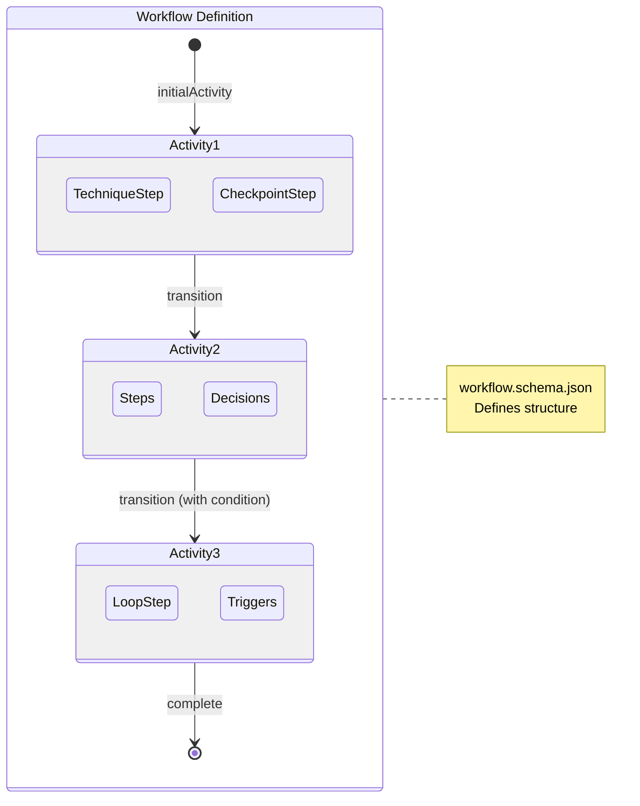
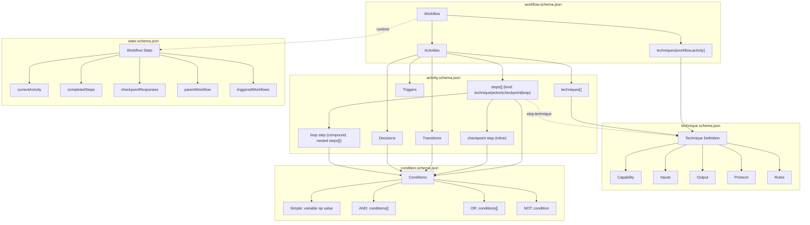
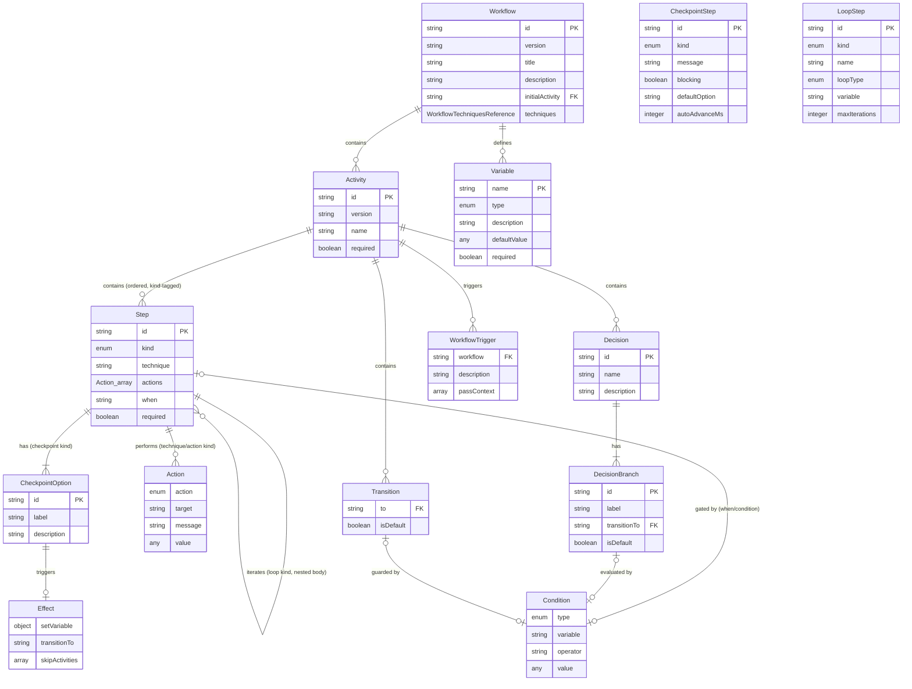

# Workflow Schema System

This folder contains JSON Schema definitions for the workflow server. These schemas define the structure for workflow definitions, conditional logic, and runtime state tracking.

The server also exposes these schemas as MCP resources under `workflow-server://schemas` (combined) and `workflow-server://schemas/{id}` (per schema), built from the JSON files in this folder.

## Overview

The workflow server uses six interconnected schemas:

| Schema | Purpose | Use Case |
|--------|---------|----------|
| `workflow.schema.json` | Defines workflow structure | Creating new workflows with activities, steps, checkpoints |
| `condition.schema.json` | Defines conditional expressions | Controlling transitions and decisions |
| `state.schema.json` | In-memory runtime execution state schema | Internal workflow-engine progress tracking |
| `session-file.schema.json` | Persistent server-managed session file (`session.json`) | On-disk session state owned by the workflow server; loaded by `session_index` and sealed by `.session-token` |
| `technique.schema.json` | Defines agent technique capabilities | Describing tool orchestration patterns and execution guidance |
| `activity.schema.json` | Defines unified activities | Combining intent matching with workflow execution stages |

## Enforcement Model

The server enforces structure at load time plus a small runtime core; most schema semantics are carried out by the executing agents. `get_activity` delivers the raw activity YAML verbatim, so every authored field reaches the agent — the classification below states what the **server** does with each field:

- **Engine-enforced** — server behavior or blocking validation depends on the field.
- **Advisory** — rendered to agents and/or checked warn-only; compliance is never enforced.
- **Agent-interpreted** — delivered in the payload, but no server code path reads it; the executing agent carries its semantics.

| Construct | Engine-enforced | Advisory (incl. warn-only checks) | Agent-interpreted |
|---|---|---|---|
| Workflow | `id` (file resolution); `techniques.workflow` / `techniques.activity` (bundle composition); `activities` / `activitiesDir` (assembly); `variables[].defaultValue` (seeded into the session variable bag at session creation, recorded as a `variables_seeded` history event) | `version` (mid-session drift warns); `title`, `description`, `tags`; `rules.*`; `variables[]` declarations (rendered in `get_workflow`); `initialActivity` (wrong first activity warns); `variables[].type` (checkpoint `setVariable` values validated warn-only — mismatches stored as written) | `author`; `variables[].required` (never checked — authoring metadata) |
| Activity | `id` (navigation key); `artifactPrefix` (server-computed from the filename; also orders activities); the composed artifact contract (synthesized from bound techniques' outputs); `techniques[]` (bundle); `bundleTechniques` (hybrid step-technique bundling in `get_activity`) | `name`, `description`, `required`, `rules[]`; `transitions[]` (legality warns only — `next_activity` moves anywhere); `decisions[]` (stringified for warn-only transition matching) | `triggers[]` / `passContext` (`dispatch_child` takes an explicit `workflow_id`; a child session's bag starts from the child workflow's own declared defaults); `outcome[]` (never reconciled against manifests) |
| Step (common) | `kind` (selects the per-kind closed contract); `id` (duplicate ids are a load error; the key for manifests and step-bound `get_technique`) | absence of a gated step from a `step_manifest` is accepted; ungated omissions warn | `when` / `condition` gates (the server never evaluates a condition; on a checkpoint step only `condition` enables `condition_not_met` dismissal); `required` (worker hint); `actions[]` (no verb has a server interpreter — `set` does not write the variable bag and is slated for removal at the next schema major, #166 B7/B12) |
| Checkpoint step | `options[]` (`option_id` hard-validated); `effect.setVariable` (applied to the session variable bag — the one engine-applied effect); `defaultOption` + `autoAdvanceMs` (the server enforces the full timer before `auto_advance`) | `effect.transitionTo` (recorded and returned; the orchestrator enacts it via `next_activity`); `effect.skipActivities` (recorded in `skippedActivities` bookkeeping) | `blocking` (orchestrator directive; the server's auto-advance gate does not consult it) |
| Loop step | body `steps[]` structure (id uniqueness per scope, flattened for lookups and artifact composition) | loop-body step ids are accepted in `step_manifest` but never required | `loopType` semantics, `variable` / `over`, `breakCondition`, `maxIterations` — iteration is executed and bounded entirely by the agent |
| Technique | `id` (resolution); rule addressing (`tech::rule`, group-prefix expansion); `inputs[].id` / `outputs[].id` (composition merge keys); `outputs[].artifact.name` (drives the composed artifact contract); `Initial` / `Final` protocol titles (composition wrapping) | `version`, `capability`; `inputs[].required` / `default` (rendered; the server neither verifies a required input was supplied nor applies a default); protocol content | input-binding resolution and output remaps (the name-match convention is an agent convention; step-bound `get_technique` annotates resolution statically) |
| Condition | — | condition text is rendered for warn-only `transition_condition` matching (exact string equality) | all evaluation — `simple` / `and` / `or` / `not`, `exists` / null semantics |

Two declarative paths lead from a workflow definition into engine-held state: `variables[].defaultValue` (seeded once, at session creation) and a checkpoint option's `setVariable` effect (the one runtime write). Everything else a definition "does" at runtime, an agent does.

## Schema Relationships

The schemas work together to define workflows (design-time) and track their execution (runtime). The diagrams below illustrate these relationships.

### Workflow Structure

A workflow consists of activities connected by transitions. Each activity contains a single ordered `steps[]` where every step carries a `kind`: a technique step (binds an operation), an action step (control-only), a checkpoint step (an inline user decision point at its concrete position), or a loop step (a compound step whose body is a nested `steps[]`). Activity-level `decisions` (automated branching) and `transitions` route between activities, and an activity can optionally trigger other workflows. The `initialActivity` property determines where sequential workflows begin; workflows with all independent activities (no transitions) don't require `initialActivity`.


```mermaid
stateDiagram-v2
    direction LR
    
    state "Workflow Definition" as WD {
        [*] --> Activity1: initialActivity
        Activity1 --> Activity2: transition
        Activity2 --> Activity3: transition (with condition)
        Activity3 --> [*]: complete
        
        state Activity1 {
            TechniqueStep
            CheckpointStep
        }
        state Activity2 {
            Steps
            Decisions
        }
        state Activity3 {
            LoopStep
            Triggers
        }
    }
    
    note right of WD
        workflow.schema.json
        Defines structure
    end note
```

### Schema Dependencies

The second diagram shows how the schema files depend on each other:

- **workflow.schema.json** defines the overall structure and references `activity.schema.json` for activities
- **activity.schema.json** defines unified activities with a single ordered `steps[]` (each step a kind: technique, action, checkpoint, or loop), plus activity-level decisions, transitions, and triggers
- **technique.schema.json** defines agent capabilities, tool orchestration patterns, and execution protocols
- **condition.schema.json** provides reusable condition expressions (simple comparisons, AND/OR/NOT combinators)
- **state.schema.json** describes the in-memory runtime execution state used internally by the workflow engine
- **session-file.schema.json** describes the persistent server-managed session file (`session.json`) that lives under each planning folder; it captures workflow ID/version, current activity, variables, history, active checkpoint, and (for child workflows) the parent session snapshot. The companion `.session-token` is an HMAC-signed seal binding `session.json` to the workspace + server signing key.

At design-time, you work with `workflow.schema.json`, `activity.schema.json`, and `technique.schema.json`. At runtime, `state.schema.json` represents the in-memory state used by the engine and `session-file.schema.json` describes the on-disk session file loaded by `session_index`.


```mermaid
flowchart TB
    subgraph Workflow["workflow.schema.json"]
        W[Workflow] --> A[Activities]
        W --> SK1["techniques{workflow,activity}"]
    end
    
    subgraph Activity["activity.schema.json"]
        A --> S["steps[] (kind: technique|action|checkpoint|loop)"]
        S --> C["checkpoint step (inline)"]
        S --> L["loop step (compound, nested steps[])"]
        A --> D[Decisions]
        A --> T[Transitions]
        A --> TR[Triggers]
        A --> SK2["techniques[]"]
    end
    
    subgraph Technique["technique.schema.json"]
        SK1 --> SKD[Technique Definition]
        SK2 --> SKD
        S -.->|"step.technique"| SKD
        SKD --> Cap[Capability]
        SKD --> In[Inputs]
        SKD --> Out[Output]
        SKD --> Proto[Protocol]
        SKD --> Rules[Rules]
    end
    
    subgraph Condition["condition.schema.json"]
        S --> COND[Conditions]
        C --> COND
        T --> COND
        D --> COND
        L --> COND
        COND --> Simple["Simple: variable op value"]
        COND --> And["AND: conditions[]"]
        COND --> Or["OR: conditions[]"]
        COND --> Not["NOT: condition"]
    end
    
    subgraph State["state.schema.json"]
        W -.->|"runtime"| ST[Workflow State]
        ST --> CA[currentActivity]
        ST --> CS[completedSteps]
        ST --> CR[checkpointResponses]
        ST --> PW[parentWorkflow]
        ST --> TW[triggeredWorkflows]
    end
```

---

## Schema Ontology

This section defines the key concepts, their fields, and relationships within the schema system.

### Entity Relationships


```mermaid
erDiagram
    Workflow ||--o{ Activity : contains
    Workflow ||--o{ Variable : defines
    
    Activity ||--o{ Step : "contains (ordered, kind-tagged)"
    Activity ||--o{ Decision : contains
    Activity ||--o{ Transition : contains
    Activity ||--o{ WorkflowTrigger : triggers
    
    Step ||--o{ Action : "performs (technique/action kind)"
    Step |o--o| Condition : "gated by (when/condition)"
    Step ||--|{ CheckpointOption : "has (checkpoint kind)"
    Step ||--o{ Step : "iterates (loop kind, nested body)"
    CheckpointOption ||--o| Effect : triggers
    
    Decision ||--|{ DecisionBranch : has
    DecisionBranch |o--o| Condition : "evaluated by"
    
    Transition |o--o| Condition : "guarded by"

    Workflow {
        string id PK
        string version
        string title
        string description
        string initialActivity FK
        WorkflowTechniquesReference techniques
    }
    
    Activity {
        string id PK
        string version
        string name
        boolean required
    }
    
    Step {
        string id PK
        enum kind
        string technique
        Action_array actions
        string when
        boolean required
    }
    
    CheckpointStep {
        string id PK
        enum kind
        string message
        boolean blocking
        string defaultOption
        integer autoAdvanceMs
    }
    
    CheckpointOption {
        string id PK
        string label
        string description
    }
    
    Decision {
        string id PK
        string name
        string description
    }
    
    DecisionBranch {
        string id PK
        string label
        string transitionTo FK
        boolean isDefault
    }
    
    Transition {
        string to FK
        boolean isDefault
    }
    
    LoopStep {
        string id PK
        enum kind
        string name
        enum loopType
        string variable
        integer maxIterations
    }
    
    Variable {
        string name PK
        enum type
        string description
        any defaultValue
        boolean required
    }
    
    WorkflowTrigger {
        string workflow FK
        string description
        array passContext
    }
    
    Action {
        enum action
        string target
        string message
        any value
    }
    
    Condition {
        enum type
        string variable
        string operator
        any value
    }
    
    Effect {
        object setVariable
        string transitionTo
        array skipActivities
    }
```

### Core Concepts

#### Workflow (Root Entity)

A workflow is the top-level container representing a complete process definition. Its activities are connected by `transitions` and entered at `initialActivity`.

| Field             | Type       | Purpose                                                    |
| ----------------- | ---------- | ---------------------------------------------------------- |
| `id`              | string     | Unique identifier for the workflow                         |
| `version`         | string     | Semantic version (X.Y.Z)                                   |
| `title`           | string     | Human-readable display name                                |
| `description`     | string     | Detailed description                                       |
| `author`          | string     | Author metadata (not read by the server)                   |
| `tags`            | string[]   | Categorization labels                                      |
| `rules`           | { workflow?, activity?, universal?: (string \| { ref })[] } | Workflow rules partitioned by audience: `workflow` (orchestrator-only, in `get_workflow`), `activity` (worker-facing, injected into every `get_activity`), and `universal` (both — surfaced in `get_workflow` AND injected into every `get_activity`). An entry is the rule text inline or a `{ ref }` import of a rule fragment |
| `fragments`       | { rules?, checkpoints? } | Shared rule texts (string or string-list) and checkpoint bodies, declared once and imported by reference (`[workflow::]name`) from rules slots and `kind: checkpoint` steps — this workflow's or another's. Resolved at load; agents always receive materialized content |
| `techniques`      | { workflow?, activity?: string[] } | Workflow techniques partitioned by audience: `workflow` (orchestrator-only, bundled into `get_workflow`) and `activity` (inherited by every activity, injected into every `get_activity` technique bundle) |
| `variables`       | Variable[] | State variables                                            |
| `initialActivity` | string     | Starting activity ID (required for sequential workflows)   |
| `activitiesDir`   | string     | Directory containing external activity files (server-resolved) |
| `activities`      | Activity[] | Inline activity definitions (or loaded from activitiesDir) |

#### Activity

A unified activity defines workflow execution as a single ordered `steps[]` (each step kind-tagged), plus activity-level decisions and transitions. Activities can also trigger other workflows.

| Field             | Type              | Purpose                                    |
| ----------------- | ----------------- | ------------------------------------------ |
| `id`              | string            | Unique identifier within workflow          |
| `version`         | string            | Semantic version (X.Y.Z)                   |
| `name`            | string            | Display name                               |
| `description`     | string            | What this activity accomplishes            |
| `techniques`      | TechniquesReference | Activity-wide technique references (`::` paths) |
| `bundleTechniques` | BundleTechniques | Opt-in hybrid bundling: `get_activity` inlines each ungated step technique whose composed wire form is at most `maxChars`; larger and gated ones stay lazy via `get_technique` |
| `steps`           | Step[]            | Ordered, kind-tagged execution list (technique / action / checkpoint / loop) |
| `decisions`       | Decision[]        | Automated branching points (activity-level)|
| `transitions`     | Transition[]      | Activity navigation rules                  |
| `triggers`        | WorkflowTrigger[] | Workflows to trigger from this activity    |
| `outcome`         | string[]          | Expected outcomes on completion (advisory; never reconciled against manifests) |
| `required`        | boolean           | Whether activity must be completed         |
| `rules`           | string[]          | Activity-level execution rules             |
| `artifactPrefix`  | string            | Server-computed numeric prefix from filename |

The activity object is closed: a field outside this set is a schema error. The activity's artifact contract is not a schema field — `get_activity` synthesizes it from the `## Outputs` of the techniques the activity's steps bind (each output's `#### artifact` filename, prefixed with `artifactPrefix` at write time).

#### Step

A step is one entry in the activity's single ordered `steps[]`. Every step carries a required `kind` discriminator that selects its shape. Each kind is a closed object — a field outside its declared set is a schema error (AP-64 bound-step purity: a step is a bound unit of work, so no step kind carries a `description`; guidance lives in the bound technique's protocol):

- **`kind: technique`** — binds an operation via `technique` (a `group::operation` string, or `{ name, inputs?, outputs? }` when it has input deviations / output remaps); may also carry `actions`.
- **`kind: action`** — a control-only step carrying `actions[]` (may be empty for a marker step).
- **`kind: checkpoint`** — an inline user decision point (see below); its position in `steps[]` is when it is presented.
- **`kind: loop`** — a compound step whose body is a nested `steps[]` (see below).

Shared base fields on every kind:

| Field         | Type     | Purpose                           |
| ------------- | -------- | --------------------------------- |
| `kind`        | enum     | Required discriminator: `technique`, `action`, `checkpoint`, or `loop` |
| `id`          | string   | Unique identifier within activity (stable; required on a checkpoint step — it is the replay key) |
| `when`        | string   | Inline boolean gate — run this step or skip it. Agent-evaluated; the server never evaluates gates |
| `condition`   | Condition | Structured gate (legacy compat); if false, step is skipped. Agent-evaluated. On a checkpoint step, `condition` (not `when`) is what enables `condition_not_met` dismissal |
| `required`    | `false`  | Worker hint, declared only when `false` (marks an optional step); an omitted `required` means the step is required |

#### Checkpoint Step

A `kind: checkpoint` step is a decision point requiring user input, inlined at its concrete position in `steps[]` (replacing the old separate `checkpoints[]` array and the `step.checkpoint` reference). It blocks by default; declaring `defaultOption` and `autoAdvanceMs` is what makes it auto-advanceable.

A checkpoint step is authored in exactly one of two forms:

- **Inline** — the step carries its own body (`message` + `options`, plus the optional body fields below).
- **By reference** — the step declares `ref: [workflow::]name` naming a `fragments.checkpoints` entry, and contributes only its `id` and site gates (`when`, `required`, and `condition` — the latter only when the fragment declares none). The body fields are forbidden alongside `ref` so the fragment stays the single home for the checkpoint's content; the loader materializes the body before anything downstream reads the step, and `check:fragments` rejects an inline body that duplicates a fragment.

| Field       | Type               | Purpose                                             |
| ----------- | ------------------ | --------------------------------------------------- |
| `id`        | string             | Checkpoint identity. Bare ids (`confirm-proceed`) are the response-replay key as written. Loop-body checkpoints that need a distinct answer per iteration use a template form `<baseId>#{...}` (e.g. `assumption-decision#{current_assumption.id}`); workers yield the expanded `<baseId>#<instance>` and the server matches the definition on the base id while recording under the full string. |
| `kind`      | enum               | `checkpoint`                                        |
| `ref`       | string             | Checkpoint-fragment reference (`[workflow::]name` into `fragments.checkpoints`; bare names resolve against the declaring workflow, then meta). Mutually exclusive with the body fields |
| `message`   | string             | Question to present to user (inline form)           |
| `options`   | CheckpointOption[] | Available choices (inline form)                     |
| `blocking`  | boolean            | Orchestrator directive: present the checkpoint and wait for explicit user selection (default: true). The server does not consult it — its auto-advance gate checks only `defaultOption` and `autoAdvanceMs`, so a checkpoint intended to block must not declare those fields. |
| `defaultOption` | string          | Option ID to auto-select when `autoAdvanceMs` elapses. |
| `autoAdvanceMs` | integer         | Milliseconds to wait before auto-selecting `defaultOption`; the server enforces the full timer on `respond_checkpoint { auto_advance }`. |

#### Decision

A decision is an automated branching point based on variable conditions. The orchestrator evaluates the branch conditions; the server stringifies them only for warn-only transition matching.

| Field         | Type             | Purpose                           |
| ------------- | ---------------- | --------------------------------- |
| `id`          | string           | Unique identifier within activity |
| `name`        | string           | Decision name                     |
| `description` | string           | What is being decided             |
| `branches`    | DecisionBranch[] | Conditional paths (min 2)         |

#### Transition

A transition defines navigation from one activity to another. Transition legality is validated warn-only at `next_activity` — an out-of-graph transition warns in `_meta.validation` but is not blocked.

| Field       | Type      | Purpose                         |
| ----------- | --------- | ------------------------------- |
| `to`        | string    | Target activity ID              |
| `condition` | Condition | When this transition applies    |
| `isDefault` | boolean   | Fallback if no conditions match |

#### WorkflowTrigger

A workflow trigger declares a workflow the orchestrator dispatches from this activity (via `dispatch_child` with an explicit `workflow_id`). Used for composing workflows (e.g., work-packages triggering work-package for each planned package). The declaration is advisory — the server does not act on triggers.

| Field         | Type     | Purpose                                    |
| ------------- | -------- | ------------------------------------------ |
| `workflow`    | string   | ID of the workflow to trigger              |
| `description` | string   | When/why this workflow is triggered        |
| `passContext` | string[] | Context variable names the dispatching agent relays to the child; the server does not copy them (a child session's bag starts from the child workflow's own declared defaults) |

#### Loop Step

A `kind: loop` step is a compound step that iterates over collections or while conditions hold, with a nested `steps[]` body (replacing the old separate `loops[]` array). It is the one step kind that may carry a `name` (it labels the iteration).

| Field            | Type      | Purpose                             |
| ---------------- | --------- | ----------------------------------- |
| `id`             | string    | Unique identifier within activity   |
| `kind`           | enum      | `loop`                              |
| `name`           | string    | Loop name (optional; labels the iteration) |
| `loopType`       | enum      | "forEach", "while", or "doWhile" (renamed from `type` to avoid clashing with `Condition.type`) |
| `variable`       | string    | Iteration variable name             |
| `over`           | string    | Collection to iterate (forEach)     |
| `condition`      | Condition | Continue condition (while/doWhile)  |
| `maxIterations`  | integer   | Safety limit (agent-enforced)       |
| `breakCondition` | Condition | Early exit condition (agent-evaluated each iteration) |
| `steps`          | Step[]    | Nested step body executed per iteration |

### Supporting Types

#### TechniquesReference

A flat array of strings — an activity's technique references, addressed by `::` path. Optional: an activity may rely solely on the techniques its steps declare plus those inherited from the workflow's `techniques.activity`.

```
techniques: string[]
```

At the **workflow** level, `techniques` is instead an object partitioned by audience (mirroring `rules`): `workflow` references go to the orchestrator (`get_workflow`), and `activity` references are inherited by every activity (injected into every `get_activity` bundle). There is no `universal` bucket for techniques.

```
techniques: { workflow?: string[]; activity?: string[] }
```

#### Action

An action performed during workflow execution. Action verbs are interpreted by the executing agent — the server has no action interpreter. In particular, `set` does not write the session variable bag (only a checkpoint option's `setVariable` effect writes it at runtime) and is slated for removal at the next workflow-schema major (#166 B7 decided retire; B12 executes it).

| Field     | Type   | Purpose                             |
| --------- | ------ | ----------------------------------- |
| `action`  | enum   | "log", "validate", "set", "emit", or "message" |
| `target`  | string | Target of the action                |
| `message` | string | Message content                     |
| `value`   | any    | Value for set/emit actions          |

#### Variable

A workflow variable definition. Declarations are rendered to agents via `get_workflow`; the session variable bag is seeded from each declaration's `defaultValue` at session creation (recorded as one `variables_seeded` history event) and thereafter written only by checkpoint `setVariable` effects, whose values are validated against `type` warn-only (mismatches are stored as written and surfaced in `_meta.validation`). `required` is never checked — agents honor it from the declaration.

| Field          | Type    | Purpose                                          |
| -------------- | ------- | ------------------------------------------------ |
| `name`         | string  | Qualified snake_case noun phrase (>=2 words, AP-60), or an enumerated bare-word exemption (see `src/schema/identifiers.ts`) |
| `type`         | enum    | "string", "number", "boolean", "array", "object" (warn-only validated on checkpoint `setVariable`; mismatched values are stored as written) |
| `description`  | string  | Variable purpose                                 |
| `defaultValue` | any     | Initial value, seeded into the session bag at session creation. Never combine with an `exists`/`notExists` gate on the same variable (`check:variable-model`) |
| `required`     | boolean | Whether variable must be set (agent-honored)     |

#### Condition

A conditional expression for control flow. Defined in `condition.schema.json`.

| Type     | Structure                 | Purpose                   |
| -------- | ------------------------- | ------------------------- |
| `simple` | variable, operator, value | Basic comparison          |
| `and`    | conditions[]              | All must be true          |
| `or`     | conditions[]              | At least one must be true |
| `not`    | condition                 | Negation                  |

### Field Naming Conventions

#### Consistent Patterns

| Pattern       | Usage                     | Examples                                |
| ------------- | ------------------------- | --------------------------------------- |
| `id`          | Unique identifier         | activity.id, step.id, checkpoint step id   |
| `name`        | Display name for entities | activity.name, loop step name              |
| `description` | Detailed explanation      | workflow.description, activity.description |
| `required`    | Mandatory flag            | variable.required, step.required        |

#### Distinct Concepts

| Field   | Context            | Meaning                 |
| ------- | ------------------ | ----------------------- |
| `title` | Workflow only      | Top-level display name  |
| `name`  | All other entities | Entity display name     |
| `label` | Options/branches   | User-facing choice text |

---

## Workflow Schema

The workflow schema (`workflow.schema.json`) defines the complete structure of a workflow, including metadata, variables, and activities. Workflows can use inline activities or reference external activity files via `activitiesDir` (a server convention — the server resolves `activitiesDir` by loading activity files and populating the `activities` array before schema validation runs).

### Top-Level Structure

```json
{
  "$schema": "../../schemas/workflow.schema.json",
  "id": "my-workflow",
  "version": "1.0.0",
  "title": "My Workflow",
  "description": "A sample workflow",
  "author": "author-name",
  "tags": ["sample", "documentation"],
  "rules": ["Rule 1", "Rule 2"],
  "variables": [],
  "initialActivity": "first-activity",
  "activitiesDir": "activities"
}
```

### Required Properties

| Property | Type | Description |
|----------|------|-------------|
| `id` | string | Unique workflow identifier |
| `version` | string | Semantic version (e.g., `1.0.0`) |
| `title` | string | Human-readable title |
| `activities` | array | Array of activity definitions (or loaded from activitiesDir) |

### Optional Properties

| Property | Type | Description |
|----------|------|-------------|
| `$schema` | string | Path to schema file for validation |
| `description` | string | Workflow description |
| `author` | string | Author name |
| `tags` | string[] | Categorization tags |
| `rules` | { workflow?, activity?, universal?: (string \| { ref })[] } | Orchestrator rules (`workflow`, in `get_workflow`) + worker rules inherited by every activity (`activity`, injected into every `get_activity`) + dual-audience rules (`universal`, both). Entries are rule strings or `{ ref }` fragment imports |
| `fragments` | { rules?, checkpoints? } | Shared rule texts and checkpoint bodies importable by reference (`[workflow::]name`); resolved at load so delivered content is always materialized |
| `techniques` | { workflow?, activity?: string[] } | Orchestrator techniques (`workflow`, bundled into `get_workflow`) + techniques inherited by every activity (`activity`, injected into every `get_activity`) |
| `variables` | array | Variable definitions with types and defaults |
| `initialActivity` | string | ID of first activity (required for sequential workflows) |
| `activitiesDir` | string | Directory containing external activity YAML files (server-resolved, not in JSON schema) |

### Variables

Variables store state that persists across activities. Define them at the workflow level. The declaration is the agents' contract and the server honors it: the session variable bag is seeded from every declared `defaultValue` at session creation (one `variables_seeded` history event records the map), and after that only checkpoint `setVariable` effects write it server-side, validated warn-only against the declared `type`. A variable without a default stays absent from the bag — reserve `exists`/`notExists` gates for those (`check:variable-model` rejects such gates on defaulted variables).

```json
{
  "variables": [
    {
      "name": "user_confirmed",
      "type": "boolean",
      "description": "Whether user confirmed the action",
      "defaultValue": false,
      "required": false
    },
    {
      "name": "selected_option",
      "type": "string",
      "description": "User's selected option",
      "required": false
    }
  ]
}
```

**Variable Types:** `string`, `number`, `boolean`, `array`, `object`

### Activities

Activities are the execution units of a workflow. Each activity contains an ordered, kind-tagged `steps[]` and activity-level `transitions`, and is reached via `transitions` from the `initialActivity`.

```json
{
  "activities": [
    {
      "id": "first-activity",
      "version": "1.0.0",
      "name": "Initial Activity",
      "description": "The first activity of the workflow",
      "steps": [],
      "transitions": []
    }
  ]
}
```

**Activity Properties:**

| Property | Type | Description |
|----------|------|-------------|
| `id` | string | Unique activity identifier |
| `version` | string | Semantic version (X.Y.Z) |
| `name` | string | Human-readable activity name |
| `description` | string | Activity description |
| `required` | boolean | Whether activity is required (default: true) |
| `steps` | array | Ordered, kind-tagged execution list (technique / action / checkpoint / loop) |
| `decisions` | array | Automated branching points (activity-level) |
| `transitions` | array | Activity transition rules |
| `triggers` | array | Workflows to trigger from this activity |
| `outcome` | string[] | Expected outcomes on completion |
| `rules` | array | Activity-level execution rules and constraints |
| `artifactPrefix` | string | Server-computed numeric prefix from activity filename (read-only) |

### Steps

`steps[]` is the activity's single ordered execution list. Every step carries a `kind`. A technique step binds an operation; an action step is control-only:

```json
{
  "steps": [
    {
      "kind": "technique",
      "id": "verify-prerequisites",
      "technique": "setup::verify-prerequisites"
    },
    {
      "kind": "action",
      "id": "log-start",
      "actions": [{ "action": "log", "message": "Activity started" }]
    }
  ]
}
```

### Checkpoint Steps

A `kind: checkpoint` step pauses execution and requires user input. It sits inline in `steps[]` at the position where it is presented (there is no separate `checkpoints[]` array and no `step.checkpoint` reference):

```json
{
  "steps": [
    {
      "kind": "checkpoint",
      "id": "confirm-proceed",
      "when": "needs_confirmation == true",
      "blocking": true,
      "message": "Do you want to proceed?",
      "options": [
        {
          "id": "proceed",
          "label": "Yes, proceed",
          "effect": {
            "setVariable": { "user_confirmed": true }
          }
        },
        {
          "id": "cancel",
          "label": "No, cancel",
          "effect": {
            "transitionTo": "cancelled"
          }
        }
      ]
    }
  ]
}
```

The `when` / `condition` gate uses the same formal condition schema shared by every step kind, transitions, and decisions (`condition.schema.json`). If omitted, the checkpoint is always presented. The two gate spellings differ at the dismissal seam: only a structured `condition` makes the checkpoint dismissible via `respond_checkpoint { condition_not_met }` — a `when`-gated checkpoint cannot be dismissed that way.

**Replay and instance-qualified ids.** `yield_checkpoint` stores responses under `<activityId>-<checkpoint_id>`. A later yield of the same key returns `status: "replayed"` (no new `activeCheckpoint`). Inside a loop, pass `<baseId>#<instance>` when each iteration needs its own decision; the loader resolves the definition by base id (portion before `#`). Use a bare id when one answer should cover every iteration.

**Checkpoint Option Effects** (per-effect enforcement):
- `setVariable` — the server applies the assignments to the session variable bag; the one engine-applied effect
- `transitionTo` — returned to the orchestrator, which enacts the transition via `next_activity`; selecting the option does not itself move the session
- `skipActivities` — recorded in the session's `skippedActivities` bookkeeping and returned; the orchestrator routes around the listed activities

### Decisions

Decisions are automated branching points based on conditions:

```json
{
  "decisions": [
    {
      "id": "decision-1",
      "name": "Path Selection",
      "description": "Choose path based on variable",
      "branches": [
        {
          "id": "branch-a",
          "label": "Path A",
          "condition": {
            "type": "simple",
            "variable": "option",
            "operator": "==",
            "value": "a"
          },
          "transitionTo": "activity-a"
        },
        {
          "id": "branch-default",
          "label": "Default Path",
          "transitionTo": "activity-default",
          "isDefault": true
        }
      ]
    }
  ]
}
```

### Loop Steps

A `kind: loop` step is a compound step that iterates over collections or while conditions. Its body is a nested `steps[]` (there is no separate `loops[]` array). It is the one step kind that may carry a `name`:

```json
{
  "steps": [
    {
      "kind": "loop",
      "id": "task-loop",
      "name": "Task Loop",
      "loopType": "forEach",
      "variable": "current_task",
      "over": "tasks",
      "maxIterations": 100,
      "steps": [
        {
          "kind": "technique",
          "id": "process-task",
          "technique": "tasks::process-task"
        }
      ]
    }
  ]
}
```

**Loop Types (`loopType`):** `forEach`, `while`, `doWhile`

### Transitions

Transitions define how to move between activities:

```json
{
  "transitions": [
    {
      "to": "next-activity",
      "condition": {
        "type": "simple",
        "variable": "user_confirmed",
        "operator": "==",
        "value": true
      }
    },
    {
      "to": "fallback-activity",
      "isDefault": true
    }
  ]
}
```

### Triggers

Triggers allow an activity to invoke another workflow:

```json
{
  "triggers": [
    {
      "workflow": "work-package",
      "description": "Execute work-package workflow for each planned package",
      "passContext": ["current_package", "priority_order"]
    }
  ]
}
```

---

## Condition Schema

The condition schema (`condition.schema.json`) defines expressions for controlling transitions, decisions, loops, and checkpoints. Conditions are evaluated by the executing agents against the session's variable state — the server never evaluates a condition at runtime; it renders condition text only for the warn-only `transition_condition` match on `next_activity`.

### Simple Conditions

Compare a variable to a value:

```json
{
  "type": "simple",
  "variable": "status",
  "operator": "==",
  "value": "approved"
}
```

**Operators:**

| Operator | Description | Example |
|----------|-------------|---------|
| `==` | Equal | `"status" == "active"` |
| `!=` | Not equal | `"count" != 0` |
| `>` | Greater than | `"score" > 80` |
| `<` | Less than | `"attempts" < 3` |
| `>=` | Greater or equal | `"level" >= 5` |
| `<=` | Less or equal | `"errors" <= 10` |
| `exists` | Variable is defined | `"user_id" exists` |
| `notExists` | Variable is undefined | `"error" notExists` |

### Composite Conditions

Combine conditions with logical operators:

**AND - All conditions must be true:**

```json
{
  "type": "and",
  "conditions": [
    {
      "type": "simple",
      "variable": "status",
      "operator": "==",
      "value": "ready"
    },
    {
      "type": "simple",
      "variable": "count",
      "operator": ">",
      "value": 0
    }
  ]
}
```

**OR - At least one condition must be true:**

```json
{
  "type": "or",
  "conditions": [
    {
      "type": "simple",
      "variable": "role",
      "operator": "==",
      "value": "admin"
    },
    {
      "type": "simple",
      "variable": "role",
      "operator": "==",
      "value": "moderator"
    }
  ]
}
```

**NOT - Condition must be false:**

```json
{
  "type": "not",
  "condition": {
    "type": "simple",
    "variable": "blocked",
    "operator": "==",
    "value": true
  }
}
```

### Nested Conditions

Conditions can be nested for complex logic:

```json
{
  "type": "and",
  "conditions": [
    {
      "type": "simple",
      "variable": "authenticated",
      "operator": "==",
      "value": true
    },
    {
      "type": "or",
      "conditions": [
        {
          "type": "simple",
          "variable": "role",
          "operator": "==",
          "value": "admin"
        },
        {
          "type": "simple",
          "variable": "permissions",
          "operator": "exists"
        }
      ]
    }
  ]
}
```

---

## State Schema

The state schema (`state.schema.json`) tracks runtime execution of a workflow using activity IDs for navigation.

### State Fields

| Field                 | Type                      | Purpose                                                        |
| --------------------- | ------------------------- | -------------------------------------------------------------- |
| `workflowId`          | string                    | Workflow being executed                                        |
| `workflowVersion`     | string                    | Version of workflow                                            |
| `stateVersion`        | integer                   | State schema version                                           |
| `currentActivity`     | string                    | Current activity ID                                            |
| `currentStep`         | integer                   | Current step index within activity (1-based)                   |
| `completedActivities` | string[]                  | Completed activity IDs                                         |
| `skippedActivities`   | string[]                  | Skipped activity IDs                                           |
| `completedSteps`      | Record<string, integer[]> | Steps completed per activity                                   |
| `checkpointResponses` | Record<string, Response>  | Checkpoint answers (key: `<activityId>-<checkpoint_id>`, including any `#instance` suffix) |
| `decisionOutcomes`    | Record<string, Outcome>   | Decision results (key: "activity-decision")                    |
| `activeLoops`         | LoopState[]               | Currently executing loops                                      |
| `variables`           | Record<string, any>       | Runtime variable values                                        |
| `history`             | HistoryEntry[]            | Execution event log                                            |
| `status`              | enum                      | "running", "paused", "suspended", "completed", "aborted", "error" |
| `parentWorkflow`      | ParentWorkflowRef         | Reference to parent workflow (if triggered)                    |
| `triggeredWorkflows`  | TriggeredWorkflowRef[]    | Child workflows triggered from this one                        |
| `completedAt`         | datetime                  | When workflow completed (only when status is "completed")      |
| `lastError`           | object                    | Most recent error (message, code, activity, step, timestamp)   |

### State Structure

```json
{
  "workflowId": "my-workflow",
  "workflowVersion": "1.0.0",
  "stateVersion": 1,
  "startedAt": "2026-01-22T10:00:00.000Z",
  "updatedAt": "2026-01-22T10:05:00.000Z",
  "currentActivity": "second-activity",
  "currentStep": 1,
  "completedActivities": ["first-activity"],
  "skippedActivities": [],
  "completedSteps": {
    "first-activity": [1, 2]
  },
  "checkpointResponses": {},
  "decisionOutcomes": {},
  "activeLoops": [],
  "variables": {
    "user_confirmed": true
  },
  "history": [],
  "status": "running",
  "parentWorkflow": null,
  "triggeredWorkflows": []
}
```

### Required Properties

| Property | Type | Description |
|----------|------|-------------|
| `workflowId` | string | ID of the workflow being executed |
| `workflowVersion` | string | Version of the workflow |
| `startedAt` | datetime | When execution started |
| `updatedAt` | datetime | Last state update |
| `currentActivity` | string | Currently active activity ID (conditionally required when status is "running", "paused", or "suspended") |

### Status Values

| Status | Description |
|--------|-------------|
| `running` | Workflow is actively executing |
| `paused` | Execution paused (awaiting user input) |
| `suspended` | Waiting for triggered child workflow to complete |
| `completed` | Workflow finished successfully |
| `aborted` | Workflow was cancelled |
| `error` | Workflow encountered an error |

### Nested Workflow Support

When an activity triggers another workflow, the state tracks the relationship:

**Parent Workflow Reference:**
```json
{
  "parentWorkflow": {
    "workflowId": "work-packages",
    "activityId": "implementation",
    "passedContext": { "current_package": "feature-auth" },
    "returnTo": { "activityId": "implementation", "stepIndex": 4 }
  }
}
```

**Triggered Workflows:**
```json
{
  "triggeredWorkflows": [
    {
      "workflowId": "work-package",
      "triggeredAt": "2026-01-22T10:00:00.000Z",
      "triggeredFrom": { "activityId": "implementation", "stepIndex": 2 },
      "status": "completed",
      "returnedContext": { "pr_number": "123" }
    }
  ]
}
```

### History Events

The `history` array tracks all workflow events:

```json
{
  "history": [
    {
      "timestamp": "2026-01-22T10:00:00.000Z",
      "type": "workflow_started",
      "activity": "first-activity"
    },
    {
      "timestamp": "2026-01-22T10:01:00.000Z",
      "type": "step_completed",
      "activity": "first-activity",
      "step": 1
    },
    {
      "timestamp": "2026-01-22T10:02:00.000Z",
      "type": "workflow_triggered",
      "activity": "implementation",
      "data": { "targetWorkflow": "work-package" }
    }
  ]
}
```

**Event Types:**
- `workflow_started`, `workflow_completed`, `workflow_aborted`, `workflow_triggered`, `workflow_returned`, `workflow_suspended`
- `activity_entered`, `activity_exited`, `activity_skipped`
- `step_started`, `step_completed`
- `checkpoint_reached`, `checkpoint_response`
- `decision_reached`, `decision_branch_taken`
- `loop_started`, `loop_iteration`, `loop_completed`, `loop_break`
- `variable_set`, `error`
- `technique_fetched`, `resource_fetched` — content-fetch records appended by `get_technique` / `get_resource` (`data` carries `techniqueId` + optional `stepId`, or `resourceId`, plus `agentId`); `next_activity`'s manifest validation reads `technique_fetched` events for the warn-only technique-fetch fidelity check
- `technique_bundled` — an inline step-technique delivery appended by `get_activity` for an activity that declares `bundleTechniques` (`data` carries `techniqueId`, `stepId`, `agentId`); counts as coverage for the technique-fetch fidelity check alongside `technique_fetched`

---

## Complete Example

Here's a minimal valid workflow that demonstrates all key concepts:

```json
{
  "$schema": "../../schemas/workflow.schema.json",
  "id": "example-workflow",
  "version": "1.0.0",
  "title": "Example Workflow",
  "description": "A minimal workflow demonstrating key schema features",
  "variables": [
    {
      "name": "approved",
      "type": "boolean",
      "defaultValue": false
    }
  ],
  "initialActivity": "review",
  "activities": [
    {
      "id": "review",
      "version": "1.0.0",
      "name": "Review",
      "description": "Initial review and approval",
      "steps": [
        {
          "kind": "technique",
          "id": "gather",
          "technique": "review::gather-information"
        },
        {
          "kind": "checkpoint",
          "id": "approve",
          "message": "Do you approve this item?",
          "blocking": true,
          "options": [
            {
              "id": "approve",
              "label": "Approve",
              "effect": {
                "setVariable": { "approved": true }
              }
            },
            {
              "id": "reject",
              "label": "Reject",
              "effect": {
                "setVariable": { "approved": false }
              }
            }
          ]
        }
      ],
      "transitions": [
        {
          "to": "process",
          "condition": {
            "type": "simple",
            "variable": "approved",
            "operator": "==",
            "value": true
          }
        },
        {
          "to": "rejected",
          "isDefault": true
        }
      ]
    },
    {
      "id": "process",
      "version": "1.0.0",
      "name": "Processing",
      "steps": [
        {
          "kind": "technique",
          "id": "process",
          "technique": "processing::process-item"
        }
      ]
    },
    {
      "id": "rejected",
      "version": "1.0.0",
      "name": "Rejection",
      "steps": [
        {
          "kind": "technique",
          "id": "notify",
          "technique": "notify::notify-rejection"
        }
      ]
    }
  ]
}
```

---

## Validation

### Using the Validation Script

Validate a workflow directory:

```bash
npx tsx scripts/validate-workflow-yaml.ts path/to/workflow-dir
```

### Programmatic Validation

```typescript
import { validateWorkflow, safeValidateWorkflow } from './src/schema/workflow.schema';

// Throws on invalid
const workflow = validateWorkflow(data);

// Returns { success: true, data } or { success: false, error }
const result = safeValidateWorkflow(data);
if (result.success) {
  console.log('Valid workflow:', result.data);
} else {
  console.error('Validation errors:', result.error);
}
```

### Common Validation Errors

| Error | Cause | Fix |
|-------|-------|-----|
| Missing required property | `id`, `version`, `title`, or `activities` not provided | Add the required property |
| Invalid version format | Version doesn't match `X.Y.Z` pattern | Use semantic versioning |
| Invalid activity reference | `initialActivity` or transition `to` references non-existent activity | Check activity IDs match |
| Checkpoint missing options | Checkpoint defined without any options | Add at least one option |
| Decision needs branches | Decision defined with fewer than 2 branches | Add at least 2 branches |

---

## Activity Schema

The activity schema (`activity.schema.json`) defines unified activities that combine workflow execution: a single ordered, kind-tagged `steps[]` (technique / action / checkpoint / loop) plus activity-level decisions, transitions, and triggers. Activities are reached via `transitions` from the workflow's `initialActivity`. This schema is **generated** by [`scripts/generate-schemas.ts`](../scripts/generate-schemas.ts) from the Zod source of truth (it was previously hand-maintained) — do not hand-edit `activity.schema.json`.

### Top-Level Structure

```json
{
  "id": "discover-session",
  "version": "1.0.0",
  "name": "Discover Session",
  "steps": [
    { "kind": "technique", "id": "identify-target", "technique": "state-management::identify-target" },
    { "kind": "technique", "id": "scan-planning-folders", "technique": "state-management::scan-planning-folders" }
  ],
  "outcome": ["Workflow target identified", "Prior state located if available"]
}
```

### Required Properties

| Property | Type | Description |
|----------|------|-------------|
| `id` | string | Unique activity identifier |
| `version` | string | Semantic version (e.g., `3.0.0`) |
| `name` | string | Human-readable activity name |

### Optional Properties

| Property | Type | Description |
|----------|------|-------------|
| `description` | string | Detailed description |
| `bundleTechniques` | BundleTechniques | Opt-in hybrid bundling (`{ maxChars }`): `get_activity` inlines each ungated step technique whose composed wire form is at most `maxChars` |
| `steps` | Step[] | Ordered, kind-tagged execution list (technique / action / checkpoint / loop) |
| `decisions` | Decision[] | Automated branching points (activity-level) |
| `transitions` | Transition[] | Navigation to other activities |
| `triggers` | WorkflowTrigger[] | Workflows to trigger from this activity |
| `outcome` | string[] | Expected outcomes when activity completes |
| `required` | boolean | Whether activity is required (default: true) |
| `rules` | string[] | Activity-level execution rules and constraints |
| `artifactPrefix` | string | Server-computed numeric prefix from activity filename (read-only) |

### Activity Flow

Activities have `transitions` connecting them, form a workflow flow, and require `initialActivity` on the parent workflow. *Workflow* selection — which workflow handles a request — happens at the catalog level via `list_workflows` and `start_session`, scored on title, description, and `tags`.

### Complete Example

A complete activity definition with workflow trigger:

```json
{
  "id": "implementation",
  "version": "1.1.0",
  "name": "Implementation",
  "description": "Execute each planned work package by triggering the work-package workflow",
  "triggers": [
    {
      "workflow": "work-package",
      "description": "Each iteration starts the work-package workflow for one planned package",
      "passContext": ["current_package", "priority_order"]
    }
  ],
  "steps": [
    {
      "kind": "loop",
      "id": "package-iteration",
      "name": "Package Iteration",
      "loopType": "forEach",
      "variable": "current_package",
      "over": "remaining_packages",
      "steps": [
        { "kind": "technique", "id": "select", "technique": "implementation::select-next-package" },
        { "kind": "technique", "id": "trigger", "technique": "implementation::trigger-work-package" },
        { "kind": "technique", "id": "update", "technique": "implementation::update-roadmap-status" }
      ]
    }
  ],
  "outcome": [
    "All planned work packages implemented",
    "Roadmap status reflects completion"
  ]
}
```

---

## Technique Schema

The technique schema (`technique.schema.json`) defines agent capabilities for workflow execution. Techniques are authored as markdown — a standalone `techniques/<slug>.md`, a grouped `techniques/<group>/TECHNIQUE.md` plus one `<sub>.md` per nested technique, or a per-workflow root `techniques/TECHNIQUE.md` — and the server parses them into the JSON shape below (served at `workflow-server://schemas/technique`).

### Top-Level Structure

```json
{
  "id": "activity-worker",
  "version": "2.0.0",
  "capability": "Bootstrap and execute a single workflow activity with consistent tool usage",
  "rules": {}
}
```

### Required Properties

| Property | Type | Description |
|----------|------|-------------|
| `id` | string | Unique technique identifier (the file/folder slug) |
| `version` | string | Semantic version (e.g., `2.0.0`) |
| `capability` | string | What this technique enables agents to do |

### Optional Properties

| Property | Type | Description |
|----------|------|-------------|
| `rules` | object | Name-value pairs: each key is a rule name (e.g. configuration-invariant); each value is a single rule string or an array of rule strings for grouped rules. |
| `inputs` | array | Inputs the technique expects from context: array of items. Each item has **id** (required; hyphen-delimited), optional **description**, **default**, and **components** (a name→description map authored as `####` sub-sections). Optional inputs say so in the description prose (a leading "(optional)"); necessity is otherwise implied by protocol use. When a protocol step uses an existing artifact (e.g. loads from a path), the technique declares one or more associated input entries. Mirrors output structure. |
| `protocol` | array | An ordered list of step blocks (no phase construct). Each block has optional **title** and a **steps** array of imperative bullet strings. Failure handling is inline in the steps. |
| `output` | array | What the technique produces: array of output items. Each item has **id** (required; generic hyphen-delimited identifier, not a filename), optional **description**, optional **components** (named object), and optional **artifact** (when present: **name** = filename to use when persisting, a literal or `{token}`-template, e.g. `01-audit-report.md`). |

A technique has `id`, `capability`, `protocol`, `rules`, and optional `inputs` and `output`. Nested techniques are individual `<sub>.md` files addressed by `::` path and are themselves techniques.

Delivered techniques carry additional server-populated (never authored) fields. Composition partitions contract-inherited entries into `inherited_inputs`/`inherited_outputs` blocks (each `{ note, items }`), distinct from the technique's own `inputs`/`outputs`. A step-bound `get_technique` adds binding-seam provenance, resolved statically from declarations and document order: a `source` on each own input item stating where its value comes from under the name-match convention (step-binding value, workflow variable, prior step output, declared default, or `UNRESOLVED`), a `source` on an inherited item only where it adds to the block's scope note (a step-binding override or a later-positioned producer), a `destination` on each output item the step binding remaps (the session-bag name it lands under), and a top-level `provenance_note` stating the output delivery mechanics.

### Protocol

Protocol is a single ordered list of step blocks (rendered from `## Protocol` in the markdown). Each block carries optional `title` and an ordered `steps` array. An ancestor's `Initial` protocol blocks are placed before, and its `Final` blocks after, a descendant's own protocol; the server renumbers for display. Failure handling is inline in the steps.

```json
{
  "protocol": [
    { "title": "Load checklist", "steps": ["Read the checklist from the resource.", "Verify version matches workflow."] },
    { "title": "Execute step", "steps": ["Run the step logic.", "Record outcome."] }
  ]
}
```

### Complete Example

A minimal technique demonstrating key concepts:

```json
{
  "id": "example-technique",
  "version": "1.0.0",
  "capability": "Demonstrate technique schema structure",
  "protocol": [
    { "title": "Discover", "steps": ["Call list_workflows to find available workflows.", "Select the appropriate workflow for the task."] },
    { "title": "Execute", "steps": ["Load the activity via next_activity.", "Execute each step following technique guidance."] }
  ]
}
```

---

## Related Documentation

- [API Reference](../docs/api-reference.md) — MCP tool catalog
- [Site API](../site/api/tools.html) — wire descriptions generated from source
- [Development Guide](../docs/development.md) — Building and testing the server
- [Resource Resolution Model](../docs/resource_resolution_model.md) — How techniques and resources are loaded
- [IDE Setup](../docs/ide-setup.md) — Bootstrap rule and `workflow-server://schemas` MCP resource
