# Workflow Schema System

This folder contains JSON Schema definitions for the workflow server. These schemas define the structure for workflow definitions, conditional logic, and runtime state tracking.

## Overview

The workflow server uses five interconnected schemas:

| Schema | Purpose | Use Case |
|--------|---------|----------|
| `workflow.schema.json` | Defines workflow structure | Creating new workflows with phases, steps, checkpoints |
| `condition.schema.json` | Defines conditional expressions | Controlling transitions and decisions |
| `state.schema.json` | Tracks runtime execution state | Persisting workflow progress |
| `skill.schema.json` | Defines agent skill capabilities | Describing tool orchestration patterns and execution guidance |
| `activity.schema.json` | Defines agent activities | Mapping user goals to skills and workflows |

## Schema Relationships

The three schemas work together to define workflows (design-time) and track their execution (runtime). The diagrams below illustrate these relationships.

### Workflow Structure

The first diagram shows how a workflow definition is structured. A workflow consists of phases connected by transitions. Each phase can contain steps (individual tasks), checkpoints (user decision points), decisions (automated branching), and loops (iteration constructs). The `initialPhase` property determines where execution begins.


### Schema Dependencies

The second diagram shows how the three schema files depend on each other:

- **workflow.schema.json** defines the overall structure and references `condition.schema.json` for conditional logic in transitions, decisions, and loops
- **condition.schema.json** provides reusable condition expressions (simple comparisons, AND/OR/NOT combinators)
- **state.schema.json** tracks runtime execution state, linking back to the workflow definition

At design-time, you work with `workflow.schema.json`. At runtime, `state.schema.json` captures progress through the workflow.


---

## Schema Ontology

This section defines the key concepts, their fields, and relationships within the schema system.

### Entity Relationships

```mermaid
erDiagram
    Workflow ||--o{ Phase : contains
    Workflow ||--o{ Variable : defines
    
    Phase ||--o{ Step : contains
    Phase ||--o{ Checkpoint : contains
    Phase ||--o{ Decision : contains
    Phase ||--o{ Loop : contains
    Phase ||--o{ Transition : contains
    Phase |o--o| Guide : references
    Phase ||--o{ Action : "entry/exit"
    
    Step |o--o| Guide : references
    Step ||--o{ Action : performs
    
    Checkpoint |o--o| Guide : references
    Checkpoint ||--|{ CheckpointOption : has
    CheckpointOption ||--o| Effect : triggers
    
    Decision |o--o| Guide : references
    Decision ||--|{ DecisionBranch : has
    DecisionBranch |o--o| Condition : "evaluated by"
    
    Loop |o--o| Condition : "controlled by"
    Loop |o--o| Condition : "break on"
    Loop ||--o{ Step : iterates
    
    Transition |o--o| Condition : "guarded by"

    Workflow {
        string id PK
        string version
        string title
        string description
        string initialPhase FK
    }
    
    Phase {
        string id PK
        string name
        string description
        boolean required
        string estimatedTime
    }
    
    Step {
        string id PK
        string name
        string description
        boolean required
    }
    
    Checkpoint {
        string id PK
        string name
        string message
        boolean blocking
    }
    
    CheckpointOption {
        string id PK
        string label
        string description
    }
    
    Decision {
        string id PK
        string name
        string description
    }
    
    DecisionBranch {
        string id PK
        string label
        string transitionTo FK
        boolean isDefault
    }
    
    Transition {
        string to FK
        boolean isDefault
    }
    
    Loop {
        string id PK
        string name
        enum type
        string variable
        integer maxIterations
    }
    
    Variable {
        string name PK
        enum type
        string description
        any defaultValue
        boolean required
    }
    
    Guide {
        string path
        string section
        string title
    }
    
    Action {
        enum action
        string target
        string message
        any value
    }
    
    Condition {
        enum type
        string variable
        string operator
        any value
    }
    
    Effect {
        object setVariable
        string transitionTo
        array skipPhases
    }
```



### Core Concepts

#### Workflow (Root Entity)

A workflow is the top-level container representing a complete process definition.

| Field          | Type       | Purpose                            |
| -------------- | ---------- | ---------------------------------- |
| `id`           | string     | Unique identifier for the workflow |
| `version`      | string     | Semantic version (X.Y.Z)           |
| `title`        | string     | Human-readable display name        |
| `description`  | string     | Detailed description               |
| `author`       | string     | Creator of the workflow            |
| `tags`         | string[]   | Categorization labels              |
| `rules`        | string[]   | Execution guidelines               |
| `variables`    | Variable[] | State variables                    |
| `initialPhase` | string     | Starting phase ID                  |
| `phases`       | Phase[]    | Ordered list of phases             |

#### Phase

A phase represents a major stage of workflow execution containing related steps and control flow elements.

| Field           | Type         | Purpose                           |
| --------------- | ------------ | --------------------------------- |
| `id`            | string       | Unique identifier within workflow |
| `name`          | string       | Display name                      |
| `description`   | string       | What this phase accomplishes      |
| `required`      | boolean      | Whether phase must be completed   |
| `estimatedTime` | string       | Time estimate (e.g., "10-15m")    |
| `guide`         | Guide        | Reference to detailed guidance    |
| `entryActions`  | Action[]     | Actions on entering phase         |
| `exitActions`   | Action[]     | Actions on exiting phase          |
| `steps`         | Step[]       | Individual tasks                  |
| `checkpoints`   | Checkpoint[] | User decision points              |
| `decisions`     | Decision[]   | Automated branching points        |
| `loops`         | Loop[]       | Iteration constructs              |
| `transitions`   | Transition[] | Phase navigation rules            |

#### Step

A step represents an individual task within a phase.

| Field         | Type     | Purpose                        |
| ------------- | -------- | ------------------------------ |
| `id`          | string   | Unique identifier within phase |
| `name`        | string   | Task name                      |
| `description` | string   | What this step accomplishes    |
| `guide`       | Guide    | Reference to detailed guidance |
| `required`    | boolean  | Whether step must be completed |
| `actions`     | Action[] | Actions to perform             |

#### Checkpoint

A checkpoint is a blocking decision point requiring user input.

| Field      | Type               | Purpose                                  |
| ---------- | ------------------ | ---------------------------------------- |
| `id`       | string             | Unique identifier within phase           |
| `name`     | string             | Checkpoint name                          |
| `message`  | string             | Question to present to user              |
| `guide`    | Guide              | Reference to detailed guidance           |
| `options`  | CheckpointOption[] | Available choices                        |
| `required` | boolean            | Whether checkpoint must be answered      |
| `blocking` | boolean            | Always true - checkpoints block progress |

#### Decision

A decision is an automated branching point based on variable conditions.

| Field         | Type             | Purpose                        |
| ------------- | ---------------- | ------------------------------ |
| `id`          | string           | Unique identifier within phase |
| `name`        | string           | Decision name                  |
| `description` | string           | What is being decided          |
| `guide`       | Guide            | Reference to detailed guidance |
| `branches`    | DecisionBranch[] | Conditional paths (min 2)      |

#### Transition

A transition defines navigation from one phase to another.

| Field       | Type      | Purpose                         |
| ----------- | --------- | ------------------------------- |
| `to`        | string    | Target phase ID                 |
| `condition` | Condition | When this transition applies    |
| `isDefault` | boolean   | Fallback if no conditions match |

#### Loop

A loop enables iteration over collections or while conditions hold.

| Field            | Type      | Purpose                            |
| ---------------- | --------- | ---------------------------------- |
| `id`             | string    | Unique identifier within phase     |
| `name`           | string    | Loop name                          |
| `type`           | enum      | "forEach", "while", or "doWhile"   |
| `variable`       | string    | Iteration variable name            |
| `over`           | string    | Collection to iterate (forEach)    |
| `condition`      | Condition | Continue condition (while/doWhile) |
| `maxIterations`  | integer   | Safety limit                       |
| `breakCondition` | Condition | Early exit condition               |
| `steps`          | Step[]    | Steps to execute per iteration     |

### Supporting Types

#### Guide

A reference to external guidance documentation.

| Field     | Type   | Purpose                       |
| --------- | ------ | ----------------------------- |
| `path`    | string | URL or path to guide          |
| `section` | string | Specific section within guide |
| `title`   | string | Display title                 |

#### Action

An action performed during workflow execution.

| Field     | Type   | Purpose                             |
| --------- | ------ | ----------------------------------- |
| `action`  | enum   | "log", "validate", "set", or "emit" |
| `target`  | string | Target of the action                |
| `message` | string | Message content                     |
| `value`   | any    | Value for set/emit actions          |

#### Variable

A workflow variable definition.

| Field          | Type    | Purpose                                          |
| -------------- | ------- | ------------------------------------------------ |
| `name`         | string  | Variable name                                    |
| `type`         | enum    | "string", "number", "boolean", "array", "object" |
| `description`  | string  | Variable purpose                                 |
| `defaultValue` | any     | Initial value                                    |
| `required`     | boolean | Whether variable must be set                     |

#### Condition

A conditional expression for control flow. Defined in `condition.schema.json`.

| Type     | Structure                 | Purpose                   |
| -------- | ------------------------- | ------------------------- |
| `simple` | variable, operator, value | Basic comparison          |
| `and`    | conditions[]              | All must be true          |
| `or`     | conditions[]              | At least one must be true |
| `not`    | condition                 | Negation                  |

### Field Naming Conventions

#### Consistent Patterns

| Pattern       | Usage                     | Examples                                |
| ------------- | ------------------------- | --------------------------------------- |
| `id`          | Unique identifier         | phase.id, step.id, checkpoint.id        |
| `name`        | Display name for entities | phase.name, step.name, loop.name        |
| `description` | Detailed explanation      | workflow.description, phase.description |
| `required`    | Mandatory flag            | variable.required, step.required        |
| `guide`       | Documentation reference   | phase.guide, step.guide                 |

#### Distinct Concepts

| Field   | Context            | Meaning                 |
| ------- | ------------------ | ----------------------- |
| `title` | Workflow only      | Top-level display name  |
| `name`  | All other entities | Entity display name     |
| `label` | Options/branches   | User-facing choice text |

---

## Workflow Schema

The workflow schema (`workflow.schema.json`) defines the complete structure of a workflow, including metadata, variables, and phases.

### Top-Level Structure

```json
{
  "$schema": "../../schemas/workflow.schema.json",
  "id": "my-workflow",
  "version": "1.0.0",
  "title": "My Workflow",
  "description": "A sample workflow",
  "author": "author-name",
  "tags": ["sample", "documentation"],
  "rules": ["Rule 1", "Rule 2"],
  "variables": [],
  "initialPhase": "phase-1",
  "phases": []
}
```

### Required Properties

| Property | Type | Description |
|----------|------|-------------|
| `id` | string | Unique workflow identifier |
| `version` | string | Semantic version (e.g., `1.0.0`) |
| `title` | string | Human-readable title |
| `initialPhase` | string | ID of the first phase to execute |
| `phases` | array | Array of phase definitions |

### Optional Properties

| Property | Type | Description |
|----------|------|-------------|
| `$schema` | string | Path to schema file for validation |
| `description` | string | Workflow description |
| `author` | string | Author name |
| `tags` | string[] | Categorization tags |
| `rules` | string[] | Execution rules/guidelines |
| `variables` | array | Variable definitions with types and defaults |

### Variables

Variables store state that persists across phases. Define them at the workflow level:

```json
{
  "variables": [
    {
      "name": "user_confirmed",
      "type": "boolean",
      "description": "Whether user confirmed the action",
      "defaultValue": false,
      "required": false
    },
    {
      "name": "selected_option",
      "type": "string",
      "description": "User's selected option",
      "required": false
    }
  ]
}
```

**Variable Types:** `string`, `number`, `boolean`, `array`, `object`

### Phases

Phases are the major stages of a workflow. Each phase contains steps, checkpoints, and transitions.

```json
{
  "phases": [
    {
      "id": "phase-1",
      "name": "Initial Phase",
      "description": "The first phase of the workflow",
      "required": true,
      "estimatedTime": "10-15m",
      "steps": [],
      "checkpoints": [],
      "transitions": []
    }
  ]
}
```

**Phase Properties:**

| Property | Type | Description |
|----------|------|-------------|
| `id` | string | Unique phase identifier |
| `name` | string | Human-readable phase name |
| `description` | string | Phase description |
| `required` | boolean | Whether phase is required (default: true) |
| `estimatedTime` | string | Time estimate (e.g., `10-15m`, `1h`, `2-3h`) |
| `guide` | object | Optional reference to external guide |
| `steps` | array | Steps within the phase |
| `checkpoints` | array | User decision points |
| `decisions` | array | Automated branching points |
| `loops` | array | Iteration constructs |
| `transitions` | array | Phase transition rules |
| `entryActions` | array | Actions on entering phase |
| `exitActions` | array | Actions on exiting phase |

### Steps

Steps are individual tasks within a phase:

```json
{
  "steps": [
    {
      "id": "step-1-1",
      "name": "Verify prerequisites",
      "description": "Check that all requirements are met",
      "required": true,
      "guide": {
        "path": "https://example.com/guide.md",
        "section": "Prerequisites"
      }
    }
  ]
}
```

### Checkpoints

Checkpoints pause execution and require user input:

```json
{
  "checkpoints": [
    {
      "id": "checkpoint-1",
      "name": "Confirmation Checkpoint",
      "message": "Do you want to proceed?",
      "required": true,
      "blocking": true,
      "options": [
        {
          "id": "proceed",
          "label": "Yes, proceed",
          "description": "Continue to the next phase",
          "effect": {
            "setVariable": { "user_confirmed": true }
          }
        },
        {
          "id": "cancel",
          "label": "No, cancel",
          "effect": {
            "transitionTo": "phase-cancelled"
          }
        }
      ]
    }
  ]
}
```

**Checkpoint Option Effects:**
- `setVariable` - Set workflow variables
- `transitionTo` - Jump to a specific phase
- `skipPhases` - Skip specified phases

### Decisions

Decisions are automated branching points based on conditions:

```json
{
  "decisions": [
    {
      "id": "decision-1",
      "name": "Path Selection",
      "description": "Choose path based on variable",
      "branches": [
        {
          "id": "branch-a",
          "label": "Path A",
          "condition": {
            "type": "simple",
            "variable": "option",
            "operator": "==",
            "value": "a"
          },
          "transitionTo": "phase-a"
        },
        {
          "id": "branch-default",
          "label": "Default Path",
          "transitionTo": "phase-default",
          "isDefault": true
        }
      ]
    }
  ]
}
```

### Loops

Loops enable iteration over collections or while conditions:

```json
{
  "loops": [
    {
      "id": "loop-1",
      "name": "Task Loop",
      "type": "forEach",
      "variable": "current_task",
      "over": "tasks",
      "maxIterations": 100,
      "steps": [
        {
          "id": "step-loop-1",
          "name": "Process task"
        }
      ]
    }
  ]
}
```

**Loop Types:** `forEach`, `while`, `doWhile`

### Transitions

Transitions define how to move between phases:

```json
{
  "transitions": [
    {
      "to": "phase-2",
      "condition": {
        "type": "simple",
        "variable": "user_confirmed",
        "operator": "==",
        "value": true
      }
    },
    {
      "to": "phase-fallback",
      "isDefault": true
    }
  ]
}
```

---

## Condition Schema

The condition schema (`condition.schema.json`) defines expressions for controlling transitions, decisions, and loops.

### Simple Conditions

Compare a variable to a value:

```json
{
  "type": "simple",
  "variable": "status",
  "operator": "==",
  "value": "approved"
}
```

**Operators:**

| Operator | Description | Example |
|----------|-------------|---------|
| `==` | Equal | `"status" == "active"` |
| `!=` | Not equal | `"count" != 0` |
| `>` | Greater than | `"score" > 80` |
| `<` | Less than | `"attempts" < 3` |
| `>=` | Greater or equal | `"level" >= 5` |
| `<=` | Less or equal | `"errors" <= 10` |
| `exists` | Variable is defined | `"user_id" exists` |
| `notExists` | Variable is undefined | `"error" notExists` |

### Composite Conditions

Combine conditions with logical operators:

**AND - All conditions must be true:**

```json
{
  "type": "and",
  "conditions": [
    {
      "type": "simple",
      "variable": "status",
      "operator": "==",
      "value": "ready"
    },
    {
      "type": "simple",
      "variable": "count",
      "operator": ">",
      "value": 0
    }
  ]
}
```

**OR - At least one condition must be true:**

```json
{
  "type": "or",
  "conditions": [
    {
      "type": "simple",
      "variable": "role",
      "operator": "==",
      "value": "admin"
    },
    {
      "type": "simple",
      "variable": "role",
      "operator": "==",
      "value": "moderator"
    }
  ]
}
```

**NOT - Condition must be false:**

```json
{
  "type": "not",
  "condition": {
    "type": "simple",
    "variable": "blocked",
    "operator": "==",
    "value": true
  }
}
```

### Nested Conditions

Conditions can be nested for complex logic:

```json
{
  "type": "and",
  "conditions": [
    {
      "type": "simple",
      "variable": "authenticated",
      "operator": "==",
      "value": true
    },
    {
      "type": "or",
      "conditions": [
        {
          "type": "simple",
          "variable": "role",
          "operator": "==",
          "value": "admin"
        },
        {
          "type": "simple",
          "variable": "permissions",
          "operator": "exists"
        }
      ]
    }
  ]
}
```

---

## State Schema

The state schema (`state.schema.json`) tracks runtime execution of a workflow using numeric indices for efficiency.

### Key Optimizations

The state schema uses numeric indices rather than string prefixes to reduce redundancy:

| Field                 | Old Format                  | New Format   | Rationale                  |
| --------------------- | --------------------------- | ------------ | -------------------------- |
| `currentPhase`        | `"phase-2"`                 | `2`          | Redundant prefix removed   |
| `currentStep`         | `"step-2-1"`                | `1`          | Phase context implicit     |
| `completedPhases`     | `["phase-1"]`               | `[1]`        | Numeric array              |
| `completedSteps`      | `{"phase-1": ["step-1-1"]}` | `{"1": [1]}` | Numeric keys and values    |
| `checkpointResponses` | Includes `checkpointId`     | Key only     | Redundant ID field removed |
| `decisionOutcomes`    | Includes `decisionId`       | Key only     | Redundant ID field removed |

### State Fields

| Field                 | Type                      | Purpose                                              |
| --------------------- | ------------------------- | ---------------------------------------------------- |
| `workflowId`          | string                    | Workflow being executed                              |
| `workflowVersion`     | string                    | Version of workflow                                  |
| `stateVersion`        | integer                   | State schema version                                 |
| `currentPhase`        | integer                   | Current phase index (1-based)                        |
| `currentStep`         | integer                   | Current step index within phase                      |
| `completedPhases`     | integer[]                 | Completed phase indices                              |
| `skippedPhases`       | integer[]                 | Skipped phase indices                                |
| `completedSteps`      | Record<string, integer[]> | Steps completed per phase                            |
| `checkpointResponses` | Record<string, Response>  | Checkpoint answers (key: "phase-checkpoint")         |
| `decisionOutcomes`    | Record<string, Outcome>   | Decision results (key: "phase-decision")             |
| `activeLoops`         | LoopState[]               | Currently executing loops                            |
| `variables`           | Record<string, any>       | Runtime variable values                              |
| `history`             | HistoryEntry[]            | Execution event log                                  |
| `status`              | enum                      | "running", "paused", "completed", "aborted", "error" |

### State Structure

```json
{
  "workflowId": "my-workflow",
  "workflowVersion": "1.0.0",
  "stateVersion": 1,
  "startedAt": "2026-01-22T10:00:00.000Z",
  "updatedAt": "2026-01-22T10:05:00.000Z",
  "currentPhase": 2,
  "currentStep": 1,
  "completedPhases": [1],
  "skippedPhases": [],
  "completedSteps": {
    "1": [1, 2]
  },
  "checkpointResponses": {},
  "decisionOutcomes": {},
  "activeLoops": [],
  "variables": {
    "user_confirmed": true
  },
  "history": [],
  "status": "running"
}
```

### Required Properties

| Property | Type | Description |
|----------|------|-------------|
| `workflowId` | string | ID of the workflow being executed |
| `workflowVersion` | string | Version of the workflow |
| `startedAt` | datetime | When execution started |
| `updatedAt` | datetime | Last state update |
| `currentPhase` | integer | Currently active phase index (1-based) |

### Status Values

| Status | Description |
|--------|-------------|
| `running` | Workflow is actively executing |
| `paused` | Execution paused (awaiting input) |
| `completed` | Workflow finished successfully |
| `aborted` | Workflow was cancelled |
| `error` | Workflow encountered an error |

### History Events

The `history` array tracks all workflow events using numeric indices:

```json
{
  "history": [
    {
      "timestamp": "2026-01-22T10:00:00.000Z",
      "type": "workflow_started",
      "phase": 1
    },
    {
      "timestamp": "2026-01-22T10:01:00.000Z",
      "type": "step_completed",
      "phase": 1,
      "step": 1
    },
    {
      "timestamp": "2026-01-22T10:02:00.000Z",
      "type": "checkpoint_response",
      "phase": 1,
      "checkpoint": 1,
      "data": { "optionId": "proceed" }
    }
  ]
}
```

**Event Types:**
- `workflow_started`, `workflow_completed`, `workflow_aborted`
- `phase_entered`, `phase_exited`, `phase_skipped`
- `step_started`, `step_completed`
- `checkpoint_reached`, `checkpoint_response`
- `decision_reached`, `decision_branch_taken`
- `loop_started`, `loop_iteration`, `loop_completed`, `loop_break`
- `variable_set`, `error`

---

## Complete Example

Here's a minimal valid workflow that demonstrates all key concepts:

```json
{
  "$schema": "../../schemas/workflow.schema.json",
  "id": "example-workflow",
  "version": "1.0.0",
  "title": "Example Workflow",
  "description": "A minimal workflow demonstrating key schema features",
  "variables": [
    {
      "name": "approved",
      "type": "boolean",
      "defaultValue": false
    }
  ],
  "initialPhase": "phase-review",
  "phases": [
    {
      "id": "phase-review",
      "name": "Review Phase",
      "description": "Initial review and approval",
      "estimatedTime": "5-10m",
      "steps": [
        {
          "id": "step-gather",
          "name": "Gather information",
          "required": true
        }
      ],
      "checkpoints": [
        {
          "id": "checkpoint-approve",
          "name": "Approval Checkpoint",
          "message": "Do you approve this item?",
          "blocking": true,
          "options": [
            {
              "id": "approve",
              "label": "Approve",
              "effect": {
                "setVariable": { "approved": true }
              }
            },
            {
              "id": "reject",
              "label": "Reject",
              "effect": {
                "setVariable": { "approved": false }
              }
            }
          ]
        }
      ],
      "transitions": [
        {
          "to": "phase-process",
          "condition": {
            "type": "simple",
            "variable": "approved",
            "operator": "==",
            "value": true
          }
        },
        {
          "to": "phase-rejected",
          "isDefault": true
        }
      ]
    },
    {
      "id": "phase-process",
      "name": "Processing Phase",
      "steps": [
        {
          "id": "step-process",
          "name": "Process the approved item"
        }
      ]
    },
    {
      "id": "phase-rejected",
      "name": "Rejection Phase",
      "steps": [
        {
          "id": "step-notify",
          "name": "Notify of rejection"
        }
      ]
    }
  ]
}
```

---

## Validation

### Using the Validation Script

Validate a workflow file:

```bash
npx tsx scripts/validate-workflow.ts path/to/workflow.json
```

### Programmatic Validation

```typescript
import { validateWorkflow, safeValidateWorkflow } from './src/schema/workflow.schema';

// Throws on invalid
const workflow = validateWorkflow(data);

// Returns { success: true, data } or { success: false, error }
const result = safeValidateWorkflow(data);
if (result.success) {
  console.log('Valid workflow:', result.data);
} else {
  console.error('Validation errors:', result.error);
}
```

### Common Validation Errors

| Error | Cause | Fix |
|-------|-------|-----|
| Missing required property | `id`, `version`, `title`, `initialPhase`, or `phases` not provided | Add the required property |
| Invalid version format | Version doesn't match `X.Y.Z` pattern | Use semantic versioning |
| Invalid phase reference | `initialPhase` or transition `to` references non-existent phase | Check phase IDs match |
| Checkpoint missing options | Checkpoint defined without any options | Add at least one option |
| Decision needs branches | Decision defined with fewer than 2 branches | Add at least 2 branches |

---

## Activity Schema

The activity schema (`activity.schema.json`) defines how user goals map to skills and workflows. Activities are the bridge between user intent (problem domain) and skill execution (solution domain).

### Top-Level Structure

```json
{
  "id": "start-workflow",
  "version": "2.1.0",
  "problem": "The user wants to begin executing a new workflow from the beginning.",
  "recognition": ["Start a workflow", "Begin workflow", "Execute workflow"],
  "skills": {
    "primary": "workflow-execution",
    "supporting": ["activity-resolution", "state-management"]
  },
  "outcome": ["Workflow is selected and loaded", "Initial state is created"],
  "flow": ["1. Call list_workflows to show options", "2. Call get_workflow to load"],
  "context_to_preserve": ["workflowId", "currentPhase", "rules"]
}
```

### Required Properties

| Property | Type | Description |
|----------|------|-------------|
| `id` | string | Unique activity identifier |
| `version` | string | Semantic version (e.g., `2.1.0`) |
| `problem` | string | Description of the user problem this activity addresses |
| `recognition` | string[] | Patterns to match user intent to this activity |
| `skills` | object | Primary and supporting skill references |
| `outcome` | string[] | Expected outcomes when activity completes successfully |
| `flow` | string[] | Ordered execution steps for this activity |

### Optional Properties

| Property | Type | Description |
|----------|------|-------------|
| `context_to_preserve` | string[] | Context items to preserve across the activity |
| `usage` | string | How to use this activity |
| `notes` | string[] | Additional notes or caveats |

### Skills Reference

The `skills` object defines which skills are used to execute the activity:

```json
{
  "skills": {
    "primary": "workflow-execution",
    "supporting": ["activity-resolution", "state-management"]
  }
}
```

| Field | Type | Required | Description |
|-------|------|----------|-------------|
| `primary` | string | Yes | The main skill that drives execution |
| `supporting` | string[] | No | Additional skills that provide context or capabilities |

### Recognition Patterns

The `recognition` array contains patterns that match user intents to this activity:

```json
{
  "recognition": [
    "Start a workflow",
    "Begin workflow",
    "Execute workflow",
    "Run workflow",
    "New workflow",
    "Let's start the work-package workflow"
  ]
}
```

Patterns can be:
- Exact phrases: `"Start a workflow"`
- Workflow-specific: `"Let's start the work-package workflow"`
- Questions: `"Where were we?"`
- Commands: `"Continue workflow"`

### Flow Steps

The `flow` array defines the execution sequence:

```json
{
  "flow": [
    "1. If workflow not specified, call list_workflows to show options",
    "2. Call get_workflow to load the selected workflow",
    "3. Initialize state per state-management skill",
    "4. Read and apply workflow rules",
    "5. Call list_guides to discover available guidance",
    "6. Call get_guide for index 00 (start-here guide) if available",
    "7. Call get_phase for phase index 1 (initialPhase)",
    "8. Present first phase to user with steps and any entry actions",
    "9. If phase has checkpoints, prepare to present when reached"
  ]
}
```

Flow steps can include:
- Numbered steps for ordering
- Conditional logic: `"If workflow not specified..."`
- Tool calls: `"Call get_workflow to load..."`
- Skill references: `"per state-management skill"`
- Sub-steps with indentation

### Context to Preserve

Defines what context should be maintained across the activity:

```json
{
  "context_to_preserve": [
    "workflowId - The selected workflow identifier",
    "currentPhase - Currently active phase index (1-based integer)",
    "rules - Workflow rules to follow throughout",
    "variables - Workflow variables with defaults",
    "guides - Available guide indices for reference"
  ]
}
```

Each entry describes a context item and its purpose.

### Outcome

Defines what success looks like for this activity:

```json
{
  "outcome": [
    "Workflow is selected and loaded",
    "Initial state is created with correct initial phase",
    "First phase is entered",
    "Agent is ready to guide user through workflow"
  ]
}
```

### Complete Example

A complete activity definition:

```json
{
  "id": "resume-workflow",
  "version": "2.1.0",
  "problem": "The user wants to continue a workflow that was previously started.",
  "recognition": [
    "Resume workflow",
    "Continue workflow",
    "Restart workflow",
    "Pick up where I left off",
    "Continue the work-package",
    "Where were we?"
  ],
  "skills": {
    "primary": "workflow-execution",
    "supporting": ["activity-resolution", "state-management"]
  },
  "outcome": [
    "Previous state is restored or reconstructed",
    "Current phase is identified",
    "Remaining work is presented",
    "Agent is ready to continue guiding user"
  ],
  "flow": [
    "1. Ask user to identify the workflow being resumed",
    "2. Call get_workflow to load workflow definition",
    "3. Call list_guides to discover available guidance",
    "4. Reconstruct state by asking user (use numeric indices per state-management skill):",
    "   - Which phase were you on? (e.g., phase 3)",
    "   - What phases have been completed? (e.g., [1, 2])",
    "   - Any key decisions already made?",
    "5. Build state object per state-management skill",
    "6. Call get_phase for current phase index",
    "7. Call get_guide for phase-specific guide if available",
    "8. Present current phase status:",
    "   - Completed steps (by index within phase)",
    "   - Remaining steps",
    "   - Upcoming checkpoints",
    "9. Resume execution from current position"
  ],
  "context_to_preserve": [
    "workflowId - The workflow being resumed",
    "currentPhase - Phase index to resume from (1-based integer)",
    "completedPhases - Array of completed phase indices",
    "checkpointResponses - Previous user decisions (keyed by 'phase-checkpoint')",
    "variables - Current variable values",
    "guides - Available guide indices for reference"
  ]
}
```

---

## Skill Schema

The skill schema (`skill.schema.json`) defines agent capabilities for workflow execution. Skills describe tool orchestration patterns, execution guidance, and error handling strategies.

### Top-Level Structure

```json
{
  "id": "workflow-execution",
  "version": "2.0.0",
  "capability": "Execute workflows from start to completion with consistent tool usage",
  "execution_pattern": {},
  "tools": {},
  "state": {},
  "errors": {}
}
```

### Required Properties

| Property | Type | Description |
|----------|------|-------------|
| `id` | string | Unique skill identifier |
| `version` | string | Semantic version (e.g., `2.0.0`) |
| `capability` | string | What this skill enables agents to do |

### Optional Properties

| Property | Type | Description |
|----------|------|-------------|
| `description` | string | Detailed skill description |
| `architecture` | object | Architectural principles and layers |
| `execution_pattern` | object | Tool call sequences for different stages |
| `tools` | object | Tool definitions and usage patterns |
| `flow` | string[] | Ordered execution steps |
| `matching` | object | Goal-to-activity matching strategies |
| `state` | object | State structure and update patterns |
| `interpretation` | object | How to interpret workflow constructs |
| `errors` | object | Error definitions and recovery strategies |

### Execution Pattern

Defines the sequence of tool calls for different execution stages:

```json
{
  "execution_pattern": {
    "start": ["list_workflows", "get_workflow", "list_guides"],
    "per_phase": ["get_phase", "get_checkpoint", "get_guide"],
    "transitions": ["validate_transition"],
    "artifacts": ["list_templates", "get_template"]
  }
}
```

| Field | Purpose |
|-------|---------|
| `start` | Tools to call at workflow start |
| `bootstrap` | Initial bootstrap tools |
| `per_phase` | Tools to call for each phase |
| `skill_loading` | Tools for loading skills |
| `discovery` | Tools for resource discovery |
| `transitions` | Tools for phase transitions |
| `artifacts` | Tools for artifact management |

### Tool Definitions

Describe how and when to use each tool:

```json
{
  "tools": {
    "get_workflow": {
      "when": "Loading workflow for execution",
      "params": "workflow_id",
      "returns": "Complete workflow definition",
      "preserve": ["id", "initialPhase", "variables", "rules", "phases"]
    },
    "get_phase": {
      "when": "Entering a new phase",
      "params": "workflow_id, phase_id",
      "returns": "Phase details with steps, checkpoints, decisions",
      "preserve": ["steps", "checkpoints", "decisions", "transitions"]
    }
  }
}
```

| Field | Purpose |
|-------|---------|
| `when` | Conditions or triggers for using this tool |
| `params` | Parameters the tool accepts |
| `returns` | What the tool returns |
| `next` | Suggested next tool to call |
| `action` | Action to take with the result |
| `usage` | How to use the tool effectively |
| `preserve` | Fields to preserve from the result |

### Architecture

For skills that define architectural patterns:

```json
{
  "architecture": {
    "principle": "Goals resolve to activities; activities resolve to skills",
    "layers": [
      "User Goal (problem domain) → Activity",
      "Activity → Skill(s) (solution domain)",
      "Skill → Tools (execution domain)"
    ],
    "gap_detection": "If a goal matches a skill but no activity exists, create one"
  }
}
```

### Matching

For skills that involve goal resolution:

```json
{
  "matching": {
    "quick_match": "Use exact or fuzzy match against quick_match keys",
    "fallback": "If no quick_match, compare user goal to activity.problem",
    "ambiguous": "If multiple activities match, ask user to clarify",
    "never": "NEVER skip activity matching to use a skill directly"
  }
}
```

### Error Definitions

Define error conditions and recovery strategies:

```json
{
  "errors": {
    "workflow_not_found": {
      "cause": "Invalid workflow_id parameter",
      "recovery": "Call list_workflows to discover valid IDs"
    },
    "no_matching_activity": {
      "cause": "User goal doesn't match any existing activity",
      "detection": "Goal could be served by existing skill but no activity maps to it",
      "resolution": [
        "1. Identify which skill(s) would serve this goal",
        "2. Create a new activity that maps goal to skill",
        "3. Add activity to prompts/intents/ with recognition patterns"
      ],
      "note": "This is a design gap, not a user error"
    }
  }
}
```

### Complete Example

A minimal skill demonstrating key concepts:

```json
{
  "id": "example-skill",
  "version": "1.0.0",
  "capability": "Demonstrate skill schema structure",
  "description": "A minimal skill showing required and optional fields",
  "execution_pattern": {
    "start": ["discover_resources"],
    "per_task": ["execute_task", "validate_result"]
  },
  "tools": {
    "discover_resources": {
      "when": "Beginning a new task",
      "params": "none",
      "returns": "List of available resources"
    },
    "execute_task": {
      "when": "Ready to perform work",
      "params": "task_id, options",
      "returns": "Execution result",
      "next": "validate_result"
    },
    "validate_result": {
      "when": "After task execution",
      "params": "result",
      "returns": "Validation status"
    }
  },
  "flow": [
    "1. Call discover_resources to understand context",
    "2. Match task to available resources",
    "3. Call execute_task with appropriate parameters",
    "4. Call validate_result to confirm success"
  ],
  "errors": {
    "resource_not_found": {
      "cause": "Requested resource does not exist",
      "recovery": "Call discover_resources to see available options"
    }
  }
}
```

---

## Related Documentation

- [API Reference](../docs/api-reference.md) - MCP server tools and endpoints
- [Development Guide](../docs/development.md) - Building and testing the server
