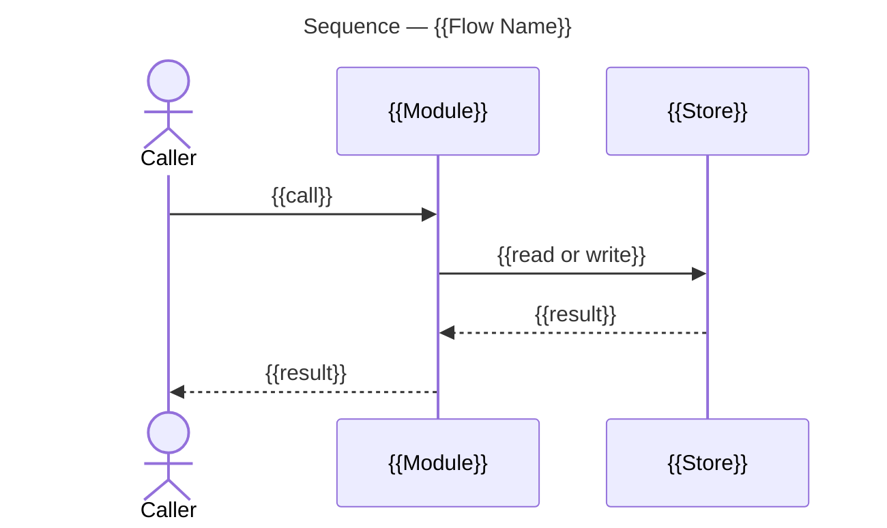

# Architecture Overview

The architecture overview is the artifact [Understand Mode](understand-mode.md) writes into a planning record. It explains one pull request's changes to the engineer who reviews them: where the change sits in the system, how it behaves, and in what order to read the diff. Its reader knows software and does not know this codebase.

## Diagram Selection

Every overview carries one structural diagram and one functional diagram. A further diagram is carried when the change warrants it, and displaces prose rather than adding to it.

| Diagram | Notation | Shows | Carried |
| --- | --- | --- | --- |
| Component | `flowchart` with subgraphs | The areas the change reaches and the dependencies between them | Always, as the structural diagram |
| Class | `classDiagram` | The types the change adds or alters, their members and their relations | In place of the component diagram when the change sits in one area and lands in its types |
| Sequence | `sequenceDiagram` | One flow's ordered interactions between components | Always, one per flow the change runs through, as the functional diagram |
| State | `stateDiagram-v2` | One subject's states and the transitions between them | When the change alters a lifecycle |
| Before and After | A pair in the notation of the structure they show | The arrangement the change replaces beside the one it establishes | When the change rearranges structure or reorders a flow |

Component node shapes: `[text]` a module, `[(text)]` a store, `[[text]]` a process boundary, `([text])` an actor.

## Template

````markdown
# Architecture Overview — {{Change Name}}

> architecture-overview · [{{owner/repo#950}}]({{pull request URL}}) · {{YYYY-MM-DD}}

## Summary

{{Three sentences at most: what the change does, which part of the system it lands in, and what it makes possible.}}

## Structure

{{One paragraph placing the change: the areas it reaches and what each is for.}}

```mermaid
---
title: Components — {{Change Name}}
---
flowchart LR
    Caller([Caller])

    subgraph Area [{{Area Name}}]
        Entry[{{Module}}]
        Store[({{Store}})]
    end

    Caller -->|{{interaction}}| Entry
    Entry -->|{{interaction}}| Store

    style Entry fill:#c8e6c9,stroke:#2e7d32
    style Store fill:#f5f5f5,stroke:#9e9e9e
```

### {{Area Name}}

- **{{Element}}.** {{What it is responsible for, and what the change gives it.}}

## Behaviour

{{One sentence naming the flows below.}}

### {{Flow Name}}

{{One sentence: what starts this flow and what it yields.}}



- **{{Step}}.** {{What happens here, and the condition it rests on.}}

## What Changed

### {{Area Name}}

- **{{Element}}.** {{The behaviour it now has.}}

## Reading Order

1. **[{{file}}]({{permalink}})** — {{why the diff starts here}}.

## Risks and Watch Points

- **{{Risk}}.** {{What can go wrong, and where the reviewer sees it.}}

## References

- **R1.** [{{Title}}]({{URL}}) — {{what the reader finds there}}.
````

## Rules

- **Register.**
  The reader is an engineer meeting this codebase for the first time. A component, type or function carries the name the diff carries, so the document and the diff name one thing once. A term the codebase coins is defined where it first appears.
- **Code references.**
  A reference is a permalink pinned to the pull request's head commit with its line anchors, on the words it supports, as SKILL.md's [Code references](../SKILL.md#formatting-scheme) rule states. A link resolved against a branch moves under the reader.
- **Measured structure.**
  A component diagram's areas and edges, and a sequence's step order, are the ones [Understand Mode](understand-mode.md#procedure) measures over the graph. A boundary taken from the directory layout, and a call order traced by hand, are each a defect.
- **One concept per diagram.**
  Five to ten elements. A diagram that needs more splits by concept, and relationships between areas carry it rather than the internals of one.
- **Highlight.**
  An element the change adds or alters carries a distinct fill, and untouched context is grey. A name and its fill hold across every diagram in the overview.
- **Labelled edges.**
  Every edge names its interaction, and its direction is the direction data or control travels.
- **Collections are bulleted.**
  Items of one kind go in a bulleted list, never packed into a paragraph. Each opens with a bold lead naming the item, and its body is the line beneath.
- **Reference, don't restate.**
  What Changed states the behaviour each area now has. The change-by-change listing is the pull request's Changes section, which the overview links rather than reproduces.
- **Reading Order.**
  One numbered entry per file the reviewer opens, ordered so the change reads from its entry point outward to what it calls. Each entry links the file at the head commit and gives one line on why it comes there. A file the change touches incidentally is left out.
- **Length.**
  About two hundred lines, diagrams counted.
- **Sections.**
  Summary, Structure, Behaviour, What Changed and Reading Order are always present. Risks and Watch Points, and References, are deleted when they have nothing to say.
