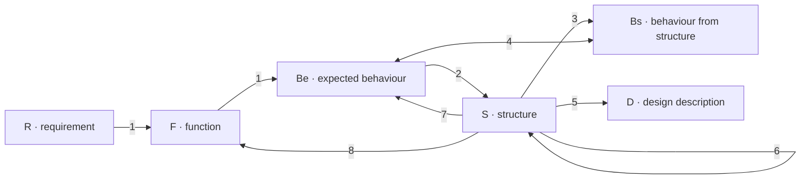

# Design Flow

How a plan moves from a requirement to a structure, and how the activity that binds that structure can change it. A single arrow is a transformation. A double arrow is a comparison.

| Mark | Name |
| --- | --- |
| R | Requirement |
| F | Function |
| Be | Expected behaviour |
| Bs | Behaviour derived from structure |
| S | Structure |
| D | Design description |

| Step | Arrow | What it does |
| --- | --- | --- |
| 1 | R → F → Be | A requirement becomes a function, and that function becomes the expected behaviour |
| 2 | Be → S | Expected behaviour becomes structure: the routines, techniques, and resources |
| 3 | S → Bs | The wired activities produce behaviour from that structure |
| 4 | Be ↔ Bs | Expected behaviour is compared with the behaviour the activities produce |
| 5 | S → D | Structure becomes the design description |
| 6 | S → S | Structure is reformulated |
| 7 | S → Be | Expected behaviour is reformulated from what the structure showed |
| 8 | S → F | Function is reformulated from what the structure showed |

## What Planning Requires

- **Step 2 comes first.**
  Routines, techniques, and resources are specced, created, and tested before an activity binds them. The grain of an existing resource is in that work.
- **Steps 3 to 8 stay in the wiring task.**
  The task that wires the activities derives behaviour from them, compares it with the expected behaviour, and writes the design description. When they differ, that task changes the routine, technique, or resource, and the tests that cover the change, until fit, form, and function hold. The same task changes the expected behaviour or the function when the structure shows that earlier statement was wrong.
