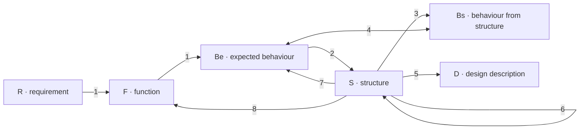
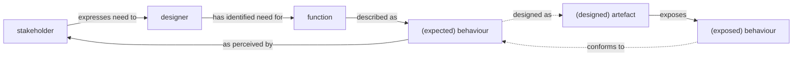

# Design Flow

How a definition is designed. A requirement becomes a function and an expected behaviour. Structure is synthesised from that behaviour. The behaviour the structure exposes is compared with the expected behaviour, and the structure can be reformulated.

The process steps are the function–behaviour–structure ontology of Gero and Kannengiesser, as Figure 3 of Nouwens, *Researching Sensemaking and Situational Architecting* (EEWC 2021, CC BY 4.0). A single arrow is a transformation. A double arrow is a comparison.

| Mark | Name | In a definition |
| --- | --- | --- |
| R | Requirement | The need the definition answers |
| F | Function | What the definition is for |
| Be | Expected behaviour | The behaviour a stakeholder can perceive |
| Bs | Behaviour from structure | The behaviour a walk or a test derives |
| S | Structure | Routines, techniques, resources, and activities |
| D | Design description | The written definition |

| Step | Arrow | What the designer does |
| --- | --- | --- |
| 1 | R → F → Be | A requirement becomes a function, and that function becomes the expected behaviour |
| 2 | Be → S | Expected behaviour is synthesised into structure |
| 3 | S → Bs | Exposed behaviour is derived from the structure |
| 4 | Be ↔ Bs | Expected behaviour is compared with exposed behaviour |
| 5 | S → D | Structure is written as the design description |
| 6 | S → S | Structure is reformulated |
| 7 | S → Be | Expected behaviour is reformulated |
| 8 | S → F | Function is reformulated |

Teleological language and ontological language share no terms. There is no procedure that derives a structure from a purpose. Step 2 is a synthesis. Steps 6, 7, and 8 are the same synthesis run again when the comparison fails.

## Two Cycles

Nouwens combines that ontology with the distinction between stakeholder and designer (Figure 4 of the same paper). One cycle elicits the requirement. The other designs the artefact and matches its exposed behaviour to the expected behaviour.

- **Requirements elicitation.**
  The stakeholder expresses a need. The designer identifies a function and describes it as expected behaviour. The stakeholder perceives that behaviour.
- **Iterative design.**
  Expected behaviour is designed as an artefact. The artefact exposes behaviour. That exposed behaviour is compared with the expected behaviour, and the design repeats until they conform.
